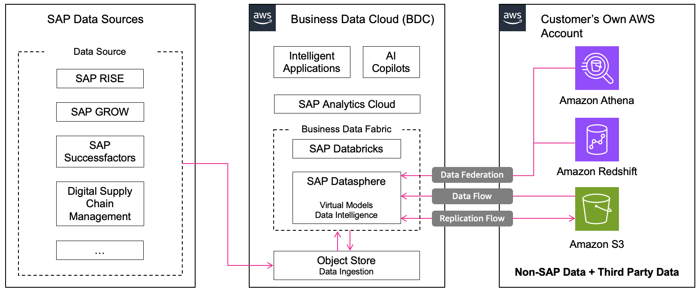

# Integrating data in SAP BDC with AWS data sources

Non-SAP data from AWS data sources can be harmonized with SAP data via SAP Datasphere data fabric architecture with SAP BDC. The integration architecture supports multiple AWS services, each with specific modes of integration based on live data or replication:

**A. Integration with Amazon Athena**

Mode of Integration: Federating data live into SAP Datasphere

Amazon Athena is Amazon’s interactive query service that helps query and analyze data in S3. Non-SAP data from Athena can be federated live into remote tables in SAP Datasphere and augmented with SAP data for real-time analytics in [SAP Analytics Cloud](https://www.sap.com/products/data-cloud/cloud-analytics.html "https://www.sap.com/products/data-cloud/cloud-analytics.html").

Here are the steps to integrate Athena with SAP Datasphere:

1. Prepare source with non-SAP and third party data
2. Configure Athena
3. onfigure necessary IAM user and authorizations
4. Setup SAP Datasphere Connection to Athena
5. Build models in SAP Datasphere
   This enables live data federation without replicating data, thus reduces cost, provides fast insights, and enterprise-grade security. For detailed step by step, visit [Federating Queries from SAP Datasphere to Amazon S3 via Amazon Athena](https://github.com/SAP-samples/sap-bdc-explore-hyperscaler-data/blob/main/AWS/athena-integration.md "https://github.com/SAP-samples/sap-bdc-explore-hyperscaler-data/blob/main/AWS/athena-integration.md").

**B. Integration with Amazon Redshift**

Mode of Integration: Federating data live into SAP Datasphere

Amazon Redshift is a fully managed, petabyte-scale data warehouse service optimized for analytical workloads. Through SAP Datasphere data federation architecture, Redshift data can be augmented with SAP data to build unified data models and analytics in SAP Analytics Cloud. [Smart Data Integration (SDI)](https://help.sap.com/docs/HANA_SMART_DATA_INTEGRATION/bf2f0282053648f8a1ef873e65ded81a/323ff4c3c12040bab8f1222a901dd95d.html "https://help.sap.com/docs/HANA_SMART_DATA_INTEGRATION/bf2f0282053648f8a1ef873e65ded81a/323ff4c3c12040bab8f1222a901dd95d.html") connects SAP Datasphere with Redshift via [Camel JDBC Adapter](https://help.sap.com/docs/HANA_SMART_DATA_INTEGRATION/7952ef28a6914997abc01745fef1b607/598cdd48941a41128751892fe68393f4.html?locale=en-US "https://help.sap.com/docs/HANA_SMART_DATA_INTEGRATION/7952ef28a6914997abc01745fef1b607/598cdd48941a41128751892fe68393f4.html?locale=en-US"), enabling the creation of virtual tables and real-time or snapshot replication.

Here are the steps to integrate Redshift with SAP Datasphere:

1. Create On-Premise Agent in SAP Datasphere
2. Set Up Redshift Access
3. Configure SAP SDI DP Agent
4. Register Camel JDBC Adapter in SAP Datasphere
5. Upload Third-Party Drivers in SAP Datasphere
6. Create Local Connection to Redshift in SAP Datasphere
7. Import Remote Tables from Redshift
   This setup enables live federated queries from SAP Datasphere to Redshift without replicating the data. Benefits include real-time access to Redshift data, pushdown queries for performance optimization, and no data duplication in SAP Datasphere. For detailed step by step, visit [Data Federation between SAP Datasphere and Amazon Redshift](https://github.com/SAP-samples/sap-bdc-explore-hyperscaler-data/blob/main/AWS/redshift-integration.md "https://github.com/SAP-samples/sap-bdc-explore-hyperscaler-data/blob/main/AWS/redshift-integration.md").

**C. Integration with Amazon S3**

Modes of Integration: Replicating data with Replication Flows, Importing data into SAP Datasphere using Data Flows

Amazon S3 provides object storage service which is highly scalable, durable, available and secure. Non-SAP data from S3 buckets can be imported into SAP Datasphere through the Data Flow feature for use with applications such as Financial Planning or business analytics in SAP Analytics Cloud.

Here are the steps to integrate Amazon S3 with SAP Datasphere:

1. Prepare source data in an S3 bucket
2. Configure necessary IAM user and authorizations
3. Create S3 Connection in SAP Datasphere
4. Create a Data Flow
   This process allows SAP Datasphere to connect to S3, access non-sap data, and use that data in combination with internal SAP datasets via Data Flows. For detailed step by step, visit [Data integration between SAP Datasphere and in Amazon S3](https://github.com/SAP-samples/sap-bdc-explore-hyperscaler-data/blob/main/AWS/s3-integration.md "https://github.com/SAP-samples/sap-bdc-explore-hyperscaler-data/blob/main/AWS/s3-integration.md").

You can find out more from SAP Architecture Center under [Integration with AWS data sources](https://architecture.learning.sap.com/docs/ref-arch/a07a316077/1 "https://architecture.learning.sap.com/docs/ref-arch/a07a316077/1").
