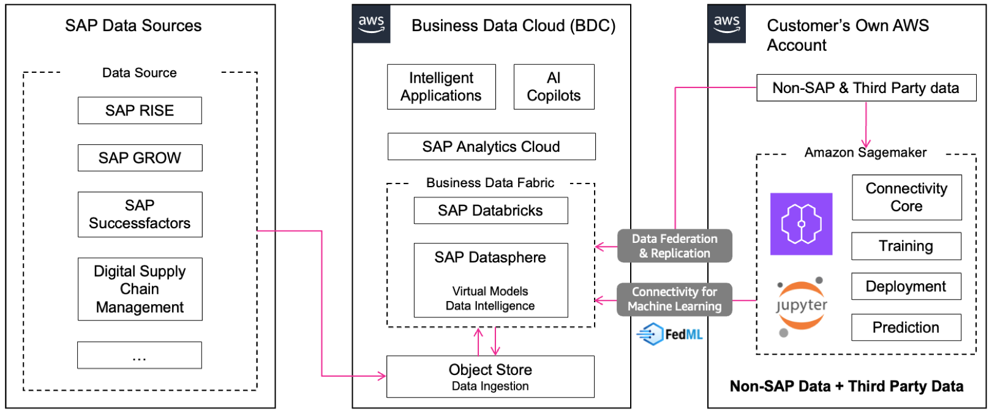

# AI Innovation with FedML-AWS and Sagemaker

In today’s data-driven enterprises, machine learning models are only as powerful as the data they can access. However, business-critical data often resides within SAP systems like SAP BDC, while advanced model development typically takes place in cloud-native platforms like Amazon Sagemaker.

FedML-AWS for Amazon Sagemaker bridges this gap by providing a secure, efficient, and unified framework for federated model training and deployment across SAP and AWS ecosystems. By eliminating data duplication and enabling real-time access to SAP data, FedML-AWS helps accelerate AI initiatives, ensure data governance, and reduce operational complexity, all while leveraging the scalability and performance of AWS and the business context of SAP. With minimal setup, FedML-AWS enables data discovery, model training, and deployment across both SAP and AWS environments to extract value from data.

FedML, a Python library, is directly imported into Amazon Sagemaker notebook instances. When most training data resides in AWS, but critical SAP data with business semantics is also needed for training, it securely connects to SAP Datasphere (part of BDC) via Python/SQLDBC connectivity, enabling federated access to SAP business data required for model training in Sagemaker.

For more technical details on methods that enable the training data to be read from SAP Datasphere (part of BDC) and trained using Machine Learning model on Amazon Sagemaker, visit [FedML-AWS](https://github.com/SAP-samples/datasphere-fedml/tree/main/AWS "https://github.com/SAP-samples/datasphere-fedml/tree/main/AWS"). You can find out more from SAP Architecture Center under [Integration with FedML-AWS for Amazon Sagemaker](https://architecture.learning.sap.com/docs/ref-arch/8e1a5fbce3/1 "https://architecture.learning.sap.com/docs/ref-arch/8e1a5fbce3/1").

By combining the strengths of SAP Business Data Cloud (BDC) and AWS services, organizations can unlock the full potential of their enterprise data. From operational systems to advanced AI and analytics, whether harmonizing datasets across Amazon S3, Redshift, and Athena or enabling federated model training with FedML-AWS and Amazon Sagemaker, these architectures provide a scalable and secure foundation for innovation. Together, SAP and AWS empower businesses to move from data silos to data-driven intelligence, accelerating time to insight, optimizing decision-making, and driving measurable business value across the enterprise.
