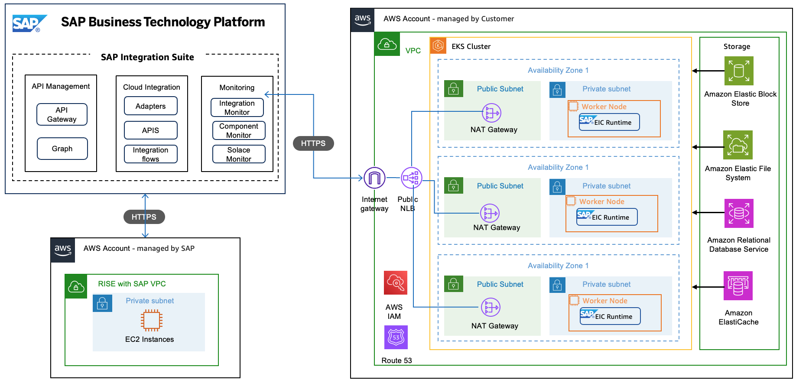

# Integration

In the RISE with SAP landscape, SAP Business Technology Platform (BTP), particularly the [SAP Integration Suite](https://help.sap.com/docs/integration-suite/sap-integration-suite/what-is-sap-integration-suite?locale=en-US "https://help.sap.com/docs/integration-suite/sap-integration-suite/what-is-sap-integration-suite?locale=en-US"), often facilitates integration scenarios. This service is capable of supporting integrations across cloud, on-premises, and hybrid environments within the SAP ecosystem.

There are two deployments options for SAP Integration Suite

**A. Standard Deployment**

In SAP Integration Suite, integration developers create integration flows and Application Programming Interfaces (APIs). The created integration and API content is deployed to SAP’s Integration Suite runtime environment. Once deployed, the integration content (e.g., a set of integration flows) becomes operational, enabling data exchange with connected sender and receiver systems.

**B. Hybrid Deployment Using Edge Integration Cell**

[Edge Integration Cell](https://help.sap.com/docs/integration-suite/sap-integration-suite/what-is-sap-integration-suite-edge-integration-cell?locale=en-US "https://help.sap.com/docs/integration-suite/sap-integration-suite/what-is-sap-integration-suite-edge-integration-cell?locale=en-US") is an optional hybrid integration runtime offered as part of SAP Integration Suite, which enables you to manage APIs and run integration scenarios within your private landscape. The hybrid deployment model of Edge Integration Cell enables you to design and monitor your integration content in the cloud. It also allows you to deploy and run your integration content in your private landscape. Its runtime environment is realized as a Kubernetes container, facilitating secure, internal data exchange.

For more detailed information, you can refer to [SAP Note 3426066 FAQ: Edge Integration Cell simple questions](https://me.sap.com/notes/3426066/E "https://me.sap.com/notes/3426066/E") and [SAP Note 3391207 SAP Integration Suite : restrictions for the Edge Integration Cell](https://me.sap.com/notes/3391207/E "https://me.sap.com/notes/3391207/E").

**Deploy Edge Integration Cell on AWS**

Edge Integration Cell (EIC) can be deployed on AWS to leverage its scalable infrastructure while maintaining secure and controlled execution in a customer-managed environment. This architecture combines AWS-native services with EIC’s hybrid capabilities, ensuring a seamless integration experience. Edge integration cell on AWS can be deployed in standard or High Availability (HA) architecture.

You can refer to the detailed EIC architecture, SAP pre-requisites, AWS pre-requisite in [this sap-samples github link](https://github.com/SAP-samples/btp-edge-integration-cell-aws "https://github.com/SAP-samples/btp-edge-integration-cell-aws").

Key Components

- **Edge Integration Cell** is a unified runtime pipeline consisting of the following key components:
  - **Worker** is a Camel-based runtime of Integration Suite that executes integration flows.
  - **Policy Engine** is an Envoy-based runtime with SAP-built extensions for enforcing policies like security or traffic management on API proxies.

- **The Message Service** is implements asynchronous integration pattern based on JMS protocol. For the Cloud offering, this instance is managed by SAP.
- **The PostgreSQL database** is a relational database system for storing structured data and is managed by SAP for the public cloud offering.
- **Redis** is an in-memory data store used for caching.

**Edge Integration Cell Sizing**

Detailed below is the minimum sizing for Edge integration cell (EIC). For a more detailed sizing based on scenarios, you can refer to [SAP Notes 3247839](https://me.sap.com/notes/3247839 "https://me.sap.com/notes/3247839") and [Sizing Guide for Edge Integration Cell](https://help.sap.com/docs/integration-suite/sap-integration-suite/sizing-guidelines "https://help.sap.com/docs/integration-suite/sap-integration-suite/sizing-guidelines").

**Sizing of worker node** : Minimum CPU and Memory requirements for High Availability (HA) and non-HA (agent or worker nodes)

| Deployment Type | CPU/Memory                   | Persistence Storage       |
| --------------- | ---------------------------- | ------------------------- |
| Non-HA          | 8 vCPU/32 GiB ( m6a.2xlarge) | 101 GiB of Amazon EBS GP3 |
| HA              | 16 vCPU/64 GiB( m6a.4xlarge) | 204 GiB of Amazon GP3     |

Minimum 3 worker nodes required in both HA and non-HA configuration.

**External Storage** : Minimum Sizing for Postgres and Redis for HA

| Database | CPU/Memory                     | Persistence Storage |
| -------- | ------------------------------ | ------------------- |
| Postgres | 1 CPU / 2 GiB (db.t2.small)    | 50 GiB of EBS GP3   |
| Redis    | 1 CPU / 1 GiB (cache.t2.small) | N/A                 |

|                                                                                                                                                                                                                                                                                                                                                                                                                                                                                                                |
| -------------------------------------------------------------------------------------------------------------------------------------------------------------------------------------------------------------------------------------------------------------------------------------------------------------------------------------------------------------------------------------------------------------------------------------------------------------------------------------------------------------- |
| \*_Pricing example_ • With minimum configuration, we calculated an indicative monthly costs in USD to deploy SAP Edge Integration Cell in us-east-1 region Load balancer (NLB), with 10GB/hour data = $60.23 Amazon EKS cluster = $73.00 Three worker nodes with m6a.2xlarge = $421.75 (3 year No Upfront EC2 Instance Savings Plan) RDS PostgreSQL Multi-AZ = $104.21 ElastiCache Redis = $24.82 Total cost for running EIC in HA mode ~ $684 billed to AWS account managed by customer. |

You can find out more from SAP Architecture Center under [Edge Integration Cell on AWS](https://architecture.learning.sap.com/docs/ref-arch/263f576c90/1 "https://architecture.learning.sap.com/docs/ref-arch/263f576c90/1").
