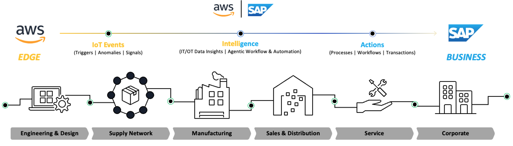
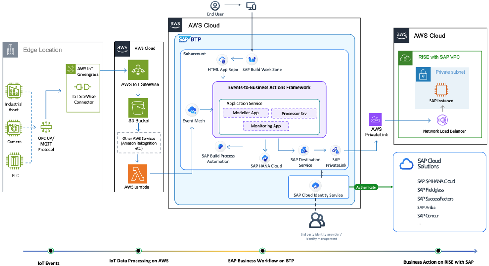
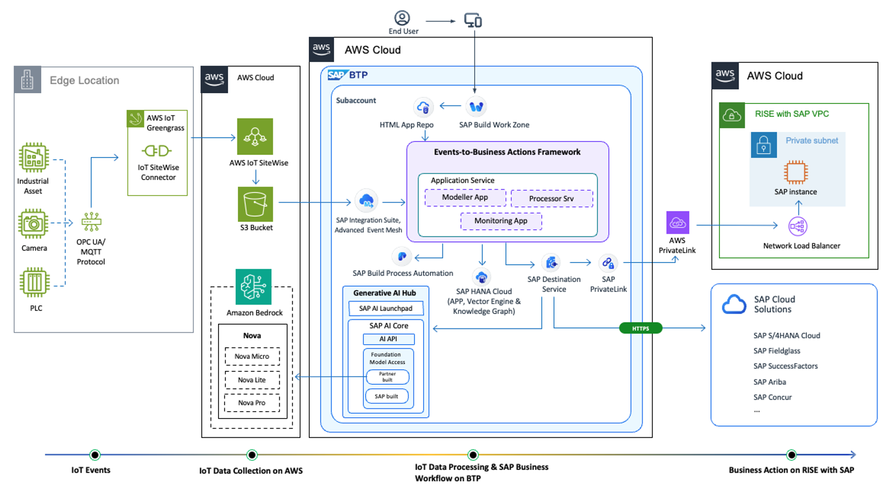

# Internet of Things

Internet of Things (IoT) refers to a network of interconnected physical devices, vehicles, home appliances, and other items embedded with electronics, software, sensors, and network connectivity, enabling these objects to collect and exchange data. IoT allows objects to be sensed and controlled remotely across existing network infrastructure, creating opportunities for direct integration between the physical world and computer-based systems.

AWS IoT provides a comprehensive suite of services to connect, manage, and secure IoT devices at scale. At its core, [AWS IoT Core](https://aws.amazon.com/iot-core/ "https://aws.amazon.com/iot-core/") serves as the foundation, enabling secure device connectivity and message routing. [AWS IoT Device Management](https://aws.amazon.com/iot-device-management/ "https://aws.amazon.com/iot-device-management/") helps register, organize, monitor, and remotely manage IoT devices throughout their lifecycle. [AWS IoT Greengrass](https://aws.amazon.com/greengrass/ "https://aws.amazon.com/greengrass/") extends cloud capabilities to edge devices, allowing them to act locally on data while still maintaining cloud connectivity. Other complementary services in the AWS IoT family include [IoT Events](https://aws.amazon.com/iot-events/ "https://aws.amazon.com/iot-events/"), [IoT TwinMaker](https://aws.amazon.com/iot-twinmaker/ "https://aws.amazon.com/iot-twinmaker/"), [IoT ExpressLink](https://aws.amazon.com/iot-expresslink/ "https://aws.amazon.com/iot-expresslink/"), and [IoT FleetWise](https://aws.amazon.com/iot-fleetwise/ "https://aws.amazon.com/iot-fleetwise/"), each serving specific IoT use cases and requirements.

**AWS IoT with SAP**

The combination of AWS IoT services and SAP business applications creates a powerful platform for digital transformation, enabling organizations to implement smart solutions across various domains - from connected products to smart city applications. This integration helps organizations harness real-time data for improved operational visibility, enhanced customer experiences, and innovative business models, driving efficiency and accelerating innovation across the enterprise ecosystem.

In [Smart Products & Services](https://aws.amazon.com/industrial/smart-products-and-services/ "https://aws.amazon.com/industrial/smart-products-and-services/") scenarios, AWS IoT services enable intelligent operations through [AWS IoT SiteWise](https://aws.amazon.com/iot-sitewise/ "https://aws.amazon.com/iot-sitewise/") and other services, delivering real-time insights that integrate seamlessly with SAP business modules. AWS IoT Device Management provides comprehensive monitoring across connected devices, with continuous data streams enriching SAP systems for informed decision-making. Edge computing capabilities through AWS IoT Greengrass ensure efficient data processing at the source, enabling rapid response times and optimal performance, particularly valuable for remote operations.

AWS IoT services can integrate with [SAP Business Technology Platform (BTP)](https://www.sap.com/products/technology-platform.html "https://www.sap.com/products/technology-platform.html") to create powerful end-to-end IoT solutions. Through SAP BTP event-driven architecture and Enterprise Messaging services, IoT data from AWS can be efficiently consumed by SAP applications in real-time. The [Cloud Application Programming (CAP)](https://pages.community.sap.com/topics/cloud-application-programming "https://pages.community.sap.com/topics/cloud-application-programming") model in SAP BTP enables rapid development of IoT-enabled business applications that can process and act on IoT data from AWS. The integration can be achieved through various methods, such as using [SAP Cloud Integration](https://help.sap.com/docs/cloud-integration/sap-cloud-integration/sap-cloud-integration?locale=en-US "https://help.sap.com/docs/cloud-integration/sap-cloud-integration/sap-cloud-integration?locale=en-US") , [API Management](https://help.sap.com/docs/sap-api-management/sap-api-management/what-is-api-management?locale=en-US "https://help.sap.com/docs/sap-api-management/sap-api-management/what-is-api-management?locale=en-US"), or direct REST APIs. For example, sensor data collected through AWS IoT Core can trigger events in SAP BTP, which can then be processed by CAP applications to update business processes, generate alerts, or trigger automated workflows in SAP systems.

**AWS IoT Security**

While AWS maintains robust cloud security mechanisms to protect data movement between AWS IoT and other AWS services, customers are responsible for managing device credentials (including X.509 certificates, AWS credentials, Amazon Cognito identities, federated identities, or custom authentication tokens) and implementing appropriate access policies.

AWS IoT implements comprehensive security measures to ensure secure device connectivity and data transmission. Devices can connect to AWS IoT using X.509 certificates or Amazon Cognito identities over Transport Layer Security (TLS) connections, with additional authentication options available for development and specific API-based applications. The AWS IoT message broker handles device authentication and manages access permissions through AWS IoT policies, while custom authentication can be implemented using custom authorizers.

Furthermore, the AWS IoT rules engine securely forwards device data to other devices or AWS services based on user-defined rules, utilizing AWS Identity and Access Management (IAM) to ensure secure data transfer to intended destinations. Customer may leverage [AWS IoT Device Defender](https://aws.amazon.com/iot-device-defender/?p=ft&c=iot&z=3&refid=a3593a2f-ae1f-4cc4-a14f-ff76e52593aa "https://aws.amazon.com/iot-device-defender/?p=ft&c=iot&z=3&refid=a3593a2f-ae1f-4cc4-a14f-ff76e52593aa"), a fully managed service that helps you secure your fleet of IoT devices.

You can find out more of [Security in AWS IoT](../../../iot/latest/developerguide/security.md "../../../iot/latest/developerguide/security.md").

**AWS and SAP Joint Reference Architecture for Internet of Things**

JRA architecture below shows the combination of AWS IoT services and SAP BTP services to build loosely coupled Edge-to-Business Process architectures.

**IoT events** - Edge locations can be environments like factories or shop floors where IoT devices such as cameras, PLCs, SCADA systems, IoT sensors or industrial assets collect data including temperature, vibration, and other metrics. The collected data is transmitted to AWS IoT services in the cloud using appropriate connectors running on edge runtime environments like AWS IoT Greengrass, with protocols specific to each device type.
Customers have the option to sanitize data at the edge using AWS Edge computing services before transmission to the cloud. AWS IoT SiteWise Edge extends cloud capabilities to industrial edge environments, while AWS IoT Greengrass serves as a general-purpose edge framework. This edge processing helps reduce noise in data, improves data quality, and optimizes costs.

**IoT Data Processing on AWS** - Data received from edge locations is first processed by AWS services such as Amazon Rekognition for computer vision use cases or other AWS services for data analysis, where IT (Information Technology) and OT (Operational Technology) data insights are combined to trigger intelligent workflow automation. AWS Lambda then triggers an event to SAP BTP for the next course of action

**SAP Business Workflow on BTP** - Control is transferred to SAP BTP services like [Event Mesh](https://www.sap.com/products/technology-platform/integration-suite/capabilities/event-mesh.html "https://www.sap.com/products/technology-platform/integration-suite/capabilities/event-mesh.html"), which allows applications to communicate through asynchronous events and [Events-to-Business-Actions-Framework](https://github.com/SAP-samples/btp-events-to-business-actions-framework "https://github.com/SAP-samples/btp-events-to-business-actions-framework"). This framework responds to and integrates events generated from different sources like industrial production processes, warehouses, etc., into enterprise business systems. Based on the events category and type, respective actions are triggered in SAP applications. The processor module leverages the [decisions](https://help.sap.com/docs/build-process-automation/sap-build-process-automation/create-decision "https://help.sap.com/docs/build-process-automation/sap-build-process-automation/create-decision") capability of [SAP Build Process Automation](https://www.sap.com/products/technology-platform/process-automation.html "https://www.sap.com/products/technology-platform/process-automation.html") to initiate business actions and also supported by other BTP services, such as HANA Cloud for storing application data. Customers can leverage private connectivity between SAP BTP and SAP RISE on AWS environment through [SAP Private Link](https://help.sap.com/docs/private-link/private-link1/what-is-sap-private-link-service "https://help.sap.com/docs/private-link/private-link1/what-is-sap-private-link-service") and [AWS PrivateLink service](https://aws.amazon.com/privatelink/ "https://aws.amazon.com/privatelink/").

**Business Actions on RISE with SAP** - Finally, based on the business rules, appropriate SAP business processes are triggered on the RISE with SAP systems like creation of maintenance order for predictive maintenance or creation of a safety observation for EHS.

This is an alternative architecture to the one discussed in the previous section, with the following differences.

**IoT events** – Same as Figure 1.

**IoT Data Processing on AWS** – Data received from edge locations is forwarded directly to the SAP BTP layer for subsequent actions, including data transformation. In this case, we are using SAP Integration Suite, [Advanced Event Mesh](https://www.sap.com/products/technology-platform/integration-suite/advanced-event-mesh.html "https://www.sap.com/products/technology-platform/integration-suite/advanced-event-mesh.html"), which has an out-of-the-box connector for S3.

**IoT Data Processing on SAP BTP** – Control is transferred to SAP BTP services like SAP Integration Suite, Advanced Event Mesh and Events-to-Business Actions Framework. Data transformation on SAP BTP is handled using GenAI services like [Generative AI Hub](https://help.sap.com/docs/ai-launchpad/sap-ai-launchpad/generative-ai-hub "https://help.sap.com/docs/ai-launchpad/sap-ai-launchpad/generative-ai-hub"), which leverages AWS Generative Foundation Models such as [Amazon Nova](https://aws.amazon.com/ai/generative-ai/nova/ "https://aws.amazon.com/ai/generative-ai/nova/") to derive insights from the data for further processing. Based on the processed data, event categories and types, respective actions are triggered in SAP applications. The processor module, part of the Events-to-Business-Action framework, leverages the Decisions capability of SAP Build Process Automation to initiate business actions. Additionally, SAP HANA Cloud can be used as a vector engine for Retrieval-Augmented Generation (RAG) framework and Knowledge Graph, in addition to storing application data.

This integration enables scenarios such as predictive maintenance, real-time asset monitoring, and supply chain optimization by combining AWS's robust IoT and Generative AI capabilities with SAP’s enterprise business processes and data models.

You can find out more from SAP Architecture Center under [Build Events-to-Business Actions Scenarios with SAP BTP and AWS IoT SiteWise](https://architecture.learning.sap.com/docs/ref-arch/fbdc46aaae/3 "https://architecture.learning.sap.com/docs/ref-arch/fbdc46aaae/3").
