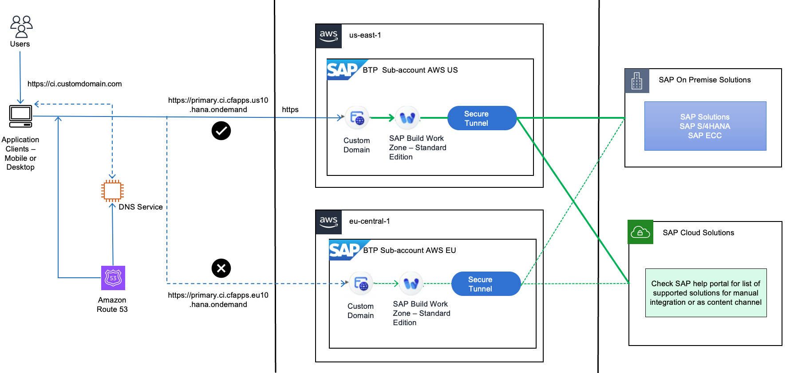
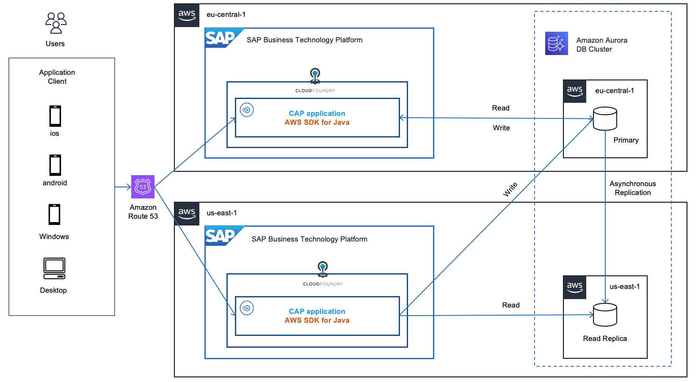

# Operational Reliability

Modern enterprises face significant hurdles in maintaining continuous availability of SAP services, particularly during regional outages or maintenance windows. Business continuity and operational reliability are critical concerns when deploying SAP Business Technology Platform (SAP BTP) and RISE with SAP.

[Amazon Route 53](https://aws.amazon.com/route53/ "https://aws.amazon.com/route53/") is a highly available, scalable, and globally distributed Domain Name System (DNS) web service, addresses these challenges effectively. It enables customers to implement [AWS multi-region architecture](../../../prescriptive-guidance/latest/aws-multi-region-fundamentals/introduction.md "../../../prescriptive-guidance/latest/aws-multi-region-fundamentals/introduction.md") for their SAP environments, providing robust fault tolerance and enhanced reliability. By leveraging Route 53’s capabilities, organizations can build resilient SAP environments that meet stringent availability requirements. This DNS service seamlessly integrates with SAP BTP services, ensuring business operations continue smoothly even during regional disruptions.

**Understanding Amazon Route 53 in the SAP Context**

Amazon Route 53 serves as a foundational component for building resilient SAP environments by providing intelligent DNS routing capabilities. In the context of SAP BTP and RISE with SAP, Route 53 addresses critical reliability challenges that cannot be solved through standard Availability Zone (AZ) configurations alone. While SAP BTP services support multi-AZs deployments within a single region, this approach remains vulnerable to region-wide failures. Route 53 extends this resilience by enabling traffic routing across multiple geographic regions, effectively creating a global safety net for mission-critical SAP applications.

Route 53’s architecture is designed with maximum reliability in mind through the separation of control plane and data plane functions. The data plane is explicitly designed to be [statically stable](https://aws.amazon.com/builders-library/static-stability-using-availability-zones/ "https://aws.amazon.com/builders-library/static-stability-using-availability-zones/") in the face of, e.g. a control plane failure or partition event. This architectural separation ensures that DNS resolution remains highly available, making Route 53 an ideal foundation for disaster recovery scenarios in SAP environments. The service continuously monitors endpoint health and automatically redirects users to healthy resources when failures are detected.

Beyond simple failover capabilities, Route 53 offers sophisticated routing policies that can be tailored to specific business requirements. These include latency-based routing to direct users to the lowest-latency endpoint, geolocation routing to comply with data sovereignty regulations, and weighted routing to distribute traffic according to defined proportions. For global organizations using SAP services, these capabilities translate into consistent performance and availability for users across different geographic locations, enhancing the overall user experience while maintaining system reliability.

**Amazon Route 53 Architecture for SAP BTP Multi-Region Resiliency**

The foundation of a resilient SAP BTP environment using Amazon Route 53 is a well-designed multi-region architecture. This approach begins with geographic redundancy, where critical application components are deployed across different regions to eliminate a [single point of failure](https://en.wikipedia.org/wiki/Single_point_of_failure "https://en.wikipedia.org/wiki/Single_point_of_failure"). Route 53 serves as the intelligent traffic director in this architecture, continuously monitoring the health of endpoints and making real-time routing decisions based on availability and performance metrics. When [integrated with SAP BTP’s Custom Domain service](https://github.com/SAP-samples/btp-services-intelligent-routing/tree/launchpad_aws/04-Map%20Custom%20Domain%20Routes "https://github.com/SAP-samples/btp-services-intelligent-routing/tree/launchpad_aws/04-Map%20Custom%20Domain%20Routes"), Route 53 provides a seamless user experience through consistent URLs, even as traffic is redirected between regions during failover events.

You can find out more in [SAP Architecture Center – Architecting Multi-Region Resiliency – Load Balancers](https://architecture.learning.sap.com/docs/ref-arch/81805673c0/3 "https://architecture.learning.sap.com/docs/ref-arch/81805673c0/3").

**Amazon Route 53 Routing Options**

Route 53 offers various [routing policies](../../../Route53/latest/DeveloperGuide/routing-policy.md "../../../Route53/latest/DeveloperGuide/routing-policy.md") for SAP BTP implementations:

- **Simple routing**: Directs traffic to a single resource
- **Weighted routing**: Distributes traffic across multiple resources in specified proportions
- **Latency-based routing**: Routes users to the region with lowest network latency
- **Failover routing**: Automatically redirects from unhealthy primary to healthy secondary resource
- **Geolocation routing**: Directs traffic based on users' geographic locations
- **Geoproximity routing**: Routes based on geographic location with optional biasing
- **Multi-value answer routing**: Responds with up to eight healthy records selected randomly
  These options can be combined to create sophisticated routing strategies tailored to specific SAP environment requirements.

**Amazon Route 53 Implementation Patterns for SAP Environments**

Two primary implementation patterns have emerged for SAP environments: active-passive and active-active configuration.

**Pattern 1. Active-Passive Implementation**

In an active-passive configuration, Route 53 directs all traffic to a primary SAP BTP region during normal operations, with a secondary region serving as a standby. This approach offers simplicity and cost-effectiveness while still providing disaster recovery capabilities. The active-passive pattern works particularly well for [SAP Build Work Zone](https://discovery-center.cloud.sap/serviceCatalog/sap-build-work-zone-standard-edition?region=all "https://discovery-center.cloud.sap/serviceCatalog/sap-build-work-zone-standard-edition?region=all") deployments where consistent user experience is critical.

You implement this by deploying the Work Zone service in the primary region with all necessary configurations, and then using [SAP Cloud Transport Management service](https://www.sap.com/sea/products/technology-platform/cloud-transport-management.html "https://www.sap.com/sea/products/technology-platform/cloud-transport-management.html"), you replicate this setup to a secondary region. Both regions are configured with identical domains using SAP BTP Custom Domain service, while Route 53 is set up with failover routing policy and health checks monitoring the primary endpoint. When issues occur in the primary region, Route 53 automatically redirects users to the secondary region with minimal disruption.

TTL optimization directly impacts failover speed and DNS query volume. Short TTL values enable fast failover but increase DNS query traffic. The specific TTL value should align with the Recovery Point Objective (RPO) requirements. For detailed implementation steps, refer to the [SAP blog post Route Multi-Region Traffic to SAP Build Work Zone using Amazon Route 53](https://community.sap.com/t5/technology-blog-posts-by-sap/route-multi-region-traffic-to-sap-build-work-zone-standard-edition-using/ba-p/13561468 "https://community.sap.com/t5/technology-blog-posts-by-sap/route-multi-region-traffic-to-sap-build-work-zone-standard-edition-using/ba-p/13561468") and [this github repository](https://github.com/SAP-samples/btp-services-intelligent-routing/tree/launchpad_aws "https://github.com/SAP-samples/btp-services-intelligent-routing/tree/launchpad_aws").

**Active-Active Implementation**

The active-active pattern distributes traffic across multiple regions simultaneously, optimizing resource utilization and minimizing regional failure impact. This approach is ideal for global organizations with users across different geographic locations. A typical implementation for [SAP Cloud Application Programming (CAP)](https://pages.community.sap.com/topics/cloud-application-programming "https://pages.community.sap.com/topics/cloud-application-programming") involves deploying identical applications in multiple SAP BTP subaccounts across different regions, connected to an [Amazon Aurora](https://aws.amazon.com/rds/aurora/ "https://aws.amazon.com/rds/aurora/"), which is a high performance global database cluster spanning multiple regions.

Data consistency is maintained by configuring Aurora for "read local/write global" operations, directing all writes to the primary region while allowing reads from any region. Route 53 implements latency-based or geolocation routing policies to direct users to the nearest healthy region. This setup not only provides resilience against regional outages but also improves performance by reducing latency for globally distributed users.

For implementation details, see [Distributed Resiliency of SAP CAP applications using Amazon Aurora with Amazon Route 53](https://blogs.sap.com/2022/11/14/distributed-resiliency-of-sap-cap-applications-using-amazon-aurora-read-replica-with-amazon-route-53/ "https://blogs.sap.com/2022/11/14/distributed-resiliency-of-sap-cap-applications-using-amazon-aurora-read-replica-with-amazon-route-53/") and [SAP CAP Application Dynamic Data Source Routing](https://blogs.sap.com/2022/11/10/sap-cap-application-dynamic-data-source-routing/ "https://blogs.sap.com/2022/11/10/sap-cap-application-dynamic-data-source-routing/"). You can also refer to this [github repository](https://github.com/SAP-samples/cap-distributed-resiliency/tree/Data-Source-Routing/source "https://github.com/SAP-samples/cap-distributed-resiliency/tree/Data-Source-Routing/source").

**Solution guidance and other considerations**

Each implementation pattern requires careful consideration of data consistency, authentication mechanisms, and operational processes to ensure seamless user experiences during normal operations and failover events.

For broader architectural guidance, refer to [SAP BTP Multi-Region reference architectures for High Availability](https://blogs.sap.com/2022/07/21/sap-btp-multi-region-reference-architectures-for-high-availability-and-resiliency/ "https://blogs.sap.com/2022/07/21/sap-btp-multi-region-reference-architectures-for-high-availability-and-resiliency/") and AWS's guide on [Creating Disaster Recovery Mechanisms Using Amazon Route 53](https://aws.amazon.com/blogs/networking-and-content-delivery/creating-disaster-recovery-mechanisms-using-amazon-route-53/ "https://aws.amazon.com/blogs/networking-and-content-delivery/creating-disaster-recovery-mechanisms-using-amazon-route-53/").
