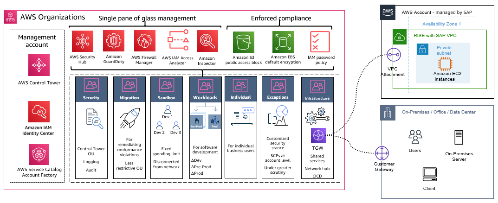

# Connecting to RISE using a shared AWS Landing Zone

Modern SAP landscapes have several connectivity requirements. Services are accessed across on-premises and AWS Cloud as well as across a variety of SaaS solutions and other cloud service providers.

Creating an [AWS Landing Zone](../../../prescriptive-guidance/latest/migration-aws-environment/understanding-landing-zones.md "../../../prescriptive-guidance/latest/migration-aws-environment/understanding-landing-zones.md") facilitates secure, scalable, and well-architected foundation for RISE with SAP connectivity. It provides the following benefits:

- Streamlined SAP network integration with standardized architecture
- Enhanced business continuity through redundant connectivity options
- Strengthened security posture with layered network controls
- Centralized management of network resources and policies
- Ability to reuse [AWS Direct Connect](https://aws.amazon.com/directconnect/ "https://aws.amazon.com/directconnect/") connections across broader AWS solutions
- Optimized network performance with reduced latency
- Enhanced governance through AWS native services
  A Landing Zone is designed to help organizations achieve their cloud initiatives by automating the set-up of an AWS environment that follows [AWS Well Architected](https://aws.amazon.com/architecture/well-architected/ "https://aws.amazon.com/architecture/well-architected/") framework. It provides scalability to cater to all scenarios, from the simplest connectivity, where only RISE with SAP connectivity to on-premises environments is required, to complex requirements with connectivity to multiple SaaS solutions, multiple CSPs and on-premises connectivity.

The key components and benefits of a Landing Zone include:

- **Multi-account structure** – it sets up an organized hierarchy using [AWS Organizations](https://aws.amazon.com/organizations/ "https://aws.amazon.com/organizations/") with separate accounts for production, development, and shared services, ensuring clear separation of concerns and improved security boundaries.
- **Network Architecture** - it establishes a centralized [AWS Transit Gateway](https://aws.amazon.com/transit-gateway/ "https://aws.amazon.com/transit-gateway/") as the network hub with standardized VPC configurations which connects the RISE with SAP account with other AWS accounts. It also supports integration with AWS Direct Connect and [AWS Site-to-Site VPN](https://aws.amazon.com/vpn/site-to-site-vpn/ "https://aws.amazon.com/vpn/site-to-site-vpn/") to connect your on-premises with RISE with SAP account while maintaining network segmentation and security controls.
- **Security Framework** - it implements comprehensive AWS security services integration with centralized logging and monitoring, including network firewall implementation and identity and access management controls.
- **Automation and Management** - it uses Infrastructure as Code deployment through [AWS Control Tower](https://aws.amazon.com/controltower/ "https://aws.amazon.com/controltower/") or [AWS CDK](https://aws.amazon.com/cdk/ "https://aws.amazon.com/cdk/") and [Landing Zone Accelerator (LZA)](https://aws.amazon.com/solutions/implementations/landing-zone-accelerator-on-aws/ "https://aws.amazon.com/solutions/implementations/landing-zone-accelerator-on-aws/") for automated account provisioning, standardized configurations, and consistent policy enforcement across the environment.
- **Logging and Monitoring** - it configures AWS services including [AWS Config](https://aws.amazon.com/config/ "https://aws.amazon.com/config/"), [AWS CloudTrail](https://aws.amazon.com/cloudtrail/ "https://aws.amazon.com/cloudtrail/"), [Amazon GuardDuty](https://aws.amazon.com/guardduty/ "https://aws.amazon.com/guardduty/") for centralized logging, monitoring, and auditing of resource changes and security events.
- **Security Controls** - it implements AWS security best practices through Config Rules, CloudTrail trails, and Security Hub standards while enabling network firewall capabilities.
- **Customization Options** - it allows for customization based on specific organizational requirements, including integration with existing infrastructure and addition of AWS services through the Landing Zone Accelerator configuration.
  We recommend using an AWS Landing Zone for RISE with SAP connectivity.

**Choosing Your Implementation Approach**

AWS offers two solutions for implementing a Landing Zone for RISE with SAP connectivity, each designed to meet different organizational needs.

[AWS Control Tower](https://aws.amazon.com/controltower/ "https://aws.amazon.com/controltower/") provides a streamlined solution through its console-based interface, enabling quick deployment with standardized controls. This approach suits organizations seeking rapid implementation with built-in governance and compliance controls, particularly those starting their cloud journey or requiring straightforward SAP connectivity.

[Landing Zone Accelerator (LZA)](https://aws.amazon.com/solutions/implementations/landing-zone-accelerator-on-aws/ "https://aws.amazon.com/solutions/implementations/landing-zone-accelerator-on-aws/") extends AWS Control Tower’s capabilities through Infrastructure as Code, offering extensive customization and automation. This solution serves enterprises with complex SAP networking requirements, multiple regions, or significant scaling plans. Organizations with established DevOps practices will benefit from LZA’s configuration-driven approach.

Both solutions deliver secure, scalable foundations for RISE with SAP connectivity. Choose Control Tower for rapid deployment and visual management, or LZA for enhanced customization and automation capabilities.

**Building an AWS Landing Zone**

You can implement AWS Landing Zones using AWS Control Tower and the Landing Zone Accelerator, which provides an automated process for building a secure, scalable, multi-account environment, including management and governance services.

For detailed implementation steps or LZA, AWS provides the [Guidance for Building an Enterprise-Ready Network Foundation for RISE with SAP on AWS](https://aws.amazon.com/solutions/guidance/building-an-enterprise-ready-network-foundation-for-rise-with-sap-on-aws/ "https://aws.amazon.com/solutions/guidance/building-an-enterprise-ready-network-foundation-for-rise-with-sap-on-aws/"). It includes validated architecture patterns, security configurations, and operational procedures specifically designed for RISE with SAP deployments. In a simple scenario, a Landing Zone contains a minimal footprint focused on network connectivity that is typically centred around AWS Transit Gateway. For more information, see [AWS Landing zone](../../../prescriptive-guidance/latest/strategy-migration/aws-landing-zone.md "../../../prescriptive-guidance/latest/strategy-migration/aws-landing-zone.md").

The following is a general overview of the process:

1. **Define requirement** – understand your organization’s security, compliance, and operational requirements. This will help determine the appropriate guardrails, controls, and services to be included in the Landing Zone. Review AWS Connectivity Questionnaire provided by SAP Enterprise Cloud Services (ECS) team.
2. **Design architecture** – plan the overall architecture, including the number of accounts (management, shared services, workload accounts), network design (VPCs, subnets, routing), shared services (logging, monitoring, identity management), and security controls (IAM, service control policies, guardrails). For LZA implementations, include planning for [configuration file structure](../../../solutions/latest/landing-zone-accelerator-on-aws/using-configuration-files.md "../../../solutions/latest/landing-zone-accelerator-on-aws/using-configuration-files.md") and customization needs.
3. **Setup AWS Control Tower** – Control Tower helps in setting up and governing a multi-account AWS environment based on best practices. It allows you to create and provision new AWS accounts and deploy baseline security configurations across those accounts. For LZA implementations, this serves as the foundation for additional customization.
4. **Deploy Landing Zone Accelerator (Optional)** - If implementing LZA, deploy the installer stack using either AWS CDK or [AWS CloudFormation](https://aws.amazon.com/cloudformation/ "https://aws.amazon.com/cloudformation/"). Implement standardized configuration files for networking, security, and RISE with SAP connectivity requirements.
5. **Configure AWS Organizations** - Organizations enables you to centrally manage and govern your AWS accounts. Configure Organizations in Control Tower by creating the necessary organizational units (OUs) and service control policies (SCPs). For LZA implementations, ensure OUs align with [configuration file structure](../../../solutions/latest/landing-zone-accelerator-on-aws/using-configuration-files.md "../../../solutions/latest/landing-zone-accelerator-on-aws/using-configuration-files.md").
6. **Deploy Core and Shared Services Accounts** - create and configure the core accounts, such as the management account, shared services accounts (for logging, security tooling), and any other required shared accounts. Deploy shared services, such as CloudTrail, Config, and [AWS Security Hub](https://aws.amazon.com/security-hub/ "https://aws.amazon.com/security-hub/") in the shared services account.
7. **Deploy Network Architecture** - set up the network architecture, including VPCs, subnets, route tables, and Transit Gateway for hub-spoke model. For LZA implementations, configure Direct Connect and/or Site-to-Site VPN through [network configuration files](../../../solutions/latest/landing-zone-accelerator-on-aws/using-configuration-files.md "../../../solutions/latest/landing-zone-accelerator-on-aws/using-configuration-files.md"). Include [AWS Network Firewall](https://aws.amazon.com/network-firewall/ "https://aws.amazon.com/network-firewall/") setup if required.
8. **Configure IAM** - establish IAM roles, policies, and groups for controlling access and permissions across the Landing Zone accounts.
9. **Implement Security Controls** - deploy security services and guardrails, such as Security Hub, [AWS Network Firewall](https://aws.amazon.com/network-firewall/ "https://aws.amazon.com/network-firewall/"), [AWS GuardDuty](https://aws.amazon.com/guardduty/ "https://aws.amazon.com/guardduty/"), and [AWS Config](https://aws.amazon.com/config/ "https://aws.amazon.com/config/") Rules.
10. **Configure Observability and Monitoring** - set up centralized logging and monitoring solutions, such as [Amazon CloudWatch](https://aws.amazon.com/cloudwatch/ "https://aws.amazon.com/cloudwatch/"), [AWS CloudTrail](https://aws.amazon.com/cloudtrail/ "https://aws.amazon.com/cloudtrail/"), and AWS Config.
11. **Share Transit Gateway Details with SAP** - using AWS connectivity questionnaire. Accept incoming transit gateway association requests and configure routing between RISE with SAP VPC and landing zone. Test connectivity and failover scenarios.
12. **Deploy Workload Accounts** - deploy workload accounts with your Landing Zone. Create separate AWS accounts for different workload types such as separating development, test and production environments, or Generative AI workloads utilizing Amazon Bedrock, or Data Analytics workloads utilizing Amazon SageMaker.
13. **Implement Operational Procedures** - establish monitoring, alerting, and backup procedures. Document operational procedures and implement change management processes. Given the complex nature of multi-account environments and the need to maintain consistent security and operational standards across the organization it is advised to set up automated testing and validation.
14. **Automate and Maintain** - use CloudFormation templates or AWS CDK to automate deployment and maintenance. For LZA implementations, maintain configuration files and regularly update LZA version. Establish processes for ongoing maintenance, updates, and compliance checks. This includes keeping the LZA version up-to-date with latest releases and regular check to ensure compliance with security and compliance standards.
15. **Manage Costs** - monitor network transfer costs, optimize connectivity paths, and implement cost allocation tags. Regularly review resource utilization and configure budgets and alerts.
    Best Practices:

- Start implementation at least 6-8 weeks before planned go-live
- Implement redundant connectivity options for high availability
- Use Landing Zone Accelerator for standardized deployment
- Follow [AWS Well-Architected framework](https://aws.amazon.com/architecture/well-architected/ "https://aws.amazon.com/architecture/well-architected/") guidelines
- Regularly review and update security controls
- Maintain documentation and operational procedures
- LZA implementations can automate most of this setup through [configuration files](../../../solutions/latest/landing-zone-accelerator-on-aws/using-configuration-files.md "../../../solutions/latest/landing-zone-accelerator-on-aws/using-configuration-files.md").
  Costs associated to a Customer Managed AWS Landing Zone vary depending on the AWS Services that are used. The AWS Services as described in this paragraph have their own pricing model. For more information on price, see the dedicated pricing pages of the listed AWS Services. See [AWS Pricing Calculator](https://calculator.aws/#/ "https://calculator.aws/#/") to configure a cost estimate that fits your business needs.

Regularly review and update the landing zone configuration to ensure it continues to meet evolving business needs and security requirements.
