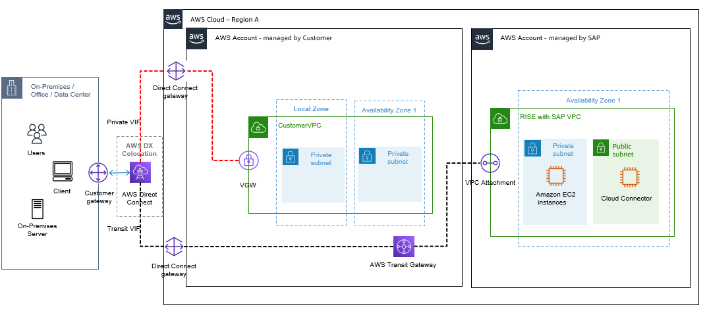
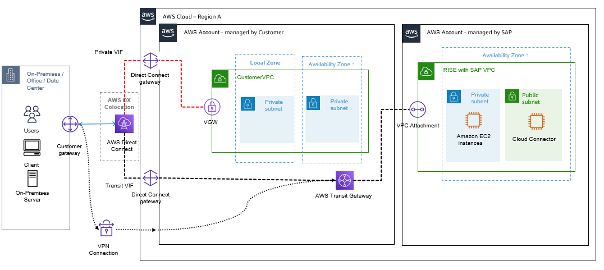

# Connect to nearest Direct Connect POP (including Local Zone)

AWS Direct Connect point-of-presence (POP) is a physical cross-connect that allows users to establish a network connection from their own premises to an AWS Region or AWS Local Zone. You can use the nearest Direct Connect POP (for example, in an AWS Local Zone) to benefit from lower setup and running costs, with the same or lower network latency to your RISE with SAP VPC that runs on the parent AWS Region. For more information, see [AWS Direct Connect Traffic Flow with AWS Local Zone](https://d1.awsstatic.com/architecture-diagrams/ArchitectureDiagrams/direct-connect-traffic-flow-local-zone-ra.pdf "https://d1.awsstatic.com/architecture-diagrams/ArchitectureDiagrams/direct-connect-traffic-flow-local-zone-ra.pdf").

Here is an example scenario - You are based in Philippines, and you would like to deploy RISE with SAP in AWS Singapore Region. You can use Direct Connect POP in Manila to setup Direct Connect from your on-premises data centre or offices. This strategy provides a lower network latency compared to a connecting directly to the AWS Region in Singapore.

The following diagram displays RISE connectivity through nearest AWS Direct Connect POP.

The following are some considerations when using AWS Direct Connect POP:

- Use separate VPCs for Region (RISE with SAP VPC) and Local Zones based non-SAP workloads
- Use Direct Connect Gateway in AWS Direct Connect POP and Private VIF connectivity
- Use Direct Connect Gateway in AWS Direct Connect POP and Transit VIF connectivity for Region VPCs (RISE with SAP VPC).This is done because Direct Connect Gateway does not exists in AWS Direct Connect POP, and AWS Transit Gateway exists only in AWS Regions.
  If resilience is critical, setup a secondary Direct Connect to the AWS Region running RISE with SAP VPC or use AWS Site-to-Site VPN to the AWS Region connectivity option. These services operate within the parent AWS Region, serving as a failover connectivity option ensuring uninterrupted connectivity in the event of disruptions or failures.

Cost of data transferred between a Local Zone and an Availability Zone within the same AWS Region, "in" to and "out" from Amazon EC2 in the Local Zone varies. For more information see: [EC2 - On-Demand Pricing - Data Transfer within the same AWS Region](https://aws.amazon.com/ec2/pricing/on-demand/#Data_Transfer_within_the_same_AWS_Region "https://aws.amazon.com/ec2/pricing/on-demand/#Data_Transfer_within_the_same_AWS_Region")
