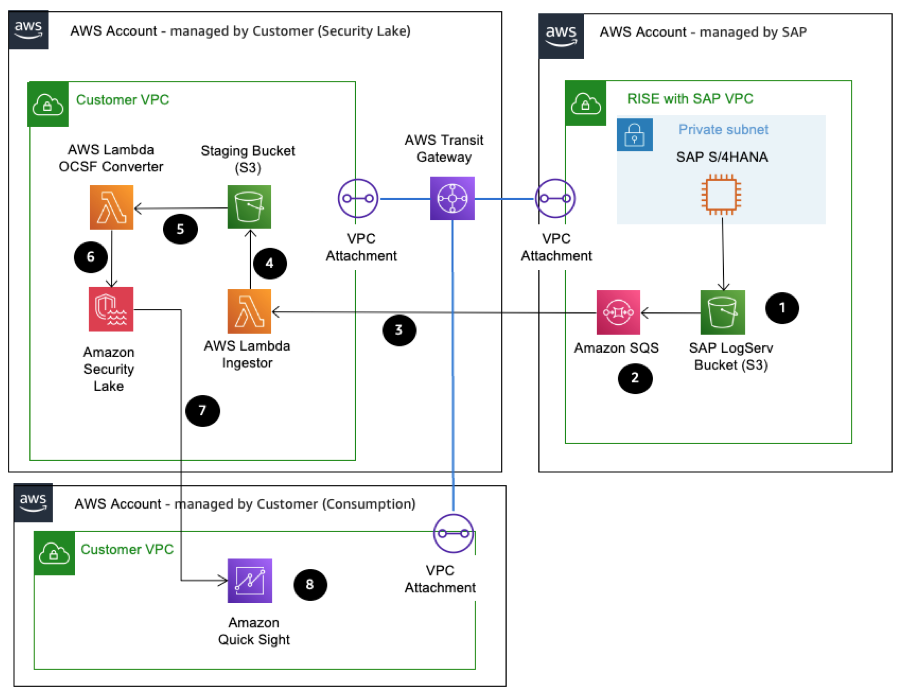

# Consuming SAP LogServ on AWS

Migrating to RISE with SAP can deliver business benefits, including enhanced security and industry compliance. When SAP workloads are hosted in the RISE with SAP, the security operating model changes following the established [RISE with SAP Shared Responsibility Framework](https://community.sap.com/t5/technology-blog-posts-by-sap/rise-with-sap-shared-security-responsibility-for-sap-cloud-services/ba-p/13497110 "https://community.sap.com/t5/technology-blog-posts-by-sap/rise-with-sap-shared-security-responsibility-for-sap-cloud-services/ba-p/13497110").

This means that the detailed SAP system telemetry are no longer available to end customers. However customers highlighted that this information is critical for them to review exceptions and threats especially for after-the-fact investigation and reporting that are out-of-scope of RISE offering. In order to meet this requirement, SAP created SAP LogServ, which is an SAP Enterprise Cloud Services (ECS) service aimed at collection, storage, forwarding and access of logs. It centralizes the logs from all system, applications and ECS services used by customer. SAP LogServ supports a comprehensive range of log sources, categorized into Infrastructure Logs and Application Logs.

Infrastructure Logs:

- Operating system logs
- DNS logs
- Proxy logs
- Network logs
- WAF/F5 logs
- Database logs
  Application Logs:

- ABAP logs
- Java logs
- HANA logs
- Webdispatcher logs
- BOBJ (BI/DS/IS) logs
- SCC logs
  In this document, we will detail a technical solution that leverages AWS services to transform SAP LogServ raw data into the [Open Cybersecurity Schema Framework (OCSF)](https://schema.ocsf.io/ "https://schema.ocsf.io/") format, centralize it in [Amazon Security Lake](https://aws.amazon.com/security-lake/ "https://aws.amazon.com/security-lake/"), and enable rich visualizations and natural language queries through Amazon Quick Sight and Amazon Q. You will be able to derive actionable insights for security monitoring, compliance reporting, and operational analytics.

## SAP LogServ data ingestion for AWS customers

To regain the same level of visibility and transparency you enjoyed in your on-premises SAP deployments, you need a comprehensive solution that can transform, centralize, and enrich the SAP LogServ data, enabling you to unlock actionable insights and maintain control over your mission-critical SAP environments. This solution will:

1. **Ingest data provided by SAP LogServ** into a standardized format, such as the Open Cybersecurity Schema Framework (OCSF), to ensure consistent structure and ease of integration.
2. **Centralize the transformed data** in a scalable, secure data store like [Amazon Security Lake](https://aws.amazon.com/security-lake/ "https://aws.amazon.com/security-lake/"). It centralizes security data from cloud, on-premises and custom sources such as RISE with SAP telemetry into a data lake that is stored in your accounts.
3. **Enrich the data** by leveraging AWS} services to extract additional context and insights.
4. **Enable rich visualizations and natural language queries** through tools like [Amazon Quick Sight](https://aws.amazon.com/quicksuite/quicksight/ "https://aws.amazon.com/quicksuite/quicksight/") and [Amazon Q](https://aws.amazon.com/q/ "https://aws.amazon.com/q/"), empowering users to quickly derive actionable insights from the data.

Importantly, this solution should also leave room for integrating with other system telemetry, allowing organizations to build a comprehensive [Security Information and Event Management (SIEM)](https://en.wikipedia.org/wiki/Security_information_and_event_management "https://en.wikipedia.org/wiki/Security_information_and_event_management") solution. If needed, the standardized data can be made available for the SIEM tool that the organization has already invested in, ensuring a seamless integration and a holistic view of the entire IT ecosystem.

**Solution Architecture**

The explanation of the steps in the diagram are as follows:

1. RISE with SAP emits raw telemetry from application, database, and infrastructure layers into the managed SAP LogServ S3 bucket as New Line Delimited JSON, giving you continual access to system events without direct OS level visibility.
2. Each new LogServ object triggers an [S3 event notification](../../../AmazonS3/latest/userguide/EventNotifications.md "../../../AmazonS3/latest/userguide/EventNotifications.md") that deposits a message in an Amazon SQS queue, decoupling log arrival from downstream processing and providing built in retry and buffering capabilities. You can find out more from the [sap-ecs-aws-log-forwarder link](https://pypi.org/project/sap-ecs-aws-log-forwarder/ "https://pypi.org/project/sap-ecs-aws-log-forwarder/").
3. In the customer managed Security Lake AWS account, an [AWS Lambda](https://aws.amazon.com/lambda/ "https://aws.amazon.com/lambda/") function continuously polls the SQS queue, retrieves object keys, and assumes a cross account IAM role to fetch the corresponding log files from the SAP LogServ bucket.
4. The AWS Lambda writes those raw JSON files into a dedicated staging S3 bucket under your control, ensuring durable storage for audit, replay, or offline analysis without touching the source again.
5. A second AWS Lambda, called OCSF Converter, fires on new staging objects, parsing each record and mapping SAP specific fields into the OCSF format before writing normalized events into Security Lake.
6. Security Lake’s built in crawler and [AWS Glue Data Catalog](../../../prescriptive-guidance/latest/serverless-etl-aws-glue/aws-glue-data-catalog.md "../../../prescriptive-guidance/latest/serverless-etl-aws-glue/aws-glue-data-catalog.md") automatically discover, validate, and partition the OCSF records in S3, applying your encryption and fine grained access policies to create a secure, centralized repository.
7. Analysts access Quick Sight to build interactive dashboards (for trends like exception rates or failed logins) and ask questions (e.g., “What are the top five SAP authentication failures this week?”) and receive visualizations or CSV outputs.
8. Amazon Quick Sight can be embedded into chat interfaces or reporting workflows—via Slack, Microsoft Teams, or email—so auditors, compliance managers, or operations teams can query SAP LogServ telemetry conversationally and obtain on demand insights.
9. Finally, because all events adhere to the OCSF standard, you can forward or export them from Security Lake to existing SIEM and observability tools (Such as : Splunk, Dynatrace, New Relic, Cribl) via native connector.

**Security of the Solution**

Security in the RISE with SAP log collection and analytics solution is designed according to AWS's' Well-Architected Framework and RISE with SAP Shared Security model, ensuring confidentiality, integrity, and availability of operational and security logs across the data lifecycle. You can follow [Security Best practices for Security Lake](../../../security-lake/latest/userguide/best-practices-overview.md "../../../security-lake/latest/userguide/best-practices-overview.md").

- **Centralized Security Lake in a dedicated AWS account** : Amazon Security Lake aggregates all logs with KMS encryption and fine-grained access control, supporting compliance with ISO 27001, SOC 2, GDPR, and CCPA. Note that Security Lake can only be deployed within an [AWS Organizations](../../../organizations/latest/userguide/orgs_introduction.md "../../../organizations/latest/userguide/orgs_introduction.md"), therefore we recommend it to be deployed in its own AWS Account.
- **Isolated Account & Network Segmentation** : SAP systems are deployed in a dedicated RISE with SAP AWS account, with workload isolation achieved via VPC segmentation. All inter-account communications leverage private connectivity. Separate AWS account for Amazon Quick Sight for Consumption Layer.
- **Follow the principle of least privilege** by granting minimum permissions to your users. This means providing IAM users, groups, and roles with only the essential access policy permissions they need to perform their tasks. For instance, you might restrict an IAM user to only viewing log sources without the ability to create sources or subscribers. You can maintain accountability by using AWS CloudTrail to track API usage.
- **Leverage the Summary page** that serves as a valuable monitoring tool. This page displays a comprehensive overview of issues from the past 14 days that affect both the Security Lake service and the Amazon S3 buckets containing your data. Regular review of this page helps you investigate and address potential security concerns promptly.
- **Integration with AWS Security Hub** enhances your security posture significantly. By connecting Security Lake with Security Hub, you receive important findings generated from various AWS services and third-party integrations. This integration provides valuable insights into your compliance status and helps ensure you’re following AWS security best practices.
- **Handle deletions of Lambda functions** correctly. The recommended approach is to delete Lambda functions directly rather than disabling them first. Disabling before deletion could disrupt data querying capabilities and potentially affect other system functionalities.
- **Monitor using Amazon CloudWatch metrics**. The system collects raw data from Security Lake every minute and processes it into meaningful metrics. You can enhance your security monitoring by setting up alarms that trigger notifications when specific metric thresholds are reached.
- **Encrypted Log Storage & Strict Access Control** : The SAP LogServ Amazon S3 bucket enforces server-side encryption with AWS KMS for data at rest. IAM roles and bucket policies restrict access to authorized accounts, enabling least-privilege principles.
- **Secure Message Transfer** : Logs are transferred via Amazon SQS with encryption at rest and policy-based access controls, ensuring ordered and tamper-proof delivery.
- **Secure Compute Environments** : Processing Lambda functions run in private subnets without public IPs. Access between services is governed by scoped IAM roles and VPC endpoints, minimizing attack surface.
- **Data Governance & Auditability** : Logs are staged in Amazon S3 with object versioning and CloudTrail auditing. The OCSF converter standardizes log formats, enabling security analytics without exposing sensitive raw data.
- **Secure Visualization & Third-Party Integration** : Quick Sight and OpenSearch connect through private endpoints and MFA-protected SSO. Integrations with Splunk, Dynatrace, and Datadog use TLS encryption and credentials stored in AWS Secrets Manager.
