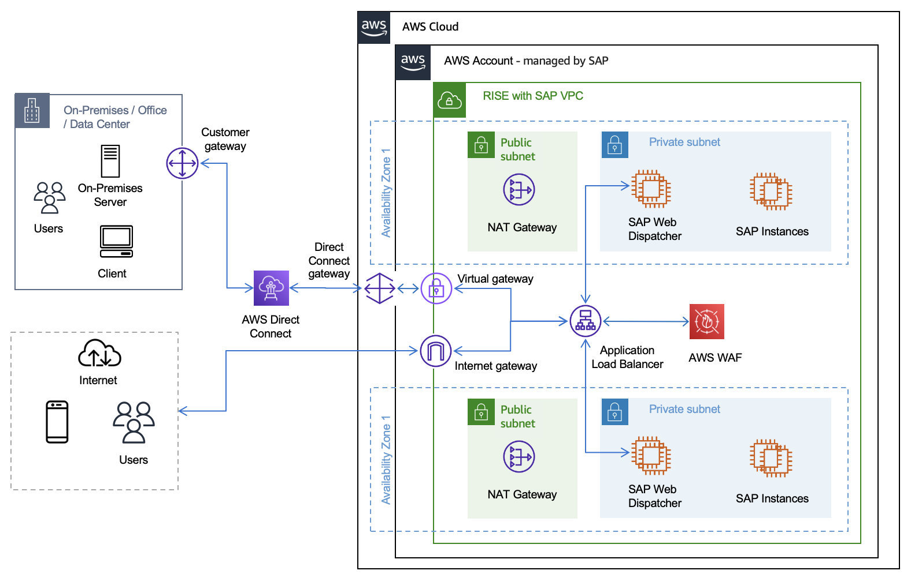

# mTLS Authentication

Mutual Transport Layer Security (mTLS) authentication establishes a secure connection where both client and server authenticate each other using digital certificates. Unlike standard TLS, where only the server presents a certificate, mTLS requires both parties to present and verify certificates.

The mTLS authentication process works in four steps:

1. The client requests a connection to the server.
2. The server presents its certificate.
3. The client verifies the server’s certificate.
4. The client presents its certificate, and the server verifies it to complete mutual authentication.

## Benefits of mTLS Authentication for SAP

mTLS authentication enhances security, improves user experience, and reduces operational overhead. It modernizes user authentication infrastructure to support digital transformation while ensuring compliance with security standards. mTLS addresses the following security requirements in SAP environments:

- **Enhanced Security**: mTLS provides two-way authentication, ensuring both the client and server verify each other’s identity. This significantly reduces the risk of unauthorized access and man-in-the-middle attacks.
- **Seamless User Experience with Single Sign On (SSO)**: mTLS integrates with SSO solutions so users can access multiple SAP applications and services without repeatedly entering credentials.
- **Automated Certificate Rotation**: mTLS allows for automated rotation of certificates, enhancing security by regularly updating authentication credentials without manual intervention. This reduces the risk of using expired or compromised certificates and minimizes administrative overhead.
- **Principal Propagation for Interfaces**: mTLS enables secure principal propagation across different SAP interfaces and systems. This eliminates the need for generic and privileged accounts (like SAP user with SAP\_ALL authorization) for system-to-system communication, significantly improving security and auditability.
- **Scalability and Performance**: ALB handles mTLS verification, offloading certificate-based authentication from SAP application servers. This improves scalability and performance of SAP systems.
- **Support for Zero Trust Architecture**: mTLS aligns well with zero trust security models, where trust is never assumed and always verified.

## mTLS Client Authentication with Application Load Balancer

Application Load Balancer (ALB) supports mTLS authentication. It offers two modes: verify and passthrough mode.

### Prerequisites

We recommend that all SSL/TLS certificates used across the infrastructure originate from a single, trusted root certificate authority (CA). This includes certificates at the ALB, SAP Web Dispatcher, and S/4HANA systems, which simplifies implementation and maintenance.

### mTLS Architecture Diagram

The following diagram shows a basic SAP on AWS architecture adapted for the RISE with SAP SKU offering.

### mTLS Verify Mode

To enable mTLS verify mode, create a trust store containing a CA certificate bundle. This can be accomplished using AWS Certificate Manager (ACM), AWS Private CA, or by importing your own certificates. Manage revoked certificates using Certificate Revocation Lists (CRLs) stored in Amazon S3 and linked to the trust store.

ALB handles client certificate verification against the trust store, effectively blocking unauthorized requests. This approach offloads mTLS processing from backend targets, improving overall system efficiency. ALB imports CRLs from S3 and performs checks without repeated S3 fetches, minimizing latency.

Beyond client authentication, ALB transmits client certificate metadata to the backend SAP Web Dispatcher through HTTP headers (for example, `X-Amzn-Mtls-Clientcert-Leaf`). Backend targets can implement additional logic based on certificate details. ALB also preserves the original Host Header information required by SAP Servers.

This enables the server to process client certificate metadata consistently, even when a non-SAP component such as ALB terminates the TLS connection.

To request mTLS verify mode, submit an Additional Service Request TO\_LRP\_1.1.08A—Enable X.509 certificate for ALB in AWS with WebDispatcher and related backends.

### mTLS Passthrough Mode

In mTLS passthrough mode, ALB forwards the client’s entire certificate chain to backend targets using an HTTP header named `X-Amzn-Mtls-Clientcert`. The chain, including the leaf certificate, is sent in URL-encoded PEM format with `+`, `=`, and `/` as safe characters. The following are key considerations when using mTLS passthrough mode:

- ALB adds no headers if client certificates are absent; backends must handle this.
- Backend targets are responsible for client authentication and error handling.
- For HTTPS listeners, ALB terminates client-ALB TLS and initiates new ALB-backend TLS using target-installed certificates.
- ALB’s TLS termination allows use of any ALB routing algorithm for load balancing.

### NLB Passthrough

When you have stringent security compliance rules requiring server-side termination of client TLS connections, you can use a Network Load Balancer (NLB). Key points to note:

- NLB operates at the transport layer (Layer 4 of the OSI model).
- It provides low-latency load balancing for TCP/UDP connections.
- NLB allows the backend servers to handle TLS termination, which can be crucial for certain security compliance scenarios.

This approach ensures that sensitive decryption processes occur on your controlled server environment, potentially meeting specific security mandates while maintaining efficient traffic distribution.

### Comparison of mTLS verify mode, mTLS passthrough mode, and NLB passthrough

| Considerations                    | ALB with mTLS Verify mode | ALB with mTLS passthrough mode     | NLB                                  |
| --------------------------------- | ------------------------- | ---------------------------------- | ------------------------------------ |
| OSI Layer                         | Layer 7 (Application)     | Layer 7 (Application)              | Layer 4 (Transport)                  |
| Integration with AWS WAF          | Supported                 | Supported                          | Not Supported                        |
| Client Authentication             | Done by ALB (AWS managed) | Done by backend (Customer managed) | Done by backend (Customer managed)   |
| Client SSL/TLS Termination        | At ALB (AWS managed)      | At ALB (AWS managed)               | At backend target (Customer managed) |
| Header Based Routing              | Supported                 | Supported                          | Not Supported                        |
| Trust Store                       | Required at ALB           | Not required at ALB                | Not required at NLB                  |
| Certificate Revocation List (CRL) | Managed at ALB            | Managed by backend (if required)   | Managed by backend (if required)     |
| Backend Processing Load           | Lower                     | Lower                              | Higher                               |
| Error Handling                    | Managed by ALB            | Managed by backend                 | Managed by backend                   |

###### Note

RISE with SAP on AWS supports ALB with mTLS Verify Mode.
