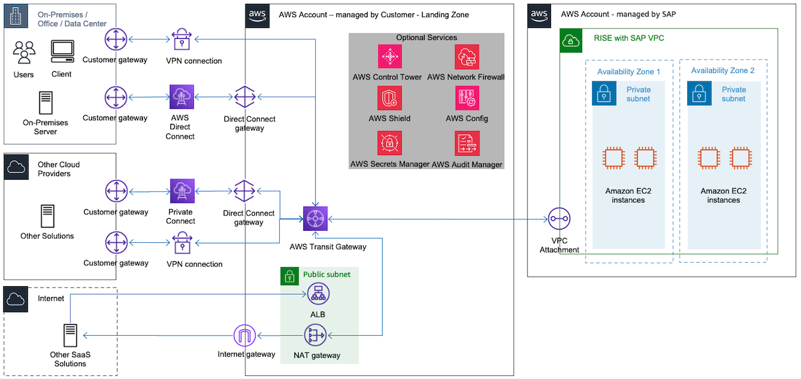
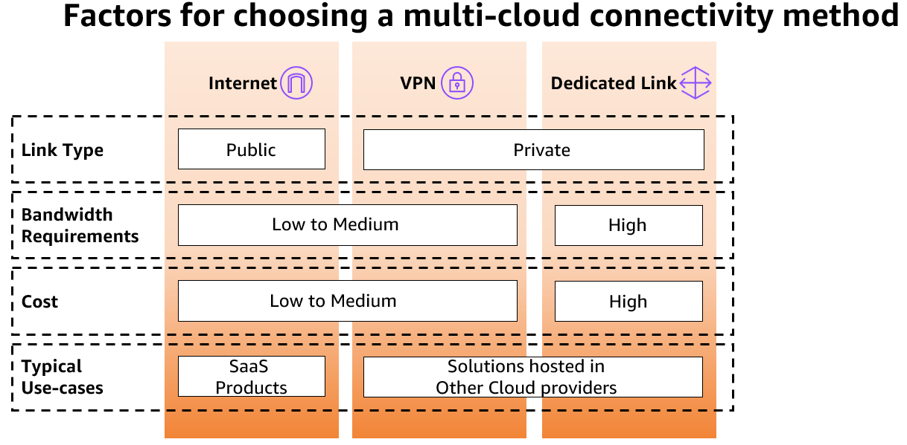

# Connectivity patterns for multi-cloud

In a complex connectivity scenario, you may need to integrate RISE with SAP setup with on-premises, AWS-hosted systems, and a variety of SaaS solutions and other cloud service providers.

Managing connectivity directly from the AWS environment decouples dependencies with on-premises networking infrastructure, improving availability and resiliency of the overall landscape.

You can use public or private connectivity to connect multi-cloud with RISE.

**Public connectivity**

Connectivity is routed over the public internet. This pattern is typically used for connectivity from RISE with SAP to SaaS solutions that runs across multiple clouds. When building connectivity routed over the public internet, consider the following:

- ensure that all communication is encrypted
- protect end-points by using AWS services, such as Elastic Load Balancers and AWS Shield
- monitor endpoints using Amazon CloudWatch
- ensure that traffic between two public IP addresses hosted on AWS is routed over the AWS network

**Private connectivity**

The following three are the options to establish private connectivity between different cloud service providers:

- Site-to-site VPN encrypted tunnel routed over public internet
- private interconnect using AWS Direct Connect in a managed infrastructure (use Azure ExpressRoute for Azure and Google Dedicated Interconnect for Google Cloud Platform)
- private interconnect using an AWS Direct Connect in a facility with a multi-cloud connectivity provider
  The following diagram describes the factors to choose a multi-cloud connectivity method.

For more information, see [Designing private network connectivity between AWS and Microsoft Azure](https://aws.amazon.com/blogs/modernizing-with-aws/designing-private-network-connectivity-aws-azure/ "https://aws.amazon.com/blogs/modernizing-with-aws/designing-private-network-connectivity-aws-azure/").
