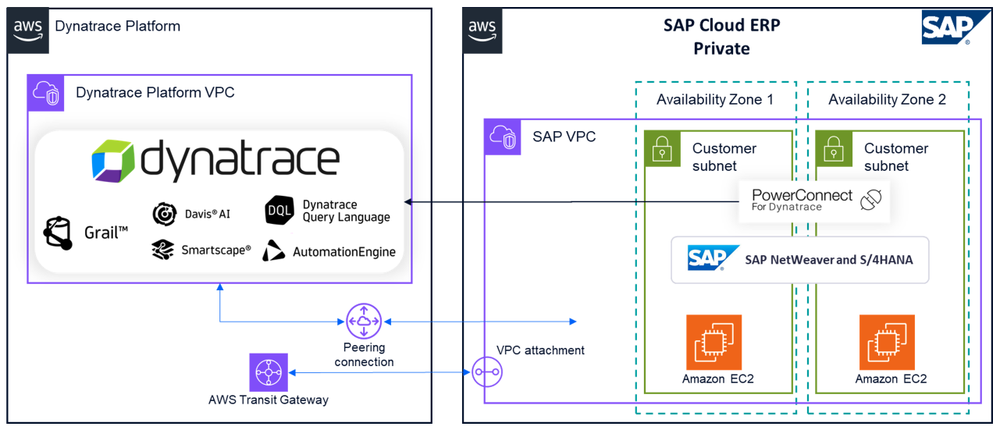

# PowerConnect for SAP on Dynatrace

PowerConnect for SAP on Dynatrace is a comprehensive observability solution that combines SoftwareOne’s deep SAP expertise with Dynatrace’s AI-powered platform to deliver unified visibility across SAP landscapes. The solution enables organizations to monitor complex SAP environments spanning traditional on-premises infrastructure, SAP Cloud ERP, SAP Business Technology Platform (BTP), and various cloud solutions through a single pane of glass.

Key Benefits

- Comprehensive visibility across diverse SAP platforms including SAP S/4HANA, SAP BTP, and other SAP offerings
- Real-time monitoring and insights for business continuity
- Comprehensive security audit and application log analysis
- AI-powered contextual intelligence for transaction tracing
- Over 200 pre-built dashboards for common SAP observability use cases
- Single pane of glass visibility for entire SAP landscape
  Architecture

The solution provides a unified observability framework that seamlessly integrates with various SAP deployment scenarios. At its core, the solution utilizes PowerConnect agents (ABAP and Java) for direct integration with SAP Cloud ERP private environments, while for SaaS and public cloud solutions, it deploys a dedicated AWS virtual machine running the PowerConnect Cloud component. This VM acts as an active remote monitoring agent, establishing connections to SAP APIs and forwarding telemetry data to the Dynatrace tenant. All observability signals, regardless of their source - whether from SAP Cloud ERP, BTP, or other SAP cloud solutions - are consolidated within the Dynatrace Grail data lakehouse. This unified architecture enables comprehensive monitoring and analytics across the entire SAP landscape through a single pane of glass, allowing organizations to maintain complete visibility of their SAP ecosystem while leveraging Dynatrace’s AI-powered analytics capabilities.

PowerConnect for SAP on Dynatrace product [documentation details](https://www.dynatrace.com/hub/detail/powerconnect-for-sap-on-dynatrace-1/ "https://www.dynatrace.com/hub/detail/powerconnect-for-sap-on-dynatrace-1/") comprehensive technical details along with installation and configuration steps. You can procure your [Dynatrace tenant from AWS Marketplace](https://aws.amazon.com/marketplace/pp/prodview-si2angoettdnc?sr=0-1&ref_=beagle&applicationId=AWSMPContessa "https://aws.amazon.com/marketplace/pp/prodview-si2angoettdnc?sr=0-1&ref_=beagle&applicationId=AWSMPContessa"), along with obtaining PowerConnect license from SoftwareOne, via the [AWS marketplace](https://aws.amazon.com/marketplace/pp/prodview-bdpl5zjkasukg "https://aws.amazon.com/marketplace/pp/prodview-bdpl5zjkasukg").

Disclaimer: Dynatrace, Grail, and the Dynatrace logo are trademarks of the Dynatrace, Inc. group of companies. All other trademarks are the property of their respective owners.
