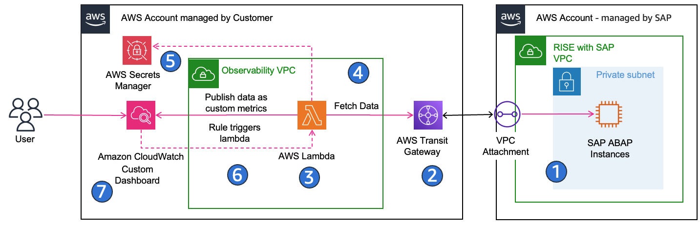
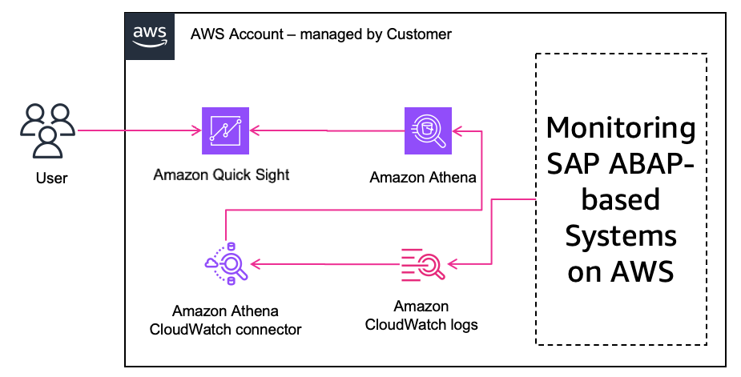
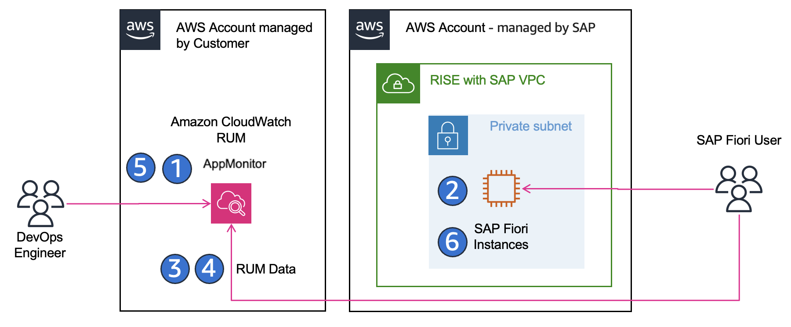

# Native AWS

**SAP Monitoring using Amazon CloudWatch**

Amazon CloudWatch is a service that monitors applications, responds to performance changes, optimizes resource use, and provides insights into operational health. Amazon CloudWatch for SAP is a native AWS monitoring solution that provides comprehensive observability for SAP workloads running on AWS. The solution enables organizations to monitor, analyze, and optimize their SAP landscape using AWS's built-in monitoring capabilities, offering seamless integration with AWS services and automated insights for SAP systems.

To provide reliable, end-to-end observability of SAP landscape on AWS, it is recommended to implement a layered approach that spans application metrics, user experience, operations tooling, and automation. When building observability for SAP on AWS, the aim should be to proactively detect issues across the entire SAP stack from application servers and databases to networks and user interfaces, while also measuring real user experience in applications such as SAP Fiori. The goal is to shorten the time required to detect, diagnose, and remediate problems, automate routine monitoring tasks to minimize manual effort, and ensure that all activities are carried out with strong security, cost efficiency, and operational discipline.

Because you cannot access CloudWatch in the RISE with SAP account directly, you can use the solution described in the next section to export the metrics into your AWS Account to access the metrics via your CloudWatch service.

**Monitoring SAP ABAP-based systems on AWS**

To establish lightweight and scalable monitoring for SAP ABAP-based systems with RISE on AWS, you can adopt a serverless model where AWS Lambda (with SAP Java Connector) configured in your own AWS account extracts workload and monitoring data from SAP transactions like ST03, STAD, and /SDF/SMON, and publishes them as custom metrics in Amazon CloudWatch. A CloudWatch rule schedules the data collection, while credentials are managed securely in AWS Secrets Manager and the Lambda runs in a customer managed VPC with connectivity to the SAP Managed VPC. The lambda function connects to the SAP systems running in the SAP Managed VPC via RFC. You can then build dashboards and alarms in CloudWatch to visualize system performance, proactively detect anomalies, and alert on thresholds, all with minimal operational overhead and low cost. This approach eliminates the need for additional infrastructure or agents, scales across multiple SAP systems, and provides a secure, cost-effective baseline for observability.

High-Level Implementation Steps:

1. Create a dedicated SAP RFC user with required authorizations for monitoring.
2. Establish network connectivity between your AWS account and RISE AWS account.
3. Deploy a Lambda function in your own AWS account using the SAP Java Connector (JCo) as a layer, via the AWS Serverless Application Repository or CloudFormation template.
4. Configure the Lambda to run inside a VPC/subnet with RFC access to your SAP system.
5. Store SAP credentials securely in AWS Secrets Manager.
6. Set a CloudWatch rule to schedule metric collection at appropriate intervals.
7. Build CloudWatch dashboards and alarms using the custom metrics to visualize system health and trigger alerts.
   You can follow [SAP monitoring: A serverless approach using Amazon CloudWatch](https://aws.amazon.com/blogs/awsforsap/sap-monitoring-a-serverless-approach-using-amazon-cloudwatch/ "https://aws.amazon.com/blogs/awsforsap/sap-monitoring-a-serverless-approach-using-amazon-cloudwatch/") for detailed steps and implementation guidance.

By implementing this approach, you gain scalable, secure, and cost-effective monitoring for your SAP ABAP systems, enabling proactive issue detection and performance visibility. This foundation allows you to expand observability over time, incorporate additional metrics, and integrate monitoring seamlessly into your operational workflows via native AWS services.

**Leveraging Quick Sight Visualization for SAP Monitoring**

Building on the “Monitoring SAP ABAP-based Systems on AWS", you can gain deeper, business-level visibility into your RISE with SAP environment by integrating Amazon CloudWatch Logs with Amazon Quick Sight using Amazon Athena. This lets you take raw operational log data, store and query it efficiently, and build interactive dashboards and reports that non-technical stakeholders can use, offering you a unified picture of system health, user behaviour, and security from a single pane.

To implement this integration, you first set up the Athena CloudWatch Logs connector by deploying a Lambda function that enables Athena to query your CloudWatch Logs. Next, you define Athena views that structure and extract the relevant log fields, such as timestamps, error codes, or custom SAP log entries, to make them ready for analysis. With the views in place, you connect Amazon Quick Sight to Athena by granting the necessary IAM permissions and configuring S3 access, then import or directly query the log data. Finally, you build interactive dashboards and visualizations in Quick Sight to monitor trends, error rates, and operational KPIs, and optionally enable Amazon Q in Quick Sight so your business users can ask natural language questions against the SAP log data without writing SQL.

Once you have setup SAP metrics from RISE environment into Amazon CloudWatch in your onw AWS account, you can follow [Integrate Amazon CloudWatch Logs with Amazon Quick Sight using Amazon Athena](https://aws.amazon.com/blogs/business-intelligence/integrate-amazon-cloudwatch-logs-with-amazon-quicksight-using-amazon-athena/ "https://aws.amazon.com/blogs/business-intelligence/integrate-amazon-cloudwatch-logs-with-amazon-quicksight-using-amazon-athena/") for detailed steps and implementation guidance.

**Monitoring and optimizing SAP Fiori user experience on AWS**

You can monitor and improve the user experience of your SAP Fiori applications by leveraging [Amazon CloudWatch Real User Monitoring (RUM)](../../../AmazonCloudWatch/latest/monitoring/CloudWatch-RUM.md "../../../AmazonCloudWatch/latest/monitoring/CloudWatch-RUM.md"). This enables you to capture how actual users interact with the SAP Fiori launchpad and apps in real-time, measuring performance, error rates, and user drop-offs. By understanding user experience metrics, you can proactively optimize your front-end performance and ensure a smooth, responsive SAP Fiori environment.

High-Level Implementation Steps:

1. Create a CloudWatch RUM app monitor in the AWS console.
2. Deploy the generated JavaScript snippet as a Fiori plugin in the launchpad with appropriate catalogs and role assignments.
3. Configure RUM to capture key metrics: page load times, Core Web Vitals (LCP, FID, CLS), and browser errors.
4. Optionally configure sampling to balance data volume and cost.
5. Create dashboards and alarms in CloudWatch to monitor performance trends and user-impacting issues.
6. Add manual route-change events where necessary to properly capture single-page application navigation.
   You can follow [Monitor and Optimize SAP Fiori User Experience on AWS](https://aws.amazon.com/blogs/awsforsap/monitor-and-optimize-sap-fiori-user-experience-on-aws/ "https://aws.amazon.com/blogs/awsforsap/monitor-and-optimize-sap-fiori-user-experience-on-aws/") for detailed steps and implementation guidance.

By implementing CloudWatch RUM for SAP Fiori, you gain deep insight into end-user experience, allowing your team to proactively identify and resolve front-end performance bottlenecks. This approach ensures higher user satisfaction, continuous improvement of SAP Fiori apps, and actionable data for IT and business teams.

**Enhance SAP Monitoring using AIOps with CloudWatch & Application Signals MCP Servers**

You can supercharge your RISE with SAP observability by using the AWS MCP Servers together with Amazon Q CLI to enable intelligent, context-aware troubleshooting. These tools let you correlate metrics, traces, logs, and service health automatically, define service-level objectives (SLOs), and interact with your observability data using natural-language prompts, helping you find root causes faster, diagnose performance problems more intuitively, and generally improve how quickly you remediate issues in your SAP landscape. Additionally, you can monitor critical network components, such as Direct Connect links and VPCs in a RISE with SAP environment deployed via AWS Landing Zone, ensuring connectivity is available, performance is optimal, and any failures are detected and mitigated promptly.

High-Level Implementation Steps:

1. Ingest full observability data (metrics, logs, traces) from your RISE with SAP systems into Amazon CloudWatch and enable Application Signals.
2. Define Service Level Objectives (SLOs) that align with SAP performance goals (e.g., dialog response time, transaction throughput, Fiori UI latency).
3. Deploy and configure the CloudWatch MCP Server and Application Signals MCP Server in your environment.
4. Set up IAM roles and permissions with least-privilege access so MCP Servers can securely interact with CloudWatch and Application Signals data.
5. Install the Amazon Q Developer CLI, configure it to use the MCP Servers, and map it to your AWS profile and region.
6. Validate that MCP Servers are loaded correctly and responding to Q CLI.
7. Start using natural-language queries in Q CLI to troubleshoot issues, detect latency spikes, validate SLO compliance, and accelerate root-cause analysis across your SAP stack.
   Once operational, you use Q CLI to ask for natural-language-style queries like “Which backend operations are failing most often in my S/4HANA system?”, “Is there any breach in our SLOs for SAP services over past 24 hours?”, or “Please check any clues of threat in my SAP system in the latest 7 days from my cloudtrail log”, letting the tools do much of the correlation and log/pattern detection for you.

You can follow [Streamline SAP Operation with CloudWatch MCP server and Amazon Q CLI](https://aws.amazon.com/blogs/awsforsap/streamline-sap-operation-with-cloudwatch-mcp-server-and-amazon-q-cli-part-3/ "https://aws.amazon.com/blogs/awsforsap/streamline-sap-operation-with-cloudwatch-mcp-server-and-amazon-q-cli-part-3/") for detailed steps and implementation guidance.

By adopting CloudWatch and Application Signals MCP Servers with Q CLI, you make SAP monitoring not just reactive but more predictive and conversational. You dramatically reduce mean time to resolution, because instead of manually crawling logs & dashboards you can ask focused questions and get insights tied to your SAP environment. In environments with many components (app servers, database, network, UI), the MCP servers help you correlate failures across layers (e.g. slow DB, overloaded app server, network latency) more quickly. This approach also helps you enforce performance targets (through SLOs), better visibility into service health, and more robust incident remediation workflows, all helping you operate RISE with SAP on AWS with higher efficiency and reliability.

**Conclusion**

By combining Amazon CloudWatch, CloudWatch RUM, Application Insights, MCP Servers, Amazon Q CLI, Athena, and Quick Sight, you can create a fully integrated, end-to-end observability strategy for your RISE with SAP environment on AWS. This approach enables you to monitor backend systems, SAP Fiori user experience, and service-level objectives, while correlating metrics, logs, and traces across your entire SAP stack.

MCP Servers and Amazon Q CLI provide powerful capabilities to interact with observability data using natural-language queries, automate routine operational tasks, generate health reports, and accelerate root-cause analysis, reducing manual effort and improving operational efficiency. At the same time, the solution is fully customizable, giving you the opportunity to design dashboards, alerts, data collection, and workflows to meet your specific business requirements and compliance needs. Overall, this strategy improves system reliability, enhances user satisfaction, and empowers both technical teams and business stakeholders to proactively optimize and maintain SAP workloads on AWS in a secure, cost-effective, and resilient manner.
