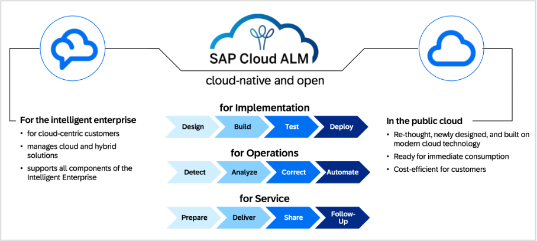

# SAP Cloud ALM

[SAP Cloud Application Lifecycle Management (ALM)](https://support.sap.com/en/alm/sap-cloud-alm.html "https://support.sap.com/en/alm/sap-cloud-alm.html") serves as the primary tool for observability in cloud and hybrid landscapes. It provides a cloud-native approach to monitoring SAP solutions with a focus on standardization rather than extensive customization. Cloud ALM is provided to customers with active cloud services and can be used for both cloud and on-premises SAP solutions, making it suitable for hybrid environments.

**Health Monitoring in SAP Cloud ALM**

At the heart of Cloud ALM’s monitoring capabilities is the [Health Monitoring application](https://support.sap.com/en/alm/sap-cloud-alm/operations/expert-portal/health-monitoring/health-monitoring-setup-configuration/sap-cloud-alm.html "https://support.sap.com/en/alm/sap-cloud-alm/operations/expert-portal/health-monitoring/health-monitoring-setup-configuration/sap-cloud-alm.html"), which systematically collects metrics to calculate the overall health of managed components. The solution presents a comprehensive dashboard displaying the current status of all connected services and systems, tracking critical KPIs including system availability, response times, memory and CPU utilization, database performance, disk space usage, job processing status, queue backlogs, user sessions, and security events. This multifaceted monitoring approach enables organizations to maintain visibility across their SAP landscape, with features spanning system availability tracking, performance monitoring, security surveillance, certificate expiration alerts, threshold-based notifications, and historical data retention for trend analysis. For further details on SAP Cloud ALM Health Monitoring, refer to [SAP Help documentation](https://help.sap.com/docs/cloud-alm/applicationhelp/health-monitoring?locale=en-US "https://help.sap.com/docs/cloud-alm/applicationhelp/health-monitoring?locale=en-US").

**User Experience Monitoring in SAP Cloud ALM**

Cloud ALM enhances its monitoring capabilities through User Experience Monitoring, which employs two complementary approaches. Real User Monitoring captures actual user interactions with SAP applications, providing authentic insights into performance metrics such as page load times, response times, and error rates. Complementing this, Synthetic User Monitoring simulates user interactions at regular intervals through predefined scripts, measuring performance even when no actual users are active. This dual approach ensures continuous visibility into application performance from both real-world and controlled testing perspectives. For further details on SAP Cloud ALM User Experience Monitoring, refer to [SAP Help documentation](https://help.sap.com/docs/cloud-alm/applicationhelp/real-user-monitoring?locale=en-US "https://help.sap.com/docs/cloud-alm/applicationhelp/real-user-monitoring?locale=en-US").

**Operations Automation and View Dashboard**

SAP Cloud ALM offers Operations Automation capabilities for orchestrating and automating standard operations and problem resolution procedures. The Operations View dashboard provides a comprehensive view of system health, calculating a System Health score based on key performance indicators such as Connectivity, Exceptions, Background Processing, and Performance.

**Cost of Using SAP Cloud ALM**

SAP Cloud ALM is included in cloud subscriptions with SAP Enterprise Support. According to [SAP’s fair use policy](https://help.sap.com/docs/CloudALM/08879d094f3b4de3ac67832f4a56a6de/fair-use "https://help.sap.com/docs/CloudALM/08879d094f3b4de3ac67832f4a56a6de/fair-use"), the default resources provided are generally sufficient for standard use cases. Organizations can monitor their usage metrics, including memory consumption and outbound API usage, in the Tenant Information app within SAP Cloud ALM. To reduce memory usage without purchasing extensions, organizations can adjust housekeeping settings in SAP Cloud ALM for operations apps. For extended use scenarios or organizations requiring additional resources, SAP offers SAP Cloud ALM, Tenant Extension. For further details, refer to [SAP Help documentation](https://help.sap.com/docs/cloud-alm/setup-administration/getting-additional-tenants?locale=en-US "https://help.sap.com/docs/cloud-alm/setup-administration/getting-additional-tenants?locale=en-US").

**Conclusion**

For SAP Cloud ERP environments, Cloud ALM represents a valuable starting point for monitoring that comes included with their subscription. As environments grow in complexity and business criticality increases, organizations should continuously assess whether the standardized monitoring approach of Cloud ALM sufficiently addresses their evolving needs or if a specialized partner monitoring solutions would provide greater business value through enhanced observability and improved operational efficiency.
