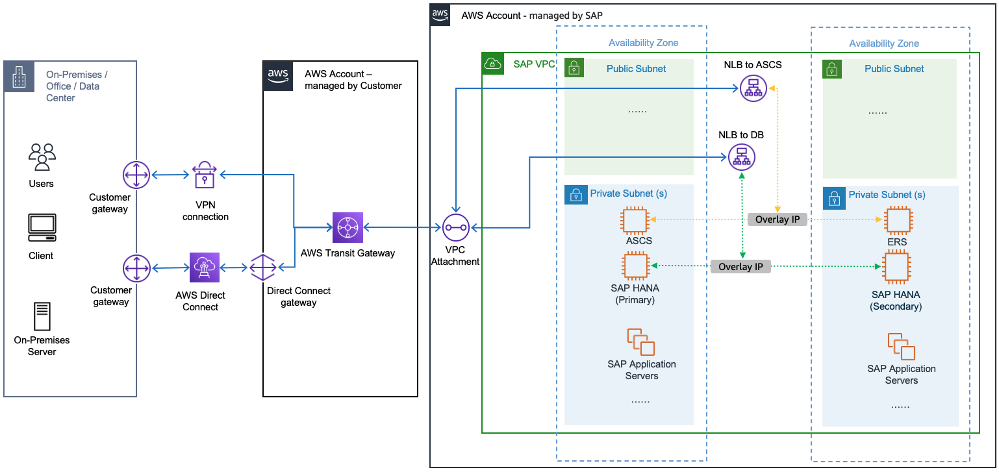

# Connectivity to Overlay IP in RISE on AWS

An Overlay IP is a private IP address assigned to an EC2 instance that is outside the VPC’s CIDR block. It’s used for [high availability and failover scenarios in SAP deployments on AWS](../sap-hana/sap-oip-sap-on-aws-high-availability-setup.md "../sap-hana/sap-oip-sap-on-aws-high-availability-setup.md"), allowing traffic to be directed to the active instance even if it is in a different Availability Zone. This IP address is routable and managed through routing tables, enabling seamless failover without changing the application’s configuration.

Overlay IP is very important in RISE construct for the following scenarios:

- SAP GUI connectivity to SAP Message Server which is part of the ASCS instance
- Application Server connectivity to SAP Enqueue Server which is part of ERS instance
- Client connectivity to HANA Database when it runs XS and XS Advanced Applications
  The Overlay IP is moved by HA Cluster software from primary node to secondary node (or vice versa) when there is an availability issue with primary node or primary availability zone. All the client connectivity must be rerouted when this event occurs so users can continue with their business activities.

There are two ways to connect to this Overlay IP addresses, which is through [Network Load Balancer (NLB)](../sap-hana/sap-oip-overlay-ip-routing-with-network-load-balancer.md "../sap-hana/sap-oip-overlay-ip-routing-with-network-load-balancer.md") and [AWS Transit Gateway (TGW)](../sap-hana/sap-oip-overlay-ip-routing-using-aws-transit-gateway.md "../sap-hana/sap-oip-overlay-ip-routing-using-aws-transit-gateway.md"). You can refer to more details in this [SAP on AWS High Availability with Overlay IP Address Routing guide](../sap-hana/sap-ha-overlay-ip.md "../sap-hana/sap-ha-overlay-ip.md").

**NLB Configuration**

RISE with SAP High Availability deployment strategy spans across two Availability Zones and involves several key networking components. When setting up this configuration, SAP implements NLBs specifically for two critical Overlay IPs, one for the database and another for ASCS. To manage DNS resolution, SAP includes CNAMEs within their RISE managed DNS system, which correspond to the Amazon NLB addresses (ending in .amazonaws.com).

When connecting to RISE with SAP VPC through VPC Peering, you can only access the system using Network Load Balancer (NLB) addresses. Direct access through Overlay IP addresses is not available.

**Transit Gateway Configuration**

When you are utilizing TGW, SAP’s default setup is to propagate routes only for the VPC CIDR range they’re actively using. This leads to an important requirement for customers to manually configure static routes for the CIDR range used by the Overlay Ips (which is outside of the VPC CIDR range). This additional configuration is crucial because it enables direct access to these Overlay IPs through the TGW. Without this static route configuration, traffic would be forced to take a less efficient path through the Network Load Balancer rather than going directly via TGW.

This routing configuration is a critical detail that customers should keep in mind during their SAP deployment, as it can significantly impact the efficiency of their network traffic flow from end-users and other external systems outside of RISE with SAP.

