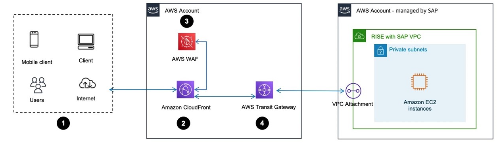
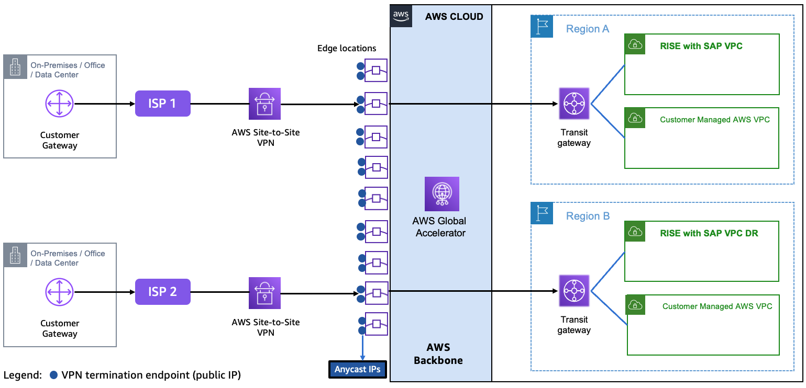

# Performance

**Enhance SAP Fiori performance with Amazon CloudFront**

[Amazon CloudFront](../../../AmazonCloudFront/latest/DeveloperGuide/Introduction.md "../../../AmazonCloudFront/latest/DeveloperGuide/Introduction.md") is a Content Delivery Network service to increase performance and reduce latency of SAP Fiori launchpad in RISE with SAP. CloudFront creates a cache for the static content and accelerates dynamic content through edge computing.

Global SAP systems accessed by users from across multiple geographical regions, can use [Amazon CloudFront VPC (Virtual Private Cloud) Origins](../../../AmazonCloudFront/latest/DeveloperGuide/private-content-vpc-origins.md "../../../AmazonCloudFront/latest/DeveloperGuide/private-content-vpc-origins.md") to reduce network latency and improve the SAP end-user experience.

CloudFront VPC Origins is a feature that enhances security and streamlines operations for web applications such as SAP Fiori, hosted in private subnets within the Amazon VPC. This architecture allows CloudFront to serve as the single entry point for SAP Fiori, eliminating the need for public exposure of the SAP servers.

CloudFront VPC Origins is deployed in the customer-managed AWS account, directing SAP users coming through the CloudFront to an internal, [AWS Application Load Balancer (ALB)](../../../elasticloadbalancing/latest/application/introduction.md "../../../elasticloadbalancing/latest/application/introduction.md"). The ALB routes Fiori traffic directly to the SAP systems hosted in the SAP RISE AWS account through the AWS Transit Gateway. The AWS Web Application Firewall (WAF) is optional but recommended to improve security posture.

Data flow

1. User accesses SAP Fiori launchpad via Internet browser or mobile device
2. The request is routed to Amazon CloudFront to the closest edge compute of the user location
3. Optionally, AWS Web Application Firewall (WAF) evaluates the request based on the customer’s configured rules to block malicious traffic. Additionally, [Distributed Denial of Service (DDOS) protection](https://aws.amazon.com/developer/application-security-performance/articles/ddos-protection/ "https://aws.amazon.com/developer/application-security-performance/articles/ddos-protection/") is also provided by [AWS Shield Standard](../../../waf/latest/developerguide/ddos-standard-summary.md "../../../waf/latest/developerguide/ddos-standard-summary.md") which is automatically included at no extra cost when you use CloudFront with AWS WAF
4. The request is then parsed to the AWS ALB which forwards the traffic to the SAP system hosted in the SAP managed RISE account.
   This improves the security posture of SAP systems by:

- Eliminating direct exposure of SAP servers to the public internet
- Reducing the attack surface as CloudFront becomes the only ingress point
- Simplified security management with centralized control through CloudFront
- Easy integration with AWS WAF & AWS Shield Standard for additional protection
  Integrating CloudFront VPC Origins with SAP can lead to performance improvements:

- Global users benefit from CloudFront’s worldwide edge locations
- Traffic is optimized using the [AWS global network backbone](https://aws.amazon.com/about-aws/global-infrastructure "https://aws.amazon.com/about-aws/global-infrastructure"). CloudFront traffic stays on the high-throughput AWS global network backbone all the way to your SAP servers, providing optimized performance and low latency
- Static SAP Fiori content is cached at CloudFront edge locations and dynamic SAP Fiori content is accelerated through CloudFront’s global edge network
  To implement CloudFront VPC Origins for SAP:

1. The applications in RISE with SAP are by default hosted in private VPC subnets, in an AWS account – managed by SAP
2. In the AWS account – managed by customer, create an AWS ALB pointing to the SAP system in the RISE account
3. Create a CloudFront distribution with VPC Origins pointing to the AWS ALB
4. Update the security group for your VPC private origin (AWS ALB in this case) to explicitly allow the CloudFront managed prefix list. This restricts traffic coming to the VPC origin
5. Ensure the same fully qualified domain name is used by CloudFront, ALB, and SAP
6. Configure CloudFront to handle both static and dynamic content from SAP systems
7. Optionally, implement AWS WAF for additional security at the edge
   Refer to AWS documentation [Restrict access with VPC origins](../../../AmazonCloudFront/latest/DeveloperGuide/private-content-vpc-origins.md "../../../AmazonCloudFront/latest/DeveloperGuide/private-content-vpc-origins.md") for more information.

**Optimize performance with Accelerated Site-to-Site VPN connections**

When you deploy RISE with SAP on AWS for a global roll-out, you can reduce the network latency by leveraging [AWS Global Accelerator](https://aws.amazon.com/global-accelerator/ "https://aws.amazon.com/global-accelerator/") based [Accelerated Site-to-Site VPN](../../../vpn/latest/s2svpn/accelerated-vpn.md "../../../vpn/latest/s2svpn/accelerated-vpn.md"). This service complements the foundational Transit Gateway and Direct Connect to address performance challenges for geographically dispersed users while ensuring efficient and secure access to mission-critical RISE with SAP. It supports both SAP Fiori (HTTPs based) traffic and SAP GUI (TCP based) traffic.

[AWS Global Accelerator](https://aws.amazon.com/global-accelerator/ "https://aws.amazon.com/global-accelerator/") is a service which create accelerators to improve the performance of applications for local and global users. It operates as a Layer 4 TCP/UDP proxy, optimizing traffic routing through AWS’s global network infrastructure. It terminates client TCP connections at AWS edge locations and establishes new TCP connections to backend endpoints over AWS’s private backbone. Thus, reduces latency (up to 75% varying by locations) by bypassing public internet hops and ensures congestion-free routing for globally distributed users.

[Accelerated Site-to-Site VPN connections](../../../vpn/latest/s2svpn/accelerated-vpn.md "../../../vpn/latest/s2svpn/accelerated-vpn.md") combines traditional [AWS Site-to-Site VPN](../../../vpn/latest/s2svpn/VPC_VPN.md "../../../vpn/latest/s2svpn/VPC_VPN.md") with AWS Global Accelerator to optimize traffic routing. It routes the traffic from on-premises network to an AWS edge location that is closest to customer gateway device, leveraging the AWS backbone. This will reduce latency by up to ~30%-60% compared to standard VPNs.

**Enhancing observability of RISE with SAP using AWS Internet Monitor**

[AWS Internet Monitor](../../../AmazonCloudWatch/latest/monitoring/CloudWatch-InternetMonitor.md "../../../AmazonCloudWatch/latest/monitoring/CloudWatch-InternetMonitor.md") continuously analyses internet traffic between end users and AWS-hosted applications, detecting network anomalies that may impact RISE with SAP performance. It provides insights into issues like increased latency, packet loss, or regional connectivity disruptions, allowing organizations to proactively address potential outages before they affect SAP workloads.

RISE with SAP relies on stable and predictable network performance, AWS Internet Monitor helps by:

- Identifying ISP or regional network disruptions that impact SAP response times.
- Providing early warnings and actionable recommendations to mitigate network-related service degradation.
- Distinguishing between AWS infrastructure issues and external internet disruptions and streamlining troubleshooting.
- Improving observability of Internet routing, which is dynamic and lacks predictable service-level agreements (SLAs).
- Proactive management of external ISPs and transit providers which may introduce unpredictable latency, packet loss, and congestion issues.
  To implement you can refer to the Getting started with [Internet Monitor](../../../AmazonCloudWatch/latest/monitoring/CloudWatch-IM-get-started.md "../../../AmazonCloudWatch/latest/monitoring/CloudWatch-IM-get-started.md").
