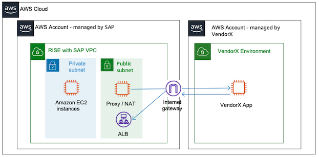
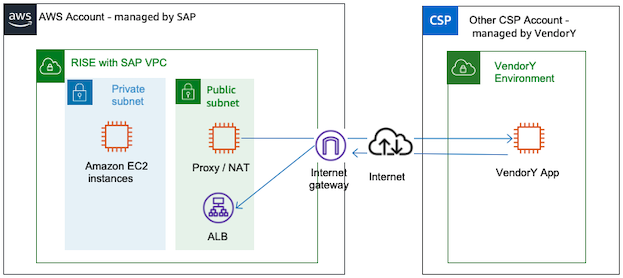

# Connecting to SaaS from RISE

When modernizing the SAP landscape, you may subscribe to several SAP cloud solutions or SaaS from independent software vendors to complement RISE with SAP solution.

When the cloud solutions are running on AWS (in the same AWS region or different AWS regions), the connectivity from RISE with SAP is kept within the AWS global network without requiring internet connectivity. The connectivity is retained through the provided squid proxy server within RISE with SAP VPC.For more information, see [Amazon VPC FAQs - Does traffic go over the internet when two instances communicate using public IP addresses or when instances communicate with a public AWS service endpoint ?](https://aws.amazon.com/vpc/faqs/ "https://aws.amazon.com/vpc/faqs/").

If your cloud is running on other data centre or with another cloud service provider, then you need internet connectivity.

SaaS cloud solutions do not offer connectivity via VPN, Direct Connect or any other means of private connectivity. You can implement a centralized egress to internet architecture to manage this connectivity. For more information, see [Centralized egress to internet](../../../whitepapers/latest/building-scalable-secure-multi-vpc-network-infrastructure/centralized-egress-to-internet.md "../../../whitepapers/latest/building-scalable-secure-multi-vpc-network-infrastructure/centralized-egress-to-internet.md").
