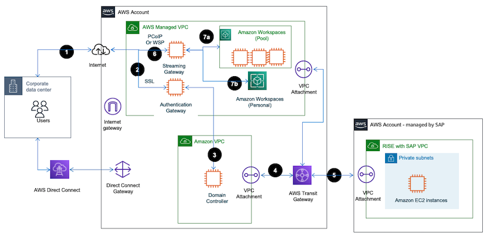

# Amazon WorkSpaces as remote access solution

Using [Amazon WorkSpaces](../../../workspaces/latest/adminguide/amazon-workspaces.md "../../../workspaces/latest/adminguide/amazon-workspaces.md") provides a secure, scalable, and managed virtual desktop environment for accessing SAP systems. This virtual desktop can be used as a centrally managed hosting platform for SAP end user software such as SAPGUI and be connected to your SAP S/4HANA environment in RISE with SAP.

[Amazon WorkSpaces Personal](../../../workspaces/latest/adminguide/amazon-workspaces.md#personal-pools "../../../workspaces/latest/adminguide/amazon-workspaces.md#personal-pools") offers persistent virtual desktops, tailored for users who need a highly-personalized desktop provisioned for their exclusive use, similar to a physical desktop computer assigned to an individual.

[Amazon WorkSpaces Pool](../../../workspaces/latest/adminguide/amazon-workspaces.md#personal-pools "../../../workspaces/latest/adminguide/amazon-workspaces.md#personal-pools") offers non-persistent virtual desktops, tailored for users who need access to highly-curated desktop environments hosted on ephemeral infrastructure.

The following image shows the use of Amazon WorkSpaces as remote access solution for RISE with SAP.

**Traffic flow**

1. User initiates a connection to the AWS WorkSpaces URL via a Web browser or [WorkSpaces Client](https://clients.amazonworkspaces.com/ "https://clients.amazonworkspaces.com/").
2. User authenticated through the authentication gateway within the AWS Managed VPC. When an end-user logs in, the Authentication Gateway verifies user against Directory Services and once the user is authenticated, the gateway establishes a secure session for the user to access their virtual desktops. This session management ensures that the user’s WorkSpaces remains accessible during their active session and helps maintain session integrity and security. This part of architecture uses Secure Socket Layer (SSL) with TCP protocol on port 443.
3. The connection is routed through another VPC Attachment to reach the Domain Controller in a separate Amazon VPC. The Domain Controller manages permissions and access control policies for users. It ensures that users have the appropriate access to resources based on their roles and group memberships. This is typically done through integration (such as AWS Managed Microsoft AD or an on-premises AD connected via AWS Directory Service)
4. Transit Gateway manages the routing between VPCs and Direct Connect or VPN. AWS Direct Connect or VPN provides a secure connection from AWS to the SAP RISE environment.
5. A secure session is established between the user’s device and the SAP managed RISE VPC.
6. The streaming service gateway within the AWS managed VPC begins to stream the virtual desktop environment to the user’s device. This streaming is secured and managed within AWS infrastructure. The streaming gateway securely transmits the desktop stream over the internet to the user’s device. The user’s device now can access SAP applications like SAP S/4 hosted in the RISE environment through SAP end user software such as SAPGUI.
7. Amazon WorkSpaces allows you to access the following 2 types of WorkSpaces, depending on your organization and user needs

**WorkSpaces Pool**, in a pooled configuration, WorkSpaces are dynamically assigned to users from a shared pool. When a user logs in, they may not always connect to the same machine, and changes such as installed applications or user configurations are generally not persistent between sessions

**WorkSpaces Personal**, in this configuration, each user is assigned their own dedicated virtual desktop, where they can install applications, save files, and have their settings and data persist between sessions.

**Set up Amazon WorkSpaces for SAP RISE Access**

1. To use or setup Amazon WorkSpaces to connect to SAP RISE, follow the [Get started with WorkSpaces](../../../workspaces/latest/adminguide/getting-started.md "../../../workspaces/latest/adminguide/getting-started.md").
2. For more information about integrating Amazon WorkSpaces with SAP Single-sign-on, see [How to integrate Amazon WorkSpaces with SAP Single Sign-On](https://aws.amazon.com/blogs/awsforsap/how-to-integrate-amazon-workspaces-with-sap-single-sign-on/ "https://aws.amazon.com/blogs/awsforsap/how-to-integrate-amazon-workspaces-with-sap-single-sign-on/")
3. [Install SAPGUI on your WorkSpaces from SAP Software download](https://help.sap.com/doc/2e5792a2569b403da415080f35f8bbf6/770.00/en-US/sap_frontend_inst_guide.pdf "https://help.sap.com/doc/2e5792a2569b403da415080f35f8bbf6/770.00/en-US/sap_frontend_inst_guide.pdf")
4. [Connect to SAP system via the SAPGUI client](https://help.sap.com/doc/saphelp_em92/9.2/en-US/4e/1260dd1e3d2287e10000000a15822b/content.htm "https://help.sap.com/doc/saphelp_em92/9.2/en-US/4e/1260dd1e3d2287e10000000a15822b/content.htm") in WorkSpaces using your SAP System details

**Amazon Workspaces Operational Best Practices**

1. Monitoring: Use [AWS CloudWatch to monitor the performance and health of your WorkSpaces](../../../workspaces/latest/adminguide/cloudwatch-metrics.md "../../../workspaces/latest/adminguide/cloudwatch-metrics.md").
2. Backup and Recovery: Ensure that critical data on your WorkSpaces is backed up and that you have a [recovery plan in place](../../../workspaces/latest/adminguide/restore-workspace.md "../../../workspaces/latest/adminguide/restore-workspace.md").
3. Updates and Maintenance: Regularly update the software and systems on your WorkSpaces to ensure security and compliance. [By default, Windows WorkSpaces will automatically update weekly](../../../workspaces/latest/adminguide/workspace-maintenance.md "../../../workspaces/latest/adminguide/workspace-maintenance.md").
4. Optimizing Performance

Scaling and Performance Tuning: You can switch a WorkSpaces between the Standard, Power, Performance, and compute types dependent on user needs. 5. Cost Management

WorkSpaces Bundles: Consider purchasing virtual desktop bundles inclusive of your end user software needs. Generally, for simple SAPGUI access a "Value" user will save on costs. See the [AWS WorkSpaces Pricing page](https://aws.amazon.com/workspaces-family/workspaces/pricing/ "https://aws.amazon.com/workspaces-family/workspaces/pricing/") for further details

Monitoring Usage: Use AWS Cost Explorer and budgets to monitor and manage costs effectively.

For non-persistent, secure desktop access consider WorkSpaces Pools as a highly cost-effective option.
By following these steps, you can set up Amazon WorkSpaces as an effective remote access solution for RISE with SAP systems, ensuring secure, scalable, and efficient operations.

**WorkSpaces Benefits to RISE**

Using Amazon WorkSpaces as a remote access solution in a RISE with SAP deployment offers several benefits, particularly around security, access control, and operational efficiency. Here are the key benefits of this approach:

1. **Enhanced Security and Controlled Access**

Isolated Environment: WorkSpaces provide an isolated environment where access to SAP systems in a RISE deployment can be tightly controlled. This helps prevent unauthorized direct access to critical systems

No Direct Internet Exposure: By using WorkSpaces as a remote access solution, you can restrict internet access to the SAP environment. External users or administrators must first connect to a secure WorkSpaces, limiting exposure to SAP systems.

Secure Protocols (PCoIP/WSP): WorkSpaces use secure streaming protocols like PCoIP or WSP, ensuring that data is encrypted during transmission.

Reduced Attack Surface: By utilizing WorkSpaces as the only point of access to SAP systems, you can reduce the attack surface by isolating SAP environments from direct access over the internet or corporate networks.

VPC Integration: WorkSpaces can be deployed in private subnets within an Amazon Virtual Private Cloud (VPC), ensuring secure and direct connectivity to the RISE with SAP infrastructure.

AWS Direct Connect or VPN: You can use AWS Direct Connect or VPN connections to provide a secure network path between the WorkSpaces and SAP environments, further enhancing security. 2. **Centralized Management**

Unified Access Point: Amazon WorkSpaces serve as a single point of access to manage and operate the RISE with SAP environments, simplifying monitoring and control.

Audit and Logging: AWS services such as AWS CloudTrail and Amazon CloudWatch can log user actions and monitor activities on the WorkSpaces. This helps with security audits and tracking access to SAP systems.

Integration with AWS IAM: Role-based access control (RBAC) through AWS Identity and Access Management (IAM) ensures fine-grained access to WorkSpaces and SAP resources. This minimizes the risk of unauthorized access and supports compliance requirements. 3. **Improved Operational Efficiency:**

On-Demand Scalability: WorkSpaces can be provisioned quickly and scaled on-demand, making it easy to provide access to administrators or developers needing to access the SAP environment without lengthy setup processes.

Minimal Maintenance: Amazon WorkSpaces are fully managed, which reduces the overhead of maintaining physical servers or traditional remote desktop infrastructure. Updates and patches are handled by AWS, freeing up time for more critical operations.

Cost Efficiency: WorkSpaces can be configured to charge only when in use (hourly pricing), making it a cost-effective solution for temporary or infrequent access, especially when not in continuous operation.

Remote Access: With WorkSpaces, administrators and users can access the SAP environment securely from any location with an internet connection. This is particularly useful for distributed teams or remote workers supporting SAP environments.

Resilience and Availability: WorkSpaces can be integrated with AWS backup solutions and spread across multiple AWS Availability Zones (AZs), ensuring redundancy and high availability.

Quick Recovery: In case of failure or disaster in the SAP environment, WorkSpaces provide a quick and scalable way to reconnect to alternative environments or backup systems.
