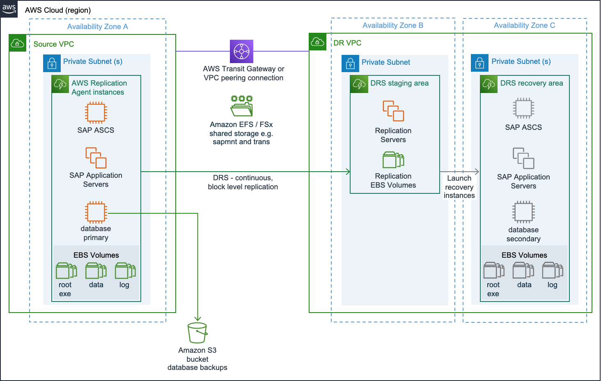
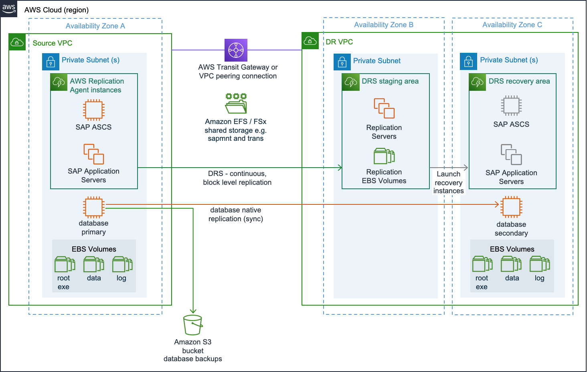
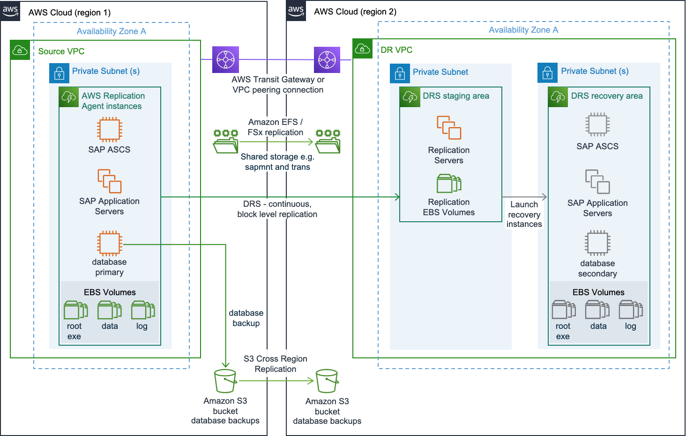
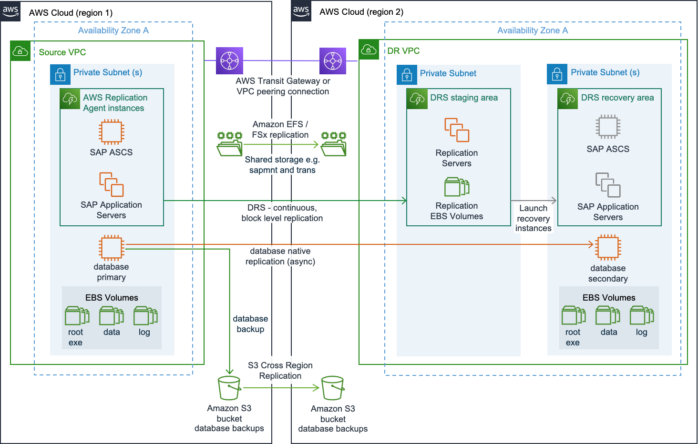
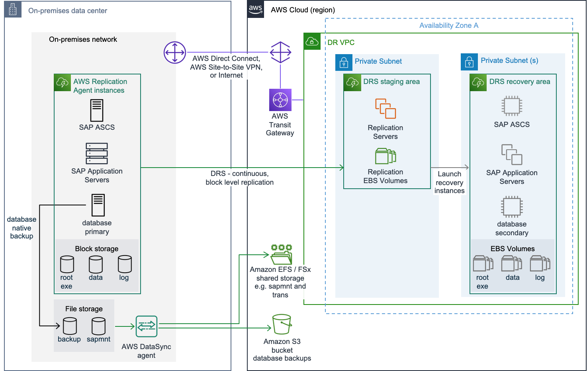
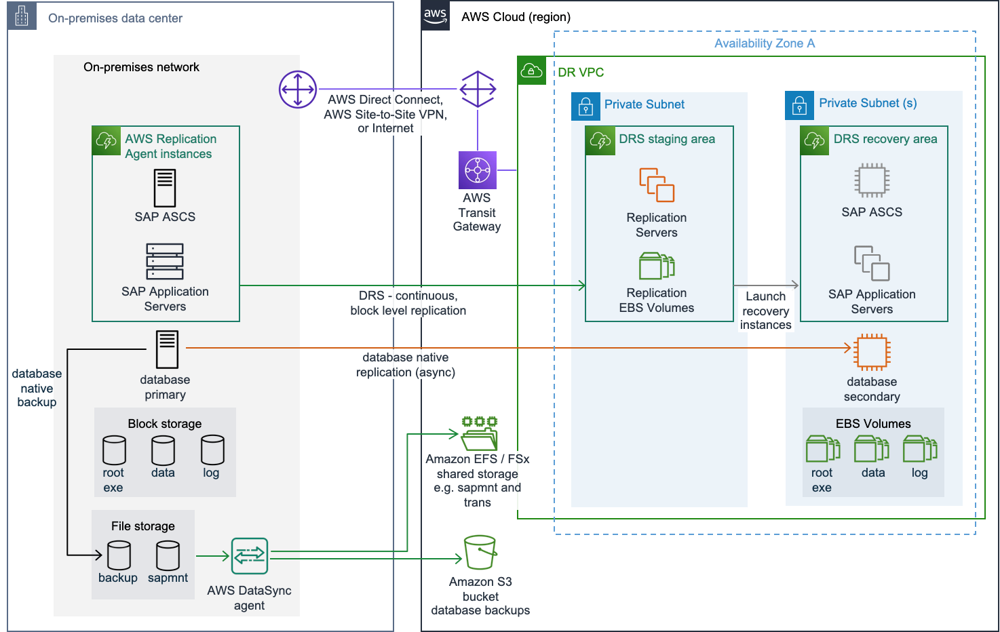

# Disaster recovery scenarios

The following are the three disaster recovery scenarios.

###### Topics

- [AWS In-Region disaster recovery](#same-region "#same-region")
- [AWS Cross-Region disaster recovery](#different-regions "#different-regions")
- [Outside of AWS to AWS disaster recovery](#other-aws "#other-aws")

## AWS In-Region disaster recovery

In AWS cloud, Availability Zones are separated by a meaningful distance, within 100 km (60 miles away from each other). This distance provides isolation from the most common disasters that could affect data centers, for instance, floods, fire, severe storms, earthquakes, etc. It is used by many AWS customers today to support their resiliency requirements for SAP workloads. Based on your business continuity requirements, in-Region disaster recovery maybe suitable for you. For more information, see [Single Region architecture patterns](arch-guide-single-region-architecture-patterns.md "arch-guide-single-region-architecture-patterns.md").

_Best practices_

- Separate Amazon VPCs for the source and recovery areas in the same Region
- Separate AWS accounts for source and recovery areas
- AWS Transit Gateway or Amazon VPC peering for supporting replication traffic and end user connectivity

For more information, see [Network](key-considerations.md#key-considerations-network "key-considerations.md#key-considerations-network").

- Multiple Availability Zones resiliency of Amazon S3 buckets and Amazon EFS for data protection
- Separate Availability Zones for source, staging, and recovery areas

The following two sections cover the reference architectures for this scenario.

**Full in-Region disaster recovery implementation**

In full in-Region disaster recovery implementation, the source servers running SAP application components, such as central services instance ((A)SCS), primary application server (PAS), additional application server (AAS), and the database, are replicated using Elastic Disaster Recovery.

**Hybrid in-Region disaster recovery implementation**

In hybrid in-Region disaster recovery implementation, the source servers running SAP application components, such as central services instance [(A)SCS], primary application server (PAS), and additional application server (AAS) are replicated using Elastic Disaster Recovery. The database is replicated using a database native replication method.

## AWS Cross-Region disaster recovery

A disaster recovery scenario with multiple AWS Regions enables business continuity with your data storage in two separate geographical locations. For more information, see [Multi-Region architecture patterns](arch-guide-multi-region-architecture-patterns.md "arch-guide-multi-region-architecture-patterns.md").

_Best practices_

- Separate Amazon VPCs for the source and recovery areas different Regions
- A shared AWS account for source and recovery areas
- AWS Transit Gateway or Amazon VPC peering for supporting replication traffic and end user connectivity

For more information, see [Network](key-considerations.md#key-considerations-network "key-considerations.md#key-considerations-network").

- Replication via Amazon EFS or other file systems to protect shared storage between Regions

For more information, see [AWS Cross-Region disaster recovery](file-systems-storage.md#file-systems-different-regions "file-systems-storage.md#file-systems-different-regions").

###### Note

You can only replicate in the same AWS account with Amazon EFS.

- Amazon S3 cross-Region replication to provide a copy of your database backups and other Amazon S3 bucket data to disaster recovery Amazon VPC
- Separate subnets for the source, staging, and recovery areas

The following two sections cover the reference architectures for this scenario.

**Full cross-Region disaster recovery implementation**

In full cross-Region disaster recovery implementation, the source servers running SAP application components, such as central services instance ((A)SCS), primary application server (PAS), additional application server (AAS), and the database, are replicated using Elastic Disaster Recovery.

**Hybrid cross-Region disaster recovery implementation**

In hybrid cross-Region disaster recovery implementation, the source servers running SAP application components, such as central services instance [(A)SCS], primary application server (PAS), and additional application server (AAS) are replicated using Elastic Disaster Recovery. The database is replicated using a database native replication method.

## Outside of AWS to AWS disaster recovery

In this scenario, the source systems are running in a non-AWS environment. A hybrid disaster recovery solution like this is can be implemented to quickly add resiliency to your existing production environments on other platforms.

_Best practices_

- AWS Direct Connect for supporting replication traffic and end user connectivity

For more information, see [Network](key-considerations.md#key-considerations-network "key-considerations.md#key-considerations-network").

- AWS DataSync to protect shared storage

For more information, see [Outside of AWS to AWS disaster recovery](file-systems-storage.md#file-systems-other-aws "file-systems-storage.md#file-systems-other-aws").

- Separate subnets for the staging and recovery areas

The following two sections cover the reference architectures for this scenario.

**Full non-AWS to AWS disaster recovery implementation**

In full non-AWS to AWS disaster recovery implementation, the source servers running SAP application components, such as central services instance ((A)SCS), primary application server (PAS), additional application server (AAS), and the database, are replicated using Elastic Disaster Recovery.

**Hybrid non-AWS to AWS disaster recovery implementation**

In hybrid non-AWS to AWS disaster recovery implementation, the source servers running SAP application components, such as central services instance [(A)SCS], primary application server (PAS), and additional application server (AAS) are replicated using Elastic Disaster Recovery. The database is replicated using a database native replication method.

For more disaster recovery options and information, you can reach out to [AWS Support](https://aws.amazon.com/premiumsupport/ "https://aws.amazon.com/premiumsupport/").
