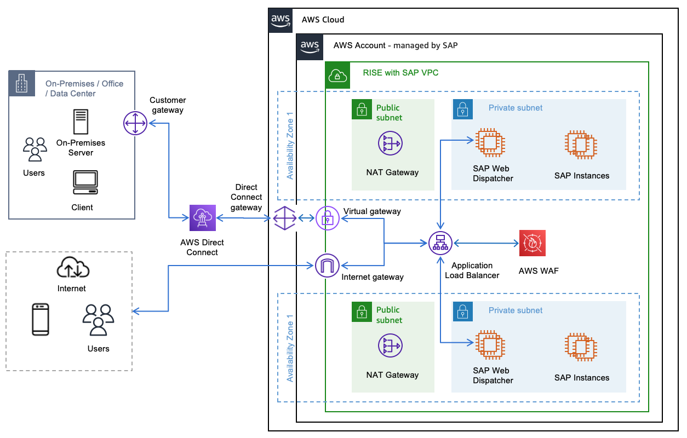
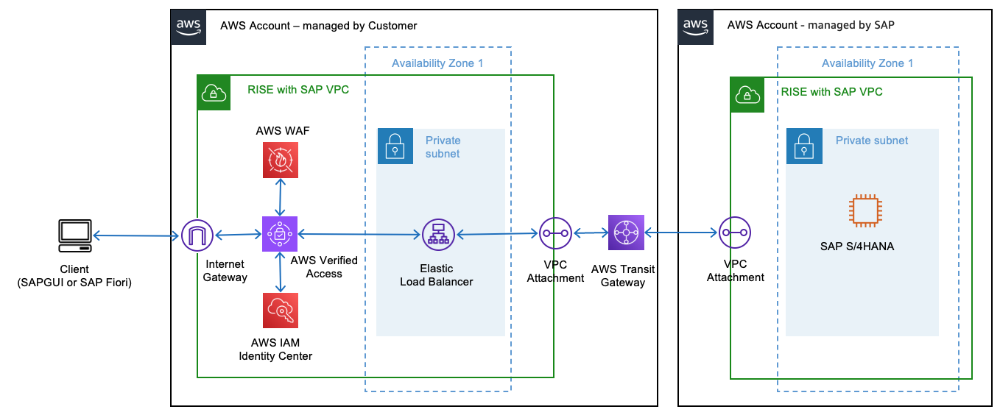

# Security Extension

## mTLS Authentication

Mutual Transport Layer Security (mTLS) Authentication establishes a secure, two-way encrypted connection between client and server. Unlike standard TLS, where only the server provides a certificate, mTLS requires both parties to present digital certificates.

The mTLS authentication process works in four steps:

1. The client requests a connection to the server
2. The server presents its certificate
3. The client verifies the server’s certificate
4. The client presents its certificate for server verification and authentication

**Why is mTLS Authentication for SAP**

The implementation of mutual TLS (mTLS) authentication for SAP systems will enhance security, improve user experience, and reduce operational overhead. It will modernize user authentication infrastructure to support digital transformation while ensuring compliance with security standards. mTLS address below security requirements in SAP environments:

1. Enhanced Security: mTLS provides two-way authentication, ensuring both the client and server verify each other’s identity. This significantly reduces the risk of unauthorized access and man-in-the-middle attacks.
2. Seamless User Experience with Single Sign On (SSO): mTLS can be integrated with SSO solutions, allowing users to access multiple SAP applications and services without repeatedly entering credentials. This creates a smoother, more efficient user experience across the SAP ecosystem.
3. Automated Certificate Rotation: mTLS allows for automated rotation of certificates, enhancing security by regularly updating authentication credentials without manual intervention. This reduces the risk of using expired or compromised certificates and minimizes administrative overhead.
4. Principal Propagation for Interfaces: mTLS enables secure principal propagation across different SAP interfaces and systems. This eliminates the need for generic and privileged accounts (like SAP user with SAP_ALL authorization) for system-to-system communication, significantly improving security and auditability.
5. Scalability and Performance: mTLS can be implemented at the network level, offloading authentication processes from application servers. This can lead to improved performance and scalability of SAP systems.
6. Support for Zero Trust Architecture: mTLS aligns well with zero trust security models, where trust is never assumed and always verified.

**mTLS Client Authentication with Application Load Balancer**

[Application Load Balancer (ALB)](../../../elasticloadbalancing/latest/application/introduction.md "../../../elasticloadbalancing/latest/application/introduction.md") supports mTLS authentication. It offers two modes: verify and passthrough mode.

**Prerequisite**

To ensure seamless communication, all SSL (Secure Socket Layer) or TLS certificates used across the infrastructure, including those at the ALB, SAP Web Dispatcher, and S/4HANA systems should originate from a single and trusted root certificate authority to ease the implementation and maintenance of these certificates.

**mTLS Architecture Diagram**

The diagram below describes a basic SAP on AWS architecture that is adapted to align with the RISE with SAP SKU offering.

**mTLS Verify Mode**

To enable mTLS verify mode, create a trust store containing a CA certificate bundle. This can be accomplished using [AWS Certificate Manager (ACM)](../../../acm/latest/userguide/acm-overview.md "../../../acm/latest/userguide/acm-overview.md"), AWS Private CA, or by importing your own certificates. Manage revoked certificates using Certificate Revocation Lists (CRLs) stored in Amazon S3 and linked to the trust store.

ALB handles client certificate verification against the trust store, effectively blocking unauthorized requests. This approach offloads mTLS processing from backend targets, improving overall system efficiency. ALB imports CRLs from S3 and performs checks without repeated S3 fetches, minimizing latency.

Beyond client authentication, ALB transmits client certificate metadata through [HTTP Headers](../../../elasticloadbalancing/latest/application/mutual-authentication.md "../../../elasticloadbalancing/latest/application/mutual-authentication.md") (e.g., X-Amzn-Mtls-Clientcert-Leaf) to the backend SAP Web Dispatcher via HTTP headers. This allows for additional logic implementation on backend targets based on certificate details, to meet the requirement for SAP Servers to preserve original “Host Header” information.

This enables the server to process client certificate metadata consistently, even when originating from non-SAP sources like an AWS load balancer terminating the SSL connection. In the event that you are implementing end-to-end encryption through ALB – SAP Web Dispatcher – SAP Servers, you must configure SAP Web Dispatcher profile parameters such as icm/HTTPS/client_certificate_header_name for more details you can refer to [this link](https://help.sap.com/docs/ABAP_PLATFORM_NEW/683d6a1797a34730a6e005d1e8de6f22/48477e7fe9d771b9e10000000a421937.html "https://help.sap.com/docs/ABAP_PLATFORM_NEW/683d6a1797a34730a6e005d1e8de6f22/48477e7fe9d771b9e10000000a421937.html").

**mTLS Passthrough Mode**

In mTLS passthrough mode, ALB forwards the client’s entire certificate chain to backend targets. This is done via an HTTP header named X-Amzn-Mtls-Clientcert. The chain, including the leaf certificate, is sent in URL-encoded PEM format with +, =, and / as safe characters. Below are the consideration while using mTLS Passthrough Mode:

- ALB adds no headers if client certificates are absent; backends must handle this.
- Backend targets are responsible for client authentication and error handling.
- For HTTPS listeners, ALB terminates client-ALB TLS and initiates new ALB-backend TLS using target-installed certificates.
- ALB’s TLS termination allows use of any ALB routing algorithm for load balancing.

**NLB Passthrough**

When you have stringent security compliance rules requiring server-side termination of client TLS connections, you can utilize a [Network Load Balancer (NLB)](../../../elasticloadbalancing/latest/network/introduction.md "../../../elasticloadbalancing/latest/network/introduction.md").

Key points to note:

1. NLB operates at the transport layer (Layer 4 of the OSI model).
2. It provides low-latency load balancing for TCP/UDP connections.
3. NLB allows the backend servers to handle TLS termination, which can be crucial for certain security compliance scenarios.

This approach ensures that sensitive decryption processes occur on your controlled server environment, potentially meeting specific security mandates while maintaining efficient traffic distribution.

**Comparison of mTLS verify mode vs mTLS passthrough mode vs NLB passthrough.**

| Considerations                | ALB with mTLS Verify mode | ALB with mTLS passthrough mode     | NLB                                  |
| ----------------------------- | ------------------------- | ---------------------------------- | ------------------------------------ | ----------------------------------------------------------------------------------------------------------------------------------------------------------------------------------------------------------------------------------------------------------------------------------------------------------------------------------------------------------------------------------------------------------------------------------------------------------------------------------------------------------------------------------------------------------------------------------------------------------------------------------------------------------------------------------------------------------------------------------------------------------------------------------------------------------------------------------------------------------------------------------------------------------------------------------------------------------------------------------------------------------------------------------------------------------------------------------------------------------------------------------------------------------------------------------------------------------------------------------------------------------------------------------------------------------------------------------------------------------------------------------------------------------------------------------------------------------------------------------------------------------------------------------------------------------------------------------------------------------------------------------------------------------------------------------------------------------------------------------------------------------------------------------------------------------------------------------------------------------------------------------------------------------------------------------------------------------------------------------------------------------------------------------------------------------------------------------------------------------------------------------------------------------------------------------------------------------------------------------------------------------------------------------------------------------------------------------------------------------------------------------------------------------------------------------------------------------------------------------------------------------------------------------------------------------------------------------------------------------------------------------------------------------------------------------------------------------------------------------------------------------------------------------------------------------------------------------------------------------------------------------------------------------------------------------------------------------------------------------------------------------------------------------------------------------------------------------------------------------------------------------------------------------------------------------------------------------------------------------------------------------------------------------------------------------------------------------------------------------------------------------------------------------------------------------------------------------------------------------------------------------------------------------------------------------------------------------------------------------------------------------------------------------------------------------------------------------------------------------------------------------------------------------------------------------------------------------------------------------------------------------------------------------------------------------------------------------------------------------------------------------------------------------------------------------------------------------------------------------------------------------------------------------------------------------------------------------------------------------------------------------------------------------------------------------------------------------------------------------------------------------------------------------------------------------------------------------------------------------------------------------------------------------------------------------------------------------------------------------------------------------------------------------------------------------------------------------------------------------------------------------------------------------------------------------------------------------------------------------------------------------------------------------------------------------------------------------------------------------------------------------------------------------------------------------------------------------------------------------------------------------------------------------------------------------------------------------------------------------------------------------------------------------------------------------------------------------------------------------------------------------------------------------------------------------------------------------------------------------------------------------------------------------------------------------------------------------------------------------------------------------------------------------------------------------------------------------------------------------------------------------------------------------------------------------------------------------------------------------------------------------------------------------------------------------------------------------------------------------------------------------------------------------------------------------------------------------------------------------------------------------------------------------------------------------------------------------------------------------------------------------------------------------------------------------------------------------------------------------------------------------------------------------------------------------------------------------------------------------------------------------------------------------------------------------------------------------------------------------------------------------------------------------------------------------------------------------------------------------------------------------------------------------------------------------------------------------------------------------------------------------------------------------------------------------------------------------------------------------------------------------------------------------------------------------------------------------------------------------------------------------------------------------------------------------------------------- |
| OSI Layer                     | Layer 7 (Application)     | Layer 7 (Application)              | Layer 4 (Transport)                  |
| Integration with AWS WAF      | Supported                 | Supported                          | Not Supported                        |
| Client Authentication         | Done by ALB (AWS managed) | Done by backend (Customer managed) | Done by backend (Customer managed)   |
| Client SSL/TLS Termination    | At ALB (AWS managed)      | At ALB (AWS managed)               | At backend target (Customer managed) |
| Header Based Routing          | Supported                 | Supported                          | Not Supported                        |
| Trust Store                   | Required at ALB           | Not required at ALB                | Not required at NLB                  |
| Certification Revocation List | Managed at ALB            | Managed by backend (if required)   | Managed by backend (if required)     |
| Backend Processing Load       | Lower                     | Lower                              | Higher                               |
| Error Handling                | Managed by ALB            | Managed by backend                 | Managed by backend                   | Note: RISE with SAP on AWS supports ALB with mTLS Verify Mode. ## Zero Trust Access AWS Verified Access is a Zero Trust security solution that replaces traditional VPNs for corporate application security. It validates each access request by checking user identity, device health, and location. The service integrates with Okta, Azure Active Directory, and IAM Identity Center while providing detailed access logging and monitoring. See [AWS Verified Access for more information](../../../verified-access/latest/ug/what-is-verified-access.md "../../../verified-access/latest/ug/what-is-verified-access.md"). **Key Features and Benefits of AWS Verified Access for SAP** This solution secures SAP landscapes through Zero Trust security, managing both SAPGUI and web-based (HTTPs) access through a unified framework. It encrypts SAPGUI TCP connections and HTTPs access for Fiori applications, eliminating Traditional VPN while maintaining security standards. Users can access RISE with SAP systems faster (before the VPN connectivity is setup). It allows you to grant secure access to remote users and external consultants, which do not have a VPN access to your corporate network 1. Identity-Centric Security Verified access integrates with existing identity providers (IdP), such as Microsoft Azure AD (Entra), Okta, Ping, and others. It provides real-time user authentication and authorization that support for SAML 2.0 and AWS IAM Identity Center 2. Contextual Access Control Verified Access is able to implement device security posture assessment, location-based access policies, role-based access management and dynamic policy evaluation. 3. Enhanced Performance Verified Access provides a direct and optimized connection paths to SAP systems, thus reducing network latency, improve performance and provide more consistent user experience to SAP systems. 4. Simplified Administration Verified Access provides centralized policy management through [AWS Cedar Policy Language](../../../prescriptive-guidance/latest/saas-multitenant-api-access-authorization/cedar.md "../../../prescriptive-guidance/latest/saas-multitenant-api-access-authorization/cedar.md") and authorization engine. It provides automated compliance reporting, real-time access monitoring and reduced infrastructure maintenance **Implementation Guide** **Prerequisites**  • AWS IAM Identity Center enabled in the AWS Region that you prefer. For more information, see [Enable AWS IAM Identity Center](../../../singlesignon/latest/userguide/get-set-up-for-idc.md "../../../singlesignon/latest/userguide/get-set-up-for-idc.md").  • A [security group](../../../vpc/latest/userguide/vpc-security-groups.md "../../../vpc/latest/userguide/vpc-security-groups.md") to allow network access to SAP applications.  • SAP application running behind an internal AWS Elastic Load Balancer. Associate your security group with the load balancer. (you can use a Network Load Balancer for both SAP GUI and SAP Fiori access, or Application Load Balancer for SAP Fiori access only).  • A public TLS certificate in [AWS Certificate Manager](https://aws.amazon.com/certificate-manager/ "https://aws.amazon.com/certificate-manager/") when configuring AWS Verified Access for HTTP(s) based access (i.e. SAP Fiori). Use an RSA certificate with a key length of 1,024 or 2,048.  • A public hosted domain and the permissions required to update DNS records for the domain. (example: Amazon Route 53)  • An IAM policy with the permissions required to create an AWS Verified Access instance. For more information, see [Policy for creating Verified Access instances](../../../verified-access/latest/ug/security_iam_id-based-policy-examples.md#security_iam_id-based-policy-examples-create-instance "../../../verified-access/latest/ug/security_iam_id-based-policy-examples.md#security_iam_id-based-policy-examples-create-instance").  • Set the system environment variable **SAP_IPV6_ACTIVE=1** as per [SAP note 1346768](http://me.sap.com/notes/1346768 "http://me.sap.com/notes/1346768") (requires a SAP S-user ID to access), this is needed when accessing SAP application using Verified Access endpoint from SAP GUI. **How to Implement AWS Verified Access for SAP** 1. Create a Verified Access Trust Provider. After IAM Identity Center is enabled on your AWS account, you can use the following [procedure](../../../verified-access/latest/ug/user-trust.md#identity-center "../../../verified-access/latest/ug/user-trust.md#identity-center") to set up IAM Identity Center as your trust provider for Verified Access. 2. Create a Verified Access instance. You use a Verified Access instance to organize your trust providers and Verified Access groups. Use the following [procedures](../../../verified-access/latest/ug/create-verified-access-instance.md "../../../verified-access/latest/ug/create-verified-access-instance.md") to create a Verified Access instance, and then attach or detach a trust provider from Verified Access. 3. Create a Verified Access group. You use Verified Access groups to organize endpoints by their security requirements. When you create a Verified Access endpoint, you associate the endpoint with a group. Use the following [procedure](../../../verified-access/latest/ug/create-verified-access-group.md "../../../verified-access/latest/ug/create-verified-access-group.md") to create a Verified Access group 4. Create a load balancer endpoint for Verified Access. Verified Access endpoint represents an application. Each endpoint is associated witha Verified Access group and inherits the access policy for the group. Use the following [procedure](../../../verified-access/latest/ug/create-load-balancer-endpoint.md "../../../verified-access/latest/ug/create-load-balancer-endpoint.md") to create a load balancer endpoint for Verified Access for SAP application. 5. Configure DNS for the Verified Access endpoint. For this step, you map your SAP application’s domain name (for example, www.myapp.example.com) to the domain name of your Verified Access endpoint. To complete the DNS mapping, create a Canonical Name Record (CNAME) with your DNS provider. 6. Add a Verified Access group-level access policy. AWS Verified Access policies allow you to define rules for accessing your SAP applications hosted in AWS. Refer to the following sample [statements](../../../verified-access/latest/ug/auth-policies-policy-statement-struct.md "../../../verified-access/latest/ug/auth-policies-policy-statement-struct.md") to derive one for your application as per your requirements. 7. Test the connectivity to your application. You can now test connectivity to your application by entering your SAP application’s domain name into your web browser, for HTTP(S) based access such as SAP Fiori.  The preceding diagram describes on how AWS verified Access deployed and integrated with RISE with SAP |
