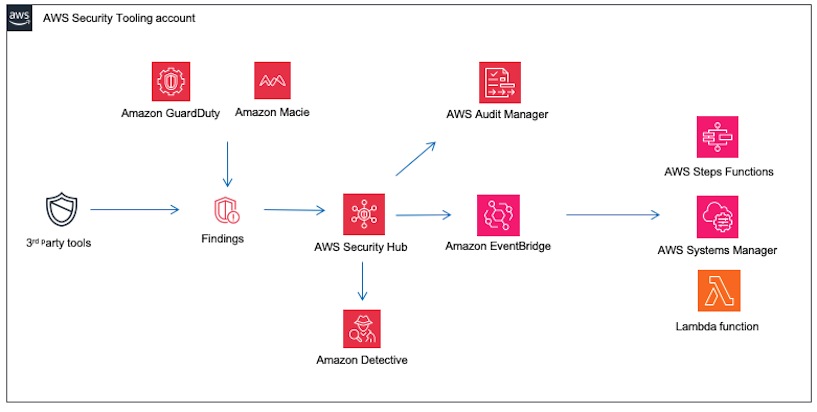

# Security Hub, Detective, Audit Manager and EventBridge

Building on implementation of GuardDuty and Amazon Macie, AWS Security Hub acts as a central hub, consolidating and prioritizing security findings AWS security services. AWS Security Hub provides a unified view of the security posture across services surrounding a RISE with SAP deployment, allowing too quickly identify and address any security issues.

To further investigation and incident response capabilities, Amazon Detective analyses security incidents by gathering and processing relevant log data from AWS resources. This service helps quickly identify the root cause of issues, enabling to take appropriate actions to mitigate the impact.

Maintaining compliance is also a critical aspect of securing a RISE with SAP environment. AWS Audit Manager automates the assessment of AWS resources against industry standards and regulations, helping demonstrate compliance and reduce the risk of non-compliance.

Finally, Amazon EventBridge enables real-time response to security events by triggering custom automated workflows and remediation actions. This service allows to quickly and efficiently address security incidents, minimizing the potential impact on RISE with SAP deployment

Below is example architecture of AWS Security Hub, Amazon Detective, AWS Audit Manager and Amazon EventBridge paired to RISE with SAP

