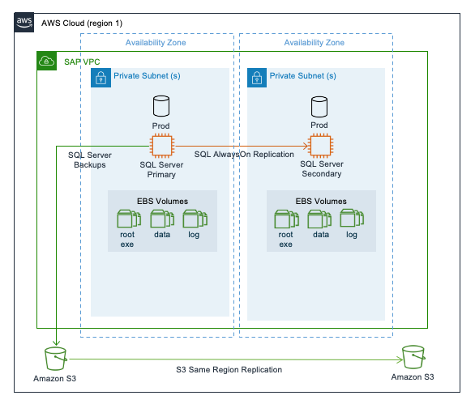
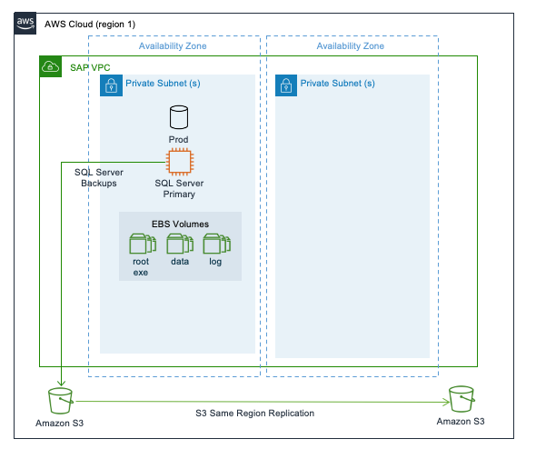

# Single Region architecture patterns for Microsoft SQL server

Single Region architecture patterns help you avoid network latency as your SAP workload components are located in a close proximity within the same Region. Every AWS Region generally has three Availability Zones. For more information, see [AWS Global Infrastructure Map](https://aws.amazon.com/about-aws/global-infrastructure/ "https://aws.amazon.com/about-aws/global-infrastructure/").

You can choose these patterns when you need to ensure that your SAP data resides within regional boundaries stipulated by the data sovereignty laws.

The following are the two single Region architecture patterns.

###### Patterns

- [Pattern 1: Single Region with two Availability Zones for production](#pattern1 "#pattern1")
- [Pattern 2: Single Region with one Availability Zone for production](#pattern2 "#pattern2")

## Pattern 1: Single Region with two Availability Zones for production

In this pattern, your Microsoft SQL server is deployed across two Availability Zones with AlwaysOn configured on both the instances. The primary and secondary instances are of the same instance type. The secondary instance can be deployed in active/passive or active/active mode. We recommend using the sync mode of replication for the low-latency connectivity between the two Availability Zones.

This pattern is foundational if you are looking for high availability cluster solutions for automated failover to fulfill near-zero recovery point and time objectives. SQL AlwaysOn with Windows cluster for automatic failover provides resiliency against failure scenarios, including the rare occurrence of loss of Availability Zone.

You need to consider the additional cost of licensing for AlwaysOn configuration. Also, provisioning production equivalent instance type as standby adds to the total cost of ownership.

Microsoft SQL server backups can be stored in Amazon S3 buckets. Amazon S3 objects are automatically stored across multiple devices, spanning a minimum of three Availability Zones across a Region. To protect against logical data loss, you can use the [Same-Region Replication](https://aws.amazon.com/about-aws/whats-new/2019/09/amazon-s3-introduces-same-region-replication/ "https://aws.amazon.com/about-aws/whats-new/2019/09/amazon-s3-introduces-same-region-replication/") feature of Amazon S3.

With Same-Region replication, you can setup automatic replication of an Amazon S3 bucket in a separate AWS account. This strategy ensures that not all copies of data are lost due to malicious activity or human error. To setup Same-Region replication, see [Setting up replication](../../../AmazonS3/latest/userguide/replication-how-setup.md "../../../AmazonS3/latest/userguide/replication-how-setup.md").

## Pattern 2: Single Region with one Availability Zone for production

In this pattern, Microsoft SQL server is deployed as a standalone installation with no target systems to replicate data. This is the most basic and cost-efficient deployment option. The options available to restore business operations during a failure scenario are by Amazon EC2 auto recovery, in the event of an instance failure or by restoration and recovery from most recent and valid backups, in the event of a significant issue impacting the Availability Zone.

