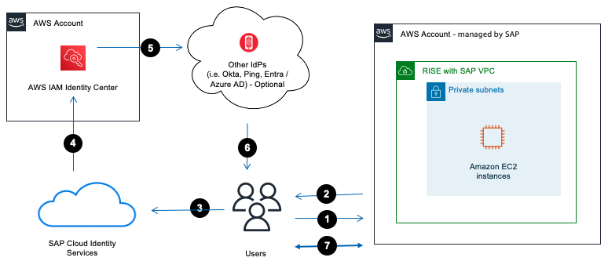

# SSO – SAP Cloud Identity Services and AWS IAM Identity Center

One of the security best practices for RISE with SAP is to centralize the user access control through the integration with a corporate Identity Provider (IdP). This makes it easier for you to provision, de-provision and manage your user access across the company including RISE with SAP, AWS services, and others.

AWS IAM Identity Center is one of the IdP that you can integrate with RISE to support Single Sign-On (SSO). IAM Identity Center provides a centralized access points for users to manage AWS account and applications consistently within the AWS Organizations (example in multi accounts setup).

If you already have an existing identity source such as Okta, Ping, Microsoft Windows Active Directory, Microsoft Entra (previously known as Azure Active Directory), or others, you can integrate the identity source to IAM Identity Center through Security Assertion Markup Language (SAML) and System for Cross-Domain Identity Management (SCIM) protocols.

For more information, you can refer to the following references:

- [What is IAM Identity Center?](../../../singlesignon/latest/userguide/what-is.md "../../../singlesignon/latest/userguide/what-is.md")
- Integration of IAM Identity Center with other identity source, see [Getting started tutorials](../../../singlesignon/latest/userguide/tutorials.md "../../../singlesignon/latest/userguide/tutorials.md").
- [SAP Cloud Identity Services - Identity Authentication](https://help.sap.com/docs/identity-authentication "https://help.sap.com/docs/identity-authentication").
  The following image shows the integration between Identity Authentication from SAP BTP and AWS IAM Identity Center in the context of RISE with SAP

**Authentication flow**

1. User accesses SAP Fiori via an Internet browser.
2. SAP Fiori will redirect SAML request back to the internet browser.
3. Internet Browser relays the SAML request to SAP Cloud Identity Services.
4. SAP Cloud Identity Service delegate authentication request to IAM Identity Center.
5. If IAM Identity Center integrates with existing identity source such as Okta, Ping, Entra, then IdP will authenticate the user.
6. User is authenticated by IdP and SAML response is provided to the internet browser with user identity information.
7. User can access RISE with SAP systems.
   For more information on how to do this, you can refer to [AWS IAM Identity Center (successor to AWS SSO) Integration Guide for SAP Cloud Platform Cloud Foundry](https://static.global.sso.amazonaws.com/app-c1553f5036ecbcd6/instructions/index.htm "https://static.global.sso.amazonaws.com/app-c1553f5036ecbcd6/instructions/index.htm").
