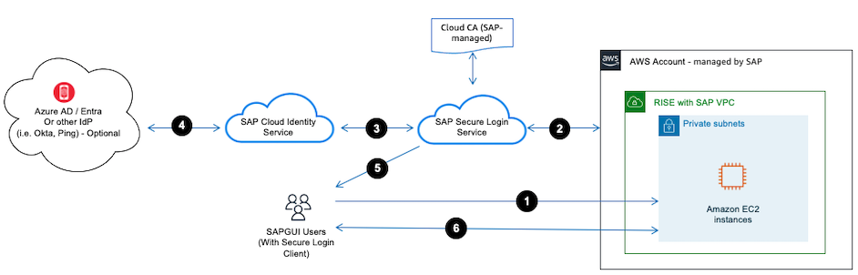

# SSO – SAPGUI Front-End

SAPGUI is a graphical user interface client in the SAP ERP’s three-tier architecture of database, application servers and clients. It requires installation in a local desktop that run on Windows or macOS or Linux.

In order to achieve Single-Sign-On (SSO) for SAPGUI in RISE with SAP, we must use either Kerberos or X.509 method. Kerberos is not recommended by AWS, because it requires user to always be connected to the corporate network and authenticated against a Microsoft Active Directory which reduce their mobility. Due to this, X509 is recommended.

SAPGUI Single-Sign-On with X509 can be achieved with [SAP Secure Login Service on BTP](https://help.sap.com/docs/SAP%20SECURE%20LOGIN%20SERVICE?version=Cloud "https://help.sap.com/docs/SAP%20SECURE%20LOGIN%20SERVICE?version=Cloud"), the image below describes how the integration works.

**Authentication flow**

1. User accesses SAPGUI on their desktop.
2. SAP S/4HANA will redirect authentication request to SAP Secure Login Service.
3. SAP Secure Login Service will delegate the authentication to SAP Cloud Identity Service.
4. When SAP Cloud Identity Service is integrated to IdP (i.e. Azure AD, Okta, Ping, etc.), then IdP will authenticate the user.
5. User is authenticated by IdP and X509 is provided by SAP Secure Login Service to the SAPGUI.
6. User can access to SAP S/4HANA in RISE with SAP VPC.
   For more information on how to do this, you can refer to [Securing SAP GUI with SAP Secure Login Service](https://community.sap.com/t5/technology-blogs-by-sap/explore-securing-sap-gui-with-sap-secure-login-service/ba-p/13579130 "https://community.sap.com/t5/technology-blogs-by-sap/explore-securing-sap-gui-with-sap-secure-login-service/ba-p/13579130").
