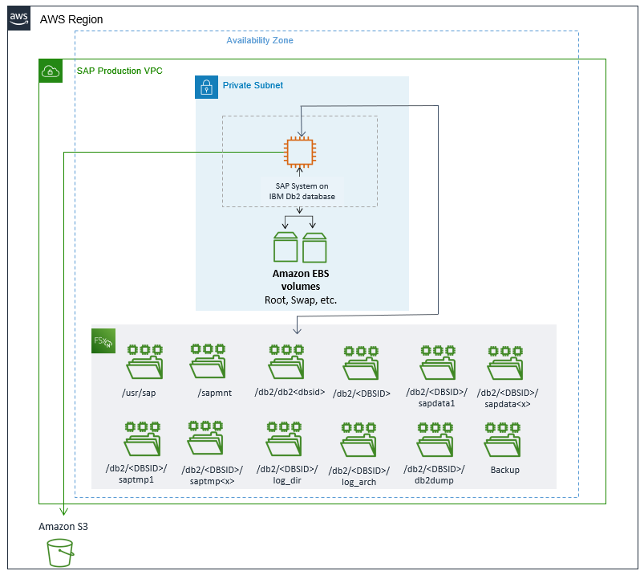
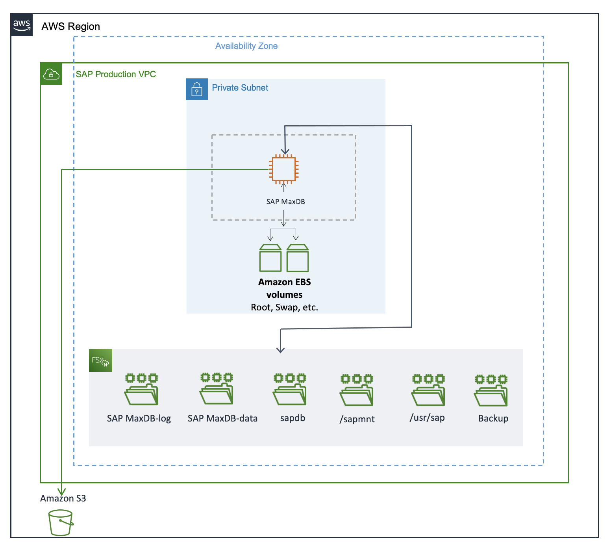
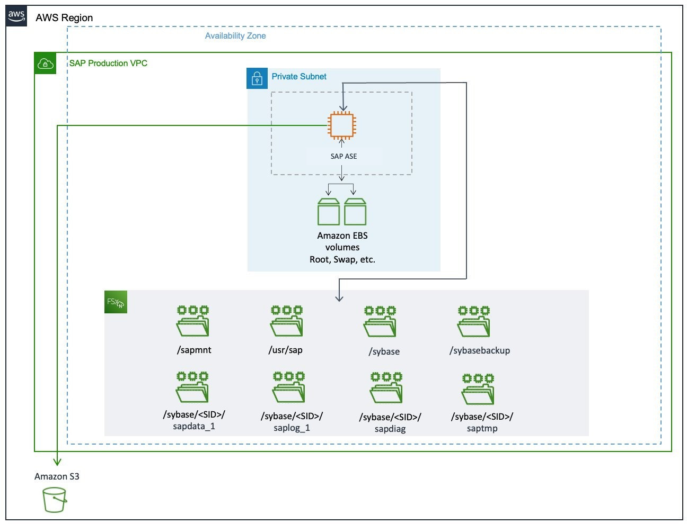
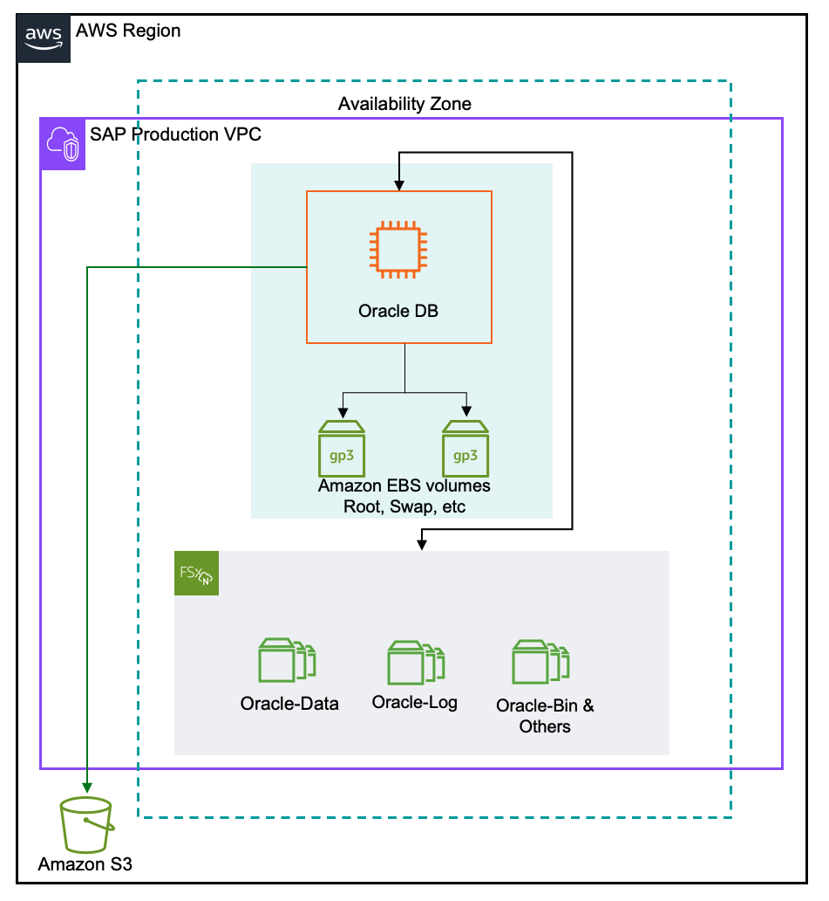
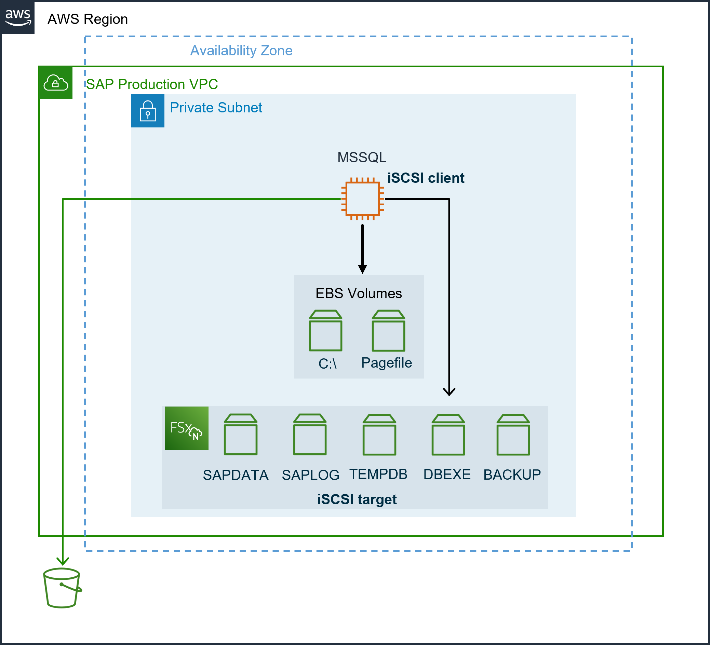
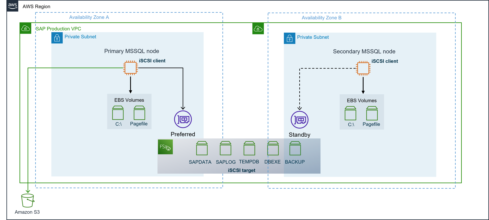

# Architecture diagrams for databases with Amazon FSx for NetApp ONTAP

See the following tabs for the architecture diagram of each database.

IBM Db2
The following diagram presents the setup for IBM Db2 system with FSx for ONTAP.

SAP MaxDB
The following diagram presents the setup for SAP MaxDB system with FSx for ONTAP.

SAP ASE
The following diagram presents the setup for SAP ASE system with FSx for ONTAP.

Oracle
The following diagram presents the setup for Oracle with FSx for ONTAP.

MSSQL
The following diagram presents the single Availability Zone setup for MSSQL database with FSx for ONTAP.

The following diagram presents a high availability setup for MSSQL database with FSx for ONTAP.

FSx for ONTAP supports both, iSCSI and SMB protocol to be used for SQL server deployments on AWS. The iSCSI protocol works at the block level, and is expected to drive higher performance for SQL server with OLTP-type workloads than the same system configured with SMB. We recommend configuring your MSSQL on FSx for ONTAP using the iSCSI protocol.

FSx for ONTAP file systems are set up redundant by default. Each file system has a preferred (active) and a standby (passive) file server. FSx for ONTAP file systems provide management and protocol specific endpoints for each file server either within an Availability Zone (single-AZ) or across Availability Zones (Multi-AZ). For more information, see [Availability, durability, and deployment options](../../../fsx/latest/ONTAPGuide/high-availability-AZ.md "../../../fsx/latest/ONTAPGuide/high-availability-AZ.md").

The SQL server FCI nodes access your FSx for ONTAP file system through elastic network interfaces (ENI). These network interfaces reside in Amazon VPC that you associate with your file system. Clients access the FSx for ONTAP file system via these ENIs (Preferred and Standby).

As a good practice, the active SQL server FCI node should be in the same subnet as the FSx for ONTAP file system preferred subnet. This enables best throughput and low latency, avoiding unnecessary inter-Availability Zone network traffic.
