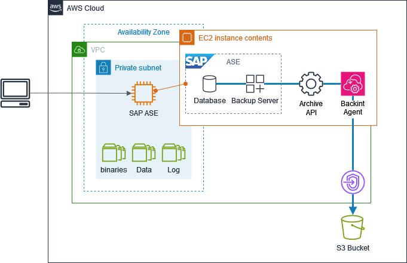

# AWS Backint Agent for SAP ASE

AWS Backint Agent for SAP ASE is a backup and restore application for SAP ASE relational database management systems (RDBMS) running on Amazon EC2 instances.
AWS Backint Agent runs as a standalone application that integrates with your existing workflows to back up your SAP ASE database to Amazon S3.

AWS Backint Agent runs on the SAP ASE database instance, where backups and transaction logs are transferred from SAP ASE to AWS Backint agent.
Based on the configurations in your agent file, AWS Backint agent stores your files in Amazon S3.
To restore your SAP ASE database, specify the backup location Amazon S3.

###### Topics

- [How AWS Backint Agent for SAP ASE works](#ase-backint-how-it-works "#ase-backint-how-it-works")
- [Architecture Components](#ase-backint-architecture "#ase-backint-architecture")
- [Workflow](#ase-backint-workflow "#ase-backint-workflow")
- [Pricing](#ase-backint-pricing "#ase-backint-pricing")
- [Supported Database Versions](#ase-backint-database-versions "#ase-backint-database-versions")
- [Supported Operating Systems](#ase-backint-operating-systems "#ase-backint-operating-systems")
- [Supported AWS Regions](#ase-backint-regions "#ase-backint-regions")
- [Prerequisites](ase-backint-preprequisites.md "ase-backint-preprequisites.md")
- [Installation](ase-backint-install.md "ase-backint-install.md")
- [Backup and Restore](ase-backint-dump-load.md "ase-backint-dump-load.md")
- [Troubleshooting](ase-backint-troubleshooting.md "ase-backint-troubleshooting.md")
- [Version history](aws-backint-agent-ase-version-history.md "aws-backint-agent-ase-version-history.md")

## How AWS Backint Agent for SAP ASE works

AWS Backint Agent for SAP ASE is built on the same foundation as the AWS Backint Agent for SAP HANA and provides a similar experience and capabilities.

AWS Backint Agent implements the SAP ASE Backup Server Archive API.
DUMP and LOAD commands can be initiated via, for example, the SAP ASE command line interface.

## Architecture Components

Architecture components include the SAP ASE database, SAP ASE backup server, AWS Backint Agent (for ASE), and an implementation of the ASE backup server archive API for AWS Backint Agent.

### SAP ASE Backup Server

SAP ASE backup server is a component of the SAP ASE database system that manages database backup and restore operations.
It’s a separate process that runs alongside the main database server and is specifically designed to handle the movement of data during backup and recovery operations.

### Backup Server Archive API

The SAP ASE Backup Server API provides an interface for third-party applications to integrate with ASE’s backup and recovery operations.
This API enables communication between the ASE database engine and external storage systems, allowing for efficient backup and restore operations without requiring intermediate storage.

### AWS Backint Agent

Backint Agent is responsible for streaming backup-related data to and from the destination in Amazon S3.
The agent Backint Agent is largely independent of the database management system.

## Workflow

SAP ASE database, SAP ASE backup server, AWS Backint Agent for ASE and AWS Backint Agent API are installed on a single EC2 instance.

1. Administrator initiates backup or restore via methods, which are native to SAP ASE. For example, a database statement via isql.
2. The **SAP ASE database** reads data pages from database devices and transfers these pages to the Backup Server through the IPC channel.
3. **Backup Server** opens byte-streams (one per stripe) and invokes Backint-specific implementation of the Archive API (Backint Archive API).
4. **Archive API** handles communication between Backup Server and AWS Backint Agent.
5. **Backint Agent** streams data to (backup) and from (restore) **Amazon S3**.

## Pricing

AWS Backint agent is free of charge.
You pay only for the underlying AWS services that you use, for example Amazon S3.
See [Amazon S3](https://aws.amazon.com/s3/pricing/ "https://aws.amazon.com/s3/pricing/") pricing for more information.

## Supported Database Versions

AWS Backint agent for SAP ASE supports the following SAP ASE database versions.

- SAP ASE 16.0
- SAP ASE 16.1

Please note that only SAP ASE databases on Amazon EC2 are supported.

## Supported Operating Systems

AWS Backint agent is supported on the following operating systems.

- SUSE Linux Enterprise Server
- SUSE Linux Enterprise Server for SAP
- Red Hat Enterprise Linux for SAP

All major and minor versions that are currently supported for SAP ASE are supported.
Please refer to the SAP Product Availability Matrix (PAM) at [support.sap.com/pam](http://support.sap.com/pam "http://support.sap.com/pam") for more information.

## Supported AWS Regions

AWS Backint agent is available in all commercial Regions.
China (Beijing), China (Ningxia), and GovCloud are not supported.
