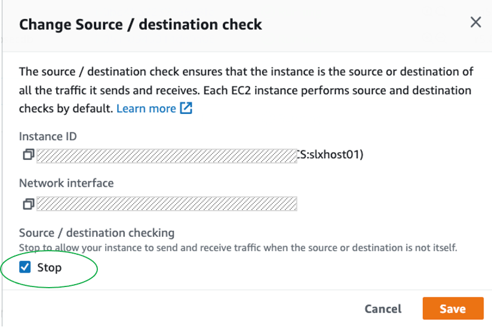

# Settings and prerequisites

The cluster setup uses parameters, including `DBSID` that is unique to your setup. It is useful to predetermine the values with the following examples and guidance.

###### Topics

- [Define reference parameters for setup](#define-parameters "#define-parameters")
- [Amazon EC2 instance settings](#instance-settings "#instance-settings")
- [Operating system prerequisites](#os-prerequisites "#os-prerequisites")
- [IP and hostname resolution prerequisites](#ip-prerequisites "#ip-prerequisites")
- [FSx for ONTAP prerequisites](#filesystem-prerequisites "#filesystem-prerequisites")
- [Shared VPC – optional](#ase-sles-ha-shared-vpc "#ase-sles-ha-shared-vpc")

## Define reference parameters for setup

The cluster setup relies on the following parameters.

###### Topics

- [Global AWS parameters](#global-aws-parameters "#global-aws-parameters")
- [Amazon EC2 instance parameters](#ec2-parameters "#ec2-parameters")
- [SAP and Pacemaker resource parameters](#sap-pacemaker-resource-parameters "#sap-pacemaker-resource-parameters")
- [SLES cluster parameters](#sles-cluster-parameters "#sles-cluster-parameters")

### Global AWS parameters

| Name           | Parameter      | Example        |
| -------------- | -------------- | -------------- |
| AWS account ID | `<account_id>` | `123456789100` |
| AWS Region     | `<region_id>`  | `us-east-1`    |

- AWS account – For more details, see [Your AWS account ID and its alias](../../../IAM/latest/UserGuide/console_account-alias.md "../../../IAM/latest/UserGuide/console_account-alias.md").
- AWS Region – For more details, see [Describe your Regions](../../../AWSEC2/latest/UserGuide/using-regions-availability-zones.md#using-regions-availability-zones-describe "../../../AWSEC2/latest/UserGuide/using-regions-availability-zones.md#using-regions-availability-zones-describe").

### Amazon EC2 instance parameters

| Name                   | Parameter              | Primary example            | Secondary example           |
| ---------------------- | ---------------------- | -------------------------- | --------------------------- |
| Amazon EC2 instance ID | `<instance_id>`        | `i-xxxxinstidforhost1`     | `i<br>• xxxxinstidforhost2` |
| Hostname               | `<hostname>`           | `slxdbhost01`              | `slxdbhost02`               |
| Host IP                | `<host_ip>`            | `10.1.10.1`                | `10.1.20.1`                 |
| Host additional IP     | `<host_additional_ip>` | `10.1.10.2`                | `10.1.20.2`                 |
| Configured subnet      | `<subnet_id>`          | `subnet-xxxxxxxxxxsubnet1` | `subnet-xxxxxxxxxxsubnet2`  |

- Hostname – Hostnames must comply with SAP requirements outlined in [SAP Note 611361 - Hostnames of SAP ABAP Platform servers](https://launchpad.support.sap.com/#/notes/611361 "https://launchpad.support.sap.com/#/notes/611361") (requires SAP portal access).

Run the following command on your instances to retrieve the hostname.

```
hostname
```

- Amazon EC2 instance ID – run the following command (IMDSv2 compatible) on your instances to retrieve instance metadata.

```
/usr/bin/curl --noproxy '*' -w "\n" -s -H "X-aws-ec2-metadata-token: $(curl --noproxy '*' -s -X PUT "http://169.254.169.254/latest/api/token" -H "X-aws-ec2-metadata-token-ttl-seconds: 21600")" http://169.254.169.254/latest/meta-data/instance-id
```

For more details, see [Retrieve instance metadata](../../../AWSEC2/latest/UserGuide/instancedata-data-retrieval.md "../../../AWSEC2/latest/UserGuide/instancedata-data-retrieval.md") and [Instance identity documents](../../../AWSEC2/latest/UserGuide/instance-identity-documents.md "../../../AWSEC2/latest/UserGuide/instance-identity-documents.md").

### SAP and Pacemaker resource parameters

| Name                       | Parameter              | Example                                      |
| -------------------------- | ---------------------- | -------------------------------------------- |
| DBSID                      | `<DBSID>` or `<dbsid>` | `ASD`                                        |
| Virtual hostname           | `<db_virt_hostname>`   | `slxvdb`                                     |
| Database Overlay IP        | `<ase_db_oip>`         | `172.16.0.29`                                |
| VPC Route Tables           | `<rtb_id>`             | `rtb-xxxxxroutetable1`                       |
| FSx for ONTAP mount points | `<ase_db_fs>`          | `svm-xxx.fs-xxx.fsx.us-east-1.amazonaws.com` |

- SAP details – SAP parameters must follow the guidance and limitations of SAP and Software Provisioning Manager. Refer to [SAP Note 1979280 - Reserved SAP System Identifiers (SAPSID) with Software Provisioning Manager](https://launchpad.support.sap.com/#/notes/1979280 "https://launchpad.support.sap.com/#/notes/1979280") for more details.

Post-installation, use the following command to find the details of the instances running on a host.

```
sudo /usr/sap/hostctrl/exe/saphostctrl -function ListDatabases
```

- Overlay IP – This value is defined by you. For more information, see [Overlay IP](../sap-netweaver/sles-ha.md#overlay-ip "../sap-netweaver/sles-ha.md#overlay-ip").
- FSx for ONTAP mount points – This value is defined by you. Consider the required mount points specified in [SAP ASE on AWS with Amazon FSx for NetApp ONTAP](sap-ase-amazon-fsx.md "sap-ase-amazon-fsx.md").

### SLES cluster parameters

| Name                    | Parameter                 | Example     |
| ----------------------- | ------------------------- | ----------- |
| Cluster user            | `cluster_user`            | `hacluster` |
| Cluster password        | `cluster_password`        |             |
| Cluster tag             | `cluster_tag`             | `pacemaker` |
| AWS CLI cluster profile | `aws_cli_cluster_profile` | `cluster`   |

## Amazon EC2 instance settings

Amazon EC2 instance settings can be applied using Infrastructure as Code or manually using AWS Command Line Interface or AWS Management Console. We recommend Infrastructure as Code automation to reduce manual steps, and ensure consistency.

###### Topics

- [Create IAM roles and policies](#iam "#iam")
- [AWS Overlay IP policy](#overlay-ip-policy "#overlay-ip-policy")
- [Assign IAM role](#role "#role")
- [Modify security groups for cluster communication](#security-groups "#security-groups")
- [Disable source/destination check](#disable-check "#disable-check")
- [Review automatic recovery and stop protection](#auto-recovery "#auto-recovery")
- [Create Amazon EC2 resource tags used by Amazon EC2 STONITH agent](#stonith-tags "#stonith-tags")

### Create IAM roles and policies

In addition to the permissions required for standard SAP operations, two IAM policies are required for the cluster to control AWS resources on ASCS. These policies must be assigned to your Amazon EC2 instance using an IAM role. This enables Amazon EC2 instance, and therefore the cluster to call AWS services.

Create these policies with least-privilege permissions, granting access to only the specific resources that are required within the cluster. For multiple clusters, you need to create multiple policies.

For more information, see {https---docs-aws-amazon-com-AWSEC2-latest-UserGuide-iam-roles-for-amazon-ec2-html-ec2-instance-profile}[IAM roles for Amazon EC2].

#### STONITH policy

The SLES STONITH resource agent (`external/ec2`) requires permission to start and stop both the nodes of the cluster. Create a policy as shown in the following example. Attach this policy to the IAM role assigned to both Amazon EC2 instances in the cluster.

```
 {
  "Version":"2012-10-17",
  "Statement": [
    {
      "Effect": "Allow",
      "Action": [
        "ec2:DescribeInstances",
        "ec2:DescribeTags"
      ],
      "Resource": "*"
    },
    {
      "Effect": "Allow",
      "Action": [
        "ec2:StartInstances",
        "ec2:StopInstances"
      ],
      "Resource": [
        "arn:aws:ec2:us-east-1:123456789012:instance/arn:aws:ec2:us-east-1:123456789012:instance/i-1234567890abcdef0",
        "arn:aws:ec2:us-east-1:123456789012:instance/arn:aws:ec2:us-east-1:123456789012:instance/i-1234567890abcdef0"
      ]
    }
  ]
}
```

### AWS Overlay IP policy

The SLES Overlay IP resource agent (`aws-vpc-move-ip`) requires permission to modify a routing entry in route tables. Create a policy as shown in the following example. Attach this policy to the IAM role assigned to both Amazon EC2 instances in the cluster.

```
 {
    "Version":"2012-10-17",
    "Statement": [
        {
            "Effect": "Allow",
            "Action": "ec2:ReplaceRoute",
            "Resource": [
                 "arn:aws:ec2:us-east-1:123456789012:route-table/rtb-0123456789abcdef0",
                 "arn:aws:ec2:us-east-1:123456789012:route-table/rtb-0123456789abcdef0"
                        ]
        },
        {
            "Effect": "Allow",
            "Action": "ec2:DescribeRouteTables",
            "Resource": "*"
        }
    ]
}
```

###### Note

If you are using a Shared VPC, see [Shared VPC cluster resources](#shared-vpc-clsuter-resources "#shared-vpc-clsuter-resources").

### Assign IAM role

The two cluster resource IAM policies must be assigned to an IAM role associated with your Amazon EC2 instance. If an IAM role is not associated to your instance, create a new IAM role for cluster operations. To assign the role, go to https://console.aws.amazon.com/ec2/, select your instance(s), and then choose **Actions** > **Security** > **Modify IAM role**.

### Modify security groups for cluster communication

A security group controls the traffic that is allowed to reach and leave the resources that it is associated with. For more information, see [Control traffic to your AWS resources using security groups](../../../vpc/latest/userguide/vpc-security-groups.md "../../../vpc/latest/userguide/vpc-security-groups.md").

In addition to the standard ports required to access SAP and administrative functions, the following rules must be applied to the security groups assigned to both Amazon EC2 instances in the cluster.

| Inbound                                                      | Source  | Protocol | Port range                                                                                                                                                                                                                                                                                                                                                                                 | Description |
| ------------------------------------------------------------ | ------- | -------- | ------------------------------------------------------------------------------------------------------------------------------------------------------------------------------------------------------------------------------------------------------------------------------------------------------------------------------------------------------------------------------------------ | ----------- |
| The security group ID (its own resource ID)                  | **UDP** | 5405     | Allows UDP traffic between cluster resources for corosync communication                                                                                                                                                                                                                                                                                                                    |
| Bastion host security group or CIDR range for administration | **TCP** | 7630     | \*optional<br>• Used for SLES Hawk2 Interface for monitoring and administration using a Web Interface<br>For more information, see [Configuring and Managing Cluster Resources with Hawk2](https://documentation.suse.com/sle-ha/12-SP5/html/SLE-HA-all/cha-conf-hawk2.html "https://documentation.suse.com/sle-ha/12-SP5/html/SLE-HA-all/cha-conf-hawk2.html") in the SUSE documentation. |

###### Note

Note the use of the UDP protocol.

If you are running a local firewall, such as `iptables`, ensure that communication on the preceding ports is allowed between two Amazon EC2 instances.

### Disable source/destination check

Amazon EC2 instances perform source/destination checks by default, requiring that an instance is either the source or the destination of any traffic it sends or receives.

In the pacemaker cluster, source/destination check must be disabled on both instances receiving traffic from the Overlay IP. You can disable check using AWS CLI or AWS Management Console.

AWS CLI

- Use the [modify-instance-attribute](https://awscli.amazonaws.com/v2/documentation/api/latest/reference/ec2/modify-instance-attribute.html "https://awscli.amazonaws.com/v2/documentation/api/latest/reference/ec2/modify-instance-attribute.html") command to disable source/destination check.

Run the following commands for both instances in the cluster.

\*\*

```
aws ec2 modify-instance-attribute --instance-id <i-xxxxinstidforhost1> --no-source-dest-check
```

\*\*

```
aws ec2 modify-instance-attribute --instance-id <i-xxxxinstidforhost2> --no-source-dest-check
```

AWS Management Console

- Ensure that the **Stop** option is checked in https://console.aws.amazon.com/ec2/.



### Review automatic recovery and stop protection

After a failure, cluster-controlled operations must be resumed in a coordinated way. This helps ensure that the cause of failure is known and addressed, and the status of the cluster is as expected. For example, verifying that there are no pending fencing actions.

This can be achieved by not enabling pacemaker to run as a service at the operating system level or by avoiding auto restarts for hardware failure.

If you want to control the restarts resulting from hardware failure, disable simplified automatic recovery and do not configure Amazon CloudWatch action-based recovery for Amazon EC2 instances that are part of a pacemaker cluster. Use the following commands on both Amazon EC2 instances in the pacemaker cluster, to disable simplified automatic recovery via AWS CLI. If making the change via AWS CLI, run the command for both Amazon EC2 instances in the cluster.

###### Note

Modifying instance maintenance options will require admin privileges not covered by the IAM instance roles defined for operations of the cluster.

```
aws ec2 modify-instance-maintenance-options --instance-id <i-xxxxinstidforhost1> --auto-recovery disabled
```

```
aws ec2 modify-instance-maintenance-options --instance-id <i-xxxxinstidforhost2> --auto-recovery disabled
```

To ensure that STONITH actions can be executed, you must ensure that stop protection is disabled for Amazon EC2 instances that are part of a pacemaker cluster. If the default settings have been modified, use the following commands for both instances to disable stop protection via AWS CLI.

###### Note

Modifying instance attributes will require admin privileges not covered by the IAM instance roles defined for operations of the cluster.

```
aws ec2 modify-instance-attribute --instance-id <i-xxxxinstidforhost1> --no-disable-api-stop
```

```
aws ec2 modify-instance-attribute --instance-id <i-xxxxinstidforhost2> --no-disable-api-stop
```

### Create Amazon EC2 resource tags used by Amazon EC2 STONITH agent

Amazon EC2 STONITH agent uses AWS resource tags to identify Amazon EC2 instances. Create tag for the primary and secondary Amazon EC2 instances via AWS Management Console or AWS CLI. For more information, see [Tagging your AWS resources](../../../tag-editor/latest/userguide/tagging.md "../../../tag-editor/latest/userguide/tagging.md").

Use the same tag key and the local hostname returned using the command `hostname` across instances. For example, a configuration with the values defined in [Global AWS parameters](../sap-netweaver/sles-setup.md#global-aws-parameters "../sap-netweaver/sles-setup.md#global-aws-parameters") would require the tags shown in the following table.

| Amazon EC2 | Key example | Value example |
| ---------- | ----------- | ------------- |
| Instance 1 | pacemaker   | slxdbhost1    |
| Instance 2 | pacemaker   | slxdbhost2    |

You can run the following command locally to validate the tag values and IAM permissions to describe the tags.

```
aws ec2 describe-tags --filters "Name=resource-id,Values=<instance_id>" "Name=key,Values=<pacemaker_tag>" --region=<region> --output=text | cut -f5
```

## Operating system prerequisites

This section covers the following topics.

###### Topics

- [Root access](#root-access "#root-access")
- [Install missing operating system packages](#os-packages "#os-packages")
- [Update and check operating system versions](#confirm-versions "#confirm-versions")
- [System logging](#system-logging "#system-logging")
- [Time synchronization services](#time-sync "#time-sync")
- [AWS CLI profile](#cli-profile "#cli-profile")
- [Pacemaker proxy settings](#proxy-settings "#proxy-settings")

### Root access

Verify root access on both cluster nodes. The majority of the setup commands in this document are performed with the root user. Assume that commands should be run as root unless there is an explicit call out to choose otherwise.

### Install missing operating system packages

This is applicable to both cluster nodes. You must install any missing operating system packages.

The following packages and their dependencies are required for the pacemaker setup. Depending on your baseline image, for example, SLES for SAP, these packages may already be installed.

```
aws-cli
chrony
cluster-glue
corosync
crmsh
dstat
fence-agents
ha-cluster-bootstrap
iotop
pacemaker
patterns-ha-ha_sles
resource-agents
rsyslog
sap-suse-cluster-connectorsapstartsrv-resource-agents
```

We highly recommend installing the following additional packages for troubleshooting.

```
zypper-lifecycle-plugin
supportutils
yast2-support
supportutils-plugin-suse-public-cloud
supportutils-plugin-ha-sap
```

###### Important

Ensure that you have installed the newer version `sap-suse-cluster-connector` (**dashes**), and not the older version `sap_suse_cluster_connector` that uses underscores.

Use the following command to check packages and versions.

```
for package in aws-cli chrony cluster-glue corosync crmsh dstat fence-agents ha-cluster-bootstrap iotop pacemaker patterns-ha-ha_sles resource-agents rsyslog sap-suse-cluster-connector sapstartsrv-resource-agents zypper-lifecycle-plugin supportutils yast2-support supportutils-plugin-suse-public-cloud supportutils-plugin-ha-sap; do
echo "Checking if ${package} is installed..."
RPM_RC=$(rpm -q ${package} --quiet; echo $?)
if [ ${RPM_RC} -ne 0 ];then
echo "   ${package} is missing and needs to be installed"
fi
done
```

If a package is not installed, and you are unable to install it using `zypper`, it may be because SUSE Linux Enterprise High Availability extension is not available as a repository in your chosen image. You can verify the availability of the extension using the following command.

```
zypper repos
```

To install or update a package or packages with confirmation, use the following command.

```
zypper install <package_name(s)>
```

### Update and check operating system versions

You must update and confirm versions across nodes. Apply all the latest patches to your operating system versions. This ensures that bugs are addresses and new features are available.

You can update the patches individually or use the `zypper` update. A clean reboot is recommended prior to setting up a cluster.

```
zypper update
reboot
```

Compare the operating system package versions on the two cluster nodes and ensure that the versions match on both nodes.

### System logging

This is applicable to both cluster nodes. We recommend using the `rsyslogd` daemon for logging. It is the default configuration in the cluster. Verify that the `rsyslog` package is installed on both cluster nodes.

`logd` is a subsystem to log additional information coming from the STONITH agent.

```
systemctl enable --now logd
systemctl status logd
```

### Time synchronization services

This is applicable to both cluster nodes. Time synchronization is important for cluster operation. Ensure that `chrony` rpm is installed, and configure appropriate time servers in the configuration file.

You can use Amazon Time Sync Service that is available on any instance running in a VPC. It does not require internet access. To ensure consistency in the handling of leap seconds, don’t mix Amazon Time Sync Service with any other `ntp` time sync servers or pools.

Create or check the `/etc/chrony.d/ec2.conf` file to define the server.

```
#Amazon EC2 time source config
server 169.254.169.123 prefer iburst minpoll 4 maxpoll 4
```

Start the `chronyd.service`, using the following command.

```
systemctl enable --now chronyd.service
systemctl status chronyd
```

For more information, see https://docs.aws.amazon.com/AWSEC2/latest/UserGuide/set-time.html[Set the time for your Linux instance].

### AWS CLI profile

This is applicable to both cluster nodes. The cluster resource agents use AWS Command Line Interface (AWS CLI). You need to create an AWS CLI profile for the root account on both instances.

You can either edit the config file at `/root/.aws` manually or by using [aws configure](../../../cli/latest/reference/configure/index.md "../../../cli/latest/reference/configure/index.md")
AWS CLI command.

You can skip providing the information for the access and secret access keys. The permissions are provided through IAM roles attached to Amazon EC2 instances.

```
aws configure
{aws} Access Key ID [None]:
{aws} Secret Access Key [None]:
Default region name [None]: <region_id>
Default output format [None]:
```

The profile name is configurable. The name chosen in this example is **cluster** – it is used in [Create Amazon EC2 resource tags used by Amazon EC2 STONITH agent](../sap-netweaver/sles-netweaver-ha-settings.md#stonith-tags "../sap-netweaver/sles-netweaver-ha-settings.md#stonith-tags"). The AWS Region must be the default AWS Region of the instance.

```
aws configure –-profile <cluster>
{aws} Access Key ID [None]:
{aws} Secret Access Key [None]:
Default region name [None]: <region_id>
Default output format [None]:
```

### Pacemaker proxy settings

This is applicable to both cluster nodes. If your Amazon EC2 instance has been configured to access the internet and/or AWS Cloud through proxy servers, then you need to replicate the settings in the pacemaker configuration. For more information, see [Use an HTTP proxy](../../../cli/latest/userguide/cli-configure-proxy.md "../../../cli/latest/userguide/cli-configure-proxy.md").

Add the following lines to `/etc/sysconfig/pacemaker`.

```
http_proxy=http://<proxyhost>:<proxyport>
https_proxy= http://<proxyhost>:<proxyport>
no_proxy=127.0.0.1,localhost,169.254.169.254,fd00:ec2::254
```

Modify `proxyhost` and `proxyport` to match your settings. Ensure that you exempt the address used to access the instance metadata. Configure `no_proxy` to include the IP address of the instance metadata service – **`169.254.169.254`** (IPV4) and **`fd00:ec2::254`** (IPV6). This address does not vary.

## IP and hostname resolution prerequisites

This section covers the following topics.

###### Topics

- [Primary and secondary IP addresses](#ip-addresses "#ip-addresses")
- [Add initial VPC route table entries for overlay IPs](#route-entries "#route-entries")
- [Add overlay IPs to host IP configuration](#overlay-host "#overlay-host")
- [Hostname resolution](#hostname-resolution "#hostname-resolution")

### Primary and secondary IP addresses

This is applicable to both cluster nodes. We recommend defining a redundant communication channel (a second ring) in `corosync` for SUSE clusters. The cluster nodes can use the second ring to communicate in case of underlying network disruptions.

Create a redundant communication channel by adding a secondary IP address on both nodes.

Add a secondary IP address on both nodes. These IPs are only used in cluster configurations. They provide the same fault tolerance as a secondary Elastic Network Interface (ENI). For more information, see [Assign a secondary private IPv4 address](../../../AWSEC2/latest/UserGuide/MultipleIP.md#ManageMultipleIP "../../../AWSEC2/latest/UserGuide/MultipleIP.md#ManageMultipleIP").

On correct configuration, the following command returns two IPs from the same subnet on both, the primary and secondary node.

```
ip -o -f inet addr show eth0 | awk -F " |/" '{print $7}'
```

These IP addresses are required for `ring0_addr` and `ring1_addr` in `corosync.conf`.

### Add initial VPC route table entries for overlay IPs

You need to add initial route table entries for overlay IPs. For more information on overlay IP, see [Overlay IP](../sap-netweaver/sles-ha.md#overlay-ip "../sap-netweaver/sles-ha.md#overlay-ip").

Add entries to the VPC route table or tables associated with the subnets of your Amazon EC2 instance for the cluster. The entries for destination (overlay IP CIDR) and target (Amazon EC2 instance or ENI) must be added manually for SAP ASE database. This ensures that the cluster resource has a route to modify. It also supports the install of SAP using the virtual names associated with the overlay IP before the configuration of the cluster.

**Modify or add a route to a route table using AWS Management Console**

1. Open the Amazon VPC console at https://console.aws.amazon.com/vpc/.
2. In the navigation pane, choose **Route Tables**, and select the route table associated with the subnets where your instances have been deployed.
3. Choose **Actions**, **Edit routes**.
4. To add a route, choose **Add route**.
   1. Add your chosen overlay IP address CIDR and the instance ID of your primary instance for SAP ASE database. See the following table for an **example**.

   |             |                      |
   | ----------- | -------------------- |
   | Destination | 172.16.0.29/32       |
   | Target      | i-xxxxinstidforhost1 |

5. Choose **Save changes**.

The preceding steps can also be performed programmatically. We suggest performing the steps using administrative privileges, instead of instance-based privileges to preserve least privilege. CreateRoute API isn’t necessary for ongoing operations.

Run the following command as a dry run on both nodes to confirm that the instances have the necessary permissions.

```
aws ec2 replace-route --route-table-id <rtb-xxxxxroutetable1> --destination-cidr-block <172.16.0.29/32> --instance-id <i-xxxxinstidforhost1> --dry-run --profile <aws_cli_cluster_profile>
```

### Add overlay IPs to host IP configuration

You must configure the overlay IP as an additional IP address on the standard interface to enable SAP install. This action is managed by the cluster IP resource. However, to install SAP using the correct IP addresses prior to having the cluster configuration in place, you need to add these entries manually.

If you need to reboot the instance during setup, the assignment is lost, and must be re-added.

See the following **example**. You must update the command with your chosen IP addresses.

On EC2 instance 1, where you are installing SAP ASE database, add the overlay IP.

```
ip addr add <172.16.0.29/32> dev eth0
```

### Hostname resolution

This is applicable to both cluster nodes. You must ensure that both instances can resolve all hostnames in use. Add the hostnames for cluster nodes to `/etc/hosts` file on both cluster nodes. This ensures that hostnames for cluster nodes can be resolved even in case of DNS issues. See the following example.

```
cat /etc/hosts
<10.1.10.1 slxdbhost01.example.com slxdbhost01>
<10.1.20.1 slxdbhost02.example.com slxdbhost02>
<172.16.0.29 slxvdb.example.com slxvdb>
```

In this example, the secondary IPs used for the second cluster ring are not mentioned. They are only used in the cluster configuration. You can allocate virtual hostnames for administration and identification purposes.

###### Important

The overlay IP is out of VPC range, and cannot be reached from locations not associated with the route table, including on-premises.

## FSx for ONTAP prerequisites

This section covers the following topics.

###### Topics

- [Shared file systems](#shared-filesystems "#shared-filesystems")
- [Create volumes and file systems](#create-filesystems "#create-filesystems")

### Shared file systems

Amazon FSx for NetApp ONTAP is supported for SAP ASE database file systems.

FSx for ONTAP provides fully managed shared storage in AWS Cloud with data access and management capabilities of ONTAP. For more information, see [Create an Amazon FSx for NetApp ONTAP file system](../../../fsx/latest/ONTAPGuide/getting-started-step1.md "../../../fsx/latest/ONTAPGuide/getting-started-step1.md").

Select a file system based on your business requirements, evaluating the resilience, performance, and cost of your choice.

The SVM’s DNS name is your simplest mounting option. The file system DNS name automatically resolves to the mount target’s IP address on the Availability ZOne of the connecting Amazon EC2 instance.

`svm-id.fs-id.fsx.aws-region.amazonaws.com`

###### Note

Review the `enableDnsHostnames` and `enableDnsSupport` DNS attributes for your VPC. For more information, see [View and update DNS attributes for your VPC](../../../vpc/latest/userguide/vpc-dns.md#vpc-dns-updating "../../../vpc/latest/userguide/vpc-dns.md#vpc-dns-updating").

### Create volumes and file systems

You can review the following resources to understand the FSx for ONTAP mount points for SAP ASE database.

- [Host setup for SAP ASE](host-setup-fsx-sap-ase.md "host-setup-fsx-sap-ase.md")
- SAP – [Setup of Database Layout](https://help.sap.com/docs/SLTOOLSET/e345db692e3c43928199d701df58c0d8/f231f7924dd34e9e85291bfb9af709f1.html?version=CURRENT_VERSION "https://help.sap.com/docs/SLTOOLSET/e345db692e3c43928199d701df58c0d8/f231f7924dd34e9e85291bfb9af709f1.html?version=CURRENT_VERSION") (ABAP)
- SAP – [Setup of Database Layout](https://help.sap.com/docs/SLTOOLSET/01f04921ac57452983980fe83a3ce10d/f231f7924dd34e9e85291bfb9af709f1.html?version=CURRENT_VERSION "https://help.sap.com/docs/SLTOOLSET/01f04921ac57452983980fe83a3ce10d/f231f7924dd34e9e85291bfb9af709f1.html?version=CURRENT_VERSION") (JAVA)

The following are the FSx for ONTAP mount points covered in this topic.

| Unique NFS Location (example) | File system location      |
| ----------------------------- | ------------------------- |
| SVM-xxx:/sybase               | /sybase                   |
| SVM-xxx:/asedata              | /sybase/<DBSID>/sapdata_1 |
| SVM-xxx:/aselog               | /sybase/<DBSID>/saplog_1  |
| SVM-xxx:/sapdiag              | /sybase/<DBSID>/sapdiag   |
| SVM-xxx:/saptmp               | /sybase/<DBSID>/saptmp    |
| SVM-xxx:/backup               | /sybasebackup             |
| SVM-xxx:/usrsap               | /usr/sap                  |

Ensure that you have properly mounted the file systems, and the necessary adjustments for host setup have been performed. See [Host setup for SAP ASE](host-setup-fsx-sap-ase.md "host-setup-fsx-sap-ase.md"). You can temporarily add the entries to `/etc/fstab` to not lose them during a reboot. The entries must be removed prior to configuring the cluster. The cluster resource manages the mounting of the NFS.

You need to perform this step only on the primary Amazon EC2 instance for the initial installation.

Review the mount options to ensure that they match with your operating system, NFS file system type, and SAP’s latest recommendations.

Use the following command to check that the required file systems are available.

```
df -h
```

## Shared VPC – _optional_

Amazon VPC sharing enables you to share subnets with other AWS accounts within the same AWS Organizations. Amazon EC2 instances can be deployed using the subnets of the shared Amazon VPC.

In the pacemaker cluster, the `aws-vpc-move-ip` resource agent has been enhanced to support a shared VPC setup while maintaining backward compatibility with previous existing features.

The following checks and changes are required. We refer to the AWS account that owns Amazon VPC as the sharing VPC account, and to the consumer account where the cluster nodes are going to be deployed as the cluster account.

This section covers the following topics.

###### Topics

- [Minimum version requirements](#minimum-version-requirements "#minimum-version-requirements")
- [IAM roles and policies](#iam-roles-policies "#iam-roles-policies")
- [Shared VPC cluster resources](#shared-vpc-clsuter-resources "#shared-vpc-clsuter-resources")

### Minimum version requirements

The latest version of the `aws-vpc-move-ip` agent shipped with SLES15 SP3 supports the shared VPC setup by default. The following are the minimum version required to support a shared VPC Setup:

- SLES 12 SP5 - resource-agents-4.3.018.a7fb5035-3.79.1.x86_64
- SLES 15 SP2 - resource-agents-4.4.0+git57.70549516-3.30.1.x86_64
- SLES 15 SP3 - resource-agents-4.8.0+git30.d0077df0-8.5.1

### IAM roles and policies

Using the overlay IP agent with a shared Amazon VPC requires a different set of IAM permissions to be granted on both AWS accounts (sharing VPC account and cluster account).

#### Sharing VPC account

In sharing VPC account, create an IAM role to delegate permissions to the EC2 instances that will be part of the cluster. During the IAM Role creation, select "Another AWS account" as the type of trusted entity, and enter the AWS account ID where the EC2 instances will be deployed/running from.

After the IAM role has been created, create the following IAM policy on the sharing VPC account, and attach it to an IAM role. Add or remove route table entries as needed.

```
 {
  "Version":"2012-10-17",
  "Statement": [
    {
      "Sid": "VisualEditor0",
      "Effect": "Allow",
      "Action": "ec2:ReplaceRoute",
      "Resource": [
        "arn:aws:ec2:us-east-1:123456789012:route-table/rtb-0123456789abcdef0",
        "arn:aws:ec2:us-east-1:123456789012:route-table/rtb-0123456789abcdef0"
      ]
    },
    {
      "Sid": "VisualEditor1",
      "Effect": "Allow",
      "Action": "ec2:DescribeRouteTables",
      "Resource": "*"
    }
  ]
}
```

Next, edit move to the "Trust relationships" tab in the IAM role, and ensure that the AWS account you entered while creating the role has been correctly added.

#### Cluster account

In cluster account, create the following IAM policy, and attach it to an IAM role. This is the IAM Role that is going to be attached to the EC2 instances.

**AWS STS policy**

```
 {
  "Version":"2012-10-17",
  "Statement": [
    {
      "Sid": "VisualEditor0",
      "Effect": "Allow",
      "Action": "sts:AssumeRole",
      "Resource": "arn:aws:iam::123456789012:role/sharing-vpc-account-cluster-role"
    }
  ]
}
```

**STONITH policy**

```
 {
  "Version":"2012-10-17",
  "Statement": [
    {
      "Sid": "VisualEditor0",
      "Effect": "Allow",
      "Action": [
        "ec2:StartInstances",
        "ec2:StopInstances"
      ],
      "Resource": [
        "arn:aws:ec2:us-east-1:123456789012:instance/arn:aws:ec2:us-east-1:123456789012:instance/i-1234567890abcdef0",
        "arn:aws:ec2:us-east-1:123456789012:instance/arn:aws:ec2:us-east-1:123456789012:instance/i-1234567890abcdef0"
      ]
    },
    {
      "Sid": "VisualEditor1",
      "Effect": "Allow",
      "Action": "ec2:DescribeInstances",
      "Resource": "*"
    }
  ]
}
```

### Shared VPC cluster resources

The cluster resource agent `aws-vpc-move-ip` also uses a different configuration syntax. When configuring the `aws-vpc-move-ip` resource agent, the following new parameters must be used:

- lookup_type=NetworkInterfaceId
- routing_table_role="arn:aws:iam::<account_id>:role/<VPC-Account-Cluster-Role>"

The following IP Resource for SAP ASE database needs to be created.

```
crm configure primitive rsc_ip_SD_ASEDB ocf:heartbeat:aws-vpc-move-ip params ip=172.16.0.29
routing_table=rtb-xxxxxroutetable1 interface=eth0 profile=cluster lookup_type=NetworkInterfaceId
routing_table_role="arn:aws:iam::<sharing_vpc_account_id>:role/<sharing_vpc_account_cluster_role>"
op start interval=0 timeout=180s op stop interval=0 timeout=180s op monitor interval=20s
timeout=40s
```
