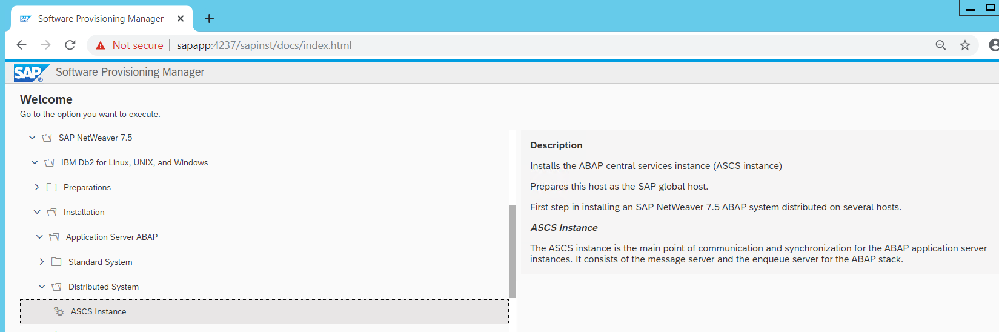
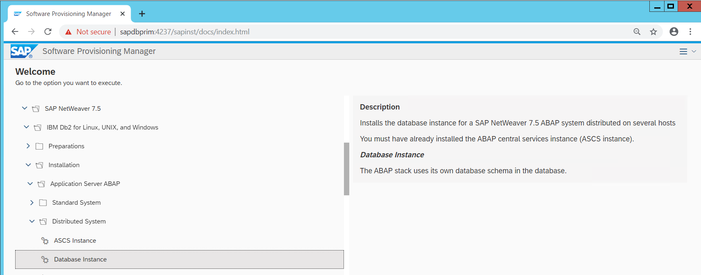
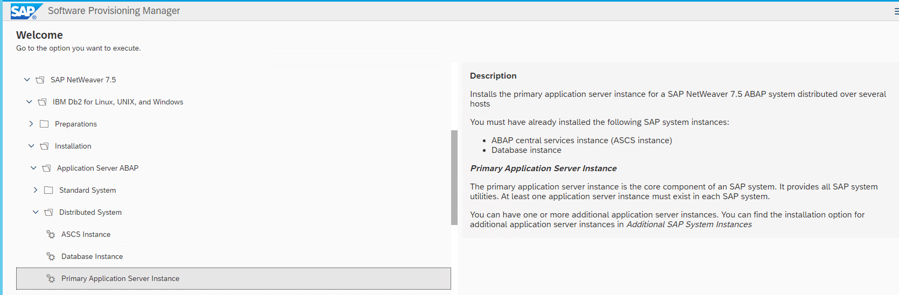
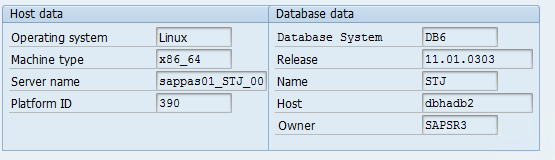
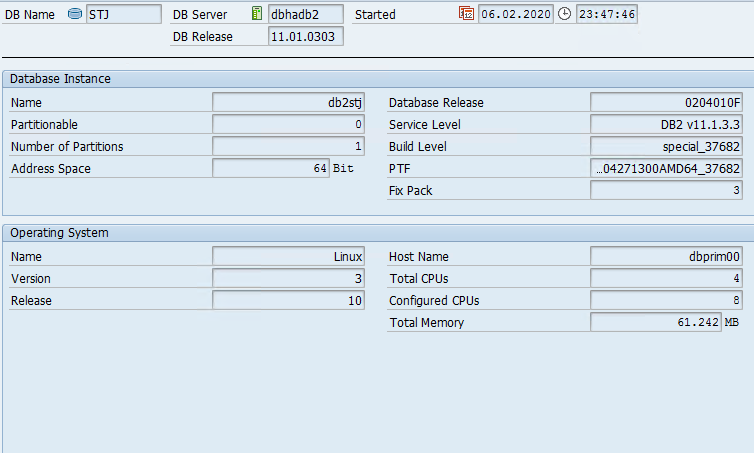
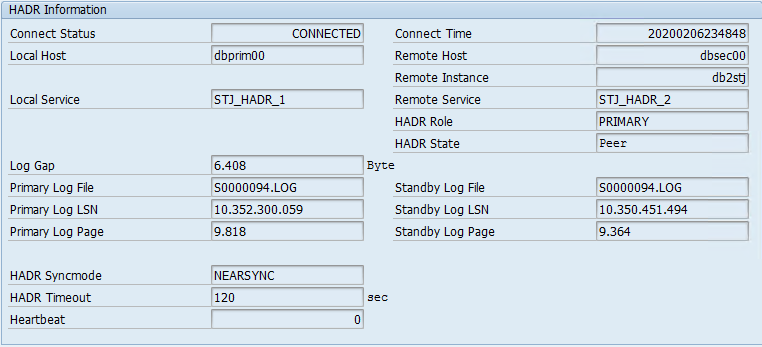

# Deployment

This section discusses high level deployment process and steps. Table 2 lists the steps in the order they should be done, and each step’s purpose.

_Table 2 – Steps to set up AWS resources to deploy IBM Db2 HADR with Pacemaker for SAP NetWeaver on Amazon EC2 instances_

| Activity                                                                                                                                                           | Purpose                                                                        |
| ------------------------------------------------------------------------------------------------------------------------------------------------------------------ | ------------------------------------------------------------------------------ | -------------------------------------------------------------------------------------------------------------------------------------------------------------------------------------------------------------------------------------------------------------------------------------------------------------------------------------------------------------------------------------------------------------------------------------------------------------------------------------------------------------------------------------------------------------------------------------------------------------------------------------------------------------------------------------------------------------------------------------------------------------------------------------------------------------------------------------------------------------------------------------------------------------------------------------------------------------------------------------------------------------------------------------------------------------------------------------------------------------------------------------------------------------------------------------------------------------------------------------------------------------------------------------------------------------------------------------------------------------------------------------------------------------------------------------------------------------------------------------------------------------------------------------------------------------------------------------------------------------------------------------------------------------------------------------------------------------------------------------------------------------------------------------------------------------------------------------------------------------------------------------------------------------------------------------------------------------------------------------------------------------------------------------------------------------------------------------------------------------------------------------------------------------------------------------------------------------------------------------------------------------------------------------------------------------------------------------------------------------------------------------------------------------------------------------------------------------------------------------------------------------------------------------------------------------------------------------------------------------------------------------------------------------------------------------------------------------------------------------------------------------------------------------------------------------------------------------------------------------------------------------------------------------------------------------------------------------------------------------------------------------------------------------------------------------------------------------------------------------------------------------------------------------------------------------------------------------------------------------------------------------------------------------------------------------------------------------------------------------------------------------------------------------------------------------------------------------------------------------------------------------------------------------------------------------------------------------------------------------------------------------------------------------------------------------------------------------------------------------------------------------------------------------------------------------------------------------------------------------------------------------------------------------------------------------------------------------------------------------------------------------------------------------------------------------------------------------------------------------------------------------------------------------------------------------------------------------------------------------------------------------------------------------------------------------------------------------------------------------------------------------------------------------------------------------------------------------------------------------------------------------------------------------------------------------------------------------------------------------------------------------------------------------------------------------------------------------------------------------------------------------------------------------------------------------------------------------------------------------------------------------------------------------------------------------------------------------------------------------------------------------------------------------------------------------------------------------------------------------------------------------------------------------------------------------------------------------------------------------------------------------------------------------------------------------------------------------------------------------------------------------------------------------------------------------------------------------------------------------------------------------------------------------------------------------------------------------------------------------------------------------------------------------------------------------------------------------------------------------------------------------------------------------------------------------------------------------------------------------------------------------------------------------------------------------------------------------------------------------------------------------------------------------------------------------------------------------------------------------------------------------------------------------------------------------------------------------------------------------------------------------------------------------------------------------------------------------------------------------------------------------------------------------------------------------------------------------------------------------------------------------------------------------------------------------------------------------------------------------------------------------------------------------------------------------------------------------------------------------------------------------------------------------------------------------------------------------------------------------------------------------------------------------------------------------------------------------------------------------------------------------------------------------------------------------------------------------------------------------------------------------------------------------------------------------------------------------------------------------------------------------------------------------------------------------------------------------------------------------------------------------------------------------------------------------------------------------------------------------------------------------------------------------------------------------------------------------------------------------------------------------------------------------------------------------------------------------------------------------------------------------------------------------------------------------------------------------------------------------------------------------------------------------------------------------------------------------------------------------------------------------------------------------------------------------------------------------------------------------------------------------------------------------------------------------------------------------------------------------------------------------------------------------------------------------------------------------------------------------------------------------------------------------------------------------------------------------------------------------------------------------------------------------------------------------------------------------------------------------------------------------------------------------------------------------------------------------------------------------------------------------------------------------------------------------------------------------------------------------------------------------------------------------------------------------------------------------------------------------------------------------------------------------------------------------------------------------------------------------------------------------------------------------------------------------------------------------------------------------------------------------------------------------------------------------------------------------------------------------------------------------------------------------------------------------------------------------------------------------------------------------------------------------------------------------- | ------------------------------------------------------------------------------------------------------------------------------------------------------------------------------------------------------------------------------------------------------------------------------------------------------------------------------------------------------------------------------------------------------------------------------------------------------------------------------------------------------------------------------------------------------------------------------------------------------------------------------------------------------------------------------------------------------------------------------------------------------------------------------------------------------------------------------------------------------------------------------------------------------------------------------------------------------------------------------------------------------------------------------------------------------------------------------------------------------------------------------------------------------------------------------------------------------------------------------------------------------------------------------------------------------------------------------------------------------------------------------------------------------------------------------------------------------------------------------------------------------------------------------------------------------------------------------------------------------------------------------------------------------------------------------------------------------------------------------------------------------------------------------------ | -------------------------------------------------------------------------------------------------------------------------------------------------------------------------------------------------------------------------------------------------------------------------------------------------------------------------------------------------------------------------------------------------------------------------------------------------------------------------------------------------------------------------------------------------------------------------------------------------------------------------------------------------------------------------------------------------------------------------------------------------------------------------------------------------------------------------------------------------------------------------------------------------------------------------------------------------------------------------------------------------------------------------------------------------------------------------------------------------------------------------------------------------------------------------------------------------------------------------------------------------------------------------------------------------------------------------------------------------------------------------------------------------------------------------- | ----------------------------------------------------------------------------------------------------------------------------------------------------------------------------------------------------------------------------------------------------------------------------------------------------------------------------------------------------------------------------------------------------------------------------------------------------------------------------------------------------------------------------------------------------------------------------------------------------------------------------------------------------------------------------------------------------------------------------------------------------------------------------------------------------------------------------------------------------------------------------------------------------------------------------------------------------------------------------------------------------------------------------------------------------------------------------------------------------------------------------------------------------------------------------------------------------------------------------------------------------------------------------------------------------------------------------------------------------------------------------------------------------------------------------------------------- | -------------------------------------------------------------------------------------------------------------------------------------------------------------------------------------------------------------------------------------------------------------------------------------------------------------------------------------------------------------------------------------------------------------------------------------------------------------------------------------------------------------------------------------------------------------------------------------------------------------------------------------------------------------------------------------------------------------------------------------------------------------------------------------------------------------------------------------------------------------------------------------------------------------------------------------------------------------------------------------------------------------------------------------------------------------------------------------------------------------------------------------------------------------------------------------------------------------------------------------------------------------------------------------------------------------------------------------------------------------------------------------------------------------------------------------------------------------------------------------------------------------------------------------------------------------------------------------------------------------------------------------------------------------------------------------------------------------------------------------------------------------------------------------------------------------------------------------------------------------------------------------------------------------------------------------------------------------------------------------------------------------------------------------------------------------------------------------------------------------------------------------------------------------------------------------------------------------------------------------------------------------------------------------------------------------------------------------------------------------------------------------------------------------------------------------------------------------------------------------------------------------------------------------------------------------------------------------------------------------------------------------------------------------------------------------------------------------------------------------------------------------------------------------------------------------------------------------------------------------------------------------------------------------------------------------------------------------------------------------------------------------------------------------------------------------------------------------------------------------------------------------------------------------------------------------------------------------------------------------------------------------------------------------------------------------------------------------------------------------------------------------------------------------------------------------------------------------------------------------------------------------------------------------------------------------------------------------------------------------------------------------------------------------------------------------------------------------------------------------------------------------------------------------------------------------------------------------------------------------------------------------------------------------------------------------------------------------------------------------------------------------------------------------------------------------------------------------------------------------------------------------------------------------------------------------------------------------------------------------------------------------------------------------------------------------------------------------------------------------------------------------------------------------------------------------------------------------------------------------------------------------------------------------------------------------------------------------------- | ---------------------------------------------------------------- | -------------------------------------------------------------------------------------------------------------------------------------------------------------------------------------------------------------------------------------------------------------------------------------------------------------------------------------------------------------------------------------------------------------------------------------------------------------------------------------------------------------------------------------------------------------------------------------------------------------------------------------------------------------------------------------------------------------------------------------------------------------------------------------------------------------------------------------------------------------------------------------------------------------------------------------------------------------------------------------------------------------------------------------------------------------------------------------------------------------------------------------------------------------------------------------------------------------------------------------------------------------------------------------------------------------------------------------------------------------------------------------------------------------------------------------------------------------------------------------------------------------------------------------------------------------------------------------------------------------------------------------------------------------------------------------------------------------------------------------------------------------------------------------------------------------------------------------------------------------------------------------------------------------------------------------------------------------------------------------------------------------------------------------------------------------------------------------------------------------------------------------------------------------------------------------------------------------------------------------------------------------------------------------------------------------------------------------------------------------------------------------------------------------------------------------------------------------------------------------------------------------------------------------------------------------------------------------------------------------------------------------------------------------------------------------------------------------------------------------------------------------------------------------------------------------------------------------------------------------------------------------------------------------------------------------------------------------------------------------------------------------------------------------------------------------------------------------------------------------------------------------------------------------------------------------------------------------------------------------------------------------------------------------------------------------------------------------------------------------------------------------------------------------------------------------------------------------------------------------------------------------------------------------------------------------------------------------------------------------------------------------------------------------------------------------------------------------------------------------------------------------------------------------------------------------------------------------------------------------------------------------------------------------------------------------------------------------------------------------------------------------------------------------------------------------------------------------------------------------------------------------------------------------------------------------------------------------------------------------------------------------------------------------------------------------------------------------------------------------------------------------------------------------------------------------------------------------------------------------------------------------------------------------------------------------------------------------------------------------------------------------------------------------------------------------------------------------------------------------------------------------------------------------------------------------------------------------------------------------------------------------------------------------------------------------------------------------------------------------------------------------------------------------------------------------------------------------------------------------------------------------------------------------------------------------------------------------------------------------------------------------------------------------------------------------------------------------------------------------------------------------------------------------------------------------------------------------------------------------------------------------------------------------------------------------------------------------------------------------------------------------------------------------------------------------------------------------------------------------------------------------------------------------------------------------------------------------------------------------------------------------------------------------------------------------------------------------------------------------------------------------------------------------------------------------------------------------------------------------------------------------------------------------------------------------------------------------------------------------------------------------------------------------------------------------------------------------------------------------------------------------------------------------------------------------------------------------------------------------------------------------------------------------------------------------------------------------------------------------------------------------------------------------------------------------------------------------------------------------------------------------------------------------------------------------------------------------------------------------------------------------------------------------------------------------------------------------------------------------------------------------------------------------------------------------------------------------------------------------------------------------------------------------------------------------------------------------------------------------------------------------------------------------------------------------------------------------------------------------------------------------------------------------------------------------------------------------------------------------------------------------------------------------------------------------------------------------------------------------------------------------------------------------------------------------------------------------------------------------------------------------------------------------------------------------------------------------------------------------------------------------------------------------------------------------------------------------------------------------------------------------------------------------------------------------------------------------------------------------------------------------------------------------------------------------------------------------------------------------------------------------------------------------------------------------------------------------------------------------------------------------------------------------------------------------------------------------------------------------------------------------------------------------------------------------------------------------------------------------------------------------------------------------------------------------------------------------------------------------------------------------------------------------------------------------------------------------------------------------------------------------------------------------------------------------------------------------------------------------------------------------------------------------------------------------------------------------------------------------------------------------------------------------------------------------------------------------------------------------------------------------------------------------------------------------------------------------------------------------------------------------------------------------------------------------------------------------------------------------------------------------------------------------------------------------------------------------------------------------------------------------------------------------------------------------------------------------------------------------------------------------------------------------------------------------------------------------------------------------------------------------------------------------------------------------------------------------------------------------------------------------------------------------------------------------------------------------------------------------------------------------------------------------------------------------------------------------------------------------------------------------------------------------------------------------------------------------------------------------------------------------------------------------------------------------------------------------------------------------------------------------------------------------------------------------------------------------------------------------------------------------------------------------------------------------------------------------------------------------------------------------------------------------------------------------------------------------------------------------------------------------------------------------------------------------------------------------------------------------------------------------------------------------------------------------------------------------------------------------------------------------------------------------------------------------------------------------------------------------------------------------------------------------------------------------------------------------------------------------------------------------------------------------------------------------------------------------------------------------------------------------------------------------------------------------------------------------------------------------------------------------------------------------------------------------------------------------------------------------------------------------------------------------------------------------------------------------------------------------------------------------------------------------------------------------------------------------------------------------------------------------------------------------------------------------------------------------------------------------------------------------------------------------------------------------------------------------------------------------------------------------------------------------------------------------------------------------------------------------------------------------------------------------------------------------------------------------------------------------------------------------------------------------------------------------------------------------------------------------------------------------------------------------------------------------------------------------------------------------------------------------------------------------------------------------------------------------------------------------------------------------------------------------------------------------------------------------------------------------------------------------------------------------------------------------------------------------------------------------------------------------------------------------------------------------------------------------------------------------------------------------------------------------------------------------------------------------------------------------------------------------------------------------------------------------------------------------------------------------------------------------------------------------------------------------------------------------------------------------------------------------------------------------------------------------------------------------------------------------------------------------------------------------------------------------------------------------------------------------------------------------------------------------------------------------------------------------------------------------------------------------------------------------------------------------------------------------------------------------------------------------------------------------------------------------------------------------------------------------------------------------------------------------------------------------------------------------------------------------------------------------------------------------------------------------------------------------------------------------------------------------------------------------------------------------------------------------------------------------------------------------------------------------------------------------------------------------------------------------------------------------------------------------------------------------------------------------------------------------------------------------------------------------------------------------------------------------------------------------------------------------------------------------------------------------------------------------------------------------------------------------------------------------------------------------------------------------------------------------------------------------------------------------------------------------------------------------------------------------------------------------------------------------------------------------------------------------------------------------------------------------------------------------------------------------------------------------------------------------------------------------------------------------------------------------------------------------------------------------------------------------------------------------------------------------------------------------------------------------------------------------------------------------------------------------------------------------------------------------------------------------------------------------------------------------------------------------------------------------------------------------------------------------------------------------------------------------------------------------------------------------------------------------------------------------------------------------------------------------------------------------------------------------------------------------------------------------------------------------------------------------------------------------------------------------------------------------------------------------------------------------------------------------------------------------------------------------------------------------------------------------------------------------------------------------------------------------------------------------------------------------------------------------------------------------------------------------------------------------------------------------------------------------------------------------------------------------------------------------------------------------------------------------------------------------------------------------------------------------------------------------------------------------------------------------------------------------------------------------------------------------------------------------------------------------------------------------------------------------------------------------------------------------------------------------------------------------------------------------------------------------------------------------------------------------------------------------------------------------------------------------------------------------------------------------------------------------------------------------------------------------------------------------------------------------------------------------------------------------------------------------------------------------------------------------------------------------------------------------------------------------------------------------------------------------------------------------------------------------------------------------------------------------------------------------------------------------------------------------------------------------------------------------------------------------------------------------------------------------------------------------------------------------------------------------------------------------------------------------------------------------------------------------------------------------------------------------------------------------------------------------------------------------------------------------------------------------------------------------------------------------------------------------------------------------------------------------------------------------------------------------------------------------------------------------------------------------------------------------------------------------------------------------------------------------------------------------------------------------------------------------------------------------------------------------------------------------------------------------------------------------------------------------------------------------------------------------------------------------------------------------------------------------------------------------------------------------------------------------------------------------------------------------------------------------------------------------------------------------------------------------------------------------------------------------------------------------------------------------------------------------------------------------------------------------------------------------------------------------------------------------------------------------------------------------------------------------------------------------------------------------------------------------------------------------------------------------------------------------------------------------------------------------------------------------------------------------------------------------------------------------------------------------------------------------------------------------------------------------------------------------------------------------------------------------------------------------------------------------------------------------------------------------------------------------------------------------------------------------------------------------------------------------------------------------------------------------------------------------------------------------------------------------------------------------------------------------------------------------------------------------------------------------------------------------------------------------------------------------------------------------------------------------------------------------------------------------------------------------------------------------------------------------------------------------------------------------------------------------------------------------------------------------------------------------------------------------------------------------------------------------------------------------------------------------------------------------------------------------------------------------------------------------------------------------------------------------------------------------------------------------------------------------------------------------------------------------------------------------------------------------------------------------------------------------------------------------------------------------------------------------------------------------------------------------------------------------------------------------------------------------------------------------------------------------------------------------------------------------------------------------------------------------------------------------------------------------------------------------------------------------------------------------------------------------------------------------------------------------------------------------------------------------------------------------------------------------------------------------------------------------------------------------------------------------------------------------------------------------------------------------------------------------------------------------------------------------------------------------------------------------------------------------------------------------------------------------------------------------------------------------------------------------------------------------------------------------------------------------------------------------------------------------------------------------------------------------------------------------------------------------------------------------------------------------------------------------------------------------------------------------------------------------------------------------------------------------------------------------------------------------------------------------------------------------------------------------------------------------------------------------------------------------------------------------------------------------------------------------------------------------------------------------------------------------------------------------------------------------------------------------------------------------------------------------------------------------------------------------------------------------------------------------------------------------------------------------------------------------------------------------------------------------------------------------------------------------------------------------------------------------------------------------------------------------------------------------------------------------------------------------------------------------------------------------------------------------------------------------------------------------------------------------------------------------------------------------------------------------------------------------------------------------------------------------------------------------------------------------------------------------------------------------------------------------------------------------------------------------------------------------------------------------------------------- |
| [Step 1: Db2 Virtual Hostname](#sap-ibm-pacemaker-step-1-db2-virtual-hostname "#sap-ibm-pacemaker-step-1-db2-virtual-hostname")                                    | Decide on the virtual hostname for your Db2 database (for example, `dbhadb2`). |
| [Step 2: AWS Overlay IP](#sap-ibm-pacemaker-step-2-aws-overlay-ip "#sap-ibm-pacemaker-step-2-aws-overlay-ip")                                                      | Decide on the Overlay IP for the dbhadb2 name (for example, `192.168.1.90`).   |
| [Step 3: Provision AWS Resources](#sap-ibm-pacemaker-step-3-aws-resources "#sap-ibm-pacemaker-step-3-aws-resources")                                               | Provision AWS resources and configure security.                                |
| [Step 4: SAP App and Db2 Install](#sap-ibm-pacemaker-step-4-sap-netweaver-and-ibm-db2-deployment "#sap-ibm-pacemaker-step-4-sap-netweaver-and-ibm-db2-deployment") | Install SAP tier and Db2 primary and standby databases.                        |
| [Step 5: Db2 HADR Setup](#sap-ibm-pacemaker-step-5-db2-hadr-setup "#sap-ibm-pacemaker-step-5-db2-hadr-setup")                                                      | Configure Db2 HADR replication.                                                |
| [Step 6: Pacemaker Cluster Setup](#sap-ibm-pacemaker-step-6-pacemaker-cluster-setup "#sap-ibm-pacemaker-step-6-pacemaker-cluster-setup")                           | Configure the Pacemaker cluster.                                               |
| [Step 7: Post Setup Configuration](sap-ibm-pacemaker.md#sap-ibm-pacemaker-about-this-guide "sap-ibm-pacemaker.md#sap-ibm-pacemaker-about-this-guide")              | Post tasks and manual configuration.                                           |
| [Step 8: Testing and Validation](#sap-ibm-pacemaker-step-8-testing-and-validation "#sap-ibm-pacemaker-step-8-testing-and-validation")                              | Quality Assurance.                                                             | ## Step 1: Db2 Virtual Hostname Decide on the virtual hostname for your Db2 database. For example, if your virtual hostname is `dbhadb2`, it would be configured in the SAP and `dbclient` profiles. See [Step 7: Post Setup Configuration](#sap-ibm-pacemaker-step-7-post-setup-configuration "#sap-ibm-pacemaker-step-7-post-setup-configuration") in this document for more information. ## Step 2: AWS Overlay IP Decide on IP address to use for your Overlay IP. An Overlay IP address is an AWS-specific routing entry which can send network traffic to an instance, no matter which AZ the instance is located in. One key requirement for the Overlay IP is that it should not be used elsewhere in your VPC or on-premises. It should be part of the private IP address range defined in [RFC1918](https://tools.ietf.org/html/rfc1918 "https://tools.ietf.org/html/rfc1918"). For example, if your VPC is configured in the range of `10.0.0.0/8` or `172.16.0.0/12`, you can use the Overlay IP from the range of `192.168.0.0/16`. Based on the number of HA setups you plan to have in your landscape, you can reserve the IP address by reserving a block from the private IP address to ensure there is no overlap. AWS worked on creating a resource agent, `aws-vpc-move-ip`, which is available along with the Linux Pacemaker. This agent updates the route table of the VPC where you have configured the cluster to always point to the primary DB. All traffic within the VPC can reach the Overlay IP address via the route table. Traffic from outside the VPC, whether that is from another VPC or on-premises will require AWS Transit Gateway (TGW) or AWS NLB to reach the Overlay IP address. For more information on how to direct traffic to an Overlay IP address via AWS TGW or AWS NLB, see [SAP on AWS High Availability with Overlay IP Address Routing](../sap-hana/sap-ha-overlay-ip.md "../sap-hana/sap-ha-overlay-ip.md"). ## Step 3: AWS Resources Deciding the right storage layout is important to ensure you can meet required IO. EBS gp2 volumes balance price and performance for a wide variety of workloads, while io1 volumes provide the highest performance consistently for mission-critical applications. With these two options, you can choose a storage solution that meets your performance and cost requirements. For more information, see [Amazon EBS features](https://aws.amazon.com/ebs/features/?nc=sn&loc=1 "https://aws.amazon.com/ebs/features/?nc=sn&loc=1") for more information. ## Step 4: SAP Netweaver and IBM Db2 Deployment See the [SAP Standard Installation guide](https://help.sap.com/viewer/9e41ead9f54e44c1ae1a1094b0f80712/ALL/en-US/576f5c1808de4d1abecbd6e503c9ba42.html "https://help.sap.com/viewer/9e41ead9f54e44c1ae1a1094b0f80712/ALL/en-US/576f5c1808de4d1abecbd6e503c9ba42.html") based on your installation release to get the technical steps and prerequisites for SAP installation. ### Step 4a: Create EC2 Instances for Deploying SAP NetWeaver ASCS See [SAP NetWeaver Environment Setup for Linux on AWS](../sap-netweaver/std-sap-netweaver-environment-setup.md "../sap-netweaver/std-sap-netweaver-environment-setup.md") to learn how to set up an EC2 instance for SAP NetWeaver. ### Step 4b: Create EC2 Instances for IBM Db2 Primary and Standby Databases Deploy two EC2 instances, one in each AZ, for your primary and standby databases. ### Step 4c: Disable Source/destination Check for the EC2 Instance Hosting the IBM Db2 Primary and Standby Databases You need to disable source/destination check for your EC2 instance hosting primary and standby databases. This is required to route traffic via Overlay IP. See [Changing the source or destination checking](../../../AWSEC2/latest/UserGuide/using-eni.md#change_source_dest_check "../../../AWSEC2/latest/UserGuide/using-eni.md#change_source_dest_check") to learn more about how to disable source/destination check for your EC2 instance. You can use the following command line interface (CLI) to achieve this. `aws ec2 modify-instance-attribute --profile cluster --instance-id EC2-instance-id --no-source-dest-check` ### Step 4d: AWS IAM Role For the Pacemaker setup, create two policies and attach them to the IAM role, which is attached to the Db2 primary and standby instance. This allows your EC2 instance to call the APIs which run during the failover process by Pacemaker. <br>• STONITH – Allows Ec2 instance to start, stop and reboot instances. `{ "Version":"2012-10-17", "Statement": [ { "Sid": "Stmt1424870324000", "Effect": "Allow", "Action": [ "ec2:DescribeInstances", "ec2:DescribeInstanceAttribute", "ec2:DescribeTags" ], "Resource": "*" }, { "Sid": "Stmt1424870324001", "Effect": "Allow", "Action": [ "ec2:ModifyInstanceAttribute", "ec2:RebootInstances", "ec2:StartInstances", "ec2:StopInstances" ], "Resource": [ "arn:aws:ec2:us-east-1:123456789012:instance/i-node1", "arn:aws:ec2:us-east-1:123456789012:instance/i-node2" ] } ] }` <br>• Overlay IP – Allows the Ec2 instance to update the route table in case of failover. `{ "Version":"2012-10-17", "Statement": [ { "Sid": "VisualEditor0", "Effect": "Allow", "Action": "ec2:ReplaceRoute", "Resource": "arn:aws:ec2:us-east-1:123456789012:route-table/rtb-XYZ" }, { "Sid": "VisualEditor1", "Effect": "Allow", "Action": "ec2:DescribeRouteTables", "Resource": "*" } ] }` Replace the following variables with the appropriate names: <br>• `region-name`: the name of the AWS region. <br>• `account-id`: The name of the AWS account in which the policy is used. <br>• `rtb-XYZ`: The identifier of the routing table which needs to be updated. <br>• `i-node1`: Instance ID for the Db2 primary instance. <br>• `i-node2`: Instance id for the Db2 standby instance. ### Step 4e: SAP Application and Db2 Software Install **Prerequisites**: <br>• Before starting the installation, update the `/etc/hosts` files of database, ASCS, and application servers with the hostname and IP address of _your_ database, ASCS and application servers. This ensures that all your instances can resolve each other’s address during installation and configuration. <br>• You need to install the following packages in your instances: `tcsh.x86_64`, `ksh.x86_64`, `libaio.x86_64`, `libstdc++.x86_64`. <br>• Comment out the 5912 port entry in the `/etc/services` file (if it exists), as this port is used for the Db2 installation: `#fis             5912/tcp          # Flight Information Services #fis             5912/udp          # Flight Information Services #fis             5912/sctp         # Flight Information Services` **SAP application and Db2 software installation (high-level instructions)**: 1. Install SAP ASCS using software provisioning manager (SWPM) on the Amazon EC2 instance. Choose the installation option depending on the scenario; for example, distributed or HA in case you plan to install ERS for app layer high availability.  _Figure 3 – Install ASCS_ 2. Install the primary database using SWPM on the Amazon EC2 instance hosted in AZ1.  _Figure 4 – Install the primary database_ 3. Take a backup of the primary database. 4. Install the PAS instance. This can be the same EC2 instance used in [step 1](#sap-ibm-pacemaker-step-1-db2-virtual-hostname "#sap-ibm-pacemaker-step-1-db2-virtual-hostname") if you want to install ASCS and PAS on one host.  _Figure 5 – Install the PAS instance_ 5. For the standby DB installation: 1. Use the SAP homogeneous system copy procedure from SWPM with the option of **System copy** > **Target systems** > **Distributed** > **Database instance**. 2. In the SWPM parameter screen, when asked for system load type, choose Homogenous System and the backup/restore option. 3. When prompted by the SWPM, restore the backup you took during [step 3](#sap-ibm-pacemaker-step-3-aws-resources "#sap-ibm-pacemaker-step-3-aws-resources") on the standby DB. You can exit the installer, because the subsequent installation is already completed on the primary database server. You should now have your ASCS, primary Db2 database, and PAS (if running on a different host than ASCS) installed and running in AZ1 of your setup. In AZ2, you should have the standby Db2 database installed and running. You can optionally install an additional application server if required to support the workload. We recommend that you distribute your application servers in both AZs. ## Step 5: Db2 HADR Setup The following steps explain how to set up HADR between the primary and standby databases. For additional references, see: <br>• [IBM Db2 HADR documentation](https://www.ibm.com/support/knowledgecenter/SSEPGG_11.1.0/com.ibm.db2.luw.admin.ha.doc/doc/t0011725.html "https://www.ibm.com/support/knowledgecenter/SSEPGG_11.1.0/com.ibm.db2.luw.admin.ha.doc/doc/t0011725.html") <br>• [IBM Support Page](https://www.ibm.com/support/pages/step-step-procedure-set-hadr-replication-between-db2-databases "https://www.ibm.com/support/pages/step-step-procedure-set-hadr-replication-between-db2-databases") Table 3 details the steps for setup. Update the configuration commands according to your environment. _Table 3 – Db2 HADR setup_ |
| System ID (SID)                                                                                                                                                    | STJ                                                                            |
| ---                                                                                                                                                                | ---                                                                            |
| **Primary Db2 database hostname**                                                                                                                                  | dbprim00                                                                       |
| **Standby Db2 database hostname**                                                                                                                                  | dbsec00                                                                        |
| **Overlay IP**                                                                                                                                                     | 192.168.1.81                                                                   | **To set up Db2 HADR**: 1. Find the state of the primary database before HADR configuration by executing the following command: ``` > db2 get db cfg for STJ                                                                                                                                                                                                                                                                                                                                                                                                                                                                                                                                                                                                                                                                                                                                                                                                                                                                                                                                                                                                                                                                                                                                                                                                                                                                                                                                                                                                                                                                                                                                                                                                                                                                                                                                                                                                                                                                                                                                                                                                                                                                                                                                                                                                                                                                                                                                                                                                                                                                                                                                                                                                                                                                                                                                                                                                                                                                                                                                                                                                                                                                                                                                                                                                                                                                                                                                                                                                                                                                                                                                                                                                                                                                                                                                                                                                                                                                                                                                                                                                                                                                                                                                                                                                                                                                                                                                                                                                                                                                                                                                                                                                                                                                                                                                                                                                                                                                                                                                                                                                                                                                                                                                                                                                                                                                                                                                                                                                                                                                                                                                                                                                                                                                                                                                                                                                                                                                                                                                                                                                                                                                                                                                                                                                                                                                                                                                                                                                                                                                                                                                                                                                                                                                                                                                                                                                                                                                                                                                                                                                                                                                                                                                                                                                                                                                                                                                                                                                                                                                                                                                                                                                                                                                                                                                                                                                                                                                                                                                                                                                                                                                                                                                                                                                                                                                                                                                                                                                                                                                                                                                                                                                                                                                                                                                                                                                                                                                                                                                                                                                                                                                                                                                                                                                                                                                                                                                                                                                   | grep HADR HADR database role = STANDARD HADR local host name (HADR_LOCAL_HOST) = HADR local service name (HADR_LOCAL_SVC) = HADR remote host name (HADR_REMOTE_HOST) = HADR remote service name (HADR_REMOTE_SVC) = HADR instance name of remote server (HADR_REMOTE_INST) = HADR timeout value (HADR_TIMEOUT) = 120 HADR target list (HADR_TARGET_LIST) = HADR log write synchronization mode (HADR_SYNCMODE) = NEARSYNC HADR spool log data limit (4KB) (HADR_SPOOL_LIMIT) = AUTOMATIC(0) HADR log replay delay (seconds) (HADR_REPLAY_DELAY) = 0 HADR peer window duration (seconds) (HADR_PEER_WINDOW) = 0 HADR SSL certificate label (HADR_SSL_LABEL) = ``2. The `HADR_LOCAL_SVC and HADR_REMOTE_SVC` parameters require an entry in your `/etc/services` file. If the entry is unavailable, update the `/etc/services` file to include the entry. Here is a sample `/etc/services` file entry. The SID is STJ.`` # grep -i hadr /etc/services STJ_HADR_1 5950/tcp # DB2 HADR log shipping STJ_HADR_2 5951/tcp # DB2 HADR log shipping ``3. Complete the following steps in your primary database (in this case, dbprim00) as the Db2 instance owner (in this case, `db2stj`):`` db2 update db cfg for STJ using HADR_LOCAL_HOST dbprim00 db2 update db cfg for STJ using HADR_LOCAL_SVC STJ_HADR_1 db2 update db cfg for STJ using HADR_REMOTE_HOST dbsec00 db2 update db cfg for STJ using HADR_REMOTE_SVC STJ_HADR_2 db2 update db cfg for STJ using HADR_REMOTE_INST db2stj db2 update db cfg for STJ using HADR_TIMEOUT 120 db2 update db cfg for STJ using HADR_SYNCMODE NEARSYNC db2 update db cfg for STJ using HADR_PEER_WINDOW 300 db2 update db cfg for STJ using LOGINDEXBUILD ON `Here is the state after the configuration was updated:` > db2 get db cfg for STJ | grep HADR HADR database role = STANDARD HADR local host name (HADR_LOCAL_HOST) = dbprim00 HADR local service name (HADR_LOCAL_SVC) = STJ_HADR_1 HADR remote host name (HADR_REMOTE_HOST) = dbsec00 HADR remote service name (HADR_REMOTE_SVC) = STJ_HADR_2 HADR instance name of remote server (HADR_REMOTE_INST) = db2stj HADR timeout value (HADR_TIMEOUT) = 120 HADR target list (HADR_TARGET_LIST) = HADR log write synchronization mode (HADR_SYNCMODE) = NEARSYNC HADR spool log data limit (4KB) (HADR_SPOOL_LIMIT) = AUTOMATIC(0) HADR log replay delay (seconds) (HADR_REPLAY_DELAY) = 0 HADR peer window duration (seconds) (HADR_PEER_WINDOW) = 300 HADR SSL certificate label (HADR_SSL_LABEL) = ``4. Run the following steps in your standby database (in this case `dbsec00`) as the Db2 instance owner (in this case, `db2stj`).`` db2 update db cfg for STJ using HADR_LOCAL_HOST dbsec00 db2 update db cfg for STJ using HADR_LOCAL_SVC STJ_HADR_2 db2 update db cfg for STJ using HADR_REMOTE_HOST dbprim00 db2 update db cfg for STJ using HADR_REMOTE_SVC STJ_HADR_1 db2 update db cfg for STJ using HADR_REMOTE_INST db2stj db2 update db cfg for STJ using HADR_TIMEOUT 120 db2 update db cfg for STJ using HADR_SYNCMODE NEARSYNC db2 update db cfg for STJ using HADR_PEER_WINDOW 300 db2 update db cfg for STJ using LOGINDEXBUILD ON `Here’s an example configuration:` > db2 get db cfg for STJ | grep HADR HADR database role = STANDBY HADR local host name (HADR_LOCAL_HOST) = dbsec00 HADR local service name (HADR_LOCAL_SVC) = STJ_HADR_2 HADR remote host name (HADR_REMOTE_HOST) = dbprim00 HADR remote service name (HADR_REMOTE_SVC) = STJ_HADR_1 HADR instance name of remote server (HADR_REMOTE_INST) = db2stj HADR timeout value (HADR_TIMEOUT) = 120 HADR target list (HADR_TARGET_LIST) = HADR log write synchronization mode (HADR_SYNCMODE) = NEARSYNC HADR spool log data limit (4KB) (HADR_SPOOL_LIMIT) = AUTOMATIC(1200000) HADR log replay delay (seconds) (HADR_REPLAY_DELAY) = 0 HADR peer window duration (seconds) (HADR_PEER_WINDOW) = 300 HADR SSL certificate label (HADR_SSL_LABEL) = ``5. When using Linux pacemaker, use the following Db2 HADR parameters: <br>• `HADR peer window duration (seconds) (HADR_PEER_WINDOW) = 300` <br>• `HADR timeout value (HADR_TIMEOUT) = 60` We recommend that you tune these parameters after testing the failover and takeover functionality. Because individual configuration can vary, the parameter might need adjustment. 6. After your primary and standby databases have been configured, start HADR on the standby server as the HADR standby.`` db2 start hadr on database STJ as standby `7. Start HADR on the primary database.` db2 start hadr on database STJ as primary DB20000I The START HADR ON DATABASE command completed successfully. db2pd -hadr -db STJ | head -20 Database Member 0 -- Database STJ -- Active -- HADR_ROLE = PRIMARY REPLAY_TYPE = PHYSICAL HADR_SYNCMODE = NEARSYNC STANDBY_ID = 1 LOG_STREAM_ID = 0 HADR_STATE = PEER HADR_FLAGS = TCP_PROTOCOL PRIMARY_MEMBER_HOST = dbprim00 PRIMARY_INSTANCE = db2stj ... HADR_CONNECT_STATUS = CONNECTED ``## Step 6: Pacemaker Cluster Setup In this section we’ll discuss the cluster setup using Linux Pacemaker on both RHEL and SLES OS. The Linux Pacemaker works as a failover Orchestrator. It monitors both the primary and standby databases, and in the event of primary database server failure it initiates an automatic HADR takeover by the standby server. The resource agents this configuration uses are as following: <br>• STONITH resource agent for fencing. <br>• The db2 database resource, which is configured in a Primary/Standby configuration. <br>• The `AWS-vpc-move-ip` resource, which is built by the AWS team to handle the overlay IP switch from the Db2 primary instance to standby in the event of failure. As mentioned in the [Operating System](sap-ibm-pacemaker-operating-system.md "sap-ibm-pacemaker-operating-system.md") section of this document, you need the correct subscription to download these resource agents. **Important**: Change the shell environment for the `db2<sid>` user to `/bin/ksh`. **To change the shell environment**: 1. Shut down both the database servers using `db2stop` while logged in as `db2<sid>`. 2. Install [Kornshell](http://www.kornshell.com/ "http://www.kornshell.com/") (ksh) (if it’s not already installed). 3. Run `sudo usermod -s /bin/ksh db2<sid>`. ## Step 6a. Setup on RHEL This section focuses on setting up the Pacemaker cluster on the RHEL operating system. **To set up the pacemaker cluster on RHEL**: 1. Basic cluster configuration – Install the required cluster packages using both database nodes.`` yum install –y pcs pacemaker fence-agents-aws yum install –y resource-agents `2. Start the cluster services.` systemctl start pcsd.service systemctl enable pcsd.service ``**Note:** If you have subscribed to RHEL for SAP with HA and US products from AWS Marketplace, run `mkdir -p /var/log/pcsd /var/log/cluster` before starting `pcsd.service`. 3. Reset the password for user `hacluster` on both the DB nodes.`` passwd hacluster `4. Authorize the cluster. Make sure that both nodes are able to communicate with each other using the hostname.` [root@dbprim00 ~] pcs cluster auth dbprim00 dbsec00 Username: hacluster Password: dbprim00: Authorized dbsec00: Authorized [root@dbprim00 ~] `5. Create the cluster.` [root@dbprim00 ~] pcs cluster setup --name db2ha dbprim00 dbsec00 Destroying cluster on nodes: dbprim00, dbsec00... dbsec00: Stopping Cluster (pacemaker)... dbprim00: Stopping Cluster (pacemaker)... dbprim00: Successfully destroyed cluster dbsec00: Successfully destroyed cluster Sending 'pacemaker_remote authkey' to 'dbprim00', 'dbsec00' dbprim00: successful distribution of the file 'pacemaker_remote authkey' dbsec00: successful distribution of the file 'pacemaker_remote authkey' Sending cluster config files to the nodes... dbprim00: Succeeded dbsec00: Succeeded Synchronizing pcsd certificates on nodes dbprim00, dbsec00... dbprim00: Success dbsec00: Success Restarting pcsd on the nodes in order to reload the certificates... dbprim00: Success dbsec00: Success [root@dbprim00 ~] pcs cluster enable --all dbprim00: Cluster Enabled dbsec00: Cluster Enabled [root@dbprim00 ~] pcs cluster start --all dbsec00: Starting Cluster... dbprim00: Starting Cluster... [root@dbprim00 ~] ``**Note**: Adjust the `corosync` timeout. 6. Go to `/etc/corosync/corosync.conf` and add or modify the token value of totem to `30000`.`` [root@dbprim00 corosync] more /etc/corosync/corosync.conf totem { version: 2 cluster_name: db2ha secauth: off transport: udpu token: 30000 } nodelist { node { ring0_addr: dbprim00 nodeid: 1 } node { ring0_addr: dbsec00 nodeid: 2 } } quorum { provider: corosync_votequorum two_node: 1 } logging { to_logfile: yes logfile: /var/log/cluster/corosync.log to_syslog: yes } ``7. Run `pcs cluster sync` to sync the changes on the standby database node.`` [root@dbprim00 corosync] pcs cluster sync dbprim00: Succeeded dbsec00: Succeeded ``8. Run `pcs cluster reload corosync` to make the changes effective.`` [root@dbprim00 corosync] pcs cluster reload corosync Corosync reloaded ```9. To ensure of the changes are in place, run`corosync-cmapctl | grep totem.token`. ``` [root@dbprim00 corosync] corosync-cmapctl | grep totem.token runtime.config.totem.token (u32) = 30000 runtime.config.totem.token*retransmit (u32) = 7142 runtime.config.totem.token_retransmits_before_loss_const (u32) = 4 totem.token (u32) = 30000 `10. Before creating any resource, put the cluster in maintenance mode.` [root@dbprim00 ~] pcs property set maintenance-mode=’true’ ``11. Create the STONITH resource. You will need the EC2 instance IDs for this operation. The default `pcmk` action is reboot. Replace the instance ID for `dbprim00` and `dbsec00` with the instance IDs of your setup. If you want to have the instance remain in a stopped state until it has been investigated and then manually started, add `pcmk_reboot_action=off`. This setting is also required if you are running the Db2 on [Amazon EC2 Dedicated Hosts](https://aws.amazon.com/ec2/dedicated-hosts/ "https://aws.amazon.com/ec2/dedicated-hosts/").`` [root@dbprim00 ~] pcs stonith create clusterfence fence_aws region=us-east-1 pcmk_host_map="dbprim00:i-09d1b1f105f71e5ed;dbsec00:i- 0c0d3444601b1d8c5" power_timeout=240 pcmk_reboot_timeout=480 pcmk_reboot_retries=4 op start timeout=300 op monitor timeout=60 `12. Create the Db2 resource.` [root@dbprim00 ~] pcs resource create Db2_HADR_STJ db2 instance=db2stj dblist=STJ master meta notify=true resource- stickiness=5000 op demote timeout=240 op promote timeout=240 op start timeout=240 op stop timeout=240 op monitor interval=20s timeout=120s op monitor interval=22s role=Master timeout=120s `**Note**: The timeout values here are default, which works for most deployments. We recommend that you test the timeouts in the QA setup extensively based on the test cases mentioned in the Appendix, and then tune it accordingly. 13. Create the Overlay IP resource agent. First, add the Overlay IP in the primary node.` [root@dbprim00 ~] ip address add 192.168.1.81/32 dev eth0 [root@dbprim00 ~] ip addr show 1: lo: <LOOPBACK,UP,LOWER_UP> mtu 65536 qdisc noqueue state UNKNOWN group default qlen 1000 link/loopback 00:00:00:00:00:00 brd 00:00:00:00:00:00 inet 127.0.0.1/8 scope host lo valid_lft forever preferred_lft forever inet6 ::1/128 scope host valid_lft forever preferred_lft forever 2: eth0: <BROADCAST,MULTICAST,UP,LOWER_UP> mtu 9001 qdisc mq state UP group default qlen 1000 link/ether 0e:10:e3:7b:6f:4f brd ff:ff:ff:ff:ff:ff inet 10.0.1.116/24 brd 10.0.1.255 scope global noprefixroute dynamic eth0 valid_lft 2885sec preferred_lft 2885sec inet 192.168.1.81/32 scope global eth0 valid_lft forever preferred_lft forever inet6 fe80::c10:e3ff:fe7b:6f4f/64 scope link valid_lft forever preferred_lft forever [root@dbprim00 ~] `14. Update the route table with the Overlay IP pointing to the Db2 primary instance:` aws ec2 create-route --route-table-id rtb-xxxxxxxx --destination- cidr-block Overlay IP --instance-id i-xxxxxxxx [root@dbprim00 ~] aws ec2 create-route --route-table-id rtb- dbe0eba1 --destination-cidr-block 192.168.1.81/32 --instance-id i-09d1b1f105f71e5ed { "Return": true } [root@dbprim00 ~] pcs resource create db2-oip aws-vpc-move-ip ip=192.168.1.81 interface=eth0 routing_table=rtb-dbe0eba1 ``**Note**: If you are using a different route table for both the subnets where you are deploying the primary and standby databases, you can specify them using a comma (,) in the resource creation command: `pcs resource create db2-oip aws-vpc-move-ip ip=192.168.1.81 interface=eth0 routing_table=rtb-xxxxx1,rtb-xxxxx2` 15. Create a colocation constraint to bind the Overlay IP resource agent with the Db2 primary instance.`` [root@dbprim00 ~] pcs constraint colocation add db2-oip with master Db2_HADR_STJ-master 2000 `16. You can now remove the maintenance mode by using the following code:` [root@dbprim00 ~] pcs property set maintenance-mode=’false’ `This is the final configuration of the cluster:` [root@dbprim00 ~] pcs config show Cluster Name: db2ha Corosync Nodes: dbprim00 dbsec00 Pacemaker Nodes: dbprim00 dbsec00 Resources: Master: Db2_HADR_STJ-master Resource: Db2_HADR_STJ (class=ocf provider=heartbeat type=db2) Attributes: dblist=STJ instance=db2stj Meta Attrs: notify=true resource-stickiness=5000 Operations: demote interval=0s timeout=120 (Db2_HADR_STJ-demote-interval-0s) monitor interval=20 timeout=60 (Db2_HADR_STJ-monitor-interval-20) monitor interval=22 role=Master timeout=60 (Db2_HADR_STJ-monitor-interval-22) notify interval=0s timeout=10 (Db2_HADR_STJ-notify-interval-0s) promote interval=0s timeout=120 (Db2_HADR_STJ-promote-interval-0s) start interval=0s timeout=120 (Db2_HADR_STJ-start-interval-0s) stop interval=0s timeout=120 (Db2_HADR_STJ-stop-interval-0s) Resource: db2-oip (class=ocf provider=heartbeat type=aws-vpc-move-ip) Attributes: interface=eth0 ip=192.168.1.81 routing_table=rtb-dbe0eba1 Operations: monitor interval=60 timeout=30 (db2-oip-monitor-interval-60) start interval=0s timeout=180 (db2-oip-start-interval-0s) stop interval=0s timeout=180 (db2-oip-stop-interval-0s) Stonith Devices: Resource: clusterfence (class=stonith type=fence_aws) Attributes: pcmk_host_map=dbprim00:i-09d1b1f105f71e5ed;dbsec00:i-0c0d3444601b1d8c5 pcmk_reboot_retries=4 pcmk_reboot_timeout=480 power_timeout=240 region=us-east-1 Operations: monitor interval=60s (clusterfence-monitor-interval-60s) Fencing Levels: Location Constraints: Ordering Constraints: Colocation Constraints: db2-oip with Db2_HADR_STJ-master (score:2000) (rsc-role:Started) (with-rsc-role:Master) Ticket Constraints: Alerts: No alerts defined Resources Defaults: No defaults set Operations Defaults: No defaults set Cluster Properties: cluster-infrastructure: corosync cluster-name: db2ha dc-version: 1.1.18-11.el7_5.4-2b07d5c5a9 have-watchdog: false Quorum: Options: [root@dbprim00 ~] ``## Step 6b. Setup on SLES This section focuses on setting up the Pacemaker cluster on the SLES operating system. **Prerequisite**: You need to complete this on both the Db2 primary and standby instances. **To create an AWS CLI profile**: The SLES operating system’s resource agents use the [AWS Command Line Interface](https://aws.amazon.com/cli/ "https://aws.amazon.com/cli/") (CLI). You need to create the AWS CLI profile for the root account on both instances: one with the default profile and the other with an arbitrary profile name (in this example, `cluster`) which creates output in text format. The region of the instance must be added as well. 1. Replace the string region-name with your target region in the following example.`` dbprim00:~ aws configure {aws} Access Key ID [None]: {aws} Secret Access Key [None]: Default region name [None]: us-east-1 Default output format [None]: dbprim00:~ aws configure --profile cluster {aws} Access Key ID [None]: {aws} Secret Access Key [None]: Default region name [None]: us-east-1 Default output format [None]: text ``You don’t need to provide the Access Key and Secret Access key, because access is controlled by the IAM role you created earlier in the setup. 2. Add a second private IP address. 3. You are required to add a second private IP address for each cluster instance. Adding a second IP address to the instance allows the SUSE cluster to implement a two-ring corosync configuration. The two-ring corosync configuration allows the cluster nodes to communicate with each other using the secondary IP address if there is an issue communicating with each other over the primary IP address. See [To assign a secondary private IPv4 address to a network interface](../../../AWSEC2/latest/UserGuide/MultipleIP.md#assignIP-existing "../../../AWSEC2/latest/UserGuide/MultipleIP.md#assignIP-existing"). 4. Add a tag with an arbitrary "key" (in this case, `pacemaker`). The value of this tag is the hostname of the respective Db2 instance. This is required to enable AWS CLI to use filters in the API calls. 5. Disable the source/destination check. 6. Ensure that the source/destination check is disabled, as described in [Step 4c](#sap-ibm-pacemaker-step-4c-disable-sourcedestination-check-for-the-ec2-instance-hosting-the-ibm-db2-primary-and-standby-databases "#sap-ibm-pacemaker-step-4c-disable-sourcedestination-check-for-the-ec2-instance-hosting-the-ibm-db2-primary-and-standby-databases"). 7. Avoid deletion of cluster-managed IP addresses on the `eth0` interface. 8. Check if the package `cloud-netconfig-ec2` is installed with the following command:`` dbprim00:~ zypper info cloud-netconfig-ec2 ``9. Update the file `/etc/sysconfig/network/ifcfg-eth0` if this package is installed. Change the following line to a "no" setting or add the following line if the package is not yet installed:`` dbprim00:~ CLOUD_NETCONFIG_MANAGE='no' ``10. Set up [NTP](http://www.ntp.org/ "http://www.ntp.org/") (best with [YaST](https://yast.opensuse.org/ "https://yast.opensuse.org/")). Use AWS time service at `169.254.169.123`, which is accessible from all EC2 instances. Enable ongoing synchronization. 11. Activate the public cloud module to get updates for the AWS CLI:`` dbprim00:~ SUSEConnect --list-extensions dbprim00:~ SUSEConnect -p sle-module-public-cloud/12/x86_64 Registering system to registration proxy https://smt-ec2.susecloud.net Updating system details on https://smt-ec2.susecloud.net ... Activating sle-module-public-cloud 12 x86_64 ... -> Adding service to system ... -> Installing release package ... Successfully registered system `12. Update your packages on both the with the command:` dbprim00:~ zypper -n update ``13. Install the resource agent pattern `ha_sles`.`` dbprim00:~ zypper install -t pattern ha_sles ``**To configure pacemaker: Configuration of the corosync.conf file**: 1. Use the following configuration in the `/etc/corosync/corosync.conf` file on both the Db2 primary and standby instances:`` #Read the corosync.conf.5 manual page totem { version: 2 rrp_mode: passive token: 30000 consensus: 36000 token_retransmits_before_loss_const: 10 max_messages: 20 crypto_cipher: none crypto_hash: none clear_node_high_bit: yes interface { ringnumber: 0 bindnetaddr: <ip-local-node> mcastport: 5405 ttl: 1 } transport: udpu } logging { fileline: off to_logfile: yes to_syslog: yes logfile: /var/log/cluster/corosync.log debug: off timestamp: on logger_subsys { subsys: QUORUM debug: off } } nodelist { node { ring0_addr: <ip-node-1> ring1_addr: <ip2-node-1> nodeid: 1 } node { ring0_addr: <ip-node-2> ring1_addr: <ip2-node-2> nodeid: 2 } } quorum { #Enable and configure quorum subsystem (default: off) #see also corosync.conf.5 and votequorum.5 provider: corosync_votequorum expected_votes: 2 two_node: 1 } ``2. Replace the variables `ip-node-1 / ip2-node-1` and `ip-node-2 / ip2-node-2` with the IP addresses of your Db2 primary and standby instances, respectively. Replace `ip-local-node` with the IP address of the instance on which the file is being created. The chosen settings for `crypto_cipher` and `crypto_hash` are suitable for clusters in AWS. They may be modified according to SUSE’s documentation if you want strong encryption of cluster communication. 3. Start the cluster services and enable them on both the Db2 primary and standby instances.`` dbprim00:~ # systemctl start pacemaker dbprim00:~ # systemctl enable pacemaker Created symlink from /etc/systemd/system/multi-user.target.wants/pacemaker.service to /usr/lib/systemd/system/pacemaker.service. `4. Check the configuration with the following command:` dbprim00:~ corosync-cfgtool -s Printing ring status. Local node ID 1 RING ID 0 id = 10.0.1.17 status = ring 0 active with no faults RING ID 1 id = 10.0.1.62 status = ring 1 active with no faults dbprim00:~ Cluster status: dbprim00:~ crm_mon -1 Stack: corosync Current DC: dbsec00 (version 1.1.19+20181105.ccd6b5b10-3.13.1-1.1.19+20181105.ccd6b5b10) - partition with quorum Last updated: Fri Apr 17 14:09:56 2020 Last change: Fri Apr 17 13:38:59 2020 by hacluster via crmd on dbsec00 2 nodes configured 0 resources configured Online: [ dbprim00 dbsec00 ] No active resources `**To prepare the cluster for adding resources**: 1. To avoid cluster starting partially defined resources, set the cluster to maintenance mode. This deactivates all monitor actions.` dbprim00:~ crm configure property maintenance-mode="true" dbprim00:~ crm status Stack: corosync Current DC: dbprim00 (version 1.1.19+20181105.ccd6b5b10-3.16.1-1.1.19+20181105.ccd6b5b10) - partition with quorum Last updated: Fri Apr 17 14:30:51 2020 Last change: Fri Apr 17 14:30:50 2020 by root via cibadmin on dbprim00 2 nodes configured 0 resources configured *** Resource management is DISABLED *** The cluster will not attempt to start, stop or recover services Online: [ dbprim00 dbsec00 ] No resources `2. Configuring AWS-specific settings:` dbprim00:/ha-files vi crm-bs.txt dbprim00:/ha-files more crm-bs.txt property cib-bootstrap-options: \ stonith-enabled="true" \ stonith-action="off" \ stonith-timeout="600s" rsc_defaults rsc-options: \ resource-stickiness=1 \ migration-threshold=3 op_defaults op-options: \ timeout=600 \ record-pending=true ``The `off` setting forces the agents to shut down the instance. You have the option of changing it to reboot if required. 3. Add the following configuration to the cluster:`` dbprim00:~ crm configure load update crm-bs.txt `**To configure the AWS-specific STONITH resource**: 1. Create a file with the following content:` primitive res_AWS_STONITH stonith:external/ec2 \ op start interval=0 timeout=180 \ op stop interval=0 timeout=180 \ op monitor interval=180 timeout=60 \ params tag=pacemaker profile=cluster ``The EC2 tag `pacemaker` entry needs to match the tag chosen for the EC2 instances, and the name of the profile needs to match the previously configured AWS profile as part of the prerequisite section. 2. Add the file to the configuration:`` dbprim00:/ha-files vi aws-stonith.txt dbprim00:/ha-files more aws-stonith.txt primitive res*{aws}\_STONITH stonith:external/ec2 \ op start interval=0 timeout=180 \ op stop interval=0 timeout=180 \ op monitor interval=120 timeout=60 \ params tag=pacemaker profile=cluster dbprim00:/ha-files crm configure load update aws-stonith.txt `3. Create the Db2 Primary/Standby resource. 4. Create a file with the following content. Change the value for SID, as per your configuration.` primitive rsc_db2_db2stj_STJ db2 \ params instance="db2stj" dblist="STJ" \ op start interval="0" timeout="130" \ op stop interval="0" timeout="120" \ op promote interval="0" timeout="120" \ op demote interval="0" timeout="120" \ op monitor interval="30" timeout="60" \ op monitor interval="31" role="Master" timeout="60" ms msl_db2_db2stj_STJ rsc_db2_db2stj_STJ \ meta target-role="Started" notify="true" `5. Add the file to the configuration:` dbprim00:/ha-files vi db2res.txt dbprim00:/ha-files more db2res.txt primitive rsc_db2_db2stj_STJ db2 \ params instance="db2stj" dblist="STJ" \ op start interval="0" timeout="130" \ op stop interval="0" timeout="120" \ op promote interval="0" timeout="120" \ op demote interval="0" timeout="120" \ op monitor interval="30" timeout="60" \ op monitor interval="31" role="Master" timeout="60" dbprim00:/ha-files crm configure load update db2res.txt `6. Create the Overlay IP resource agent. 1. First, add the Overlay IP in the Db2 primary instance.` dbprim00:~ ip address add 192.168.1.81/32 dev eth0 dbprim00:~ ip addr show 1: lo: <LOOPBACK,UP,LOWER_UP> mtu 65536 qdisc noqueue state UNKNOWN group default qlen 1000 link/loopback 00:00:00:00:00:00 brd 00:00:00:00:00:00 inet 127.0.0.1/8 scope host lo valid_lft forever preferred_lft forever inet6 ::1/128 scope host valid_lft forever preferred_lft forever 2: eth0: <BROADCAST,MULTICAST,UP,LOWER_UP> mtu 9001 qdisc mq state UP group default qlen 1000 link/ether 0e:73:7f:b5:b2:95 brd ff:ff:ff:ff:ff:ff inet 10.0.1.17/24 brd 10.0.1.255 scope global eth0 valid_lft forever preferred_lft forever inet 10.0.1.62/32 scope global eth0 valid_lft forever preferred_lft forever inet 192.168.1.81/32 scope global eth0 valid_lft forever preferred_lft forever inet6 fe80::c73:7fff:feb5:b295/64 scope link valid_lft forever preferred_lft forever [root@dbprim00 ~] `2. Update the route table with the Overlay IP pointing to the Db2 primary instance.` aws ec2 create-route --route-table-id rtb-xxxxxxxx --destination-cidr-block Overlay IP --instance-id i-xxxxxxxx `**Note**: If you are using different route table for both the subnets where you are deploying the primary and standby database, you can specify them with a comma (,) in the command preceding this note.` dbprim00:~ aws ec2 create-route --route-table-id rtb-dbe0eba1 -- destination-cidr-block 192.168.1.81/32 --instance-id i-05fc8801284585362 { "Return": true } ``The `aws-vpc-move-ip` resource agent call the AWS command from the location `/usr/bin`, so ensure that there is a soft link pointing to the location where you have the `awscli` installed.`` dbprim00:/usr/bin which aws /usr/local/bin/aws dbprim00:/usr/bin ls -ltr aws lrwxrwxrwx 1 root root 18 Apr 18 17:44 aws -> /usr/local/bin/aws `3. Create the file with the following content, and replace the Overlay IP and the route table ID based on your configuration. If you have multiple route tables associated with the subnet to which your instances belong, you can use a comma-separated list of routing tables. **Note**: Make sure you use the same profile name (which is cluster for this setup) that you used while configuring the AWS CLI.` dbprim00:/ha-files vi aws-move-ip.txt dbprim00:/ha-files more aws-move-ip.txt primitive res_AWS_IP ocf:suse:aws-vpc-move-ip \ params ip=192.168.1.81 routing_table=rtb-dbe0eba1 interface=eth0 profile=cluster \ op start interval=0 timeout=180 \ op stop interval=0 timeout=180 \ op monitor interval=60 timeout=60 dbprim00:/ha-files crm configure load update aws-move-ip.txt `4. Create a colocation constraint to bind the Overlay IP resource agent with the Db2 primary instance.` dbprim00:/ha-files more crm-cs.txt colocation col_db2_db2stj_STJ 2000: res_AWS_IP:Started \ msl_db2_db2stj_STJ:Master dbprim00:/ha-files crm configure load update crm-cs.txt dbprim00:/ha-files `5. Adjust the resource-stickiness and migration-threshold values.` dbprim00:~ crm configure rsc_defaults resource-stickiness=1000 dbprim00:~ crm configure rsc_defaults migration-threshold=5000 `6. You can now remove maintenance-mode.` dbprim00:~ crm configure property maintenance-mode="false" `Final configuration of the cluster:` dbprim00:/ha-files crm status Stack: corosync Current DC: dbsec00 (version 1.1.19+20181105.ccd6b5b10-3.16.1-1.1.19+20181105.ccd6b5b10) - partition with quorum Last updated: Sat Apr 18 18:45:53 2020 Last change: Sat Apr 18 16:01:26 2020 by root via cibadmin on dbprim00 2 nodes configured 4 resources configured Online: [ dbprim00 dbsec00 ] Full list of resources: res_AWS_STONITH (stonith:external/ec2): Started dbprim00 Master/Slave Set: msl_db2_db2stj_STJ [rsc_db2_db2stj_STJ] Masters: [ dbprim00 ] Slaves: [ dbsec00 ] res_AWS_IP (ocf::suse:aws-vpc-move-ip): Started dbprim00 dbprim00:/ha-files crm configure show node 1: dbprim00 node 2: dbsec00 primitive res_AWS_IP ocf:suse:aws-vpc-move-ip \ params ip=192.168.1.81 routing_table=rtb-dbe0eba1 interface=eth0 profile=cluster \ op start interval=0 timeout=180 \ op stop interval=0 timeout=180 \ op monitor interval=60 timeout=60 primitive res_AWS_STONITH stonith:external/ec2 \ op start interval=0 timeout=180 \ op stop interval=0 timeout=180 \ op monitor interval=120 timeout=60 \ params tag=pacemaker profile=cluster primitive rsc_db2_db2stj_STJ db2 \ params instance=db2stj dblist=STJ \ op start interval=0 timeout=130 \ op stop interval=0 timeout=120 \ op promote interval=0 timeout=120 \ op demote interval=0 timeout=120 \ op monitor interval=30 timeout=60 \ op monitor interval=31 role=Master timeout=60 ms msl_db2_db2stj_STJ rsc_db2_db2stj_STJ \ meta target-role=Started notify=true colocation col_db2_db2stj_STJ 2000: res_AWS_IP:Started msl_db2_db2stj_STJ:Master property cib-bootstrap-options: \ have-watchdog=false \ dc-version="1.1.19+20181105.ccd6b5b10-3.16.1-1.1.19+20181105.ccd6b5b10" \ cluster-infrastructure=corosync \ maintenance-mode=false \ stonith-enabled=true \ stonith-action=off \ stonith-timeout=600s rsc_defaults rsc-options: \ resource-stickiness=1000 \ migration-threshold=5000 op_defaults op-options: \ timeout=600 \ record-pending=true `## Step 7: Post Setup Configuration To enable SAP to connect to the Db2 virtual name, post-setup configuration tasks must be performed. To perform post-setup configuration tasks: 1. Edit your SAP profile files:` > vi DEFAULT.PFL SAPDBHOST = dbhadb2 j2ee/dbhost = dbhadb2 rsdb/reco_trials = 10 rsdb/reco_sleep_time = 10 ``2. Update the two parameters (`SAPDBHOST` and `j2ee/dbhost`) to the virtual name you chose for your database server. You will have to update the `rsdb/reco*` parameters to greater than failover duration to avoid DB disconnect in case of failover. We recommend that you test these values in QA before setting it up in production. 3. Edit your Db2 client file:`` > cd /sapmnt/STJ/global/db6 sappas01:stjadm 15> more db2cli.ini ; Comment lines start with a semi-colon. [STJ] Database=STJ Protocol=tcpip Hostname=dbhadb2 Servicename=5912 [COMMON] Diagpath=/usr/sap/STJ/SYS/global/db6/db2dump `Make sure the hostname parameter matches your Db2 virtual hostname. 4. After you change the entries and save your file, test your connection to the database server:` sappas01:stjadm 17> R3trans -d This is R3trans version 6.26 (release 745 - 13.04.18 - 20:18:04). unicode enabled version R3trans finished (0000). sappas01:stjadm 18> startsap Checking db Database Database is running ------------------------------------------- Starting Startup Agent sapstartsrv OK Instance Service on host sappas01 started ------------------------------------------- starting SAP Instance D00 Startup-Log is written to /home/stjadm/startsap_D00.log ------------------------------------------- /usr/sap/STJ/D00/exe/sapcontrol -prot NI_HTTP -nr 00 -function Start Instance on host sappas01 started ```  *Figure 6 – SAP system status information* You can check get the status/information of HADR in the transaction **DB02/dbacockpit** > **Configuration** > **Overview**.  *Figure 7 – Transaction DB02 database instance information*  *Figure 8 – Transaction DB02 HADR information* ## Step 8: Testing and Validation We recommend you define your failure scenarios and test them on your cluster. Unless otherwise specified, all tests are done with the primary node running on the primary server (`dbprim00`) and the standby node running on the standby server (`dbsec00`). **Prerequisite**: Before running any tests, please ensure that: <br>• There is no error or failed action in the Pacemaker. This can be tested using pcs status. In case there is any failed action, check the cause in `/var/log/cluster/corosync.log`in the node on which it has failed, and then take the corrective action. You can clean the failed action using`pcs/crm`resource cleanup. <br>• There is no unintended location constraint set up. Using the`pcs/crm`resource, move the master from primary to standby to set a location constraint on the primary node which prevents any resource from starting on it. This can be identified using the`pcs/crm`constraint show. Note the ID of the location constraint, and then run`pcs/crm`constraint delete`<id>`to remove it. <br>• The Db2 HADR synchronization is working. This can be checked using`db2pd -hadr -db <DBSID>`and comparing the`LOG_FILE`, `PAGE`, and `POS` for primary and standby. <br>• Refer to [Appendix 1](sap-ibm-pacemaker-appendix-1-testing-on-rhel-setup.md "sap-ibm-pacemaker-appendix-1-testing-on-rhel-setup.md") for detailed test cases on RHEL setup. <br>• Refer to [Appendix 2](sap-ibm-pacemaker-appendix-2-testing-on-sles-setup.md "sap-ibm-pacemaker-appendix-2-testing-on-sles-setup.md") for detailed test cases on SLES Setup |
