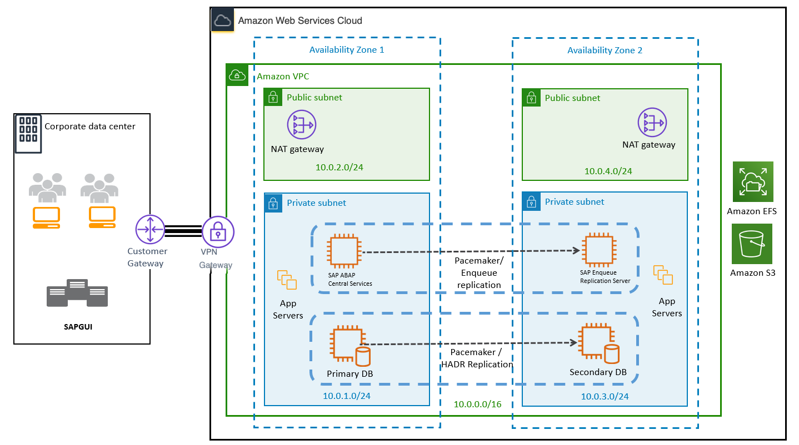

# Planning

## Architecture Options

SAP NetWeaver applications based on IBM Db2 can be installed in three different ways:

- **Standard system or single host installation**-- In this option, Advanced Business Application Programming (ABAP) Application Server Central Services/System Central Services (ASCS/SCS) and the database primary application server (PAS) of SAP NetWeaver run in a single Amazon EC2 instance. This option is suited for non-critical and non-production workloads.
- **Distributed system**-- In distributed systems, ASCS/SCS and the database PAS of SAP NetWeaver can run on separate Amazon EC2 instances. For example, you can choose to run ASCS and PAS on one Amazon EC2 instance, and the database on another Amazon EC2 instance, or other combinations. This option is suited for production and non-production workloads.
- **High availability system**-- For your SAP application to be highly available, you will need to protect the single point of failures. The database is one of the single points of failure in SAP applications.

AWS recommends that you deploy primary and standby IBM Db2 databases in different Availability Zones (AZs) within an AWS region. Figure 1 provides a high-level architecture for IBM Db2 high availability in AWS. This option is suited for business-critical applications.

_Figure 1 – High-level HA architecture for SAP with IBM Db2 on AWS_
