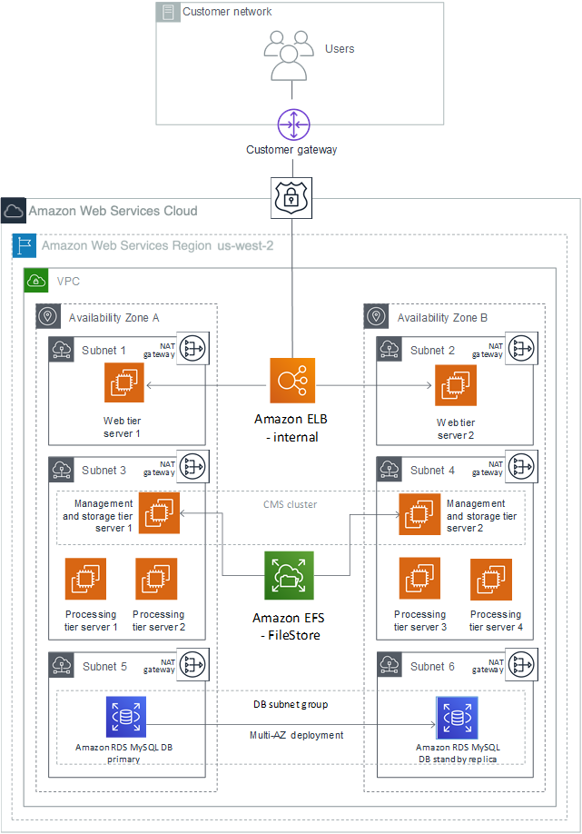

# Architecture Options

The server-side architecture of SAP BOBI Platform consists of five tiers: web, management, storage, processing, and data. (For details, see the administrator’s guide on the [SAP BusinessObjects Business Intelligence Platform](https://help.sap.com/viewer/product/SAP_BUSINESSOBJECTS_BUSINESS_INTELLIGENCE_PLATFORM/ "https://help.sap.com/viewer/product/SAP_BUSINESSOBJECTS_BUSINESS_INTELLIGENCE_PLATFORM/") website). The following list provides high-level details.

- **Management tier:** Includes the CMS servers, event servers, and associated services.
- **Storage tier:** Includes input and output file repository servers. The file system used by these servers to store files, such as documents, reports, and universes, must be on a shared file system.
- **Web tier and processing tier:** Performs functions like receiving and processing user requests.
- **Data tier:** Consists of the CMS system database and the auditing data store.
  You can have following example architecture designs for the above tiers:

- Install all tiers on the same EC2 instance.
- Install the application and database tiers on two separate EC2 instances.
- Install different tiers on multiple EC2 instances grouped based on customer-specific requirements.

The architecture choice depends on multiple factors like complexity, cost, sizing, and technical restrictions. For example, if you use [Amazon RDS](https://aws.amazon.com/rds/ "https://aws.amazon.com/rds/") as the database, application tiers cannot be installed with database.

## CMS and Audit Database Architecture Options

You have the choice of deploying the SAP BOBI Platform application on a standard SAP supported database like SAP HANA, SAP ASE, IBM DB2, Microsoft SQL Server, or [Amazon Relational Database Service (Amazon RDS)](https://aws.amazon.com/rds/ "https://aws.amazon.com/rds/"). For supported [Amazon RDS](https://aws.amazon.com/rds/ "https://aws.amazon.com/rds/") database types, see [SAP Note 1656099 SAP on AWS: Supported SAP](https://launchpad.support.sap.com/#/notes/1656099 "https://launchpad.support.sap.com/#/notes/1656099").

[Amazon RDS](https://aws.amazon.com/rds/ "https://aws.amazon.com/rds/") is a service that makes it easier to set up, operate, and scale a relational database in the AWS Cloud. Amazon RDS takes over many of the difficult or tedious management tasks such as backups, software patching, automatic failure detection, and recovery. You can read more about this service in [Amazon RDS documentation](../../../AmazonRDS/latest/UserGuide/Welcome.md "../../../AmazonRDS/latest/UserGuide/Welcome.md").

Figure 1 shows an example large scale architecture of SAP BOBI with multi-AZ and multi-instance architecture. Web, Management, Processing, and Data tiers are all distributed on different EC2 instances. [Amazon RDS](https://aws.amazon.com/rds/ "https://aws.amazon.com/rds/") MySQL is used for CMS database.

**Figure 1: SAP BOBI with multi-AZ and multi-instance architecture**

