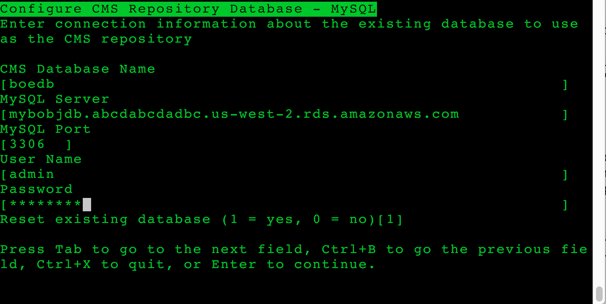

# Deployment

In this deployment, we will provision an Amazon EC2 instance for installing the SAP application servers and the CMS database (if you are using database on EC2). When using Amazon RDS for CMS database, follow [Step 7. (Only for CMS Database on EC2 Instance) Installing CMS Database](#bobi-linux-step-7-only-for-cms-database-on-ec2-instance-installing-cms-database "#bobi-linux-step-7-only-for-cms-database-on-ec2-instance-installing-cms-database").

In this deployment, we will provision an Amazon EC2 instance for installing a standalone Oracle database standard system.

###### Note

In this section, the syntax shown for the AWS CLI and Linux commands is specific to the scope of this document. Each command supports many additional options. For more information, use the AWS CLI `aws help` command or see the documentation.

## Step 1. Prepare Your AWS Account

In this example we step through setting up a sample environment for the installation which includes a public subnet for RDP and SSH access via the internet. In our scenario, we are using [AWS Launch Wizard for SAP](../../../launchwizard/latest/userguide/launch-wizard-sap.md "../../../launchwizard/latest/userguide/launch-wizard-sap.md") in a single-AZ deployment to create the VPC, subnets, security groups, and IAM roles. This is just an example setup and customers should follow their own network layout and comply with their own security standards. This may include:

- using AWS Launch Wizard for SAP in for multi-AZ deployment of SAP HANA
- using a landing zone solution like [AWS Control Tower](https://aws.amazon.com/controltower/ "https://aws.amazon.com/controltower/")
- work with their cloud team (for example a Cloud Center of Excellence or CCoE) to use existing standards
  1.  Check the region where you want to deploy your AWS resources:

  ###### Note

  You’ll have picked the region you want to deploy in during your planning phase. 2. Display the AWS CLI configuration data:

  ```
  $ aws configure list
  ```

In the command output, make sure that the default region that’s listed is the same as the target region where you want to deploy your AWS resources and install the SAP workload.

## Step 2. Create a JSON file for the Amazon EBS storage

Create a JSON file that contains the storage requirements for SAP BOBI Platform server volumes.

Below is an example JSON file with two EBS volumes for swap and SAP BOBI Platform installation directory. You can modify this file as per your requirements:

```
[
  {
    "DeviceName": "/dev/sdh",
    "Ebs": {
      "VolumeSize": 32,
      "VolumeType": "gp32",
      "DeleteOnTermination": true
    }
   },
  {
    "DeviceName": "/dev/sdg",
    "Ebs": {
      "VolumeSize": 50,
      "VolumeType": "gp32",
      "DeleteOnTermination": true
   }
  }
]
```

## Step 3. Launch the Amazon EC2 Instance

Launch the Amazon EC2 instance for the SAP BOBI Platform installation in your target region by using the information that you gathered in the preparation phase. You will also be creating the required storage volumes and attaching them to the Amazon EC2 instance for the SAP installation, based on the JSON file that you created in the previous step.

```
$ aws ec2 run-instances \
--image-id <AMI-ID> \
--count <number-of-EC2-instances> \
--instance-type <instance-type> \
--key-name=<name-of-key-pair> \
--security-group-ids <security-group-ID> \
--subnet-id <subnet-ID> \
--block-device-mappings file://C:\Users\<file>.json \
--region <region-ID>
```

The JSON file is the storage file that you created in [Step 2. Create a JSON file for the Amazon EBS storage](#bobi-linux-step-2-create-a-json-file-for-the-amazon-ebs-storage "#bobi-linux-step-2-create-a-json-file-for-the-amazon-ebs-storage").

When using the command, make sure to place the command and its parameters on a single line. For example:

```
aws ec2 run-instances --image-id <ami-xxxxxxxxxxxxxxx> --count 1 \
--instance-type m5.large --key-name=my_key --security-group-ids \
<sg-xxxxxxxx> --subnet-id <subnet-xxxxxx> \
--block-device-mappings file://C:\Users\<file>.json
```

You can also launch EC2 instances using the AWS Management Console. For detailed steps, see [Launch Linux EC2 Instances using AWS Management Console](../../../AWSEC2/latest/UserGuide/EC2_GetStarted.md#ec2-launch-instance "../../../AWSEC2/latest/UserGuide/EC2_GetStarted.md#ec2-launch-instance").

## Step 4. Prepare the EC2 Instances

### Update the Hostname

Log in to your SAP Instance with Secure Shell (SSH) using the private key pair, and switch to root user to update the hostname along with the DNS name according to your requirements. For detailed steps, see the AWS Knowledge Center article for your operating system:

- [Assign a static hostname to Amazon EC2 instance running SuSe Linux](https://aws.amazon.com/premiumsupport/knowledge-center/linux-static-hostname-suse/ "https://aws.amazon.com/premiumsupport/knowledge-center/linux-static-hostname-suse/")
- [Assign a static hostname to Amazon EC2 instance running on RHEL](https://aws.amazon.com/premiumsupport/knowledge-center/linux-static-hostname-rhel7-centos7/ "https://aws.amazon.com/premiumsupport/knowledge-center/linux-static-hostname-rhel7-centos7/")

Alternatively, you can edit the /etc/hosts file and manually add this entry. For SAP systems, the maximum length of the hostname should not exceed 13 characters. The name should comply with SAP standards. See [SAP OSS Note 611361](https://launchpad.support.sap.com/#/notes/611361 "https://launchpad.support.sap.com/#/notes/611361") for details (requires access to SAP Service Marketplace).

### Install Prerequisite Packages

###### Note

Your Amazon EC2 instance should have access to the internet to read and download required packages from the SUSE or Redhat repository.

1. As root user, use the following commands to install the Linux packages that are required for SAP installation.
   - SUSE syntax:

   To install a package: `zypper -n install package-name`

   To remove a package: `zypper remove package-name`
   - RHEL syntax:

   To install a package: `yum install package-name`

   To remove a package: `yum remove package-name`

2. Install `nfs-utils`, which is required for mounting the Amazon EFS mounts onto the Linux host.
   - SUSE command:

   ```
    zypper install nfs-utils
   ```

   - RHEL command:

   ```
    yum install nfs-utils
   ```

3. Install nvme-cli package to view the NVME device mapping of Amazon EBS volumes
4. Install SSM Agent by following the instructions in the [Systems Manager user guide](../../../systems-manager/latest/userguide/sysman-manual-agent-install.md#agent-install-sles "../../../systems-manager/latest/userguide/sysman-manual-agent-install.md#agent-install-sles").
5. Install the [AWS Data Provider for SAP](../general/data-provider-install.md "../general/data-provider-install.md").

```
cd /tmp
 wget https://s3.amazonaws.com/aws-data-provider/bin/aws-agent_install.sh
 chmod ugo+x aws-agent_install.sh
 sudo ./aws-agent_install.sh
```

### Identify Amazon EBS Device from NVMe Block Devices

On [Nitro-based](../../../AWSEC2/latest/UserGuide/instance-types.md#ec2-nitro-instances "../../../AWSEC2/latest/UserGuide/instance-types.md#ec2-nitro-instances") instances, the device name specified in the block device mapping (Step 2) are renamed as `/dev/nvme[0-26]n`. Before you proceed with the next step, ensure that you are using the appropriate device name to create a file system.

### Format Block Devices for Mounting SAP File Systems

To view the list of volumes attached to your instance and their device names, run the `lsblk` command as root user. The command displays the list of devices that are attached to your instance.

```
 lsblk
NAME        MAJ:MIN RM SIZE RO TYPE MOUNTPOINT
nvme1n1     259:0    0  50G  0 disk
nvme0n1     259:1    0  10G  0 disk
└─nvme0n1p1 259:2    0  10G  0 part /
nvme2n1     259:3    0  50G  0 disk
```

Format the block device for `/usr/sap`, swap and other file systems that are needed to install SAP. As root user, format the Amazon EBS volumes attached to your instance to store local SAP files. You need to create a label for the file system as well. This label will be used to mount the file system.

```
  mkfs.xfs -f /dev/nvme1n1 -L USR_SAP
```

###### Tip

NVME device ids associated with the volume could change during reboots. To avoid mount errors during instance reboots, you need to create a label for your file systems and mount it by label than the actual NVME ids. This will also help in situation where you need to change your instance type between Nitro-based and non Nitro-based instances.

### Create Directories and Mount the File System

As root user, create the directories to mount the file systems required for SAP installation. Start with the `/usr/sap` mount, using the syntax `mkdir <directory-path>`:

```
 mkdir /usr/sap
```

As root user, add entries to the `/etc/fstab` file and mount the file systems. Adding entries to `/etc/fstab` ensures that your file systems are mounted automatically when your Amazon EC2 instance is restarted.

Add the entries for local SAP file systems to the `/etc/fstab` file by using the following commands:

```
 echo "/dev/disk/by-label/USR_SAP /usr/sap xfs nobarrier,noatime,nodiratime,logbsize=256k 0 0" >> /etc/fstab
```

To mount the file system that has been added to `/etc/fstab`, use the syntax `mount -a`:

```
 mount -a
 df -h
Filesystem      Size  Used Avail Use% Mounted on
devtmpfs        3.8G  8.0K  3.8G   1% /dev
tmpfs           3.8G     0  3.8G   0% /dev/shm
tmpfs           3.8G  9.5M  3.8G   1% /run
/dev/nvme0n1p1  9.8G  1.4G  7.9G  15% /
tmpfs           3.8G     0  3.8G   0% /sys/fs/cgroup
tmpfs           769M     0  769M   0% /run/user/1000
/dev/nvme1n1     50G   33M   50G   1% /usr/sap
```

In the example code above, you can see that `/usr/sap` is mounted on device `/dev/nvme1n1`.

### Create Swap for SAP Installation

Linux swap functionality can improve the overall performance of the system and is a mandatory prerequisite for SAP installation. To determine the value for swap, follow the recommendations in the [SAP Note 1597355](https://launchpad.support.sap.com/#/notes/1597355 "https://launchpad.support.sap.com/#/notes/1597355").

To allocate swap on device `/dev/nvme2n1`, use the following commands:

```
 lsblk
NAME        MAJ:MIN RM SIZE RO TYPE MOUNTPOINT
nvme1n1     259:0    0  50G  0 disk /usr/sap
nvme0n1     259:1    0  10G  0 disk
└─nvme0n1p1 259:2    0  10G  0 part /
nvme2n1     259:3    0  50G  0 disk

 mkswap -f /dev/nvme2n1 -L SWAP
Setting up swapspace version 1, size = 50 GiB (53687087104 bytes)
LABEL=SWAP, UUID=07291579-afb6-4e5f-8828-4c1441841f9b
 swapon -L SWAP
 swapon -s
Filename         Type       Size      Used   Priority
/dev/nvme2n1     partition  52428796  0      -1
```

Device `/dev/nvme2n1` is now allocated to be used as swap by the SAP application that will be installed on this host.

## Step 5. Create Amazon EFS Mount for FileStore

To create an Amazon EFS file system and mount it on the Amazon EC2 instance, do the following:

1. Create a security group for Amazon EFS.

```
$ aws ec2 create-security-group --group-name efs-sap-sg --description "Amazon EFS for SAP, SG for EFS " --vpc-id vpc-123456789abcdefgh
```

Make a note of the security group ID that is displayed in the output:

```
{
    "GroupId": "sg-abc12def "
}
```

In this example, the security group ID is `sg-abc12def`. 2. Create an inbound rule for the security group:

```
$ aws ec2 authorize-security-group-ingress --group-id sg-abc12def --protocol tcp --port 2049 --cidr 0.0.0.0/0
```

3. Create an Amazon EFS file system:

```
$ aws efs create-file-system --creation-token efsforsap
```

The command should display the output:

```
{
    "SizeInBytes": {
        "Value": 0
    },
    "CreationToken": "efsforsap",
    "Encrypted": false,
    "CreationTime": 1523374253.0,
    "PerformanceMode": "generalPurpose",
    "FileSystemId": "fs-abc12def",
    "NumberOfMountTargets": 0,
    "LifeCycleState": "creating",
    "OwnerId": "xxxxxxxxxxxx"
}
```

Make a note of the FileSystemId. In this example, the FileSystemId is `fs-abc12def`. 4. Create the tag for the FileSystemId:

```
$ aws efs create-tags --file-system-id <FileSystemId> --tags Key=<Name>,Value=<SomeExampleNameValue>
```

For example:

```
$ aws efs create-tags --file-system-id fs-abc12def --tags Key=filestore,Value=ECC
```

5. Create the mount target:

```
$ aws efs create-mount-target --file-system-id fs-abc12def --subnet-id subnet-a98c8386 --security-group sg-abc12def
```

The command should display the following output:

```
{
    "MountTargetId": "fsmt-123abc45",
    "NetworkInterfaceId": "xxxxxxxxxx",
    "FileSystemId": "fs-abc12def ",
    "LifeCycleState": "creating",
    "SubnetId": "xxxxxxxxxxx",
    "OwnerId": "xxxxxxxxxxxx",
    "IpAddress": "x.x.x.x"
}
```

Make a note of the LifeCycleState, which is `creating` in the example. 6. Wait for a few minutes, and then check the status of creation by using the following command:

```
$ aws efs describe-mount-targets --file-system-id fs-abc12def
```

The mount target `fsmt-061ab24e` is now available:

```
{
    "MountTargets": [
        {
            "MountTargetId": "fsmt-061ab24e",
            "NetworkInterfaceId": " xxxxxxxxxx ",
            "FileSystemId": "fs-abc12def",
            "LifeCycleState": "available",
            "SubnetId": " xxxxxxxxxxx ",
            "OwnerId": " xxxxxxxxxxx",
            "IpAddress": "x.x.x.x"
        }
    ]
}
```

7. Mount EFS file system using DNS name or its IP address and create folders for mounting EFS.

###### Tip

The DNS name for your file system on Amazon EFS should use the following naming convention:

```
<file-system-id>.efs.<aws-region>.amazonaws.com
```

For example:

```
fs-abc12def.efs.us-east-1.amazonaws.com
```

Alternatively, you can also use the IpAddress from step 11. In this example, we use the IpAddress instead.

```
 mkdir /test
 sudo mount -t nfs -o nfsvers=4.1,rsize=1048576,wsize=1048576,hard,timeo=600,retrans=2 <ip-address>:/ /test
 cd /test
 mkdir FileStore
 ls -ltr
drwxr-xr-x 2 root root 6144 Apr  1 16:08 FileStore
 cd /
 umount /test
```

8. Create the mount points for FileStore (used here as an example for the name of your FileStore mount point):

```
 mkdir /prdbobi_fs
```

9. Mount the Amazon EFS file system using DNS name of EFS.

```
 sudo mount -t nfs -o nfsvers=4.1,rsize=1048576,wsize=1048576,hard,timeo=600,retrans=2 <ip-address>:/TRANS /usr/sap/trans
```

This IP address can be found in step 7. For example:

```
 sudo mount -t nfs -o nfsvers=4.1,rsize=1048576,wsize=1048576,hard,timeo=600,retrans=2 x.x.x.x:/TRANS /usr/sap/trans
 sudo mount -t nfs -o nfsvers=4.1,rsize=1048576,wsize=1048576,hard,timeo=600,retrans=2 x.x.x.x:/TRANS /usr/sap/trans
```

## Step 6. Prepare and Install the CMS Database (Only for RDS Database)

This option is applicable only when Amazon RDS MySQL is used for the CMS database. You can create a separate database for the auditing database if it’s required.

1. Create a DB subnet group for an RDS instance by following the instructions in [Create a DB Subnet Group](../../../AmazonRDS/latest/UserGuide/CHAP_Tutorials.WebServerDB.md#CHAP_Tutorials.WebServerDB.CreateVPC.DBSubnetGroup "../../../AmazonRDS/latest/UserGuide/CHAP_Tutorials.WebServerDB.md#CHAP_Tutorials.WebServerDB.CreateVPC.DBSubnetGroup").
2. In the [Amazon RDS console](https://console.aws.amazon.com/rds/ "https://console.aws.amazon.com/rds/"), launch an Amazon RDS MySQL DB instance by following the instructions in the [Creating a DB Instance Running the MySQL Database Engine](../../../AmazonRDS/latest/UserGuide/USER_CreateInstance.md "../../../AmazonRDS/latest/UserGuide/USER_CreateInstance.md").
3. Choose a supported DB version based on [SAP Note 1656099 - SAP on AWS: Supported SAP](https://launchpad.support.sap.com/#/notes/1656099 "https://launchpad.support.sap.com/#/notes/1656099"), and select the instance type and storage based on your sizing output.
4. On the **Specify DB details** page, in the **Instance specifications** section, choose **Create replica in different zone**.
5. The **Choose use case** page asks if you are planning to use the DB instance you are creating for production. If you choose **Production - MySQL**, the Multi-AZ failover option is preselected. You can deselect this option if you are not installing a highly available system.
6. On the **Configure advanced settings** page, provide information about the infrastructure you already provisioned, such as settings for the VPC, DB subnet group, and security group. In addition, you can provide custom options for encryption, backup retention period, maintenance window, and so on. You will also create a user to administer this database.
7. For the database name, you can provide the name you want to use for the CMS database. You can also change the database port from the default value to your choice of port.
8. Choose **Create database**, and then wait for the DB instance status to change to **available** in the Amazon RDS console.
9. Choose the **Instances** view and note the **Endpoint** name. In case of failover to another Availability Zone, this endpoint enables an application to reconnect to a new primary database instance without having to change anything.
10. (Optional) Create a CNAME in Route 53 or other DNS server for the database cluster endpoint. Use this CNAME during the installation of SAP BOBI Platform nodes.

## Step 7. Install CMS Database (Only for CMS Database on EC2 Instance)

Install the CMS database with an SAP supported database version of your choice. Refer to the database vendor specific documentation for instructions. You can also install Audit database if you plan to use auditing. The Auditing database can be installed at a later point in time as it is not required for SAP BOBI Platform functioning.

## Step 8. Install SAP BOBI Platform Nodes

1. Log in to each EC2 instance in the SAP BOBI Platform server and repeat the following step to install SAP BOBI platform on each instance.
2. See the [SAP BusinessObjects BI Platform installation guide](https://help.sap.com/viewer/product/SAP_BUSINESSOBJECTS_BUSINESS_INTELLIGENCE_PLATFORM/ "https://help.sap.com/viewer/product/SAP_BUSINESSOBJECTS_BUSINESS_INTELLIGENCE_PLATFORM/") and go to the SAP BOBI documentation specific to the version you want to install. Launch the installation as described:

**Custom / Expand** > **Expand an existing SAP BusinessObjects BI platform deployment** > **Instances** > **Servers** > **Platform Services** 3. For the first server installation, choose **Start a new SAP BusinessObjects BI platform deployment**. Follow the instructions and enter inputs as required for example database connection information. Figure 3 shows example of adding database connection information when using RDS MySQL. 4. (Optional) This step is only required for multi-node installation. For all additional server installations, choose **Expand an existing SAP BusinessObjects BI platform deployment**. Follow the instructions and enter inputs as required for example database connection information and first CMS server connection information.

Figure 3 is an example input for CMS database information for Linux installation. In this case, RDS MySQL database is used on default port 3306.

**Figure 3: Example of adding database connection information when using RDS MySQL**



This completes the installation of SAP BOBI Platform.

## Step 9. Configure End User Access for Multi-Node Deployment

To distribute the user load evenly across the web tier servers, you can use a load balancer between the web users and the web servers. In this guide, we’ll discuss the use of [Elastic Load Balancing (ELB)](https://aws.amazon.com/elasticloadbalancing/ "https://aws.amazon.com/elasticloadbalancing/") for this purpose. You can also install other load balancers on EC2 instances for end user access, refer to vendor specific documentation for such installation. An Application Load Balancer automatically scales its request handling capacity in response to incoming application traffic. Follow these steps to configure an Application Load Balancer for SAP BOBI Platform:

1. In the [Amazon EC2 console](https://console.aws.amazon.com/ec2/ "https://console.aws.amazon.com/ec2/"), [create an Application Load Balancer](../../../elasticloadbalancing/latest/application/create-application-load-balancer.md#configure-load-balancer "../../../elasticloadbalancing/latest/application/create-application-load-balancer.md#configure-load-balancer") in the VPC where SAP BOBI Platform is running. Specify the Availability Zones and subnets of all the web tier servers.

###### Note

Application Load Balancer cannot route fields with special characters (such as, underscore) to targets. Disable the `routing.http.drop_invalid_header_fields` attribute to enable routing of fields with special characters. 2. [Configure a security group](../../../elasticloadbalancing/latest/application/create-application-load-balancer.md#configure-security-group "../../../elasticloadbalancing/latest/application/create-application-load-balancer.md#configure-security-group") that allows users to connect to the Application Load Balancer on the SSL port. 3. [Create a target group](../../../elasticloadbalancing/latest/application/create-application-load-balancer.md#configure-target-group "../../../elasticloadbalancing/latest/application/create-application-load-balancer.md#configure-target-group") to register web servers as the targets to the load balancer. For **Target type**, choose **ip** and specify the IP address and SSL port of the web servers to register as targets. 4. [Enable sticky sessions](../../../elasticloadbalancing/latest/application/load-balancer-target-groups.md#sticky-sessions "../../../elasticloadbalancing/latest/application/load-balancer-target-groups.md#sticky-sessions"). 5. Create or upload an existing SSL certificate in AWS Certificate Manager (ACM). 6. Enable Secure Sockets Layer (SSL) communications for SAP BOBI Platform by following the instructions in the [Business Intelligence Platform Administrator Guide](https://help.sap.com/http.svc/rc/ec7df5236fdb101497906a7cb0e91070/4.2.6/en-US/sbo42sp6_bip_admin_en.pdf "https://help.sap.com/http.svc/rc/ec7df5236fdb101497906a7cb0e91070/4.2.6/en-US/sbo42sp6_bip_admin_en.pdf"). See also: [Enabling SSL in BI Platform 4.2 SP05](https://blogs.sap.com/2017/11/08/enabling-ssl-in-bi-platform-4.2-sp05/ "https://blogs.sap.com/2017/11/08/enabling-ssl-in-bi-platform-4.2-sp05/") on the SAP Blog. 7. (Optional) Create a `CNAME` in Amazon Route 53 for the Application Load Balancer DNS name. Use this `CNAME` to access SAP BOBI Platform.
