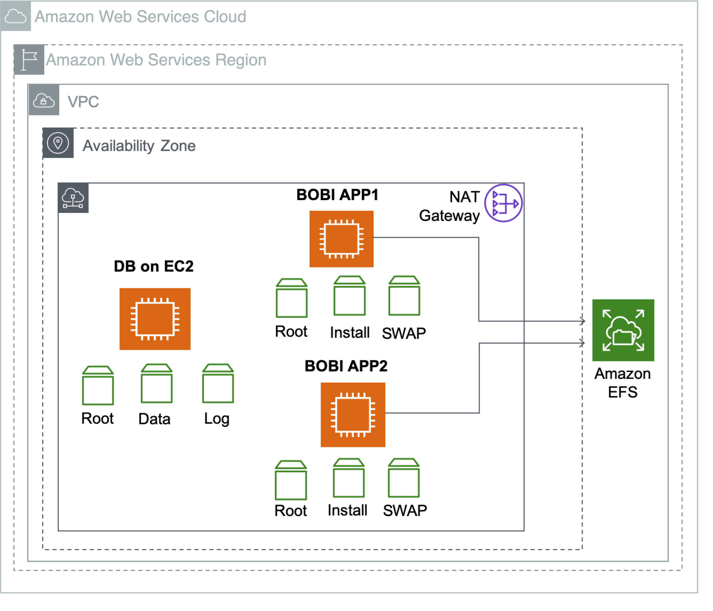

# Storage

The SAP BOBI Platform uses the following AWS storage services:

- [Amazon Elastic Block Store (Amazon EBS)](https://aws.amazon.com/ebs/ "https://aws.amazon.com/ebs/") is used for block storage requirements of SAP BOBI Platform application servers and databases (when the database is installed on EC2).

Figure 2 shows an example use of EBS volumes for application and database. In this example, EBS volumes are used for root volumes, SAP BOBI Platform installation directory, operating system swap volume, and database data and log volumes. The CMS database is typically a small database that stores information like users, SAP BOBI Platform servers, folders, and other configurations. Therefore, it does not have the same storage performance requirements as other enterprise OLTP/OLAP databases. Follow the best practices of the database vendor for designing storage for the SAP BOBI Platform database.

- [Amazon Elastic File System (Amazon EFS)](https://aws.amazon.com/efs/ "https://aws.amazon.com/efs/") is used for shared file system requirements of SAP BOBI Platform application servers installed on Linux EC2 instances. The FileStore in an SAP BOBI Environment requires a shared file system as it stores the content like reports, universes, and connections, which are used by all application servers of that system.
- [Amazon Simple Storage Service (Amazon S3)](https://aws.amazon.com/s3/ "https://aws.amazon.com/s3/") is used for storing the backups of SAP BOBI Platform application servers.
  Figure 2 shows an example use of AWS storage services by an SAP BOBI Platform installation. In this example, two SAP applications servers and a database are installed on three separate EC2 instances with Linux operating system. EBS volumes are used for local file systems like root, install, swap, data, and log volumes. Amazon EFS is used for shared file system FileStore.

###### Note

For SAP BusinessObjects file storage, you can use Amazon FSx for NetApp ONTAP to store your content in a shared file system. You can also use FSx for ONTAP file system for your CMS database `data` and `log` volumes. For more information, see [Amazon FSx for NetApp ONTAP](../../../fsx/latest/ONTAPGuide/what-is-fsx-ontap.md "../../../fsx/latest/ONTAPGuide/what-is-fsx-ontap.md").

**Figure 2: AWS storage system use on SAP BOBI Platform installation**

