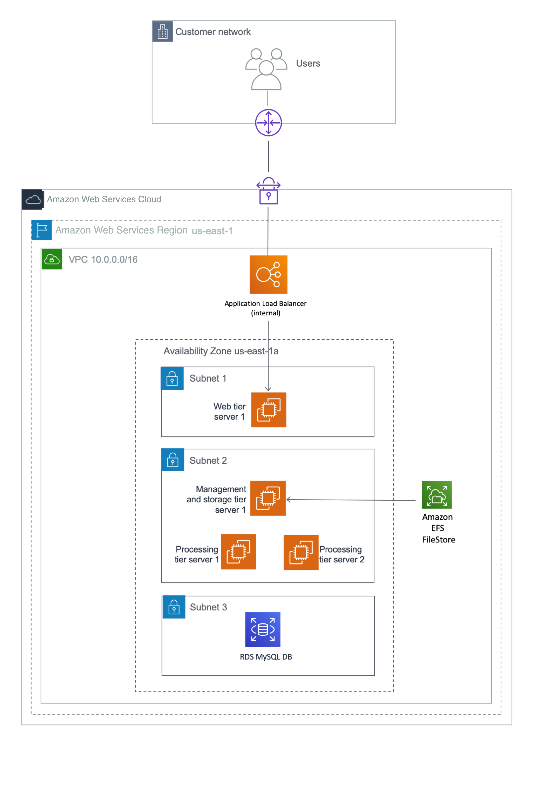
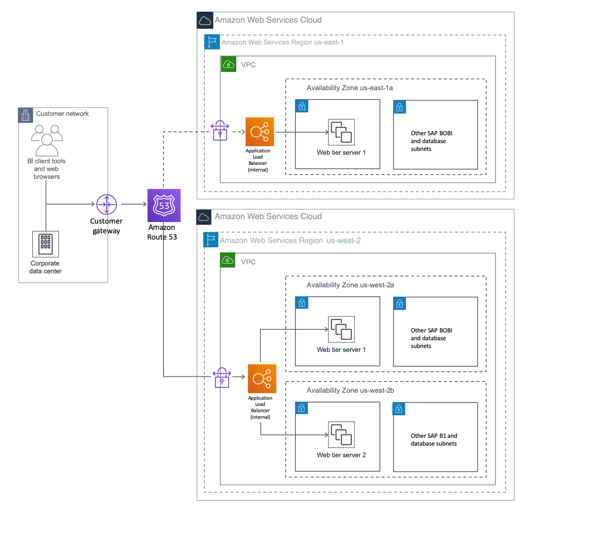

# Planning the Deployment in the DR Region

Planning the deployment of a DR system is critical. Consider these items in your planning:

1. Choose a region for your DR site. Make sure that this DR region supports the services and resources that you are using for your SAP BusinessObjects BI Platform. Each AWS Region is completely isolated from other AWS Regions to provide the best possible fault tolerance and stability. You may choose a DR region that is geographically closer to your users. For the examples in this guide, we’ll assume US West (Oregon) as the primary region and US East (N. Virginia) as the DR region.
2. Determine the RTO and RPO that are acceptable to your business. This decision determines the methodologies you choose for copying the CMS database and FRS content from the primary site to the DR site. See [Affordable Enterprise-Grade Disaster Recovery Using AWS](https://d1.awsstatic.com/asset-repository/products/CloudEndure/CloudEndure_Affordable%20Enterprise-Grade%20Disaster%20Recovery%20Using%20AWS%20082019.pdf "https://d1.awsstatic.com/asset-repository/products/CloudEndure/CloudEndure_Affordable%20Enterprise-Grade%20Disaster%20Recovery%20Using%20AWS%20082019.pdf") on the AWS website for options based on your RTO and RPO requirements. In this guide, because we’re using Amazon RDS MySQL for the CMS database, we have two options for copying the database:
   - Perform periodic snapshots of the Amazon RDS MySQL database and copy these snapshots to the DR region (results in lower RTO and RPO, and lower cost).
   - Create an Amazon RDS MySQL Read Replica in the DR region, and promote this Read Replica to master in the event of a disaster or DR drill (results in higher RTO and RPO, and higher cost).

   For details, see the section [Installing and Configuring the CMS Database for the DR Region](bobj-ha-dr-installing-sap-bobj-dr.md#bobj-ha-dr-dr-cms-database "bobj-ha-dr-installing-sap-bobj-dr.md#bobj-ha-dr-dr-cms-database") later in this guide.

3. Determine the capacity of the DR site. You might want the DR site to have the same capacity and resources as the primary site, or you might decide to run it with fewer resources.
4. For the examples in this guide, we’re using a Route 53 CNAME with an Application Load Balancer for user connectivity. You can change the value of the CNAME to point to the load balancer of the DR region in the event of a disaster or DR drill. This will direct users to the DR environment. You can also use other methods to redirect users if you aren’t using Route 53.
5. Determine the failover process. Define the disaster situations beforehand and put a mechanism in place to direct users to the DR site if a disaster occurs. Define test cases to simulate these scenarios, and perform a DR drill.

## Designing Network and Security Groups for the DR Region

Network and security groups in the DR region will follow the same design as in the primary region, as discussed in the section Designing Network and Security Groups for the Primary Region earlier in this guide. The table in that section lists the VPC and subnet CIDRs that the DR region uses for the examples in this guide. Figure 3 shows the DR architecture used in this guide. This guide does not discuss the use of a secondary Availability Zone for HA in the DR region, but based on your requirements, you can use one to install additional servers.

## Multiple Region Multi-VPC Connectivity

See [Multiple Region Multi-VPC Connectivity](https://aws.amazon.com/answers/networking/aws-multiple-region-multi-vpc-connectivity/ "https://aws.amazon.com/answers/networking/aws-multiple-region-multi-vpc-connectivity/") on the AWS website to find options for connecting multiple VPCs in different AWS Regions. If you aren’t using an Amazon RDS database, you can use the database replication method supported by your database vendor to build a DR database and continuously copy the data. SAP HANA System Replication is one such example. AWS provides options to establish a connection between the primary and DR VPCs in two separate AWS Regions securely and reliably. [Multiple Region Multi-VPC Connectivity](https://aws.amazon.com/answers/networking/aws-multiple-region-multi-vpc-connectivity/ "https://aws.amazon.com/answers/networking/aws-multiple-region-multi-vpc-connectivity/") discusses two ways to connect the VPCs:

- Routing over AWS networks: This option enables you to use an AWS backbone network for connectivity. AWS provides a high bandwidth, global network infrastructure to support your regional networking needs. AWS Regions are connected to multiple Internet Service Providers (ISPs) and to a private global network backbone, which provides lower cost and more consistent cross-region network latency when compared with the public internet.
- Routing over non-AWS networks: This option enables you to route DR network traffic though your corporate data center. Customers can use an internet-based VPN or their own corporate network backbone.

Each option provides different benefits for bandwidth reliability, security, HA, and use of existing infrastructure, and might have limitations as well. You can choose the option that meets your requirements. You can also use AWS Direct Connect gateways to connect your AWS Direct Connect connection over a private virtual interface to one or more VPCs located in the same or different regions in your account. See [AWS Direct Connect Gateways](../../../directconnect/latest/UserGuide/direct-connect-gateways.md "../../../directconnect/latest/UserGuide/direct-connect-gateways.md") in the AWS documentation for the rules and limitations of using this approach.

###### Note

The AWS Regions and Availability Zones shown in the following diagrams are just examples. This architecture can be used in any AWS Region.

**Figure 3: DR architecture for SAP BusinessObjects BI Platform**

Figure 4 shows the user connectivity using Route 53 as an example. You can also use your own DNS. During normal operations, the value of the CNAME record for SAP BusinessObjects BI Platform points to the Application Load Balancer of the primary region. The load balancer distributes the load between the available web servers that deploy the SAP BusinessObjects BI Platform web applications.

**Figure 4: User connectivity with Route 53**

In the event of DR or when performing a DR drill, you can either manually switch the DNS to point to the DR region or you can use automatic failover by using Route 53 health checks. For details, see [Configuring DNS Failover](../../../Route53/latest/DeveloperGuide/dns-failover-configuring.md "../../../Route53/latest/DeveloperGuide/dns-failover-configuring.md") in the Route 53 documentation. Redirect all the users to the DR region as shown in Figure 5.

**Figure 5: Redirecting users to a DR region**

