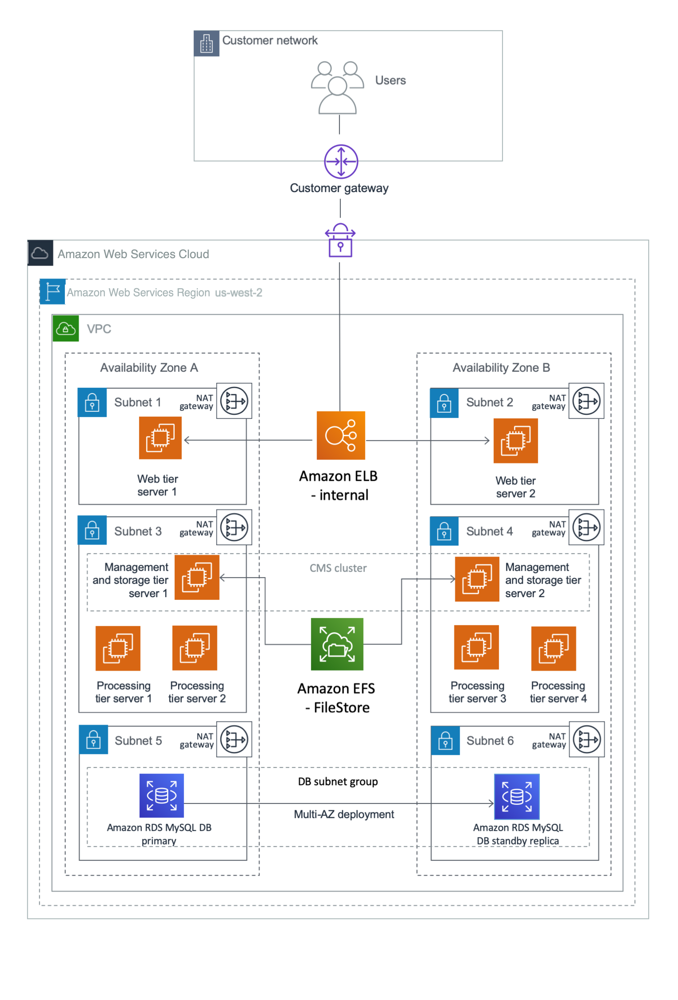
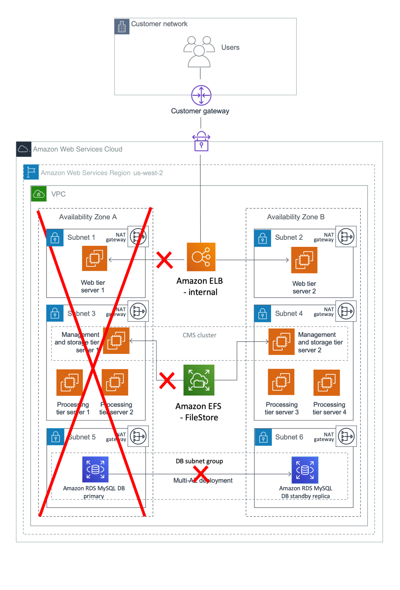

# Planning the Deployment in a Primary Region

Good planning is a key step in ensuring a successful HA deployment for SAP BusinessObjects BI Platform on AWS. Consider these guidelines in your planning:

- Perform the sizing exercise using the [SAP BusinessObjects BI4 Sizing Guide](https://help.sap.com/doc/a47f2e0ca04847daa08f748eb6f40adc/4.2.4/en-US/sbo42_bi_sizing_guide_en.pdf "https://help.sap.com/doc/a47f2e0ca04847daa08f748eb6f40adc/4.2.4/en-US/sbo42_bi_sizing_guide_en.pdf"). You can determine the resource requirements of each tier based on the sizing exercise.
- Create your architecture document for SAP BusinessObjects BI Platform. Based on sizing decisions, determine the distribution of BI components across EC2 instances and subnets. The level of redundancy in your distributed architecture depends on your HA requirements: your recovery time objective (RTO) and recovery point objective (RPO). For example, if you design your system to be available at full capacity during an Availability Zone failure with zero RTO, you can deploy your system so that servers in a single Availability Zone can process all user requests. If your business can tolerate losing partial capacity temporarily, you can provision lost instances by using Amazon Machine Images (AMIs) and AWS CloudFormation templates in the Availability Zone that’s available at the time. There may be other options as well, depending on your cost and recovery time requirements.
- Choose a CMS database with an HA feature. SAP BusinessObjects BI Platform cannot function if the CMS database isn’t available. The method of replication between the primary and standby databases depends on your RTO and RPO requirements, and must be consistent with your application recovery times. If you use an Amazon RDS database as the CMS database, AWS manages HA setup and failover, as explained later in this guide.
- Design the Amazon VPC IP address range, CIDR block, and subnet ranges before you start the installation.

## Designing Network and Security Groups for the Primary Region

Define the security groups that will be used to control access to instances for administrative functions, application and DB-level communications, and isolation of failed resources.

###### Note

Security groups are firewall rules that you define at the instance or network interface level to open or close specific ports for network communication. You’ll need to come up with your own set of rules and configure these based on your application connectivity, setup, and integration requirements.

Here are some of the key considerations for configuring security groups for SAP BusinessObjects BI Platform:

- Users will connect to the web server with web browsers or CMS servers and by using desktop SAP BusinessObjects BI Platform client tools.
- Web servers will communicate with CMS servers and other BusinessObjects BI Platform servers.
- CMS servers will communicate with the CMS and auditing databases.
- The BusinessObjects BI Platform processing tier servers will communicate with the data sources. Data sources could be SAP or non-SAP systems in your landscape where SAP BusinessObjects BI Platform runs the reports.

See [SAP Note 2276646](https://launchpad.support.sap.com/#/notes/2276646 "https://launchpad.support.sap.com/#/notes/2276646") to find out the ports used by different SAP BusinessObjects BI Platform components for communication. The SAP deployment and networking teams should work closely to understand what network traffic to allow in each tier and to configure the tiers accordingly. The following ideas should help provide some structure and guidance:

- Set up a virtual private gateway and one customer gateway. These provide VPN connectivity between the corporate data center and the VPC.
- Set up route table configurations for all the traffic to and from the corporate data center over the VPN tunnel.
- Define all communications on required protocols and ports by using network access control lists (ACLs).
- Set up security groups on management servers with restricted access from certain on-premises networks or IP addresses.
- Set up security groups with limited inbound and outbound protocols and ports for each instance.

###### Note

Servers within a particular VPC subnet might need to access resources on the internet for actions such as software updates. You can provide this access by adding an internet gateway to the VPC and using a network address translation (NAT) gateway or NAT instance placed within a public subnet to protect internal resources. Another method is to create network routes to direct the traffic to traverse the VPN tunnel, into the corporate data center, and out through corporate proxy servers. See the blog posts _VPC Subnet Zoning Patterns for SAP on AWS (Part I, II and III)_ in the [AWS for SAP](https://aws.amazon.com/blogs/awsforsap/ "https://aws.amazon.com/blogs/awsforsap/") blog for guidance on designing VPCs for SAP applications.

This guide uses an example of a typical, large-scale deployment with two Availability Zones to maximize availability and durability, and three subnets per Availability Zone to distribute different SAP BusinessObjects BI Platform tiers. However, based on your sizing requirements, you can also use more than two Availability Zones to install and distribute the SAP BusinessObjects BI Platform nodes. There are many ways to distribute the servers among Availability Zones, EC2 instances, and subnets. In this example, we’ve designed the architecture for HA/DR, with the specifications listed in the following table. See the [Disaster Recovery](bobj-ha-dr-disaster-recovery.md "bobj-ha-dr-disaster-recovery.md") section for details on DR design and setup.

- The web tier is installed in subnet 1 in both Availability Zones.
- The management, storage, and processing tiers are installed in subnet 2 in both Availability Zones.
- The data tier (CMS database) is installed in the DB subnet group in subnet 3 in both Availability Zones.

| AWS component                                   | Key consideration                                                                                                                                      | Specifications for primary region | Information used for DR region                              |
| ----------------------------------------------- | ------------------------------------------------------------------------------------------------------------------------------------------------------ | --------------------------------- | ----------------------------------------------------------- | ----------------------------------------------------------------------------------------------------------------------------------------------------------------------------------------------------------------------------------------------------------------------------------------------------------------------------------------------------------------------------------------------------------------------------------------------------------------------------------------------------------------------------------------------------------------------------------------------------------------------------------------------------------------------------------------------------------------------------------------------------------------------------------------------------------------------------------------------------------------------------------------------------------------------------------------------------------------------------------------------------------------------------------------------------------------------------------------------------------------------------------------------------------------------------------------------------------------------------------------------------------------------------------------------------------------------------------------------------------------------------------------------------------------------------------------------------------------------------------------------------------------------------------------------------------------------------------------------------------------------------------------------------------------------------------------------------------------------------------------------------------------------------------------------------------------------------------------------------------------------------------------------------------------------------------------------------------------------------------------------------------------------------------------------------------------------------------------------------------------------------------------------------------------------------------------------------------------------------------------------------------------------------------------------------------------------------------------------------------------------------------------------------------------------------------------------------------------------------------------------------------------------------------------------------------------------------------------------------------------------------------------------------------------------------------------------------------------------------------------------------------------------------------------------------------------------------------------------------------------------------------------------------------------------------------------------------------------------------------------------------------------------------------------------------------------------------------------------------------------------------------------------------------------------------------------------------------------------------------------------------------------------------------------------------------------------------------------------------------------------------------------------------------------------------------------------------------------------------------------------------------------------------------------------------------------------------- |
| Region                                          | Consider latency requirements, distance from end users.                                                                                                | us-west-2 US West (Oregon)        | us-east-1 US East (N. Virginia)                             |
| Availability Zone 1                             | Choose at least two Availability Zones.                                                                                                                | us-west-2a                        | us-east-1a                                                  |
| Availability Zone 2                             | Choose at least two Availability Zones.                                                                                                                | us-west-2b                        | Availability Zone 2 isn’t available for DR in this example. |
| VPC IP range/CIDR block                         | Range shouldn’t overlap with existing internal IP range. The IP range should be sized appropriately to support the number of hosts and planned growth. | 192.168.0.0/16                    | 10.0.0.0/16                                                 |
| Web tier subnet                                 | CIDR IP range for Availability Zone 1 subnets should accommodate future growth.                                                                        | 192.168.5.0/24                    | 10.0.5.0/24                                                 |
| Management, storage, and processing tier subnet |                                                                                                                                                        | 192.168.6.0/24                    | 10.0.6.0/24                                                 |
| DB group subnet                                 |                                                                                                                                                        | 192.168.7.0/24                    | 10.0.7.0/24                                                 |
| Web tier subnet                                 | CIDR IP range for Availability Zone 2 subnets should accommodate future growth.                                                                        | 192.168.8.0/24                    | Availability Zone 2 isn’t available for DR in this example. |
| Management, storage and processing tier subnet  |                                                                                                                                                        | 192.168.9.0/24                    |                                                             |
| DB group subnet                                 |                                                                                                                                                        | 192.168.10.0/24                   |                                                             | ###### Note The AWS Regions, Availability Zones, and IP addresses listed in the table will be used throughout this guide as needed. You can change these details for your own implementation, based on your design requirements. Figure 1 shows the high-level architecture of all application and network components used in this example. This architecture includes an internal Application Load Balancer between the two web servers, but you can use other load balancers in your design. In this case, the load balancer can route requests only from clients that have access to the VPC. Typically, this will allow access from your corporate network and from the VPC itself. If your users access SAP BusinessObjects BI Platform from the internet, you can choose to deploy an internet-facing load balancer. An internet-facing load balancer has a publicly resolvable DNS name, so it can route requests from clients over the internet to the EC2 instances registered with the load balancer. For configuration steps, see [How do I connect a public-facing load balancer to EC2 instances that have private IP addresses?](https://aws.amazon.com/premiumsupport/knowledge-center/public-load-balancer-private-ec2/ "https://aws.amazon.com/premiumsupport/knowledge-center/public-load-balancer-private-ec2/") in the AWS Knowledge Center. ###### Note The AWS Regions and Availability Zones shown in the following diagrams are just examples. This architecture can be used in any AWS Region. **Figure 1: HA architecture for SAP BusinessObjects BI Platform**  This example puts the web tier in a dedicated subnet. End users will access the web tier servers where the web applications are deployed. You can use security groups to restrict connectivity between the subnets only to the required ports. For example, you can restrict connectivity from the application subnet to the database subnet to allow access only to the database listener port. The Multi-AZ architecture provides both load balancing and HA. The Application Load Balancer will distribute the user load across the two web servers in two Availability Zones. The web servers forward the user requests to the CMS servers. Two EC2 instances (one in each Availability Zone) host the management and storage tier. Similarly, there are four instances (two in each Availability Zone) that host the processing tier. You can scale servers in or out further in any tier, according to your requirements. CMS servers installed in both Availability Zones query the CMS database in Availability Zone 1 during normal operations. In case of an Availability Zone failure, as shown in Figure 2, the health check for the web server in Availability Zone 1 fails, and the Application Load Balancer forwards requests only to the web server in Availability Zone 2. The management and processing tiers in Availability Zone 2 process the user requests. Amazon RDS MySQL switches the standby replica in Availability Zone 2 to primary, and the CMS server connects to the new primary CMS database in Availability Zone 2. If the servers in Availability Zone 2 alone cannot process the user load, you can choose to redeploy additional servers using AMIs and AWS CloudFormation templates. **Figure 2: What happens during a failure in Availability Zone 1**  |
