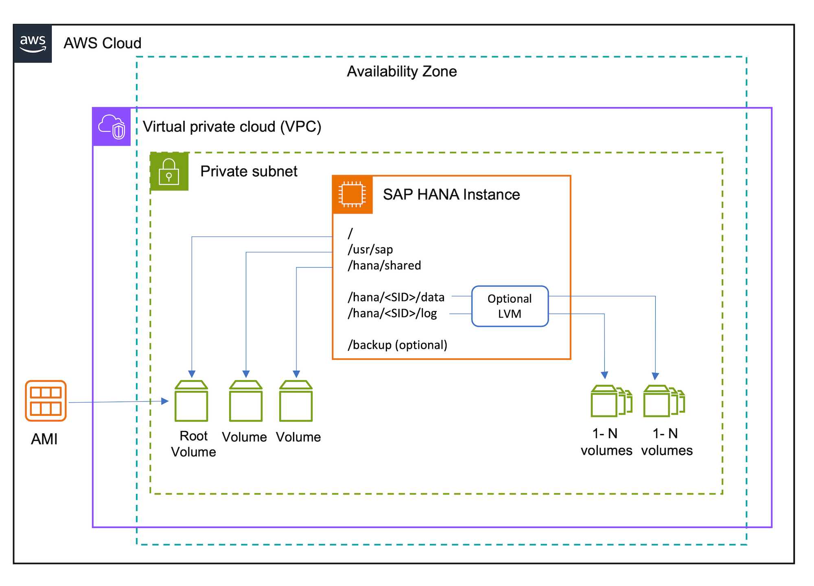
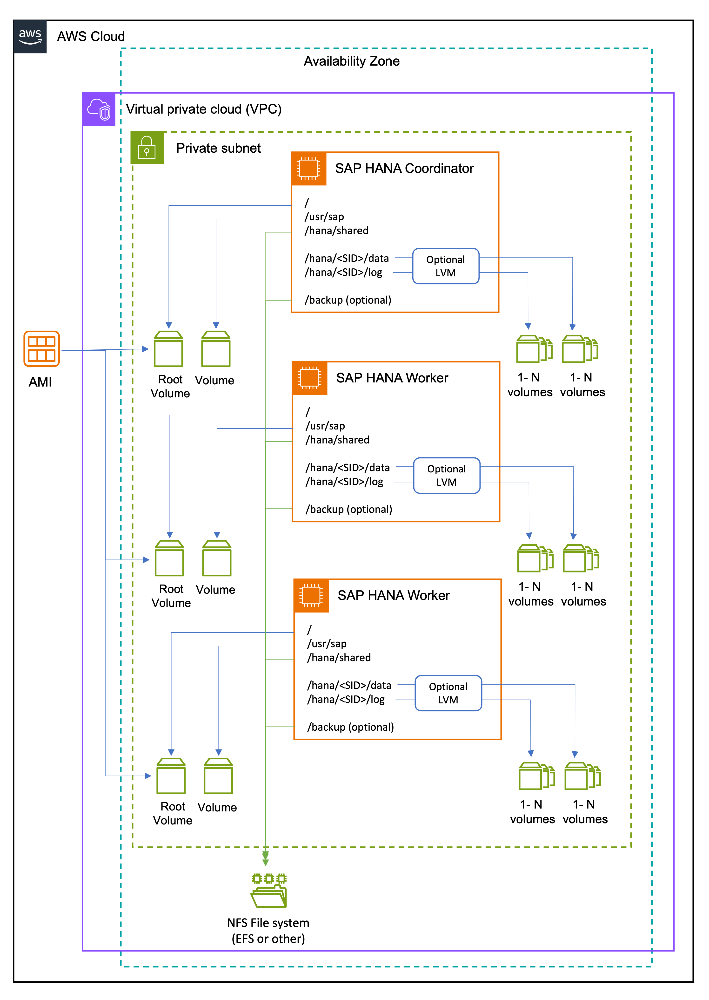

# Architecture

The following architecture diagrams show scale-up and scale-out environments for SAP HANA workloads using Amazon EBS volumes.

###### Topics

- [Scale-up environment](#ebs-scale-up "#ebs-scale-up")
- [Scale-out environment](#ebs-scale-out "#ebs-scale-out")

## Scale-up environment

The following architecture diagram shows a scale-up environment for SAP HANA workloads using Amazon EBS volumes.

## Scale-out environment

The following architecture diagram shows a scale-out environment for SAP HANA workloads using Amazon EBS volumes.

