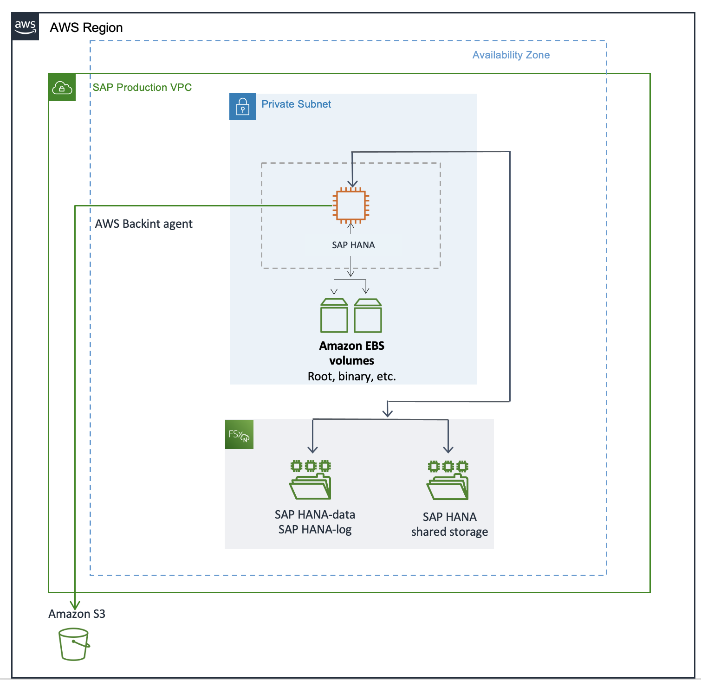
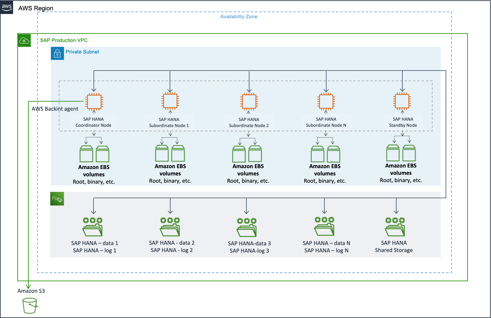
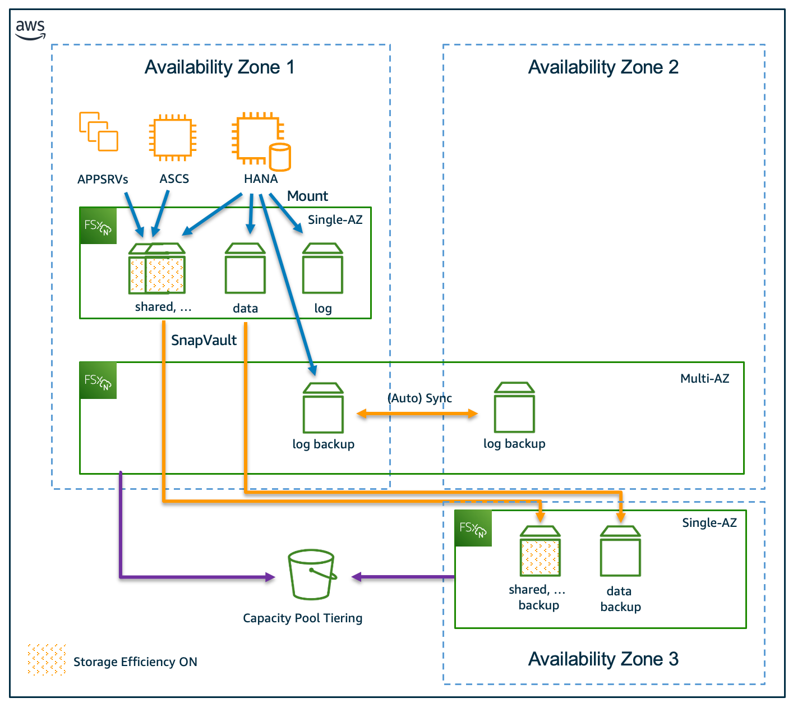
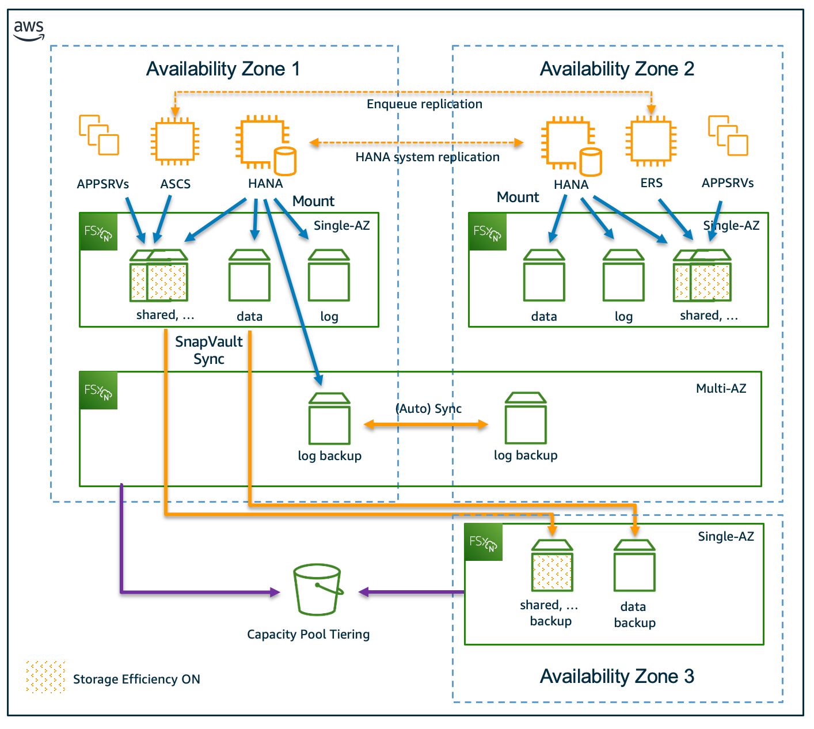

# Amazon FSx for NetApp ONTAP

The following architecture diagrams show different options for SAP HANA workloads using Amazon FSx for NetApp ONTAP.

###### Topics

- [Scale-up environment](#fsx-scale-up "#fsx-scale-up")
- [Scale-out environment](#fsx-scale-out "#fsx-scale-out")
- [Single Availability Zone deployment](#fsx-single "#fsx-single")
- [Multi-Availability Zone deployment](#fsx-multi "#fsx-multi")

## Scale-up environment

The following architecture diagram shows a scale-up environment for SAP HANA workloads using FSx for ONTAP.

## Scale-out environment

The following architecture diagram shows a scale-out environment for SAP HANA workloads using FSx for ONTAP.

## Single Availability Zone deployment

The following architecture diagram shows a single Availability Zone deployment for SAP HANA workloads using FSx for ONTAP.

## Multi-Availability Zone deployment

The following architecture diagram shows a multi-Availability Zone deployment for SAP HANA workloads using FSx for ONTAP.

