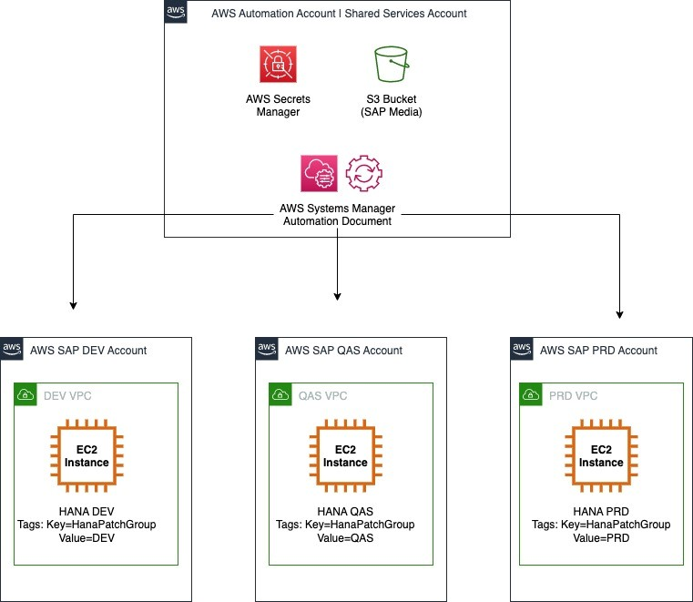
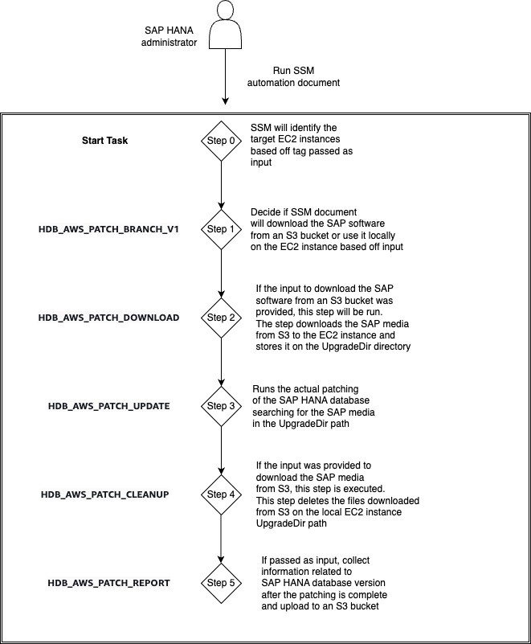
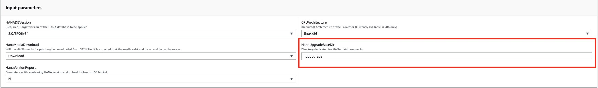

# Automated patching for SAP HANA

Maintaining the SAP HANA database software version keeps the database on with supported software versions, and enables you to stay updated with security fixes and software improvements.

This section provides information about automating the update of your SAP HANA database software version with AWS Systems Manager. You must have a good understanding of SAP HANA patching processes, paths, and prerequisites. Apart from SAP HANA, you must also keep all other components of an SAP system updates with an SAP-supported version.

###### Topics

- [SAP references](#sap-references "#sap-references")
- [Architecture](#architecture-patching "#architecture-patching")
- [Prerequisites](#prerequisites "#prerequisites")
- [SSM automation document](#ssm-automation-document "#ssm-automation-document")
- [AWS services](#services-patching "#services-patching")
- [Prepare to run the SSM automation document](#preparations "#preparations")
- [Troubleshoot](#troubleshoot-patching "#troubleshoot-patching")
- [SAP HANA version reporting](#version-reporting "#version-reporting")

## SAP references

It is recommended that you familiarize yourself with the following SAP documents to understand SAP HANA patching processes, paths, and prerequisites.

You must have SAP portal access to view the SAP Notes.

- SAP Note : [2115815 - FAQ: SAP HANA Database Patches and Upgrades](https://launchpad.support.sap.com/#/notes/2115815 "https://launchpad.support.sap.com/#/notes/2115815")
- SAP Note : [1948334 - SAP HANA Database Update Paths for SAP HANA Maintenance Revisions](https://launchpad.support.sap.com/#/notes/1948334 "https://launchpad.support.sap.com/#/notes/1948334")
- SAP Note : [2378962 - SAP HANA 2.0 Revision and Maintenance Strategy](https://launchpad.support.sap.com/#/notes/2378962 "https://launchpad.support.sap.com/#/notes/2378962")
- SAP HANA Master Guide : [Updating an SAP HANA System Landscape](https://help.sap.com/docs/SAP_HANA_PLATFORM/eb3777d5495d46c5b2fa773206bbfb46/e396b93cbb571014a319bfdf7fb84638.html "https://help.sap.com/docs/SAP_HANA_PLATFORM/eb3777d5495d46c5b2fa773206bbfb46/e396b93cbb571014a319bfdf7fb84638.html")

## Architecture

Based on your governance strategy, you can centralize AWS SSM automation document into a Shared Services account or an automation account. For more information, see [Infrastructure OU - Shared Services account](../../../prescriptive-guidance/latest/security-reference-architecture/shared-services.md "../../../prescriptive-guidance/latest/security-reference-architecture/shared-services.md").

A Shared Services account is used in this document. The AWS SSM automation document is stored in this account. It is connected to the child AWS accounts that host Amazon EC2 instances running SAP HANA workloads. The Shared Services account also hosts the Amazon S3 bucket containing the SAP HANA media software, and specific parameters stored in AWS Secrets Manager. These parameters are required for the automation document to run.

The automation account can be a production account running SAP workloads or a dedicated account for only running SSM automation documents. A Shared Services account for automation reduces the administrative overhead by maintaining the automation document and its dependencies in the same account.



## Prerequisites

- You must setup IAM permissions in the Shared Services account as well as the connected child accounts. This is to enable AWS Systems Manager to run automation documents from the Shared Services account to connected accounts. For more information, see [Running automations in multiple AWS Regions and accounts](../../../systems-manager/latest/userguide/running-automations-multiple-accounts-regions.md "../../../systems-manager/latest/userguide/running-automations-multiple-accounts-regions.md").
- You must set up your Amazon EC2 instance running SAP workloads to be managed by AWS Systems Manager. For more information, see [Working with SSM Agent on Amazon EC2 instances on Linux](../../../systems-manager/latest/userguide/sysman-install-ssm-agent.md "../../../systems-manager/latest/userguide/sysman-install-ssm-agent.md").

## SSM automation document

You can find the code for the SSM automation document on [AWS Samples](https://github.com/aws-samples "https://github.com/aws-samples") GitHub repository. For more information, see [sap-hana-patch-sample.yml](https://github.com/aws-samples/sap-automated-hana-patching/blob/main/sap-hana-patch-sample.yml "https://github.com/aws-samples/sap-automated-hana-patching/blob/main/sap-hana-patch-sample.yml"). The following diagram illustrates the steps run by the SSM automation document.



## AWS services

The sample code interacts with the following AWS services to run the SSM automation documents.

###### Topics

- [Amazon S3](#services-s3 "#services-s3")
- [Amazon EC2](#services-ec2 "#services-ec2")
- [AWS Identity and Access Management](#services-iam "#services-iam")
- [AWS Secrets Manager](#services-secrets-manager "#services-secrets-manager")
- [AWS Key Management Service](#services-kms "#services-kms")

### Amazon S3

You have the following three options to store the SAP HANA software media.

- Amazon EBS volume attached to your Amazon EC2 instance
- NFS mount point – Amazon EFS or Amazon FSx for NetApp ONTAP
- Amazon S3 bucket

An Amazon S3 bucket can be used to store all the SAP HANA software media containing different versions. The target software version to be used in the SSM automation document can be selected from here.

Store the SAP media in a compressed `–0—SAR` file. The SSM automation document extracts information from this file when you choose to download SAP HANA media from Amazon S3.

The bucket can reside in a Shared Services account and can be shared with all AWS accounts that run SAP HANA workloads. The following table provides an example structure of the SAP HANA software media in Amazon S3.

|                            |             |              |           |                                                               |
| -------------------------- | ----------- | ------------ | --------- | ------------------------------------------------------------- |
| **Software**               | **Version** | **Revision** | **Patch** | **Amazon S3 path**                                            |
| SAP HANA database software | 2           | SP04         | 48        | S3://<Your SAP software bucket>/linuxx86/hanadb/2.0/SP04/48   |
| SAP HANA database software | 2           | SP05         | 59        | S3://<Your SAP software bucket>/linuxx86/hanadb/2.0/SP05/59   |
| SAP HANA database software | 2           | SP05         | 59.5      | S3://<Your SAP software bucket>/linuxx86/hanadb/2.0/SP05/59p5 |
| SAP HANA database software | 2           | SP06         | 60        | S3://<Your SAP software bucket>/linuxx86/hanadb/2.0/SP06/60   |
| SAP HANA database software | 2           | SP06         | 64        | S3://<Your SAP software bucket>/linuxx86/hanadb/2.0/SP06/64   |

**Amazon S3 bucket policies**

The Amazon S3 bucket containing the SAP HANA software media must be accessible to all Amazon EC2 instances running SAP HANA workloads in all of your AWS accounts. Use Amazon S3 bucket policies to grant limited access to Amazon S3 buckets and their contents only to specific authorized entities. For more information, see the following documents.

- [Policies and Permissions in Amazon S3](../../../AmazonS3/latest/userguide/access-policy-language-overview.md "../../../AmazonS3/latest/userguide/access-policy-language-overview.md")
- [Security best practices for Amazon S3](../../../AmazonS3/latest/userguide/security-best-practices.md "../../../AmazonS3/latest/userguide/security-best-practices.md")

The following policy is an example Amazon S3 bucket policy that grants access to a specific role on a specific account to download all files from an Amazon S3 bucket.

```
{
    "Version":"2012-10-17",
    "Statement": [
        {
            "Sid": "AddPerm",
            "Effect": "Allow",
            "Principal": {
                "AWS": "arn:aws:iam::123456789012:role/service-role/{ec2_role}"
            },
            "Action": [
                "s3:GetObject",
                "s3:GetObjectVersion",
                "s3:ListBucket"
            ],
            "Resource": [
                "arn:aws:s3:::{bucket_name}/*",
                "arn:aws:s3:::{bucket_name}"
            ]
        }
    ]
}
```

**Dedicated Linux file system**

If the SAP HANA database software is stored in an Amazon S3 bucket, it is downloaded to the local Linux directory on Amazon EC2. It is recommended to have at least 30 GB of free space when downloading the SAP HANA software media files from Amazon S3 bucket to a local Linux directory. The directory path must be specified in the input parameters of the SSM automation document, as shown in the following image.



The files must be present in the specified directory on Amazon EC2 instance. The files must be unzipped, and stored in the following structure, based on the AWS SSM automation document code.

```
/{{HanaUpgradeBaseDir}}/x-sap-lnx-patch-hanadb/{{HANADBVersion}}/SAP_HANA_DATABASE/
```

The downloaded files are removed from the local directory once the SSM automation document has completed updating the SAP HANA database.

### Amazon EC2

Your Amazon EC2 instance running SAP HANA workloads requires two tags to support the SSM automation document code. For more information, see [Tag your Amazon EC2 resources](../../../AWSEC2/latest/UserGuide/Using_Tags.md "../../../AWSEC2/latest/UserGuide/Using_Tags.md").

The `DBSid:{SID}` and `HanaPatchGroup:{Usage}` tags are accessed by AWS Secrets Manager. Both of these tags are depicted in the arc [Architecture](#architecture-patching "#architecture-patching").

The `HanaPatchGroup` tag is used to filter different Amazon Resource Names (ARNs) that are retrieved from AWS Secrets Manager for the SAP HANA database user. The following is an example of `HanaPatchGroup` tag values.

```
DBSid = HDB
HanaPatchGroup = DEV
HanaPatchGroup = QAS
HanaPatchGroup = PRD
HanaPatchGroup = SBX
```

You can customize the tags based on your strategy for user and password management of the database user that is going to perform the SAP HANA update process.

### AWS Identity and Access Management

AWS Systems Manager must be able to manage Amazon EC2 instance running SAP HANA workload. For more information, see [Create an IAM instance profile for Systems Manager](../../../systems-manager/latest/userguide/setup-instance-profile.md "../../../systems-manager/latest/userguide/setup-instance-profile.md").

If your SAP HANA database instance is provisioned via AWS Launch Wizard for SAP, this permission is included in the deployment. For more information, see [AWS Launch Wizard for SAP](../../../launchwizard/latest/userguide/launch-wizard-sap.md "../../../launchwizard/latest/userguide/launch-wizard-sap.md").

### AWS Secrets Manager

AWS Secrets Manager is used to store the parameters of the SAP HANA database that are required to run the SSM automation document. AWS Secrets Manager enables sharing of secrets across multiple accounts. With this flexibility, you can manage the parameters in one location, and outside of the code.

Sharing the secrets across different accounts requires additional permissions. For more information, see [How do I share AWS Secrets Manager secrets between AWS accounts?](https://repost.aws/knowledge-center/secrets-manager-share-between-accounts "https://repost.aws/knowledge-center/secrets-manager-share-between-accounts")

The following table shows the example secrets created in the Shared Services account to run the sample code.

|                                |                  |                                                    |
| ------------------------------ | ---------------- | -------------------------------------------------- |
| **Secret name**                | **Secret key**   | **Secret value**                                   |
| zsap/hana/upgrade/user         | User             | <HANA Upgrade User ID>                             |
| zsap/hana/upgrade/password/DEV | Password         | <HANA DEV Upgrade User Password>                   |
| zsap/hana/upgrade/password/QAS | Password         | <HANA QAS Upgrade User Password>                   |
| zsap/hana/upgrade/password/PRD | Password         | <HANA PRD Upgrade User Password>                   |
| zsap/hana/upgrade/password/SBX | Password         | <HANA SBX Upgrade User Password>                   |
| zsap/hana/upgrade/bucket       | Amazon S3 bucket | <Amazon S3 bucket for SAP HANA software>           |
| zsap/sap/bucket/version_repo   | Amazon S3 bucket | <Amazon S3 bucket for SAP HANA version repository> |

###### Note

The sample code has references to the Amazon Resource Names of the secrets. This is required as the secrets are stored in a different account. The AWS account that contains the Amazon EC2 instance running the SAP HANA workload is different.

**Policies for AWS Secrets Manager**

The secrets created in AWS Secrets Manager must be set up to be accessible to target AWS accounts. For more information, see [Resource-based policies](../../../IAM/latest/UserGuide/access_policies.md#policies_resource-based "../../../IAM/latest/UserGuide/access_policies.md#policies_resource-based").

The following is an example policy that is assigned to a Secret, granting access from a different AWS account.

```
{
  "Version" : "2012-10-17",
  "Statement" : [ {
    "Effect" : "Allow",
    "Principal" : {
      "{aws}" : "arn:aws:iam::{sap_workloads_account_id}:role/service-role/{ec2_role}"
    },
    "Action" : "secretsmanager:GetSecretValue",
    "Resource" : "arn:aws:secretsmanager:{region}:{automation_account_id}:
    {secret_ARN}"
  } ]
}
```

###### Note

###### SAP HANA database user ID

A valid user in the SAP HANA database `SYSTEMDB` with the required authorization to make the SAP HANA update is required.

In the sample code, the user and password are stored in AWS Secrets Manager as a secret. Follow the principle of granting least privilege, and use a user with the required authorizations. For more details, see [Create a Lesser-Privileged Database User for Update](https://help.sap.com/docs/SAP_HANA_PLATFORM/2c1988d620e04368aa4103bf26f17727/df3de8c31cef45c0847d2804b97604ea.htmls "https://help.sap.com/docs/SAP_HANA_PLATFORM/2c1988d620e04368aa4103bf26f17727/df3de8c31cef45c0847d2804b97604ea.htmls").

### AWS Key Management Service

The sample code uses AWS Secrets Manager to share secrets across different AWS accounts. As AWS Secrets Manager encrypts the contents of the parameters, a KMS key is used for encryption and decryption operations. The KMS key must be accessible to all of your AWS accounts. For more information, see [Creating keys](../../../kms/latest/developerguide/create-keys.md "../../../kms/latest/developerguide/create-keys.md").

## Prepare to run the SSM automation document

Before running the SSM automation document, you must ensure that a valid backup of the SAP HANA database exists, and that the applications connecting to the SAP HANA database are properly stopped. For more details, see [Administration](hana-ops-administration.md "hana-ops-administration.md").

For SAP HANA databases managed by an operation system or a third-party cluster software, the cluster must be placed in maintenance mode before initiating automated patching. The SSM automation document must run on the secondary node first.

For more details on SAP HANA clustered environments, see [SAP HANA on AWS: High Availability Configuration Guide for SLES and RHEL](sap-hana-on-aws-ha-configuration.md "sap-hana-on-aws-ha-configuration.md"). For more details on updating SAP HANA databases with SAP HANA System Replication enabled, see [Update SAP HANA Systems Running in a System Replication Setup](https://help.sap.com/docs/SAP_HANA_PLATFORM/6b94445c94ae495c83a19646e7c3fd56/e94ce3e59ece4b918b5c90d998ab7fae.html "https://help.sap.com/docs/SAP_HANA_PLATFORM/6b94445c94ae495c83a19646e7c3fd56/e94ce3e59ece4b918b5c90d998ab7fae.html").

Concurrency enables you to define how many SAP HANA databases should be updated in parallel. For more information, see [Control automations at scale](../../../systems-manager/latest/userguide/running-automations-scale-controls.md "../../../systems-manager/latest/userguide/running-automations-scale-controls.md").

## Troubleshoot

Follow these steps to see the status of each SSM automation.

1. Open the [https://console.aws.amazon.com/systems-manager/](https://console.aws.amazon.com/systems-manager "https://console.aws.amazon.com/systems-manager").
2. On the left navigation pane, select **Automation**.
3. Select **Configure preferences** > **Executions**.
4. You can see the status of your SSM automations in the **Automation executions** section.

AWS Management Console enables you to drill into each execution, review the steps executed, and the result for each step. You can understand the failures that occur _before_ SSM automation. For troubleshooting _after_ the SSM automation has been initiated, review the logs. You can find the SSM logs on Amazon EC2 at the following path.

```
/var/lib/amazon/ssm/{instance-id}/document/orchestration/{automation_step_execution_id}/awsrunShellScript/0.awsrunShellScript
```

You can send the output of each SSM automation to Amazon CloudWatch Logs. For more information, see [Configuring Amazon CloudWatch Logs for Run Command](../../../systems-manager/latest/userguide/sysman-rc-setting-up-cwlogs.md "../../../systems-manager/latest/userguide/sysman-rc-setting-up-cwlogs.md").

## SAP HANA version reporting

You can use [Amazon QuickSight](https://aws.amazon.com/quicksight/?nc1=h_ls "https://aws.amazon.com/quicksight/?nc1=h_ls") to create server less BI dashboards that can serve as a repository for your SAP HANA software versions. With Amazon QuickSight, you can review all of your SAP HANA database versions xin all of your AWS accounts. For more information, see [Maintain an SAP landscape inventory with AWS Systems Manager and Amazon Athena](https://aws.amazon.com/blogs/awsforsap/maintain-an-sap-landscape-inventory-with-aws-systems-manager-and-amazon-athena/ "https://aws.amazon.com/blogs/awsforsap/maintain-an-sap-landscape-inventory-with-aws-systems-manager-and-amazon-athena/").

The `HDB_Report_Version` step in the sample code gathers SAP HANA version information, and uploads that data into an Amazon S3 bucket. (In the sample code, the Amazon S3 bucket has a `/HANA` folder that contains the SAP HANA version information.) You can use the data in this bucket as source dataset to feed Amazon QuickSight dashboards. For more information, see [Creating a dataset using Amazon S3 files](../../../quicksight/latest/user/create-a-data-set-s3.md "../../../quicksight/latest/user/create-a-data-set-s3.md"). You can ensure accuracy of the data by scheduling automatic refreshes. For more information, see [Refreshing SPICE data](../../../quicksight/latest/user/refreshing-imported-data.md "../../../quicksight/latest/user/refreshing-imported-data.md").

You must set up IAM permissions for the Amazon S3 bucket. The following is a sample Amazon S3 bucket policy for storing SAP HANA version information.

```
{
    "Version":"2012-10-17",
    "Statement": [
        {
            "Sid": "AddPerm",
            "Effect": "Allow",
            "Principal": {
                "AWS": "arn:aws:iam::123456789012:role/service-role/{ec2_role}"
            },
            "Action": "s3:PutObject",
            "Resource": [
                "arn:aws:s3:::{bucket_name}/*",
                "arn:aws:s3:::{bucket_name}"
            ]
        }
    ]
}
```
