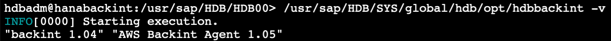

# Install and configure AWS Backint Agent for SAP HANA

This section provides information to help you install the AWS Backint agent using an AWS Systems Manager document or AWS Backint installer. It also provides information to help you configure the agent, view logs, and get the current agent version.

###### Topics

- [Install AWS Backint agent using the AWS Systems Manager document](#aws-backint-agent-ssm-document "#aws-backint-agent-ssm-document")
- [Install AWS Backint agent using AWS Backint installer — interactive mode](#aws-backint-agent-installer-interactive "#aws-backint-agent-installer-interactive")
- [Install AWS Backint agent using AWS Backint installer — silent mode](#aws-backint-agent-installer-silent "#aws-backint-agent-installer-silent")
- [Use a proxy address with AWS Backint agent](#aws-backint-agent-sap-hana-proxy "#aws-backint-agent-sap-hana-proxy")
- [Backint-related SAP HANA parameters](#aws-backint-agent-sap-hana-parameters "#aws-backint-agent-sap-hana-parameters")
- [Modify AWS Backint agent configuration parameters](#aws-backint-agent-modifying-config "#aws-backint-agent-modifying-config")
- [Configure SAP HANA to use a different Amazon S3 bucket and folder for data and log backup](#configure-sap-hana-to-use-different-amazon-s3-bucket-and-folder-for-data-and-log-backup "#configure-sap-hana-to-use-different-amazon-s3-bucket-and-folder-for-data-and-log-backup")
- [Configure SAP HANA to use a different Amazon S3 bucket and folder for catalog backup](#configure-sap-hana-to-use-different-amazon-s3-bucket-and-folder-for-catalog-backup "#configure-sap-hana-to-use-different-amazon-s3-bucket-and-folder-for-catalog-backup")
- [Configure AWS Backint agent to use shorter Amazon S3 paths](#configure-aws-backint-agent-to-use-shorter-amazon-s3-paths "#configure-aws-backint-agent-to-use-shorter-amazon-s3-paths")
- [View AWS Backint agent logs](#aws-backint-agent-view-logs "#aws-backint-agent-view-logs")
- [Get the currently installed AWS Backint agent version](#aws-backint-agent-latest-version "#aws-backint-agent-latest-version")
- [Update to the newest version or install a previous version of AWS Backint agent](#aws-backint-agent-update-version "#aws-backint-agent-update-version")
- [Performance tuning](#aws-backint-agent-performance-tuning "#aws-backint-agent-performance-tuning")
- [Subscribe to AWS Backint agent notifications](#aws-backint-agent-sns "#aws-backint-agent-sns")

## Install AWS Backint agent using the AWS Systems Manager document

Use the following steps to install the AWS Backint agent using the AWS SSM document.

###### Important

Disable any existing backup processes (including scheduled log backups) before continuing with the installation. If you don’t disable existing backup processes before running the SSM document, you can corrupt an in-progress backup, which can impact your ability to recover your database.

1.  From the AWS Management Console, choose **Systems Manager** under **Management & Governance**, or enter `Systems Manager` in the **Find Services** search bar.
2.  From the Systems Manager console, choose **Documents** under **Shared Resources** in the left navigation pane.
3.  On the Documents page, select the **Owned by Amazon** tab. You should see a document named **AWSSAP-InstallBackint**.
4.  Select the **AWSSAP-InstallBackint** document and choose **Run command**.
5.  Under the Command parameters, enter the following
    1. **Bucket Name**. Enter the name of the Amazon S3 bucket where you want to store your SAP HANA backup files.
    2. **Bucket Folder**. Optionally, enter the name of the folder within your Amazon S3 bucket where you want to store your SAP HANA backup files.
    3. **System ID**. Enter your SAP HANA System ID, for example `HDB`.
    4. **Bucket Region**. Enter the AWS Region of the Amazon S3 bucket where you want to store your **SAP HANA backup files**. AWS Backint agent supports cross-Region and cross-account backups. You must provide the AWS Region and Amazon S3 bucket owner account ID along with the Amazon S3 bucket name for the agent to perform successfully.
    5. **Bucket Owner Account ID**. Enter the account ID of the Amazon S3 bucket where you want to store your SAP HANA backup files.
    6. **Kms Key**. Enter the ARN of AWS KMS that AWS Backint agent can use to encrypt the backup files stored in your Amazon S3 bucket.
    7. **Installation Directory**. Enter the path of the directory location where you want to install the AWS Backint agent. Avoid using `/tmp` as the install path.
    8. **Agent Version**. Enter the version number of the agent that you want to install. If you do not enter a version number, the latest published version of the agent is installed.

    ###### Note

    1.0 versions are unavailable in the GovCloud Regions. 9. **Modify Global ini file**. Choose how you want to modify the `global.ini` file. The `global.ini` file of the SAP HANA SYSTEM DB must be updated to complete the setup.

        1. "modify" — SSM will update the `global.ini` file directly.
        2. "sql" — SSM will create a file called `modify_global_ini.sql` with SQL statements that you can run in your target SAP HANA system to set the required parameters. You can find the `modify_global_ini.sql` file in the `<installation directory>/aws-backint-agent/` folder.
        3. "none" — No action will be taken by SSM to modify the `global.ini` file. You must manually update it to complete the setup.

    10. **Ignore Bucket Checks**. Select **yes** to ignore sanity checks of the S3 bucket. S3 Bucket sanity checks verify the following:
        - the bucket exists in your account
        - the bucket Region is correct
        - the bucket is public

    11. **Debug Mode**. Select **yes** to activate debug mode.
    12. **Important! Ensure No Backup In Process**. Choose **Yes** to confirm that you have disabled existing backups and are ready to proceed with the installation. **The SSM document will fail if you choose "No"** .

6.  Under **Targets**, select the method for your target instance to use to install the AWS Backint agent, and then choose the instance on which to install it. If you are not able to find your instance in the list, verify that you have followed all of the steps in the [prerequisites](aws-backint-agent-amazon-s3.md#aws-backint-agent-s3-prerequisites "aws-backint-agent-amazon-s3.md#aws-backint-agent-s3-prerequisites").
7.  Under **Other parameters**, leave the field empty and choose **Run**.

###### Important

If you do not have the latest version of the SSM Agent installed (2.3.274.0 or later), **Run Command** will fail to execute. 8. When the agent is successfully installed, you will see the **Success** status under the **Command ID**. 9. To verify the installation, log in to your instance and view the `/<install directory>/aws-backint-agent` directory. You should see the following files in the directory: the AWS Backint agent binary, `THIRD_PARTY_LICENSES.txt` file, which contains licenses of libraries used by the agent, the launcher script, the YAML configuration file, and the optional `modify_global_ini.sql` file. In addition, a source file (`aws-backint-agent.tar.gz`) of AWS Backint agent is stored in the package directory. You can verify the signature of this file to ensure that the downloaded source file is original and unmodified. See the [Verifying the signature of AWS Backint agent and installer for SAP HANA](aws-backint-agent-signature.md "aws-backint-agent-signature.md") section in this document for details.

The SSM document creates symbolic links (symlinks) in the SAP HANA global directory for the Backint configuration. Verify that the symlink for `hdbbackint` exists in the `/usr/sap/<SID>/SYS/global/hdb/opt` directory and the symlink for `aws-backint-agent-config.yaml` exists in the `/usr/sap/<SID>/SYS/global/hdb/opt/hdbconfig` directory.

## Install AWS Backint agent using AWS Backint installer — interactive mode

Another way to install the AWS Backint agent is with the AWS Backint installer. You can download the AWS Backint installer from an Amazon S3 bucket.

The name of the S3 bucket is `s3://awssap-backint-agent/`

###### Note

For AWS GovCloud (US-East), the name of the S3 bucket is `s3://awssap-backint-agent-us-gov-east-1`.

For AWS GovCloud (US-West), the name of the S3 bucket is `s3://awssap-backint-agent-us-gov-west-1`.

The latest installer can always be found at `s3://awssap-backint-agent/binary/latest/install-aws-backint-agent`

###### Note

For AWS GovCloud (US-East), the latest installer can always be found at `s3://awssap-backint-agent-us-gov-east-1/binary/latest/install-aws-backint-agent`.

For AWS GovCloud (US-West), the latest installer can always be found at `s3://awssap-backint-agent-us-gov-west-1/binary/latest/install-aws-backint-agent`.

Follow these steps to install AWS Backint agent using the AWS Backint installer from an SSH session on your SAP HANA instance.

###### Important

Disable any existing backup processes (including scheduled log backups) before continuing with the installation. If you don’t disable existing backup processes before running the AWS Backint agent installer, you can corrupt an in-progress backup, which can impact your ability to recover your database.

1. Navigate to `/tmp` (or another temporary directory where you downloaded the installer).

```
cd /tmp
```

2. Run one of the following commands to download the installer.

```
sudo aws s3 cp s3://awssap-backint-agent/binary/latest/install-aws-backint-agent /tmp/ --region us-east-1
```

or

```
sudo wget https://s3.amazonaws.com/awssap-backint-agent/binary/latest/install-aws-backint-agent -O /tmp/install-aws-backint-agent
```

###### Note

If you encounter permission issues while downloading the AWS Backint installer using the AWS CLI, check your IAM policy and ensure that your policies allow for downloading objects from the `awssap-backint-agent` bucket. See the [Identity and Access Management](aws-backint-agent-amazon-s3.md#aws-backint-agent-iam "aws-backint-agent-amazon-s3.md#aws-backint-agent-iam") section of this documentation for details. 3. (Optional) For AWS GovCloud (US-East) and AWS GovCloud (US-West), run one of the following commands to download the installer.

```
sudo aws s3 cp s3://awssap-backint-agent-us-gov-east-1/binary/latest/install-aws-backint-agent /tmp/ --region us-gov-east-1
```

```
sudo aws s3 cp s3://awssap-backint-agent-us-gov-west-1/binary/latest/install-aws-backint-agent /tmp/ --region us-gov-west-1
```

or

```
sudo wget https://awssap-backint-agent-us-gov-east-1.s3.us-gov-east-1.amazonaws.com/binary/latest/install-aws-backint-agent -O /tmp/install-aws-backint-agent
```

```
sudo wget https://awssap-backint-agent-us-gov-west-1.s3.us-gov-west-1.amazonaws.com/binary/latest/install-aws-backint-agent -O /tmp/install-aws-backint-agent
```

4. Run the installer with the `-h` flag to find all of the available options.

```
sudo python install-aws-backint-agent -h
```

5. Run the following command to execute the installer.

```
sudo python install-aws-backint-agent
```

###### Note

Run the installer with the `-l` flag if you want the installer to get the AWS Backint agent binary file from your own file system or Amazon S3 bucket. Specify the location of the `aws-backint-agent.tar.gz` file.

```
sudo python install-aws-backint-agent -l /tmp/backint/aws-backint-agent.tar.gz
```

```
sudo python install-aws-backint-agent -l s3://<S3 bucket>/aws-backint-agent.tar.gz
```

```
sudo python install-aws-backint-agent -l https://<S3 bucket>.s3.amazonaws.com/aws-backint-agent.tar.gz
```

6.  Enter information for the following parameters.
    1. **Installation directory** — Enter the path of the directory location where you want to install the AWS Backint agent. The default value for the installation directory is `/hana/shared/`.
    2. **Amazon S3 bucket owner** — Enter the account ID of the Amazon S3 bucket owner of the bucket where you want to store your SAP HANA backup files.
    3. **Amazon S3 bucket Region** — Enter the AWS Region of the Amazon S3 bucket where you want to store your SAP HANA backup files.
    4. **Amazon S3 bucket name** — Enter the name of the Amazon S3 bucket where you want to store your SAP HANA backup files.
    5. **Folder in the S3 bucket** — Enter the name of the folder in the Amazon S3 bucket where you want to store your SAP HANA backup files. This parameter is optional.
    6. **Amazon S3 SSE KMS ARN** — Enter the ARN of the AWS KMS that AWS Backint agent can use to encrypt the backup files stored in your Amazon S3 bucket.

    ###### Note

    If you leave this field empty, AWS Backint installer will prompt you to confirm that you don’t want to encrypt your backup files with encryption keys stored in AWS KMS. If you do not confirm that you do not want to encrypt with the kms-key, the installer will abort. We strongly recommend that you encrypt your data. 7. **SAP HANA system ID** — Enter your SAP HANA System ID, for example `HDB`. 8. **HANA opt dir** — Confirm the location of the SAP HANA opt directory. 9. **Modify global.ini [modify/sql/[none]]** — Choose how you want to modify the `global.ini` file. The `global.ini` file of the SAP HANA SYSTEM must be updated to complete the setup.

        1. "modify" — AWS Backint installer will update the `global.ini` file directly.
        2. "sql" — AWS Backint installer will create a file called `modify_global_ini.sql` with SQL statements that you can run in your target SAP HANA system to set the required parameters. You can find the `modify_global_ini.sql` file in the `<installation directory>/aws-backint-agent/` folder.
        3. "none" — No action will be taken by AWS Backint installer to modify the `global.ini` file. You must manually update them to complete the setup.

    10. **HANA SYSTEM db global.ini file** — Confirm the location of `global.ini` file.
    11. **Verify signature of the agent binary `–0—tar` file** — 
        - Choose `y` to verify the signature of the AWS Backint agent source file. If you choose `y`, enter the Amazon S3 bucket location of the signature file of the agent binary `–0—tar` file, for example, `https://s3.amazonaws.com/awssap-backint-agent/binary/latest/aws-backint-agent.sig`. Or, provide a local file that is stored on the instance. If you proceed without making a selection, the default location listed within brackets ([]) is used.
        - Choose `n` if you do not want to verify the signature of the AWS Backint agent source file.

    12. **Save responses for future usage?** — You can save your information for the AWS Backint installer to a file. You can then use it later to run the installer in silent mode, if needed.
    13. **Do you want to proceed with the installation?** — Confirm that you have disabled the existing backups and are ready to proceed with the installation.

7.  To verify the installation, log in to your instance and view the `/<install directory>/aws-backint-agent` directory. You should see the following files in the directory: the AWS Backint agent binary, the `THIRD_PARTY_LICENSES.txt` file, which contains licenses of libraries used by the agent, the launcher script, the YAML configuration file, and the optional `modify_global_ini.sql` file. In addition, a source file (`aws-backint-agent.tar.gz`) of AWS Backint agent is stored in the package directory. You can verify the signature of this file to ensure that the downloaded source file is original and unmodified. See the [Verifying the signature of AWS Backint agent and installer for SAP HANA](aws-backint-agent-signature.md "aws-backint-agent-signature.md") section in this document for details.

In addition, the AWS Backint installer creates symbolic links (symlinks) in the SAP HANA global directory for the Backint configuration. Verify that the symlink for `hdbbackint` exists in the `/usr/sap/<SID>/SYS/global/hdb/opt` directory, and that the symlink for `aws-backint-agent-config.yaml` exists in the `/usr/sap/<SID>/SYS/global/hdb/opt/hdbconfig` directory.

###### Note

If your installation fails due to validation errors and you want to ignore the validation and proceed with the installation, you can execute the installer with the `-n` flag to ignore the validation steps. You can also use the `-d` flag to run the installer in debug mode to generate detailed installation logs for troubleshooting.

## Install AWS Backint agent using AWS Backint installer — silent mode

You can install the AWS Backint agent with the AWS Backint installer in a silent mode. Choose this option if you want the installation process to be automated without manual intervention.

To run the AWS Backint installer in silent mode, create a response file with all of the required installation parameters. Follow the steps in the [section on installing using the interactive mode](#aws-backint-agent-installer-interactive "#aws-backint-agent-installer-interactive") to download AWS Backint installer and create a response file. You don’t have to confirm to continue with the AWS Backint agent installation in interactive mode. AWS Backint installer will create a response file called `aws-backint-agent-install-YYYYMMDDHHMMSS.rsp`.

When you have a response file, you can modify it with a vim editor and adjust the parameters as needed.

The following is an example response file.

```
[DEFAULT]
s3_bucket_name = <S3 bucket>
s3_bucket_owner_account_id = 111122223333
modify_global_ini = sql
s3_bucket_region = <us-east-1>
s3_sse_kms_arn = arn:aws:kms:<us-east-1>:111122223333:key/1abcd9b9-ab12-1a2a-1abc-12345abc12a3
s3_bucket_folder = myfolder
hana_sid = TST
installation_directory = /hana/shared/
```

If you want to generate the response file programmatically instead of using AWS Backint installer in interactive mode, you can use the `-g` flag to generate a new response file. The following is an example of how to generate a response file using AWS Backint installer.

```
sudo python install-aws-backint-agent -g "s3_bucket_owner_account_id = 111122223333,s3_bucket_name = <S3 bucket>,s3_bucket_region = <us-east-1>,hana_sid = TST,s3_sse_kms_arn = arn:aws:kms:<us-east-1>:111122223333:key/1abcd9b9-ab12-1a2a-1abc-12345abc12a3,s3_bucket_folder = myfolder,installation_directory = /hana/shared/,modify_global_ini = sql" -f myresponse.rsp
```

After the response file is created, use the following steps to run AWS Backint installer in silent mode.

###### Important

Disable any existing backup processes (including scheduled log backups) before continuing with the installation. If you don’t disable existing backup processes before running the AWS Backint agent installer, you can corrupt an in-progress backup, which can impact your ability to recover your database.

Run the following command to execute the installer using the generated response file.

```
sudo python install-aws-backint-agent -m silent -f backint-agent-install-YYYYMMDDHHMMSS.rsp -a yes
```

If you want to choose the location from which to install the agent, run the command with the `-l` flag and specify the location.

```
sudo python install-aws-backint-agent -f aws-backint-agent-install-YYYYMMDDHHMMSS.rsp -m silent -a yes -d -l /tmp/backint/aws-backint-agent.tar.gz
```

###### Note

You must confirm that you have disabled the existing backups and are ready to proceed with the installation in silent mode by passing an acknowledgement flag (`-a yes`). If you don’t pass the acknowledgement flag, AWS Backint installer will fail to execute.

## Use a proxy address with AWS Backint agent

If you use a proxy address in your SAP HANA environment when you install the agent, you must use the following shell script to install the agent to ensure that the correct proxy settings are used by the AWS Backint agent installer.

```
#!/bin/bash
export https_proxy=<PROXY_ADDRESS>:<PROXY_PORT>
export HTTP_PROXY=<PROXY_ADDRESS:PROXY_PORT>
export no_proxy=169.254.169.254
export NO_PROXY=169.254.169.254
sudo python install-aws-backint-agent
```

If you use a proxy address in your SAP HANA environment, you must update the `aws-backint-agent-launcher.sh` file, which is located in the AWS Backint agent installation directory (for example, `/hana/shared/aws-backint-agent/`). You must perform the following update to ensure that the correct proxy settings are used by AWS Backint agent during backup and restore operations.

Add `http_proxy`, `HTTP_PROXY`, `no_proxy`, and `NO_PROXY` variables to the `aws-backint-agent-launcher.sh` script. It is important to exclude the `169.254.169.254` address with the `no_proxy` variable. If you do not exclude this address, instance metadata service calls made by AWS Backint agent will fail and cause errors during backup and restore operations. For more information about instance metadata and user data, see [Instance metadata and user data](../../../AWSEC2/latest/UserGuide/ec2-instance-metadata.md "../../../AWSEC2/latest/UserGuide/ec2-instance-metadata.md") in the _Amazon EC2 User Guide for Linux Instances_.

```
#!/bin/bash
export https_proxy=<PROXY_ADDRESS>:<PROXY_PORT>
export HTTP_PROXY=<PROXY_ADDRESS>:<PROXY_PORT>
export no_proxy=169.254.169.254
export NO_PROXY=169.254.169.254
/hana/shared/aws-backint-agent/aws-backint-agent "$@"
```

## Backint-related SAP HANA parameters

To enable SAP HANA backups using AWS Backint agent, you must set the following SAP HANA parameters. If you chose the "modify" option for the `global.ini` file update, the SSM document or AWS Backint installer adds or updates the following backup related SAP HANA parameters in `global.ini` for the system database. If you chose "sql", you can run the SQL statements specified in the `modify_global_ini.sql` file to update these parameters. For more details about these parameters, see [Backup Configuration Parameters](https://help.sap.com/viewer/6b94445c94ae495c83a19646e7c3fd56/2.0.03/en-US/c1eb6ff410f946318dae539cb3d33f9f.html "https://help.sap.com/viewer/6b94445c94ae495c83a19646e7c3fd56/2.0.03/en-US/c1eb6ff410f946318dae539cb3d33f9f.html") in the _SAP HANA Administration Guide_.

```
[backup]
catalog_backup_parameter_file = /usr/sap/<SID>/SYS/global/hdb/opt/hdbconfig/aws-backint-agent-config.yaml
data_backup_parameter_file = /usr/sap/<SID>/SYS/global/hdb/opt/hdbconfig/aws-backint-agent-config.yaml
log_backup_parameter_file = /usr/sap/<SID>/SYS/global/hdb/opt/hdbconfig/aws-backint-agent-config.yaml
catalog_backup_using_backint = true
log_backup_using_backint = true
parallel_data_backup_backint_channels = 8
data_backup_buffer_size = 4096
max_recovery_backint_channels = 1
[communication]
tcp_backlog = 2048
[persistence]
enable_auto_log_backup = yes
verify_signature = yes
input_signature_filepath = https://s3.amazonaws.com/awssap-backint-agent/binary/latest/aws-backint-agent.sig
```

###### Note

Changing the `tcp_backlog` parameter requires a restart of SAP HANA to take effect.

`max_recovery_backint_channels` determines the number of log files restored/recovered in parallel during the recovery process. When multistreamed backups are recovered, SAP HANA always uses the same number of channels that were used during the backup. For more information, see [Multistreaming Data Backups with Third-Party Backup Tools](https://help.sap.com/viewer/6b94445c94ae495c83a19646e7c3fd56/2.0.02/en-US/9159de1e829740908e0ba022f8e8d1b0.html "https://help.sap.com/viewer/6b94445c94ae495c83a19646e7c3fd56/2.0.02/en-US/9159de1e829740908e0ba022f8e8d1b0.html") in the SAP documentation.

## Modify AWS Backint agent configuration parameters

The AWS Backint agent configuration parameters are maintained in a YAML file in the `/<installation directory>/aws-backint-agent/` directory. The name of the configuration file is `aws-backint-agent-config.yaml`. The following tables summarize the configuration parameters added as part of the AWS Backint agent installation process, and additional parameters that you can add or change.

**Parameters added to the `aws-backint-agent-config.yaml` during initial setup**

| Name of the parameter                    | Description                                                                                                                                                                                                                                                                                                                                                                                                                                                                                                     | Default value                                                                     |
| ---------------------------------------- | --------------------------------------------------------------------------------------------------------------------------------------------------------------------------------------------------------------------------------------------------------------------------------------------------------------------------------------------------------------------------------------------------------------------------------------------------------------------------------------------------------------- | --------------------------------------------------------------------------------- | ----------------------------------------------------------------------------------------------------- | --------------------------------------------------------------------------------------------------------------------------------------------------------------------------------------------------------------------------------------------------------------------------------------------------------------------------------------------------------------------------------------------------------------------------------------------------------------------------------------------------------------------------------------------------------------------------------------------------------------------------------------------------------------------------------------------------------------------------------------------------------------------------------------------------------------------------------------------------------------------------------------------------------------------------------------------------------------------------------------------------------------------------------------------------------------------------------------------------------------------------------------------------------------------------------------------------------------------------------------------------------------------------------------------------------------------------------------------------------------------------------------------------------------------------------------------------------------------------------------------------------------------------------------------------------------------------------------------------------------------------------------------------------------------------------------------------------------------------------------------------------------------------------------------------------------------------------------------------------------------------------------------------------------------------------------------------------------------------------------------------------------------------------------------------------------------------------------------------------------------------------------------------------------------------------------------------------------------------------------------------------------------------------- | -------------------------------------------------------------------------------------------------------------------------------------------------------------------------------------------------------------------------------------------------------------------------------------------------------------------------------------------------------------------------------------------------------------------------------------------------------------------------------------------------------------------------------------------------------------------------------------------------------------------------------------------------------------------------------------------------------------------------------------------------------------------------------------------------------------------------------------------------------------------------------------------------------------------------------------------------------------------------------------------------------------------------------------------------------------------------------------------------------------------------------------------------------------------------------------------------------------------------------------------------------------------------------------------------------------------------------------------------------------------------------------------------------------------------------------------------------------------------------------------------------------------------------------------------------------------------------------------------------------------------------------------------------------------------------------------------------------------------------------------------------------------------------------------------------------------------------------------------------------------------------------------------------------------------------------------------------------------------------------------------------------------------------------------------------------------------------------------------------------------------------------------------------------------------------------------------------------------------------------------------------------------------------------------------------------------------------------------------------------------------------------------------------------------------------------------------------------------------------------------------------------------------------------------------------------------------------------------------------------------------------------------------------------------------------------------------------------------------------------------------------------------------------------------------------------------------------------------------------------------------------------------------------------------------------------------------------------------------------------------------------------------------------------------------------------------------------------------------------------------------------------------------------------------------------------------------------------------------------------------------------------------------------------------------------------------------------------------------------------------------------------------------------------------------------------------------------------------------------------------------------------------------------------------------------------------------------------------------------------------------------------------------------------------------------------------------------------------------------------------------------------------------------------------------------------------------------------------------------------------------------------------------------------------------------------------------------------------------------------------------------------------------------------------------------------------------------------------------------------------------------------------------------------------------------------------------------------------------------------------------------------------------------------------------------------------------------------------------------------------------------------------------------------------------------------------------------------------------------------------------------------------------------------------------------------------------------------------------------------------------------------------------------------------------------------------------------------------------------------------------------------------------------------------------------------------------------------------------------------------------------------------------------------------------------------------------------------------------------------------------------------------------------------------------------------------------------------------------------------------------------------------------------------------------------------------------------------------------------------------------------------------------------------------------------------------------------------------------------------------------------------------------------------------------------------------------------------------------------------------------------------------------------------------------------------------------------------------------------------------------------------------------------------------------------------------------------------------------------------------------------------------------------------------------------------------------------------------------------------------------------------------------------------------------------------------------------------------------------------------------------------------------------------------------------------------------------------------------------------------------------------------------------------------------------------------------------------------------------------------------------------------------------------------------------------------------------------------------------------------------------------------------------------------------------------------------------------------------------------------------------------------------------------------------------------------------------------------------------------------------------------------------------------------------------------------------------------------------------------------------------------------------------------------------------------------------------------------------------------------------------------------------------------------------------------------------------------------------------------------------------------------------------------------------------------------------------------------------------------------------------------------------------------------------------------------------------------------------------------------------------------------------------------------------------------------------------------------------------------------------------------------------------------------------------------------------------------------------------------------------------------------------------------------------------------------------------------------------------------------------------------------------------------------------------------------------------------------------------------------------------------------------------------------------------------------------------------------------------------------------------------------------------------------------------------------------------------------------------------------------------------------------------------------------------------------------------------------------------------------------------------------------------------------------------------------------------------------------------------------------------------------------------------------------------------------------------------------------------------------------------------------------------------------------------------------------------------------------------------------------------------------------------------------------------------------------------------------------------------------------------------------------------------------------------------------------------------------------------------------------------------------------------------------------------------------------------------------------------------------------------------------------------------------------------------------------------------------------------------------------------------------------------------------------------------------------------------------------------------------------------------------------------------------------------------------------------------------------------------------------------------------------------------------------------------------------------------------------------------------------------------------------------------------------------------------------------------------------------- |
| `S3BucketName`                           | Name of the Amazon S3 bucket where you want to store your SAP HANA backup files. For example, `amzn-s3-demo-bucket`.                                                                                                                                                                                                                                                                                                                                                                                            | N/A                                                                               |
| `S3BucketAwsRegion`                      | AWS Region of your Amazon S3 bucket. For example, `us-east-1`.                                                                                                                                                                                                                                                                                                                                                                                                                                                  | N/A                                                                               |
| `S3BucketFolder`                         | Name of the folder in the Amazon S3 bucket where you want to store your SAP HANA backup files. For example, `my-folder`.                                                                                                                                                                                                                                                                                                                                                                                        | Empty                                                                             |
| `S3BucketOwnerAccountID`                 | 12-digit account ID of the Amazon S3 bucket owner. For example, `111122223333`.                                                                                                                                                                                                                                                                                                                                                                                                                                 | N/A                                                                               |
| `LogFile`                                | Location of the AWS Backint agent log file.                                                                                                                                                                                                                                                                                                                                                                                                                                                                     | `/hana/shared/aws-backint-agent/aws-backint-agent.log`                            |
| `S3SseKmsArn`                            | ARN of the kms-key that AWS Backint agent can use to encrypt the backup files stored in Amazon S3. For example, `arn:aws:kms:<us-east-1>: 111122223333:key/5bfbc9b9-ab12-ab12-a123-11111xxx22xx`.                                                                                                                                                                                                                                                                                                               | Empty                                                                             |
| `S3SseEnabled`                           | Specifies whether KMS encryption is enabled.                                                                                                                                                                                                                                                                                                                                                                                                                                                                    | Set to `false` if the `S3SseKmsArn` parameter is empty. Otherwise, set to `true`. | **Parameters that can be added to the `aws-backint-agent-config.yaml` file to update default values** |
| Name of the parameter                    | Description                                                                                                                                                                                                                                                                                                                                                                                                                                                                                                     | Default value                                                                     | Supported since                                                                                       |
| ---                                      | ---                                                                                                                                                                                                                                                                                                                                                                                                                                                                                                             | ---                                                                               | ---                                                                                                   |
| `BackupObjectTags`                       | Enables support for additional S3 object tags. `EnableTagging` must be set to `true` in order to use `BackupObjectTags`. Allowed values: must be a valid JSON string that uses the following syntax: `-BackupObjectTags: "[{Key=string,Value=string},{Key=string,Value=string},...]` For applicable tag restrictions, see [Tag restrictions](../../../AWSEC2/latest/UserGuide/Using_Tags.md#tag-restrictions "../../../AWSEC2/latest/UserGuide/Using_Tags.md#tag-restrictions") in the _Amazon EC2 User Guide_. | N/A                                                                               | Version 1.03                                                                                          |
| `EnableTagging`                          | Enables or disables default object tagging for backups files stored in S3. Tagging helps to identify the AWS Backint version and SAP HANA version used during the backup. Allowed values: `true` or `false`.                                                                                                                                                                                                                                                                                                    | `true`                                                                            | Version 1.03                                                                                          |
| `LogLevel`                               | Specifies the logging level for agent logs. Allowed values: `info` or `debug`.                                                                                                                                                                                                                                                                                                                                                                                                                                  | `info`                                                                            | Version 1.0                                                                                           |
| `LogRotationFrequency`                   | Specifies the `aws-backint-agent.log` file rotation frequency. Allowed values: `minute`, `hour`, `day`, or `never`.                                                                                                                                                                                                                                                                                                                                                                                             | `never`                                                                           | Version 1.03                                                                                          |
| `S3StorageClass`                         | Specifies the S3 storage class type that AWS Backint agent can use while storing your backup files. Allowed values: `STANDARD`, `STANDARD_IA`, `ONEZONE_IA`, or `INTELLIGENT_TIERING`.                                                                                                                                                                                                                                                                                                                          | `STANDARD`                                                                        | Version 1.0 (Intelligent-Tiering since version 1.05)                                                  |
| `UploadConcurrency`                      | Specifies the number of Amazon S3 threads that can work in parallel during backup. Allowed values: `1` to `200`.                                                                                                                                                                                                                                                                                                                                                                                                | `100`                                                                             | Version 1.0                                                                                           |
| `UploadChannelSize`                      | Specifies the number of files that can be uploaded in parallel to the S3 bucket during the backups. Allowed values: `1` to `32`.                                                                                                                                                                                                                                                                                                                                                                                | `10`                                                                              | Version 1.0                                                                                           |
| `MaximumConcurrentFilesForRestore`       | Specifies the number of files that can be downloaded in parallel from S3 during the restore. Allowed values: `1` to `32`.                                                                                                                                                                                                                                                                                                                                                                                       | `5`                                                                               | Version 1.0                                                                                           |
| `S3ShortenBackupDestinationEnabled`      | Specifies whether to use a shorter Amazon S3 path. Allowed values: `true` or `false`.                                                                                                                                                                                                                                                                                                                                                                                                                           | `false`                                                                           | Version 1.05                                                                                          |
| `DownloadConcurrency`                    | Specifies the number of Amazon S3 threads that can work in parallel during restore Allowed values: `1` to `200`.                                                                                                                                                                                                                                                                                                                                                                                                | `100`                                                                             | Version 1.0                                                                                           | ## Configure SAP HANA to use a different Amazon S3 bucket and folder for data and log backup AWS Backint agent uses the same parameters by default for the data and log backups. It stores the data and log backups in the same Amazon S3 bucket and folder. `data_backup_parameter_file = /usr/sap/<SID>/SYS/global/hdb/opt/hdbconfig/aws-backint-agent-config.yaml log_backup_parameter_file = /usr/sap/<SID>/SYS/global/hdb/opt/hdbconfig/aws-backint-agent-config.yaml` To use a different Amazon S3 bucket and folder for the data and log backups, follow these steps. 1. **Check the SAP HANA backup parameters** Locate the `data_backup_parameter_file` and `log_backup_parameter_file` parameters. The default value of these parameters should be `/<installation directory>/aws-backint-agent/aws-backint-agent-config.yaml`. If you do not see this default value, check the configuration file to confirm that it is displaying the same Amazon S3 location. 2. **Retain access to the logs backup stored in the previous Amazon S3 location** If this is a new setup or you do not want to retain the previous logs backup, skip this step and continue with Step 3. Move the previous logs backup with source type `volume` to the new Amazon S3 location for logs backup only. You can confirm the source type by running the following SQL command. `select SOURCE_TYPE_NAME, DESTINATION_PATH from M_BACKUP_CATALOG_FILES` The backup catalog is assigned a name in the following format: `log_backup_0_0_0_0.<BackupID>`. This type of backup is managed by a different SAP HANA parameter, has a source type `catalog`, and should remain in the data backup location. This file contains the backup catalog file that stores the history of all backups. Only the log backups with source type `volume` should be moved to the new Amazon S3 location. To change the Amazon S3 location for catalog backup, see [Configure SAP HANA to use a different Amazon S3 bucket and folder for catalog backup](#configure-sap-hana-to-use-different-amazon-s3-bucket-and-folder-for-catalog-backup "#configure-sap-hana-to-use-different-amazon-s3-bucket-and-folder-for-catalog-backup"). The following table provides an example of a SYSTEM DB folder structure: |
| Backup folder                            | Descriptions                                                                                                                                                                                                                                                                                                                                                                                                                                                                                                    |                                                                                   | ---                                                                                                   | ---                                                                                                                                                                                                                                                                                                                                                                                                                                                                                                                                                                                                                                                                                                                                                                                                                                                                                                                                                                                                                                                                                                                                                                                                                                                                                                                                                                                                                                                                                                                                                                                                                                                                                                                                                                                                                                                                                                                                                                                                                                                                                                                                                                                                                                                                               |
| COMPLETE_DATA_BACKUP_databackup_0_1/     | Nameserver data backup with the source type "topology"                                                                                                                                                                                                                                                                                                                                                                                                                                                          |                                                                                   | COMPLETE_DATA_BACKUP_databackup_1_1/                                                                  | Nameserver data backup with the source type "volume"                                                                                                                                                                                                                                                                                                                                                                                                                                                                                                                                                                                                                                                                                                                                                                                                                                                                                                                                                                                                                                                                                                                                                                                                                                                                                                                                                                                                                                                                                                                                                                                                                                                                                                                                                                                                                                                                                                                                                                                                                                                                                                                                                                                                                              |
| log_backup_0_0_0_0/                      | Log file with source type "catalog"                                                                                                                                                                                                                                                                                                                                                                                                                                                                             |                                                                                   | log_backup_1_0\_<backup ID>\_<backup ID>                                                              | Log file with source type "volume"                                                                                                                                                                                                                                                                                                                                                                                                                                                                                                                                                                                                                                                                                                                                                                                                                                                                                                                                                                                                                                                                                                                                                                                                                                                                                                                                                                                                                                                                                                                                                                                                                                                                                                                                                                                                                                                                                                                                                                                                                                                                                                                                                                                                                                                | The following table provides an example of a TENANT DB folder structure:                                                                                                                                                                                                                                                                                                                                                                                                                                                                                                                                                                                                                                                                                                                                                                                                                                                                                                                                                                                                                                                                                                                                                                                                                                                                                                                                                                                                                                                                                                                                                                                                                                                                                                                                                                                                                                                                                                                                                                                                                                                                                                                                                                                                                                                                                                                                                                                                                                                                                                                                                                                                                                                                                                                                                                                                                                                                                                                                                                                                                                                                                                                                                                                                                                                                                                                                                                                                                                                                                                                                                                                                                                                                                                                                                                                                                                                                                                                                                                                                                                                                                                                                                                                                                                                                                                                                                                                                                                                                                                                                                                                                                                                                                                                                                                                                                                                                                                                                                                                                                                                                                                                                                                                                                                                                                                                                                                                                                                                                                                                                                                                                                                                                                                                                                                                                                                                                                                                                                                                                                                                                                                                                                                                                                                                                                                                                                                                                                                                                                                                                                                                                                                                                                                                                                                                                                                                                                                                                                                                                                                                                                                                                                                                                                                                                                                                                                                                                                                                                                                                                                                                                                                                                                                                                                                                                                                                                                                                                                                                                                                                                                                                                                                                                                                                                                                                                                                                                                                                                                                                                                                                                                                                                                                                                                                                                                                                                                                                                                                                                                                                                                                                                                                                                                                                                                                                                                                                                         |
| Backup folder                            | Descriptions                                                                                                                                                                                                                                                                                                                                                                                                                                                                                                    |                                                                                   | ---                                                                                                   | ---                                                                                                                                                                                                                                                                                                                                                                                                                                                                                                                                                                                                                                                                                                                                                                                                                                                                                                                                                                                                                                                                                                                                                                                                                                                                                                                                                                                                                                                                                                                                                                                                                                                                                                                                                                                                                                                                                                                                                                                                                                                                                                                                                                                                                                                                               |
| COMPLETE_DATA_BACKUP_databackup_0_1/     | Indexserver data backup with the source type "topology"                                                                                                                                                                                                                                                                                                                                                                                                                                                         |                                                                                   | COMPLETE_DATA_BACKUP_databackup_2_1/                                                                  | Indexserver data backup with the source type "volume"                                                                                                                                                                                                                                                                                                                                                                                                                                                                                                                                                                                                                                                                                                                                                                                                                                                                                                                                                                                                                                                                                                                                                                                                                                                                                                                                                                                                                                                                                                                                                                                                                                                                                                                                                                                                                                                                                                                                                                                                                                                                                                                                                                                                                             |
| COMPLETE_DATA_BACKUP_databackup_3_1/     | Xsengine data backup with the source type "volume"                                                                                                                                                                                                                                                                                                                                                                                                                                                              |                                                                                   | log_backup_0_0_0_0/                                                                                   | Log file with source type "catalog"                                                                                                                                                                                                                                                                                                                                                                                                                                                                                                                                                                                                                                                                                                                                                                                                                                                                                                                                                                                                                                                                                                                                                                                                                                                                                                                                                                                                                                                                                                                                                                                                                                                                                                                                                                                                                                                                                                                                                                                                                                                                                                                                                                                                                                               |
| log_backup_2_0\_<backup ID>\_<backup ID> | Log file with source type "volume"                                                                                                                                                                                                                                                                                                                                                                                                                                                                              |                                                                                   | log_backup_3_0\_<backup ID>\_<backup ID>                                                              | Log file with source type "volume"                                                                                                                                                                                                                                                                                                                                                                                                                                                                                                                                                                                                                                                                                                                                                                                                                                                                                                                                                                                                                                                                                                                                                                                                                                                                                                                                                                                                                                                                                                                                                                                                                                                                                                                                                                                                                                                                                                                                                                                                                                                                                                                                                                                                                                                | ###### Note Before doing steps a and b, ensure that there is no backup process running. 1. **Change the location of the logs backup for SYSTEM DB** Run the following commands to move the volume type of SYSTEM DB logs. In the example, we use the same Amazon S3 bucket, but create another folder for the logs backup. `#Create the folder structure aws s3api put-object --bucket <S3 bucket> --key <S3 folder for logs>/<SID>/usr/sap/<SID>/SYS/global/hdb/backint/SYSTEMDB/ --region <us-east-1> #Execute a Dry Run to check aws s3 cp s3://<S3 bucket>/<S3 folder>/<SID>/usr/sap/<SID>/SYS/global/hdb/backint/SYSTEMDB/ s3://<S3 bucket>/<S3 folder for logs>/<SID>/usr/sap/<SID>/SYS/global/hdb/backint/SYSTEMDB/ --exclude "*" --include "log_backup_1_0*" --recursive --dryrun --region <us-east-1> #Run the command to move the logs to the new S3 location aws s3 cp s3://<S3 bucket>/<S3 folder>/<SID>/usr/sap/<SID>/SYS/global/hdb/backint/SYSTEMDB/ s3://<S3 bucket>/<S3 folder for logs>/<SID>/usr/sap/<SID>/SYS/global/hdb/backint/SYSTEMDB/ --exclude "*" --include "log_backup_1_0*" --recursive --region <us-east-1> #Check the output of the S3 location for logs aws s3 ls s3://<S3 bucket>/<S3 folder for logs>/<SID>/usr/sap/<SID>/SYS/global/hdb/backint/SYSTEMDB/ --region <us-east-1>` 2. **Change the location of the logs backup for TENANT DB** Run the following commands to move the volume type TENANT DB logs. In the example, we use the same Amazon S3 bucket, and create another folder for the logs backup. You need to repeat this step for every TENANT DB. `#Create the folder structure aws s3api put-object --bucket <S3 bucket> --key <S3 folder for logs>/<SID>/usr/sap/<SID>/SYS/global/hdb/backint/DB_<SID>/ --region <us-east-1> #Execute a Dry Run aws s3 cp s3://<S3 bucket>/<S3 folder>/<SID>/usr/sap/<SID>/SYS/global/hdb/backint/DB_<SID>/ s3://<S3 bucket>/<S3 bucket for logs>/<SID>/usr/sap/<SID>/SYS/global/hdb/backint/DB_<SID>/ --exclude "" --include "log_backup_2_0" --include "log_backup_3_0" --recursive --dryrun --region <us-east-1> #Run the command to move the logs to the new S3 location aws s3 cp s3://<S3 bucket>/<S3 folder>/<SID>/usr/sap/<SID>/SYS/global/hdb/backint/DB_<SID>/ s3://<S3 bucket>/<S3 bucket for logs>/<SID>/usr/sap/<SID>/SYS/global/hdb/backint/DB_<SID>/ --exclude "" --include "log_backup_2_0" --include "log_backup_3_0" --recursive --region <us-east-1> #Check the output of the S3 location for logs aws s3 ls s3://<S3 bucket>/<S3 bucket for logs>/<SID>/usr/sap/<SID>/SYS/global/hdb/backint/DB_<SID>/ --region <us-east-1>` 3. **Create the `aws-backint-agent-config-logs.yaml` parameter file** 1. Make a copy of the existing AWS Backint agent configuration for logs backup. `cp /hana/shared/aws-backint-agent/aws-backint-agent-config.yaml  \ /hana/shared/aws-backint-agent/aws-backint-agent-config-logs.yaml` 2. Modify the `S3BucketName`, `S3BucketFolder`, and `LogFile` parameters in `aws-backint-agent-config-logs.yaml`, using your preferred editor. `S3BucketName: "<Amazon S3 bucket for SAP HANA logs>" S3BucketFolder: "<Amazon S3 folder for SAP HANA logs>" LogFile: "/hana/shared/aws-backint-agent/aws-backint-agent-logs.log"` 3. Create a `hdbbackint` soft link from `/usr/sap/<SID>/SYS/global/hdb/opt/hdbconfig/` to `/hana/shared/aws-backint-agent/`. `ln -s /hana/shared/aws-backint-agent/aws-backint-agent-config-logs.yaml  \ /usr/sap/<SID>/SYS/global/hdb/opt/hdbconfig/aws-backint-agent-config-logs.yaml` 4. **Update the `global.ini` file** Update the `global.ini` file with the following configuration. `log_backup_parameter_file = /usr/sap/<SID>/SYS/global/hdb/opt/hdbconfig/aws-backint-agent-config-logs.yaml` 5. **Run reconfiguration for the update** Run `hdbnsutil -reconfig` for the update to take effect. 6. **Validate to ensure that all steps have been processed correctly** 1. Run a point-in-time recovery to a previous state, to ensure that you can access the previous log files in the new Amazon S3 location. 2. Verify that new logs are uploaded to the new S3 location. 7. **Delete previous backups** After a successful validation, we recommend waiting for at least a week before deleting the previous logs. When you’re ready, delete the previous logs with the following commands. `#Delete previous backups in SYSTEMDB aws s3 rm s3://<S3 bucket>/<S3 folder>/<SID>/usr/sap/<SID>/SYS/global/hdb/backint/SYSTEMDB/ --exclude "" --include "log_backup_1_0" --recursive --dryrun --region <us-east-1> aws s3 rm s3://<S3 bucket>/<S3 folder>/<SID>/usr/sap/<SID>/SYS/global/hdb/backint/SYSTEMDB/ --exclude "" --include "log_backup_1_0" --recursive --region <us-east-1> #Delete previous backups in the TENANT database (Repeat for each tenant) aws s3 rm s3://<S3 bucket>/<S3 folder>/<SID>/usr/sap/<SID>/SYS/global/hdb/backint/DB_<SID>/ --exclude "" --include --include "log_backup_2_0" --include "log_backup_3_0" --recursive --dryrun --region <us-east-1> aws s3 rm s3://<S3 bucket>/<S3 folder>/<SID>/usr/sap/<SID>/SYS/global/hdb/backint/DB_<SID>/ --exclude "" --include "log_backup_2_0" --include "log_backup_3_0" --recursive --region <us-east-1>` ## Configure SAP HANA to use a different Amazon S3 bucket and folder for catalog backup AWS Backint agent uses the same parameters by default for the data, log, and catalog backups. It stores all of the backups in the same Amazon S3 bucket and folder. `data_backup_parameter_file = /usr/sap/<SID>/SYS/global/hdb/opt/hdbconfig/aws-backint-agent-config.yaml log_backup_parameter_file = /usr/sap/<SID>/SYS/global/hdb/opt/hdbconfig/aws-backint-agent-config.yaml catalog_backup_parameter_file = /usr/sap/<SID>/SYS/global/hdb/opt/hdbconfig/aws-backint-agent-config.yaml` To use a different Amazon S3 bucket and folder for catalog backup, follow these steps. 1. **Check the SAP HANA backup parameters** Locate the `data_backup_parameter_file`, `log_backup_parameter_file`, and `catalog_backup_parameter_file` parameters. The default value of these parameters should be `/<installation directory>/aws-backint-agent/aws-backint-agent-config.yaml`. If you do not see this default value, check the configuration file to confirm that it is displaying the same Amazon S3 location. 2. **Retain access to the logs backup stored in the previous Amazon S3 location** If this is a new setup or you do not want to retain the previous catalog backup, skip this step and continue with Step 3. Move the previous catalog backup with source type `catalog` to the new Amazon S3 location for catalog backup only. You can confirm the source type by running the following SQL command. `select SOURCE_TYPE_NAME, DESTINATION_PATH from M_BACKUP_CATALOG_FILES` The backup catalog is assigned a name in the following format: `log_backup_0_0_0_0.<BackupID>`. This type of backup has a source type `catalog`. This file contains the backup catalog file that stores the history of all backups. Only the catalog backups with source type `catalog` should be moved to the new Amazon S3 location. To change the Amazon S3 location for log backup, see [Configure SAP HANA to use a different Amazon S3 bucket and folder for data and log backup](#configure-sap-hana-to-use-different-amazon-s3-bucket-and-folder-for-data-and-log-backup "#configure-sap-hana-to-use-different-amazon-s3-bucket-and-folder-for-data-and-log-backup"). The following table provides an example of a SYSTEM DB folder structure:                                                                                                                                                                                                                                                                                                                                                                                                                                                                                                                                                                                                                                                                                                                                                                                                                                                                                                                                                                                                                                                                                                                                                                                                                                                                                                                                                                                                                                                                                                                                                                                                                                                                                                                                                                                                                                                           |
| Backup folder                            | Descriptions                                                                                                                                                                                                                                                                                                                                                                                                                                                                                                    |                                                                                   | ---                                                                                                   | ---                                                                                                                                                                                                                                                                                                                                                                                                                                                                                                                                                                                                                                                                                                                                                                                                                                                                                                                                                                                                                                                                                                                                                                                                                                                                                                                                                                                                                                                                                                                                                                                                                                                                                                                                                                                                                                                                                                                                                                                                                                                                                                                                                                                                                                                                               |
| COMPLETE_DATA_BACKUP_databackup_0_1/     | Nameserver data backup with the source type "topology"                                                                                                                                                                                                                                                                                                                                                                                                                                                          |                                                                                   | COMPLETE_DATA_BACKUP_databackup_1_1/                                                                  | Nameserver data backup with the source type "volume"                                                                                                                                                                                                                                                                                                                                                                                                                                                                                                                                                                                                                                                                                                                                                                                                                                                                                                                                                                                                                                                                                                                                                                                                                                                                                                                                                                                                                                                                                                                                                                                                                                                                                                                                                                                                                                                                                                                                                                                                                                                                                                                                                                                                                              |
| log_backup_0_0_0_0/                      | Log file with source type "catalog"                                                                                                                                                                                                                                                                                                                                                                                                                                                                             |                                                                                   | log_backup_1_0\_<backup ID>\_<backup ID>                                                              | Log file with source type "volume"                                                                                                                                                                                                                                                                                                                                                                                                                                                                                                                                                                                                                                                                                                                                                                                                                                                                                                                                                                                                                                                                                                                                                                                                                                                                                                                                                                                                                                                                                                                                                                                                                                                                                                                                                                                                                                                                                                                                                                                                                                                                                                                                                                                                                                                | The following table is an example of a TENANT DB folder structure:                                                                                                                                                                                                                                                                                                                                                                                                                                                                                                                                                                                                                                                                                                                                                                                                                                                                                                                                                                                                                                                                                                                                                                                                                                                                                                                                                                                                                                                                                                                                                                                                                                                                                                                                                                                                                                                                                                                                                                                                                                                                                                                                                                                                                                                                                                                                                                                                                                                                                                                                                                                                                                                                                                                                                                                                                                                                                                                                                                                                                                                                                                                                                                                                                                                                                                                                                                                                                                                                                                                                                                                                                                                                                                                                                                                                                                                                                                                                                                                                                                                                                                                                                                                                                                                                                                                                                                                                                                                                                                                                                                                                                                                                                                                                                                                                                                                                                                                                                                                                                                                                                                                                                                                                                                                                                                                                                                                                                                                                                                                                                                                                                                                                                                                                                                                                                                                                                                                                                                                                                                                                                                                                                                                                                                                                                                                                                                                                                                                                                                                                                                                                                                                                                                                                                                                                                                                                                                                                                                                                                                                                                                                                                                                                                                                                                                                                                                                                                                                                                                                                                                                                                                                                                                                                                                                                                                                                                                                                                                                                                                                                                                                                                                                                                                                                                                                                                                                                                                                                                                                                                                                                                                                                                                                                                                                                                                                                                                                                                                                                                                                                                                                                                                                                                                                                                                                                                                                                               |
| Backup folder                            | Descriptions                                                                                                                                                                                                                                                                                                                                                                                                                                                                                                    |                                                                                   | ---                                                                                                   | ---                                                                                                                                                                                                                                                                                                                                                                                                                                                                                                                                                                                                                                                                                                                                                                                                                                                                                                                                                                                                                                                                                                                                                                                                                                                                                                                                                                                                                                                                                                                                                                                                                                                                                                                                                                                                                                                                                                                                                                                                                                                                                                                                                                                                                                                                               |
| COMPLETE_DATA_BACKUP_databackup_0_1/     | Indexserver data backup with the source type "topology"                                                                                                                                                                                                                                                                                                                                                                                                                                                         |                                                                                   | COMPLETE_DATA_BACKUP_databackup_2_1/                                                                  | Indexserver data backup with the source type "volume"                                                                                                                                                                                                                                                                                                                                                                                                                                                                                                                                                                                                                                                                                                                                                                                                                                                                                                                                                                                                                                                                                                                                                                                                                                                                                                                                                                                                                                                                                                                                                                                                                                                                                                                                                                                                                                                                                                                                                                                                                                                                                                                                                                                                                             |
| COMPLETE_DATA_BACKUP_databackup_3_1/     | Xsengine data backup with the source type "volume"                                                                                                                                                                                                                                                                                                                                                                                                                                                              |                                                                                   | log_backup_0_0_0_0/                                                                                   | Log file with source type "catalog"                                                                                                                                                                                                                                                                                                                                                                                                                                                                                                                                                                                                                                                                                                                                                                                                                                                                                                                                                                                                                                                                                                                                                                                                                                                                                                                                                                                                                                                                                                                                                                                                                                                                                                                                                                                                                                                                                                                                                                                                                                                                                                                                                                                                                                               |
| log_backup_2_0\_<backup ID>\_<backup ID> | Log file with source type "volume"                                                                                                                                                                                                                                                                                                                                                                                                                                                                              |                                                                                   | log_backup_3_0\_<backup ID>\_<backup ID>                                                              | Log file with source type "volume"                                                                                                                                                                                                                                                                                                                                                                                                                                                                                                                                                                                                                                                                                                                                                                                                                                                                                                                                                                                                                                                                                                                                                                                                                                                                                                                                                                                                                                                                                                                                                                                                                                                                                                                                                                                                                                                                                                                                                                                                                                                                                                                                                                                                                                                | ###### Note Before doing steps a and b, ensure that there is no backup process running. 1. **Change the location of the catalog backup for SYSTEM DB** Run the following commands to move the `catalog` type of SYSTEM DB logs. In the example, we use the same Amazon S3 bucket, but create another folder for catalog backup. `#Create the folder structure aws s3api put-object --bucket <S3 bucket> --key S3 folder for catalog/<SID>/usr/sap/<SID>/SYS/global/hdb/backint/SYSTEMDB/ --region <us-east-1> #Execute a Dry Run to check aws s3 cp s3://<S3 bucket>/<S3 folder>/<SID>/usr/sap/<SID>/SYS/global/hdb/backint/SYSTEMDB/ s3://<S3 bucket>/<S3 folder for catalog>/<SID>/usr/sap/<SID>/SYS/global/hdb/backint/SYSTEMDB/ --exclude "*" --include "log_backup_0_0_0_0*" --recursive --dryrun --region <us-east-1> #Run the command to move the logs to the new S3 location aws s3 cp s3://example-s3-bucket;/<S3 folder>/<SID>/usr/sap/<SID>/SYS/global/hdb/backint/SYSTEMDB/ s3://<S3 bucket>/<S3 folder for catalog>/<SID>/usr/sap/<SID>/SYS/global/hdb/backint/SYSTEMDB/ --exclude "*" --include "log_backup_0_0_0_0*" --recursive --region <us-east-1> #Check the output of the S3 location for logs aws s3 ls s3://<S3 bucket>/<S3 folder for catalog>/<SID>/usr/sap/<SID>/SYS/global/hdb/backint/SYSTEMDB/ --region <us-east-1>` 2. **Change the location of the catalog backup for TENANT DB** Run the following commands to move the `catalog` type tenant database logs. In the example, we use the same Amazon S3 bucket, and create another folder for catalog backup. You need to repeat this step for every TENANT DB. `#Create the folder structure aws s3api put-object --bucket <S3 bucket> --key S3 folder for catalog/<SID>/usr/sap/<SID>/SYS/global/hdb/backint/DB_<SID>/ --region <us-east-1> #Execute a Dry Run aws s3 cp s3://<S3 bucket>/<S3 folder>/<SID>/usr/sap/<SID>/SYS/global/hdb/backint/DB_<SID>/ s3://<S3 bucket>/<S3 bucket for catalog>/<SID>/usr/sap/<SID>/SYS/global/hdb/backint/DB_<SID>/ --exclude "" --include "log_backup_0_0_0_0*" --recursive --dryrun --region <us-east-1> #Run the command to move the catalog to the new S3 location aws s3 cp s3://<S3 bucket>/<S3 folder>/<SID>/usr/sap/<SID>/SYS/global/hdb/backint/DB_<SID>/ s3://<S3 bucket>/<S3 bucket for catalog>/<SID>/usr/sap/<SID>/SYS/global/hdb/backint/DB_<SID>/ --exclude "" --include "log_backup_0_0_0_0*" --recursive --region <us-east-1> #Check the output of the S3 location for catalog` 3. Create the `**aws-backint-agent-config-catalog.yaml**` parameter file 1. Make a copy of the existing AWS Backint agent configuration for catalog backup. `cp /hana/shared/aws-backint-agent/aws-backint-agent-config.yaml  \ /hana/shared/aws-backint-agent/aws-backint-agent-config-catalog.yaml` 2. Modify the `S3BucketName`, `S3BucketFolder`, and `LogFile` parameters in `aws-backint-agent-config-catalog.yaml`, using your preferred editor. `S3BucketName: "Amazon S3 bucket for SAP HANA catalog" S3BucketFolder: "Amazon S3 folder for SAP HANA catalog" LogFile: "/hana/shared/aws-backint-agent/aws-backint-agent-catalog.log"` 3. Create a `hdbbackint` soft link from `/usr/sap/<SID>/SYS/global/hdb/opt/hdbconfig/` to `/hana/shared/aws-backint-agent/`. `ln -s /hana/shared/aws-backint-agent/aws-backint-agent-config-catalog.yaml  \ /usr/sap/<SID>/SYS/global/hdb/opt/hdbconfig/aws-backint-agent-config-catalog.yaml` 4. Update the `**global.ini**` file Update the `global.ini` file with the following configuration. `log_backup_parameter_file = /usr/sap/<SID>/SYS/global/hdb/opt/hdbconfig/aws-backint-agent-config-logs.yaml` 5. Run reconfiguration for the update Run `hdbnsutil -reconfig` for the update to take effect. 6. Validate to ensure that all steps have been processed correctly 1. Run a point-in-time recovery to a previous state to ensure that you can access the previous log files in the new Amazon S3 location. 2. Verify that new logs are uploaded to the new S3 location. 7. Delete previous backups After a successful validation, we recommend waiting for at least a week before deleting the previous catalog. When you’re ready, delete the previous logs with the following commands. `#Delete previous backups in SYSTEMDB aws s3 rm s3://<S3 bucket>/<S3 folder>/<SID>/usr/sap/<SID>/SYS/global/hdb/backint/SYSTEMDB/ --exclude "" --include "log_backup_0_0_0_0" --recursive --dryrun --region <us-east-1> aws s3 rm s3://<S3 bucket>/<S3 folder>/<SID>/usr/sap/<SID>/SYS/global/hdb/backint/SYSTEMDB/ --exclude "" --include "log_backup_0_0_0_0" --recursive --region <us-east-1> #Delete previous backups in the TENANT database (Repeat for each tenant) aws s3 rm s3://<S3 bucket>/<S3 folder>/<SID>/usr/sap/<SID>/SYS/global/hdb/backint/DB_<SID>/ --exclude "" --include --include "log_backup_0_0_0_0" --recursive --dryrun --region <us-east-1> aws s3 rm s3://<S3 bucket>/<S3 folder>/<SID>/usr/sap/<SID>/SYS/global/hdb/backint/DB_<SID>/ --exclude "" --include "log_backup_0_0_0_0" --recursive --region <us-east-1>` ## Configure AWS Backint agent to use shorter Amazon S3 paths AWS Backint agent uses the SAP HANA operating system path as the default location for backups, but you can configure it to use a shorter path.                                                                                                                                                                                                                                                                                                                                                                                                                                                                                                                                                                                                                                                                                                                                                                                                                                                                                                                                                                                                                                                                                                                                                                                                                                                                                                                                                                                                                                                                                                                                                                                                                                                                                                                                                                                                                                                                                                                                                                                                                                                                                                                                                                                                                                                                                                                                                                                                                                                                                                                                                                                                                                                                                                                                                                                                                                                                                                                                                                                                                                                                                                                                                                                                                                                                                                                                                                                                                                                                                                                                                                                                                                                                                                                                                                                                                                                                                                                                                                                                                                                                                                                                       |
|                                          |                                                                                                                                                                                                                                                                                                                                                                                                                                                                                                                 |                                                                                   | ---                                                                                                   | ---                                                                                                                                                                                                                                                                                                                                                                                                                                                                                                                                                                                                                                                                                                                                                                                                                                                                                                                                                                                                                                                                                                                                                                                                                                                                                                                                                                                                                                                                                                                                                                                                                                                                                                                                                                                                                                                                                                                                                                                                                                                                                                                                                                                                                                                                               |
| Default path                             | s3://<Amazon-s3-bucket>/<Amazon-s3-folder>/<SID>/usr/sap/<SID>/SYS/global/hdb/backint/                                                                                                                                                                                                                                                                                                                                                                                                                          |                                                                                   | New path                                                                                              | s3://<Amazon-s3-bucket>/<Amazon-s3-folder>/<SID>/                                                                                                                                                                                                                                                                                                                                                                                                                                                                                                                                                                                                                                                                                                                                                                                                                                                                                                                                                                                                                                                                                                                                                                                                                                                                                                                                                                                                                                                                                                                                                                                                                                                                                                                                                                                                                                                                                                                                                                                                                                                                                                                                                                                                                                 | To use a shorter path, complete the following steps. 1. Check the SAP HANA backup parameters Locate the `data_backup_parameter_file`, `log_backup_parameter_file`, and `catalog_backup_parameter_file` parameters. If you are using the same parameter for data, log, and catalog backups, you only need to make this change in the `aws-backint-agent-config.yaml` file. If you are using different files, these changes need to be made in both files. 2. Retain access to backups that are stored in the previous Amazon S3 location If this is a new setup or you do not want to retain the previous catalog backup, skip this step and continue with Step 3. Ensure that there is no backup process running, then run the following command to move all of the previous backups to the new Amazon S3 location. This step assumes that you are using the same configuration parameter for both data and log. The example below uses the same S3 bucket, but you can use a new bucket. `#Execute a Dry Run to check aws s3 cp s3://<S3 bucket>/<S3 folder>/<SID>/usr/sap/<SID>/SYS/global/hdb/backint/ s3://<S3 bucket>/<S3 folder>/<SID>/ --recursive --dryrun --region <us-east-1> #Run the command to move the backups to new S3 location aws s3 cp s3://<S3 bucket>/<S3 folder>/<SID>/usr/sap/<SID>/SYS/global/hdb/backint/ s3://<S3 bucket>/<S3 folder>/<SID>/ --recursive --region <us-east-1> #Check the output of both S3 location aws s3 ls s3://<S3 bucket>/<S3 folder>/<SID>/ --region <us-east-1>` 3. Modify `aws-backint-agent-config.yaml`. `vi /hana/shared/aws-backint-agent/aws-backint-agent-config.yaml` Add the `S3ShortenDestinationBackupEnabled` parameter in `aws-backint-agent-config.yaml`, using your preferred editor. `S3ShortenBackupDestinationEnabled: "true"` 4. Validate to ensure that all steps have been processed correctly 1. Run a point-in-time recovery to a previous state to ensure that you can access the previous log files in the new Amazon S3 location. 2. Verify that new logs are uploaded to the new S3 location. 5. Delete previous backups After a successful validation, we recommend waiting for at least a week before deleting the previous catalog. When you’re ready, delete the previous logs with the following commands. `#Execute a Dry Run to make sure aws s3 rm s3://<S3 bucket>/<S3 folder>/<SID>/usr --recursive --dryrun --region <us-east-1> #Run the command to delete it in the previous S3 location aws s3 rm s3://<S3 bucket>/<S3 folder>/<SID>/usr --recursive --region <us-east-1> #Check the output of both S3 location aws s3 ls s3://<S3 bucket>/<S3 folder>/<SID>/ --region <us-east-1>` ## View AWS Backint agent logs When the AWS Backint agent is called by SAP HANA for backup and restore related operations, the logs are written as `aws-backint-agent.log` to the `<installation_directory>/aws-backint-agent/` folder. If you want to change the location of AWS Backint agent logs, you can update the parameter `LogFile` in the `aws-backint-agent-config.yaml` file. ## Get the currently installed AWS Backint agent version To display the backint version and the current AWS Backint agent version that it supports, run the `hdbbackint` command with the `–v` parameter from the install directory as the `<SID>adm` user as shown in the following example. `/usr/sap/<SID>/SYS/global/hdb/opt/hdbbackint -v` For instance, running the preceding command on a system with `<SID>` as `HDB` returns the AWS Backint agent version as 1.05 as displayed in the image below.  `/usr/sap/<SID>/SYS/global/hdb/opt/hdbbackint -v` ## Update to the newest version or install a previous version of AWS Backint agent **Prerequisite** You must complete the following tasks before updating the agent. <br>• Disable scheduled data backups as these can fail during the version update. <br>• Stop log backups from SAP HANA Cockpit, SAP HANA Studio or through SQL command. **Update using installation method** The latest and previous versions of the installer can be found at the following S3 bucket locations. <br>• _Latest version_ – `s3://awssap-backint-agent/binary/latest/install-aws-backint-agent` _AWS GovCloud (US-East) latest version_ – `s3://awssap-backint-agent-us-gov-east-1/binary/latest/install-aws-backint-agent` _AWS GovCloud (US-West) latest version_ – `s3://awssap-backint-agent-us-gov-west-1/binary/latest/install-aws-backint-agent` <br>• _Previous version_ – `s3://awssap-backint-agent/binary/agent-version/install-aws-backint-agent` _AWS GovCloud (US-East) previous version_ – `s3://awssap-backint-agent-us-gov-east-1/binary/`agent-version`/install-aws-backint-agent` _AWS GovCloud (US-West) previous version_ – `s3://awssap-backint-agent-us-gov-west-1/binary/`agent-version`/install-aws-backint-agent` **Update using agent binary** 1. Based on your AWS Region, download the agent binary tar file into a temporary location from the relevant Amazon S3 location. `cd /tmp` `mkdir agent_download && cd agent_download` `aws s3 cp s3://awssap-backint-agent/binary/<agent-version>/aws-backint-agent.tar.gz aws-backint-agent.tar.gz --region <us-east-1>` The latest and previous versions of the installer can be found at the following S3 bucket locations. <br>• _Latest version_ – `s3://awssap-backint-agent/binary/latest/aws-backint-agent.tar.gz` _AWS GovCloud (US-East) latest version_ – `s3://awssap-backint-agent-us-gov-east-1/binary/latest/aws-backint-agent.tar.gz` _AWS GovCloud (US-West) latest version_ – `s3://awssap-backint-agent-us-gov-west-1/binary/latest/aws-backint-agent.tar.gz` <br>• _Previous version_ – `s3://awssap-backint-agent/binary/agent-version/aws-backint-agent.tar.gz` _AWS GovCloud (US-East) previous version_ – `s3://awssap-backint-agent-us-gov-east-1/binary/agent-version/aws-backint-agent.tar.gz` _AWS GovCloud (US-West) previous version_ – `s3://awssap-backint-agent-us-gov-west-1/binary/agent-version/aws-backint-agent.tar.gz` 2. Extract the binary using the following command. `tar -xf aws-backint-agent.tar.gz` 3. Disable scheduled data and log backups, if not already disabled as prerequisite. 4. Backup existing agent binary using the following command. This is to ensure that you have a backup if you need to revert the agent version. `cp <INSTALLATION_DIR>/aws-backint-agent/aws-backint-agent <INSTALLATION_DIR>/aws-backint-agent/aws-backint-agent. <mmddyy>` 5. Copy the newly extracted agent binary using the following command. `cp aws-backint-agent <INSTALLATION_DIR>/aws-backint-agent/aws-backint-agent` 6. Change the ownership and mode with the following commands. `cd <INSTALLATION_DIR>/aws-backint-agent` `chmod 770 aws-backint-agent` `chown <sid>adm:sapsys aws-backint-agent` 7. Once the installation or update is complete, you can re-enable scheduled data backups and log backups. See [Modify AWS Backint agent configuration parameters](#aws-backint-agent-modifying-config "#aws-backint-agent-modifying-config") for the configuration parameters of the agent that are applicable according to the version. For installing the agent with AWS Systems Manager, leave the **Agent version** blank or input a specific agent version, and follow the steps in [Install AWS Backint agent using the AWS Systems Manager document](#aws-backint-agent-ssm-document "#aws-backint-agent-ssm-document"). ## Performance tuning AWS Backint agent is installed with default values that optimize the performance of backup and restore operations. If you want to further optimize the performance of your backup and restore operations, you can adjust the `UploadChannelSize` and `MaximumConcurrentFilesForRestore` parameters. Ensure that you are using the right instance type and storage configurations to get the best performance. AWS Backint agent is constrained by the resources available in the instance. The `UploadChannelSize` parameter is used to determine how many files can be uploaded in parallel to the S3 bucket during backups. The default value for this parameter is `10` and it provides optimal performance in most cases. The `UploadConcurrency` parameter is used to determine how many S3 threads can work in parallel during backups. The default value for this parameter is `100` and it provides optimal performance in most cases. The `MaximumConcurrentFilesForRestore` parameter is used to determine how many files can be downloaded in parallel from S3 during a restore operation. The default value for this parameter is `5`, which provides the optimal performance for most use cases. If you want to adjust these parameters, you can add them to the `aws-backint-agent-config.yaml` file and adjust the values (up to the allowed maximum). We strongly recommend that you test both the backup and recovery operations after the change to ensure there is no unintended impact to your backup and restore operations, as well as to other standard operations. For non-production servers and SAP HANA instances smaller than 512 GB, you can lower the Amazon S3 upload and restore parameters to avoid maxing out the data volume Amazon EBS throughput. You can assign lower parameter values for non-production instances. |
|                                          |                                                                                                                                                                                                                                                                                                                                                                                                                                                                                                                 |                                                                                   | ---                                                                                                   | ---                                                                                                                                                                                                                                                                                                                                                                                                                                                                                                                                                                                                                                                                                                                                                                                                                                                                                                                                                                                                                                                                                                                                                                                                                                                                                                                                                                                                                                                                                                                                                                                                                                                                                                                                                                                                                                                                                                                                                                                                                                                                                                                                                                                                                                                                               |
| `UploadConcurrency`                      | 10                                                                                                                                                                                                                                                                                                                                                                                                                                                                                                              |                                                                                   | `UploadChannelSize`                                                                                   | 5                                                                                                                                                                                                                                                                                                                                                                                                                                                                                                                                                                                                                                                                                                                                                                                                                                                                                                                                                                                                                                                                                                                                                                                                                                                                                                                                                                                                                                                                                                                                                                                                                                                                                                                                                                                                                                                                                                                                                                                                                                                                                                                                                                                                                                                                                 | You can test the speed of your backup and Amazon EBS usage before increasing the parameter values for optimal backup time and disk usage. For more information, see [Storage configuration for SAP HANA](hana-ops-storage-config.md "hana-ops-storage-config.md"). ## Subscribe to AWS Backint agent notifications Amazon Simple Notification Service (Amazon SNS) can notify you when new versions of AWS Backint agent or AWS Backint installer are released. The following procedure shows how to subscribe to these notifications. 1. Open the Amazon SNS console at [https://console.aws.amazon.com/sns/v3/home](https://console.aws.amazon.com/sns/v3/home "https://console.aws.amazon.com/sns/v3/home"). 2. From the Region selector in the navigation bar, choose **US East (N. Virginia)**, if it is not selected already. You must select this Region because the SNS notifications for AWS Backint agent that you are subscribing to are generated from this Region only. 3. In the navigation pane, choose **Subscriptions**. 4. Choose **Create subscription**. 5. For **Create subscription**, do the following: 1. For **Topic ARN**, use the following Amazon Resource Name (ARN): `arn:aws:sns:<us-east-1>:464188257626:AWS-Backint-Agent-Update` For the and Regions, use `arn:aws-cn:sns:cn-north-1:476271213511:AWS-Backint-Agent-Update` For AWS GovCloud (US-East) and AWS GovCloud (US-West), use `arn:aws-us-gov:sns:us-gov-east-1:516607370456:AWS-Backint-Agent-Update` 2. For **Protocol**, choose **Email** or **SMS**. 3. For **Endpoint**, enter an email address that you can use to receive the notifications. If you choose **SMS**, enter an area code and number. 4. Choose **Create subscription**. 6. If you chose **Email**, you’ll receive an email asking you to confirm your subscription. Open the email and follow the directions to complete your subscription. Whenever a new version of AWS Backint agent or AWS Backint installer is released, we send notifications to subscribers. If you no longer want to receive these notifications, use the following procedure to unsubscribe. 7. Open the Amazon SNS console. 8. In the navigation pane, choose **Subscriptions**. 9. Select the subscription and then choose **Actions**, **Delete subscriptions**. When prompted for confirmation, choose **Delete**.                                                                                                                                                                                                                                                                                                                                                                                                                                                                                                                                                                                                                                                                                                                                                                                                                                                                                                                                                                                                                                                                                                                                                                                                                                                                                                                                                                                                                                                                                                                                                                                                                                                                                                                                                                                                                                                                                                                                                                                                                                                                                                                                                                                                                                                                                                                                                                                                                                                                                                                                                                                                                                                                                                                                                                                                                                                                                                                                                                                                                                                                                                                                                                                                                                                                                                                                                                                                                                                                                                                                                                                                                                                                                                                                                                                                                                                                                                                                                                                                                                                                                                                                                                                                                                                                                                                                                                                                                                                                                                                                                                                                                                                                                                                                                                                                                                                                                                                                                                                                                                                                                                                                                                                                                                                                                                                                                                                                                                                                                                                                                                                                                                                                                                                                                                                                                                                                                                                                                                                                                                                                                                                                                                                                                                                                                                                                                                                                                                                                                                                                                                                                                                                                                                                                                                                                                                                                                                                                                                                                                                                                                                                  |
