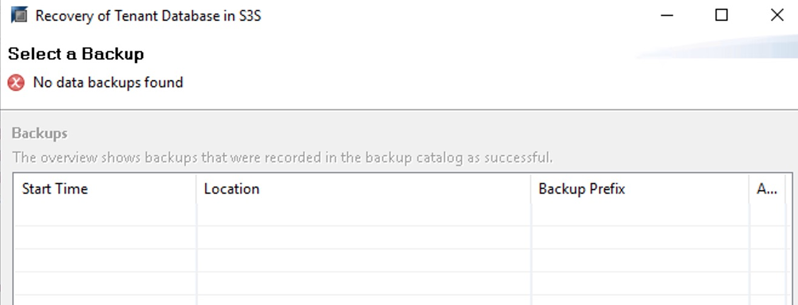
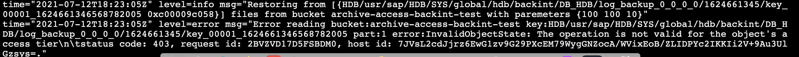

# Troubleshoot AWS Backint Agent for SAP HANA

The following documentation can help you troubleshoot problems that you might have with your AWS Backint Agent for SAP HANA installation or backups.

###### Topics

- [Agent logs](#aws-backint-agent-troubleshooting-agent-logs "#aws-backint-agent-troubleshooting-agent-logs")
- [Installation](#aws-backint-agent-troubleshooting-installation "#aws-backint-agent-troubleshooting-installation")
- [Backup and recovery](#aws-backint-agent-troubleshooting-backup-recovery "#aws-backint-agent-troubleshooting-backup-recovery")
- [Backup deletion](#aws-backint-agent-troubleshooting-deletion "#aws-backint-agent-troubleshooting-deletion")

## Agent logs

To find logs to help you troubleshoot errors and failures, check the following locations.

**Agent logs**

```
{INSTALLATION DIRECTORY}/aws-backint-agent/aws-backint-agent.log
```

**System db backup/recovery logs**

```
/usr/sap/<SID>/HDB<Instance No>/<hostname>/trace/backup.log
/usr/sap/<SID>/HDB<Instance No>/<hostname>/trace/backint.log
```

**Tenant db backup/recovery logs**

```
/usr/sap/<SID>/HDB<Instance No>/<hostname>/trace/DB_<TENANT>/backup.log
/usr/sap/<SID>/HDB<Instance No>/<hostname>/trace/DB_<TENANT>/backint.log
```

## Installation

**Problem: Error returned when installing AWS Backint agent.**

Error returned:

```
SyntaxError: Non-UTF-8 code starting with '\xf3' in file install-aws-backint-agent on line 1, but no encoding declared; see http://python.org/dev/peps/pep-0263/ for details
```

- **Root Cause**: Only Python version 3 is installed on the user environment.
- **Resolution**: Run the following commands to install Python version 2 and create a symbolic link to `usr/bin/python`.

```
yum install -y python2
```

```
ln -s /usr/bin/python2.7 /usr/bin/python
```

**Problem: Unable to view the instance listed for installation with the SSM document.**

- **Root Causes**:
  1.  The SSM Agent is not installed on the instance.
  2.  If the SSM Agent is installed, either the instance is not running or the SSM Agent on the instance is not running.
  3.  The SSM Agent installed on the instance is a version older than 2.3.274.0.

- **Resolution**: Follow the steps listed at [Practice Installing or Updating SSM Agent on an Instance](../../../systems-manager/latest/userguide/getting-started-agent.md "../../../systems-manager/latest/userguide/getting-started-agent.md"). You can verify whether the SSM Agent is running with the following command.

```
sudo systemctl status amazon-ssm-agent
```

**Problem: The following error is returned when you use the SSM installation document.**

`failed to download manifest - failed to retrieve package document description: InvalidDocument: Document with name AWSBackintAgent with version x does not exist.`

- **Root Cause**: An unsupported version of AWS Backint agent was entered.
- **Resolution**: See the version history for AWS Backint agent. For more information, see [Version history for AWS Backint agent](aws-backint-agent-version-history.md "aws-backint-agent-version-history.md").

## Backup and recovery

**Problem: `AccessDenied` appears in agent logs.**

- **Root Causes**:
  1.  The IAM role for the EC2 instance does not have the correct permissions to access the S3 bucket.
  2.  The agent configuration file does not have the `S3BucketOwnerAccountID` in double quotes. The `S3BucketOwnerAccountID` is the 12-digit AWS Account ID.
  3.  The S3 bucket is not owned by the provided account for `S3BucketOwnerAccountID`.
  4.  The S3 bucket provided for the `S3BucketOwnerAccountID` was created before May 2019.

- **Resolution**: Verify the [prerequisite steps](aws-backint-agent-s3-prerequisites.md "aws-backint-agent-s3-prerequisites.md") for installing the AWS Backint agent.

**Problem: Backup or recovery failed due to S3 connectivity**

- **Root Cause**: The IAM role attached to the instance does not have the correct permissions to access the S3 bucket.
- **Resolution**: Verify the [prerequisite steps](aws-backint-agent-s3-prerequisites.md "aws-backint-agent-s3-prerequisites.md") for installing the AWS Backint agent.

**Problem: Agent logs display `Backint cannot execute hdbbackint` or `No such file or directory`.**

- **Root Causes**:
  1.  If you are installing the agent manually, the creation of a symlink for the agent executable did not succeed.
  2.  If you are using the SSM agent, step 2 of the agent failed while creating symlinks. You can verify this by viewing the RunCommand implementation details.

- **Resolution**: Verify that you have correctly followed the [installation steps](aws-backint-agent-s3-installing-configuring.md "aws-backint-agent-s3-installing-configuring.md") in this document.

**Problem: The following error is displayed when initiating a backup from the SAP HANA console:**

`Could not start backup for system <SID> DBC: [447]: backup could not be completed: [110091] Invalid path selection for data backup using backint: /usr/sap/<SID>/SYS/global/hdb/backint/COMPLETE_DATA_BACKUP must start with /usr/sap/<SID>/SYS/global/hdb/backint/DB_<TENANT>`

- **Root Cause**: When adding your SAP HANA system to SAP HANA Studio, you chose the single container mode instead of the multiple container mode.
- **Resolution**: Add the SAP HANA system to SAP HANA Studio and select multiple container mode, and then try to initiate your backup again. For more details, see [Invalid path selection for data backup using backint](https://me.sap.com/notes/2803753 "https://me.sap.com/notes/2803753") (portal access required).

**Problem: Your backup fails and the following error appears in `aws-backint-agent.log`:**

`Error creating uploadId: AuthorizationHeaderMalformed: The authorization header is malformed; the region '<region id>' is wrong; expecting '<region id>'`

- **Root Cause**: You specified an incorrect Region ID for the `AwsRegion` parameter in the `aws-backint-agent-config.yaml` configuration file.
- **Resolution**: Specify the AWS Region of your Amazon S3 bucket and initiate the backup again. You can find the Region in which your Amazon S3 bucket is created from the Amazon S3 console.

**Problem: Any AWS Backint agent operation fails with one of the following errors, which appear in the `aws-backint-agent.log`:**

`Error creating upload id for bucket:<mys3bucket>`

or

`NoCredentialProviders: no valid providers in chain.`

- **Potential Root Cause**: No IAM role is attached to your Amazon EC2 instance.
- **Resolution**: AWS Backint agent requires an attached IAM role to your EC2 instance to access AWS resources for backup and restore operations. Attach an IAM role to your EC2 instance and attempt the operation again. For more information, see the [prerequisites](aws-backint-agent-s3-prerequisites.md "aws-backint-agent-s3-prerequisites.md") for installing AWS Backint agent.
- **Potential Root Cause**: Use of proxy for HANA instance on which agent is run causes agent failure.
- **Resolution**: When using a proxy for the HANA instance on which the agent is run, do not use a proxy for the instance metadata call, otherwise the call hangs. Instance metadata information can not be obtained via proxy, so it must be excluded. Update the launcher script at `{INSTALLATION DIRECTORY}/aws-backint-agent-launcher.sh` to designate `169.254.169.254` as a `no_proxy` host.

```
# cat aws-backint-agent-launcher.sh
#!/bin/bash
export https_proxy=<PROXY_ADDRESS>:<PROXY_PORT>
export HTTP_PROXY=<PROXY_ADDRESS>:<PROXY_PORT>
export no_proxy=169.254.169.254
export NO_PROXY=169.254.169.254
/hana/shared/aws-backint-agent/aws-backint-agent "$@"
```

For more information about using a proxy address in your SAP HANA environment, see [Use a proxy address with AWS Backint agent](aws-backint-agent-s3-installing-configuring.md#aws-backint-agent-sap-hana-proxy "aws-backint-agent-s3-installing-configuring.md#aws-backint-agent-sap-hana-proxy").

**Problem: When you initiate a backup or restore, you get the following error in SAP HANA Studio or SAP HANA Cockpit:**

`backup could not be completed, Backint cannot execute /usr/sap/<SID>/SYS/global/hdb/opt/hdbbackint, Permission denied (13)`

- **Root Cause**: The AWS Backint agent binary or launcher script doesn’t have the execute permission at the operating system level.
- **Resolution**: Set the execute permission for AWS Backint agent binary `aws-backint-agent` and for the launcher script `aws-backint-agent-launcher.sh` in the installation directory (for example, `/hana/shared/aws-backint-agent/`).

**Problem: My backup is running too slowly and is taking a longer time to complete.**

- **Root Cause**: The performance of backup and restore depends on many factors, such as the type of EC2 instance used, the EBS volumes, and the number of SAP HANA channels. If your database size is less than 128 GB, SAP HANA defaults to a single channel, or your SAP HANA parameter `parallel_data_backup_backint_channels` is set to 1.
- **Resolution**: The speed of your database backup depends on how much storage throughput is available to your SAP HANA data volumes (/hana/data). Total storage throughput available for SAP HANA data volumes depends on your Amazon EBS storage type and the number of volumes used for striping. For best performance, follow the [storage configuration](hana-ops-storage-config.md "hana-ops-storage-config.md") best practices. You can switch your Amazon EBS volumes associated with SAP HANA data filesystem to `io1`, `io2` or `gp3` volume type. Additionally, if your database size is greater than 128 GB, you can improve your backup performance by adjusting the number of parallel backup channels. Increase the value of `parallel_data_backup_backint_channels` and try to initiate your backup again. We recommend that you take the resource contention with normal system operation performance into consideration when you try to tune the performance of your backup.

**Problem: My backup and restore fails with one of the following errors:**

1. `Backint exited with exit code 1 instead of 0. console output: Crashed during fetch and conversion read/write tcp 10.0.2.83:56192→52.216.88.123:443: use of closed network connection`
2. `Backint exited with exit code 1 instead of 0. console output: Crashed during fetch and conversion caused by: read tcp 10.0.2.83:54890→52.216.130.243:443: read: connection reset by peer`
   - **Root Cause**: The connection between AWS Backint agent and S3 fails due to high throughput.
   - **Resolution**: Use the following steps to troubleshoot this issue.

3. Update AWS Backint agent version to 2.0.4.768 or higher. These versions have improved resiliency to S3 connection timeouts.
   - Once the agent is updated, ensure that SAP HANA picks up the latest version of the agent. Run the following command to verify the version of the agent.

   ```
   /usr/sap/<SID>/SYS/global/hdb/opt/hdbbackint -v
   ```

   For more information, see {https---docs-aws-amazon-com-sap-latest-sap-hana-aws-backint-agent-s3-installing-configuring-html-aws-backint-agent-latest-version}[Get the currently installed AWS Backint agent version].

4. Use these steps if the issue persists – lower the following backup and restore parameters.
   - **Backup**
     - `UploadConcurrency`
     - `UploadChannelSize`

   - **Restore**
     - `MaximumConcurrentFilesForRestore`
     - `DownloadConcurrency`

_These values reduce concurrency and parallelism used by AWS Backint agent to achieve high performance during backup and restore. See [Modify AWS Backint agent configuration parameters](aws-backint-agent-s3-installing-configuring.md#aws-backint-agent-latest-version "aws-backint-agent-s3-installing-configuring.md#aws-backint-agent-latest-version") for the default values of the preceding parameters._ 5. Review network setup and configuration. 6. Perform trace route to see if Amazon S3 traffic goes through firewall package scanners or any other software that could significantly increase network latency.

**Problem: When you set the `S3ShortenBackupDestinationEnabled = ‘true’` parameter in the `aws-backint-agent-config.yaml`, a ‘No data backups found’ error is displayed when processing a database recovery.**



- **Root Cause**: AWS Backint agent searches for the logs and data backups only in the Amazon S3 path that’s provided in the configuration file. Because the `S3ShortenBackupDestinationEnabled` parameter changes the Amazon S3 folder, it cannot find the backup.
- **Resolution**: You can either change the `S3ShortenBackupDestinationEnabled` parameter to `false` and run the restore, or you can move the previous backups and the SAP HANA backup catalog to the new S3 location. For more details, see [Configure AWS Backint agent to use shorter Amazon S3 paths](aws-backint-agent-s3-installing-configuring.md#configure-aws-backint-agent-to-use-shorter-amazon-s3-paths "aws-backint-agent-s3-installing-configuring.md#configure-aws-backint-agent-to-use-shorter-amazon-s3-paths").

**Problem: When processing a database recovery, a 'No data backups found' error is displayed and the agent log shows, 'The operation is not valid for the objects' access tier'.**



- **Root Cause**: With the **S3StorageClass = "INTELLIGENT_TIERING"** parameter set in the `aws-backint-agent-config.yaml`, the objects have moved to archival storage tiers. AWS Backint agent does not support recovery from archival tiers.
- **Resolution**: You must first [restore the archived S3 objects](../../../AmazonS3/latest/userguide/restoring-objects.md "../../../AmazonS3/latest/userguide/restoring-objects.md") to move them in the access tier. This can take from a few minutes to 12 hours, depending on the archival tier and restore option that is selected. After the S3 restore is complete, you can initiate recovery for the HANA database.

**Problem: Backup request initiated by IAM doesn’t have access to your Amazon S3 bucket.**

Error returned:

```
Error Fetching Bucket: Access Denied
```

- **Root Cause**: Credentials for internal tasks are configured in the `–0—/aws` folder which is picked by default instead of the configured IAM role for initiating a backup request.
- **Resolution**: When you initialize a new service client without providing any credential arguments, the SDK uses the default credential provider chain to find AWS credentials. The SDK uses the first provider in the chain that returns credentials without an error. The default provider chain looks for credentials in the following order:

      1. Environment variables
      2. Shared credentials file
      3. If your application uses an Amazon ECS task definition or RunTask API operation, IAM role for tasks
      4. If your application is running on an Amazon EC2 instance, IAM role for Amazon EC2

  For more information, see [Configuring the AWS SDK for Go](../../../sdk-for-go/v1/developer-guide/configuring-sdk.md "../../../sdk-for-go/v1/developer-guide/configuring-sdk.md").

**Problem: "/bin/sh: error importing function definition for `which`" when performing backup and restore with AWS Backint agent.**

"/bin/sh: error importing function definition for `which`" error may occur when performing backup and restore with AWS Backint agent. This error occurs when ` BASH_FUNC_which%%` environment variable has a multi-line value that is not supported by some older SAP scripts.

**Affected environment**

- Red Hat Enterprise Linux 8.5 and later
- Systems with "which" package 2.21-18 or later
  - **Root cause**: The `which-2.21-18.el8.x86_64 RPM` package sets the `BASH_FUNC_which%%` variable with a multi-line function definition in `/etc/profile.d/which2.{csh,sh}` files. Some older SAP scripts are unable to parse this correctly.
  - **Resolution**: Check if `BASH_FUNC_which%%` is running using the following command.

  ```
  $ env | grep -A 2 BASH_FUNC_which
  ```

  Based on your business requirements, use one of the following resolutions.

      1. *Temporary*: Run `unset -f which` to unset the function. This step must be repeated for each new session.
      2. *User-level*: Add `unset -f which` to the user’s `–0—bashrc` file. Verify if this is a scalable resolution for you.
      3. *System-level*: Move `/etc/profile.d/which2.{sh,csh}` files to a backup location or create `/etc/profile.d/zzz_which2.{sh,csh}` using the following steps.


      `sh: echo "unset -f which"` > `/etc/profile.d/zzz_which2.sh csh: echo "unalias which"` > `/etc/profile.d/zzz_which2.csh`.


      The system-level fix is a persistent solution that survives package updates to the "which" package. We recommended this resolution.

## Backup deletion

**Problem: You deleted your SAP HANA backup from the SAP HANA backup console (SAP HANA Studio or SAP HANA Cockpit) but the deleted backup files still appear in the Amazon S3 folder.**

- **Root Cause**: AWS Backint agent couldn’t delete the associated backup files from the Amazon S3 bucket due to a permission issue.
- **Resolution**: AWS Backint agent requires `s3:DeleteObject` permission to delete the backup files from your target Amazon S3 bucket when you delete the backup from the SAP HANA backup console. Ensure that the IAM profile attached to your EC2 instance has `s3:DeleteObject` permission. For backups that are already deleted from SAP HANA, you can manually delete the associated files from the Amazon S3 bucket. We recommend that you take additional precaution before manually deleting any backup files. Manually deleting the wrong backup file could impact your ability to recover your SAP HANA system in the future.
