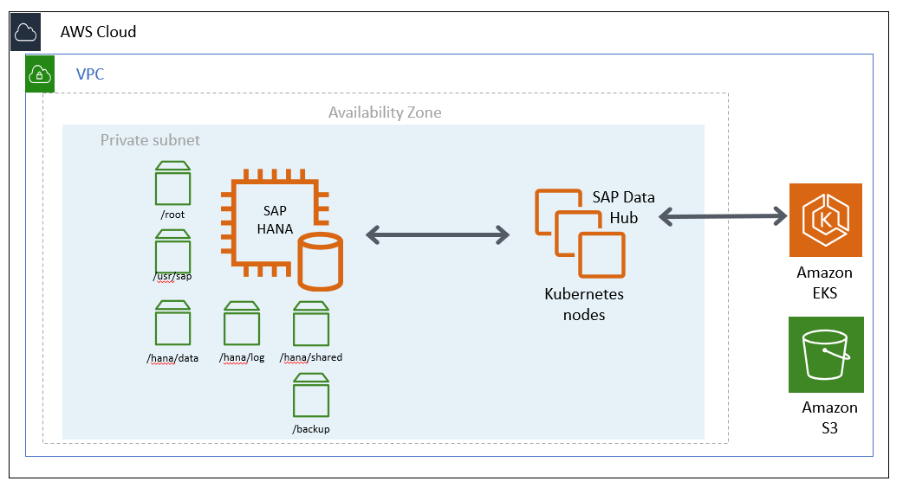
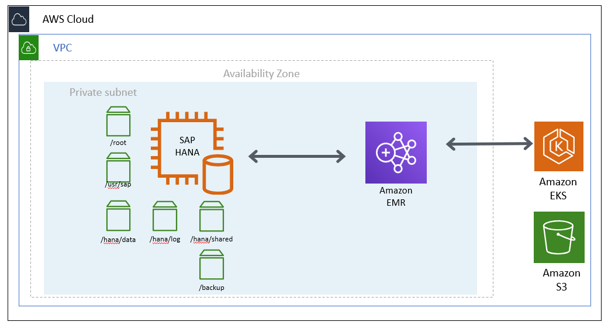
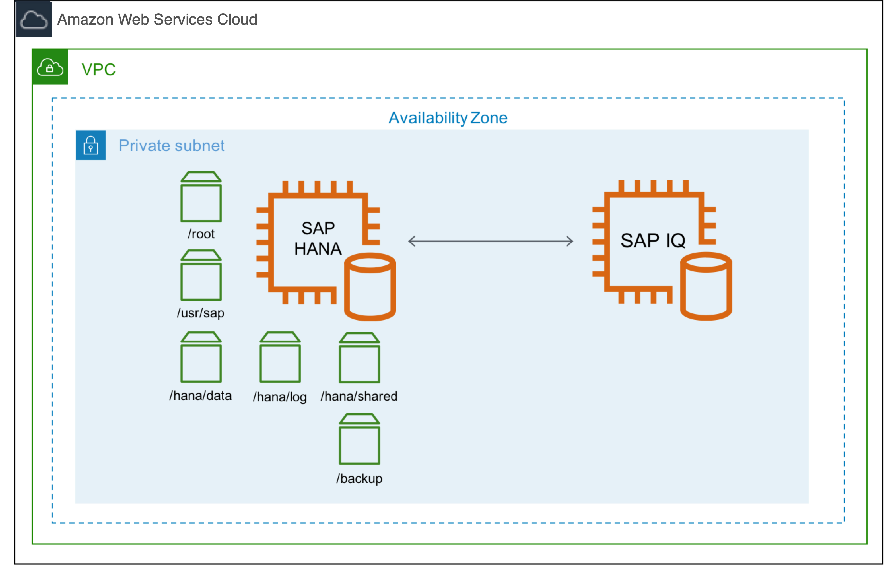
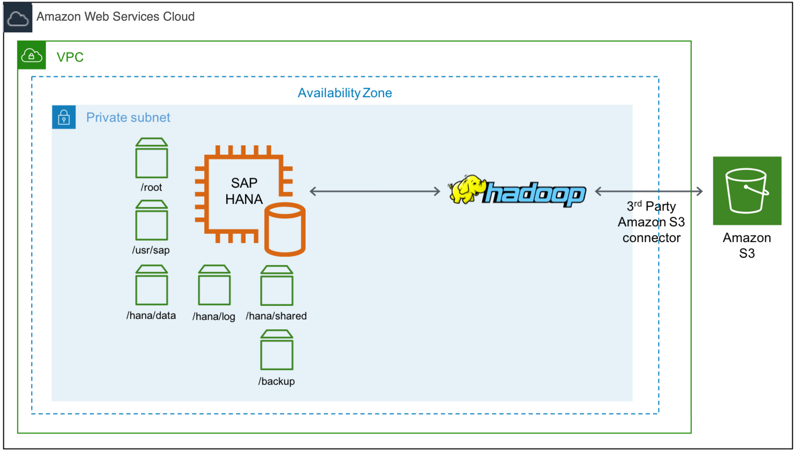
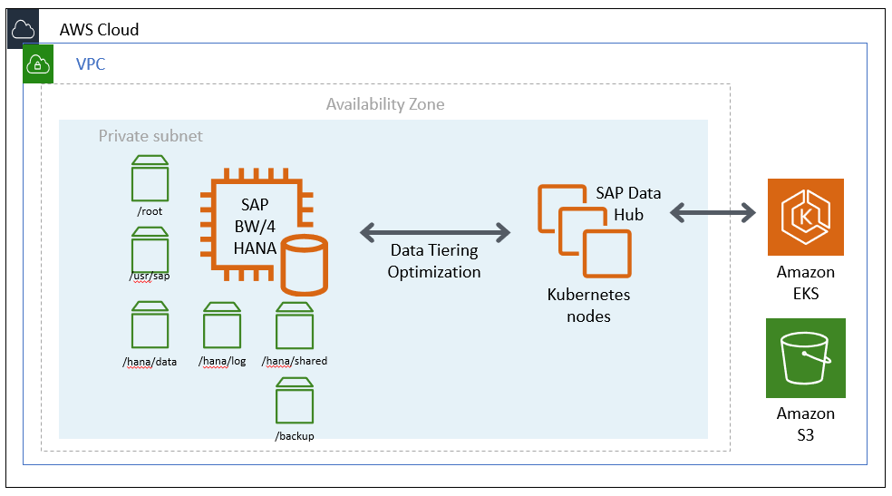
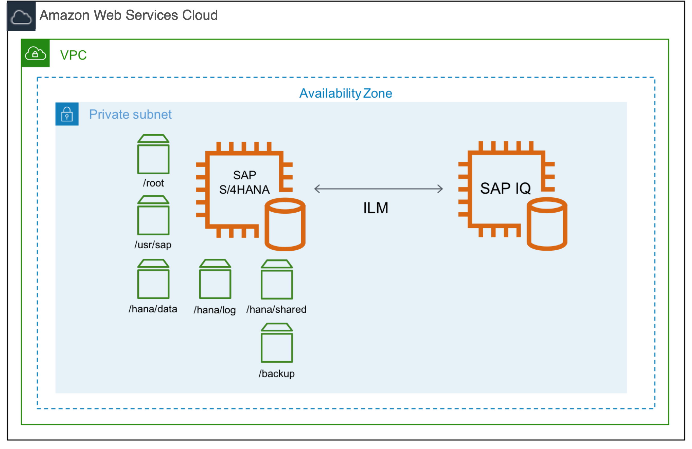
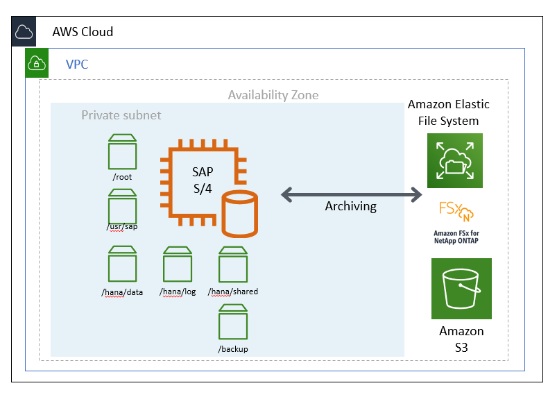
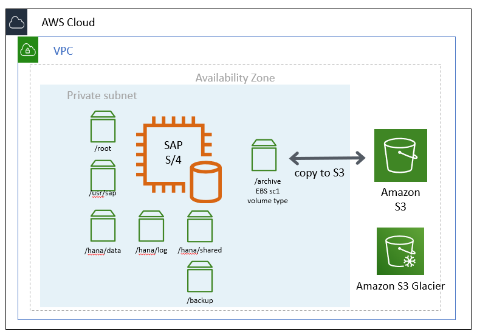

# Cold Data Tiering Options

The following sections discuss cold data tiering options on AWS.

The Data Lifecycle Manager (DLM) tool, which is part of SAP HANA Data Warehousing Foundation, can be used to move data from SAP HANA memory to a cold storage location. For your native SAP HANA use case, you have two options.

[[-toc13564132]]**DLM with SAP Data Hub**

SAP Data Hub is a data orchestration and management solution running on Kubernetes. With this option, you can use the [SAP Data Hub](https://help.sap.com/viewer/product/SAP_DATA_HUB/2.7.latest/en-US?task=discover_task "https://help.sap.com/viewer/product/SAP_DATA_HUB/2.7.latest/en-US?task=discover_task") product to move data in and out of SAP HANA into your cold store location. On AWS, you are able to use native AWS services such as [Amazon Simple Storage Service](https://aws.amazon.com/s3/ "https://aws.amazon.com/s3/") to store your cold data. Once your data is in Amazon S3, you can use Amazon S3 features such as [S3 Intelligent-Tiering](https://aws.amazon.com/s3/storage-classes/ "https://aws.amazon.com/s3/storage-classes/") and [Amazon S3 Lifecycle](../../../AmazonS3/latest/dev/lifecycle-transition-general-considerations.md "../../../AmazonS3/latest/dev/lifecycle-transition-general-considerations.md") to optimize your costs. Once you have determined that you no longer need to access your cold data from SAP HANA, you can archive your data in [Amazon S3 Glacier](../../../amazonglacier/latest/dev/introduction.md "../../../amazonglacier/latest/dev/introduction.md") for long-term retention.

###### Note

SAP Data Hub is now released as managed service on SAP Cloud Platform with the name SAP Data Intelligence.

**Figure 4: SAP Data Hub on Amazon EKS for cold tier**

## DLM with SAP HANA Spark Controller

SAP HANA Spark controller enables SAP HANA to access the data in Hadoop through an SQL interface. With this option, you can use the SAP HANA Spark Controller to allow SAP HANA to access cold data through the Spark SQL SDA adapter. On AWS, you can use an AWS native service like [Amazon EMR](https://aws.amazon.com/emr "https://aws.amazon.com/emr") for the Hadoop cold tier storage location. To use Amazon EMR with SAP HANA, see [DLM on Amazon Elastic Map Reduce](https://help.sap.com/viewer/6437091bdb1145d9be06aeec79f06363/2.0.3.5/en-US/7ee592019c22455e9f3a137a35b51021.html "https://help.sap.com/viewer/6437091bdb1145d9be06aeec79f06363/2.0.3.5/en-US/7ee592019c22455e9f3a137a35b51021.html") documentation from SAP. For more information about the Spark controller, see [Using SAP HANA Spark Controller](https://help.sap.com/docs/SAP_HANA_PLATFORM/6b94445c94ae495c83a19646e7c3fd56/1392da63884b40fc932586f582d9ef90.html?version=2.0.00 "https://help.sap.com/docs/SAP_HANA_PLATFORM/6b94445c94ae495c83a19646e7c3fd56/1392da63884b40fc932586f582d9ef90.html?version=2.0.00").

**Figure 5: SAP HANA with Amazon EMR for cold tier**

## Cold Tier Options for SAP BW

For the SAP Business Warehouse (BW) on HANA or SAP BW/4 HANA use cases, you have additional options for cold tier storage.

## SAP BW Near Line Storage (NLS) with SAP IQ

With this option, you can use SAP BW [Near Line Storage](https://help.sap.com/viewer/dd104a87ab9249968e6279e61378ff66/11.0.7/en-US/4a2c7958e460351ce10000000a42189b.html?q=Near-Line%20Storage "https://help.sap.com/viewer/dd104a87ab9249968e6279e61378ff66/11.0.7/en-US/4a2c7958e460351ce10000000a42189b.html?q=Near-Line%20Storage") (NLS) with SAP IQ or you can use [Data Tiering Optimization](https://help.sap.com/viewer/107a6e8a38b74ede94c833ca3b7b6f51/2.0.0/en-US/9d76dae79ab047099ee81b50208d5945.html "https://help.sap.com/viewer/107a6e8a38b74ede94c833ca3b7b6f51/2.0.0/en-US/9d76dae79ab047099ee81b50208d5945.html") (DTO) with SAP IQ to store your cold data. On AWS, you can run your SAP IQ server on [Amazon Elastic Compute Cloud (Amazon EC2)](https://aws.amazon.com/ec2 "https://aws.amazon.com/ec2") instances for the cold tier storage.

**Figure 6: SAP BW NLS with SAP IQ for cold tier**

## SAP BW NLS with Hadoop

With this option, you can use SAP BW NLS with [Apache Hadoop](https://hadoop.apache.org/ "https://hadoop.apache.org/") instead of SAP IQ, with this option you can persist your Hadoop data in Amazon S3 using a [Hadoop third-party connector](https://docs.hortonworks.com/HDPDocuments/HDP3/HDP-3.1.0/bk_cloud-data-access/content/s3-third-party.html "https://docs.hortonworks.com/HDPDocuments/HDP3/HDP-3.1.0/bk_cloud-data-access/content/s3-third-party.html") for Amazon S3. See [Hadoop as a Near-Line Storage Solution](https://help.sap.com/viewer/107a6e8a38b74ede94c833ca3b7b6f51/2.0.0/en-US/d935c9e9866b413693c72f7841b3b459.html "https://help.sap.com/viewer/107a6e8a38b74ede94c833ca3b7b6f51/2.0.0/en-US/d935c9e9866b413693c72f7841b3b459.html") documentation from SAP, [SAP Note 2363218 – Hadoop NLS: Information, Recommendations and Limitations](https://launchpad.support.sap.com/#/notes/2363218 "https://launchpad.support.sap.com/#/notes/2363218"), and [Cloud Data Access](https://docs.hortonworks.com/HDPDocuments/HDP2/HDP-2.6.5/bk_cloud-data-access/content/intro.html "https://docs.hortonworks.com/HDPDocuments/HDP2/HDP-2.6.5/bk_cloud-data-access/content/intro.html") documentation for details.

**Figure 7: SAP BW NLS with Hadoop for cold tier**

## SAP BW/4HANA DTO with Data Hub

This option is similar to SAP Data Hub with SAP HANA. You can use DTO with SAP Data Hub to store your cold data in Amazon S3. This option only applies if you use SAP BW/4HANA.

**Figure 8: SAP Data Hub on Amazon EKS with BW4/HANA**

## Cold Tier Options for SAP S/4HANA or Suite on HANA

For S/4HANA or SOH, you can use SAP Information Life Cycle Management (ILM) for the cold data tiering. You have few options with ILM for cold tier. See [ILM Store](https://help.sap.com/viewer/ed0caf935e73410fa09cfa42e6ead8d3/7.5.14/en-US/0ae375c2a84c421f802776dce5530402.html "https://help.sap.com/viewer/ed0caf935e73410fa09cfa42e6ead8d3/7.5.14/en-US/0ae375c2a84c421f802776dce5530402.html") documentation from SAP for details.

## SAP ILM with SAP IQ

With this option, you can use ILM with SAP IQ. Similar to the SAP BW NLS with SAP IQ scenario, you can run your SAP IQ server on AWS Amazon EC2 instances to store cold data.

**Figure 9: SAP ILM with SAP IQ for cold tier**

## SAP Archiving

With this option, you can use ILM or your standard data archiving process. You can use [Amazon Elastic File System (Amazon EFS)](https://aws.amazon.com/efs/ "https://aws.amazon.com/efs/") and Amazon FSx for NetApp ONTAP to store your archive file in a highly available, scalable and durable manner. Amazon EFS and FSx for ONTAP can be mounted as your archive file system and you can archive your data from SAP to this file system through [SAP transaction code SARA](https://help.sap.com/viewer/f0944a4717b5464f8d2343f9a44ff65b/7.4.19/en-US/4d8c7894910b154ee10000000a42189e.html "https://help.sap.com/viewer/f0944a4717b5464f8d2343f9a44ff65b/7.4.19/en-US/4d8c7894910b154ee10000000a42189e.html").

**Figure 10: SAP archiving with Amazon EFS for cold tier**

For archiving, another option is to use the [Amazon Elastic Block Store (Amazon EBS) sc1](../../../AWSEC2/latest/UserGuide/EBSVolumeTypes.md "../../../AWSEC2/latest/UserGuide/EBSVolumeTypes.md") volume type as the underlying storage type for your archive file system. Amazon EBS sc1 volumes are inexpensive block storage and are designed for less frequently accessed workloads like data archiving. To increase durability and availability of your archived data, we recommend that you copy the data to Amazon S3 for backup and Amazon S3 Glacier for long term retention.

**Figure 11: SAP archiving with Amazon EBS for cold tier**

