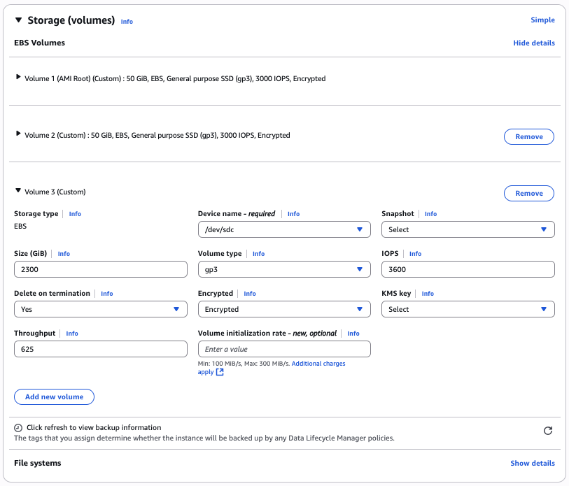

# Deploy SAP HANA Workloads with Amazon EBS Volumes

This topic explains how to assign EBS Volumes when launching an Amazon EC2 Instance.
Choose one of the following methods.

Console

1. Log in to the console with appropriate permissions and ensure that you have the right Region selected.
2. Choose **Services**, and then choose **EC2** (under **Compute**).
3. Choose **Launch Instance**.
4. In Section **Application and OS Images (Amazon Machine Images)**:
   - Choose a recently used AMI or **My AMIs** to search for your BYOS or custom AMI ID.
   - Choose **Browse more AMIs** to search for more AMIs from AWS, Marketplace and the Community.

5. In Section **Choose an Instance Type** page, select the instance type that you identified when [planning the deployment](planning-the-deployment.md#compute "planning-the-deployment.md#compute")
6. In Section **Key Pair (login)** . Select an existing key pair if you have one. Otherwise, create a new key pair.
7. In Section **Network Settings**
   - Select the VPC ID and subnet for the network.
   - Turn off the **Auto-assign Public IP** option.
   - Select **Security Groups**
     - Choose **Select an existing security group** and select a security group, if you have one, to attach to your instance. Otherwise, choose **Create a new security group** and configure the **Type**, **Protocol**, **Port Range**, and the **Source IP address** from where you want to allow traffic to your SAP HANA instance. Refer to [Security groups in AWS Launch Wizard for SAP](../../../launchwizard/latest/userguide/launch-wizard-sap-security-groups.md "../../../launchwizard/latest/userguide/launch-wizard-sap-security-groups.md") for a list of ports that we recommend. You can change the port as needed to meet your security requirements.

8. In Section **Configure Storage**
   - Choose **Advanced** to see extended details, and **Add new volume** to provision volumes for SAP binaries, and SAP HANA data, log, shared and optionally backup. Ensure that you follow the guidance for size, IOPS and Throughput in [Calculate Requirements](hana-storage-config-ebs.md "hana-storage-config-ebs.md") or [Storage Reference](hana-storage-config-reference-layout.md "hana-storage-config-reference-layout.md").
   - If you are planning to deploy scale-out workloads, you can optionally include EFS or FSX **filesystems** for SAP HANA shared and backup volumes.

   

   **Figure 1: SAP HANA Storage Configuration with the console**

9. In Section **Advanced Details**, review and modify the options to suit your workload.
10. Select **Launch Instance**
11. Your instance should be launching now with the selected configuration. After the instance is launched, you can proceed with the operating system and storage configuration steps.

AWS CLI

1. **Prepare Storage Configuration for SAP HANA**

Use the editor of your choice to create a .json file that contains block device mapping details similar to the following example, and save your file in a temporary directory. The example shows the block device mapping details for the x2iedn.24xlarge instance with gp3 volumes for HANA data and log. Change the details depending on instance and storage type that you intend to use for your deployment.

```
[
{"DeviceName":"/dev/sda1","Ebs":{"VolumeSize":50,"VolumeType":"gp3","Iops":3000,"Throughput":125,"Encrypted":true,"DeleteOnTermination":true}},
{"DeviceName":"/dev/sdb","Ebs":{"VolumeSize":50,"VolumeType":"gp3","Iops":3000,"Throughput":125,"Encrypted":true,"DeleteOnTermination":true}},
{"DeviceName":"/dev/sdc","Ebs":{"VolumeSize":2300,"VolumeType":"gp3","Iops":3600,"Throughput":625,"Encrypted":true,"DeleteOnTermination":true}},
{"DeviceName":"/dev/sdd","Ebs":{"VolumeSize":2300,"VolumeType":"gp3","Iops":3600,"Throughput":625,"Encrypted":true,"DeleteOnTermination":true}},
{"DeviceName":"/dev/sde","Ebs":{"VolumeSize":500,"VolumeType":"gp3","Iops":3000,"Throughput":300,"Encrypted":true,"DeleteOnTermination":true}},
{"DeviceName":"/dev/sdf","Ebs":{"VolumeSize":1024,"VolumeType":"gp3","Iops":3000,"Throughput":125,"Encrypted":true,"DeleteOnTermination":true}}
]
```

**Notes**

    * The initial Device name for root should match the AMI you are trying to assign it to. Query this with


    ```
    $ aws ec2 describe-images --image-ids ami-0123456789abcdef0 --query 'Images[].RootDeviceName' --output text
    ```
    * You may choose to set `DeleteOnTermination` flag to false so that Amazon EBS volumes are not deleted when you terminate your Amazon EC2 instance. This helps preserve your data from accidental termination of your Amazon EC2 instance. When you terminate the instance, you need to manually delete the Amazon EBS volumes that are associated with the terminated instance to stop incurring storage cost.
    * If you plan to deploy scale-out workloads, you can use Amazon EFS and Network File System (NFS) to mount the SAP HANA shared and backup volumes to your coordinator and subordinate nodes after deployment.

2. **Launch the Amazon EC2 instance**

Use AWS CLI to launch the Amazon EC2 instance for SAP HANA, including Amazon EBS storage, in the VPC in your target AWS Region by using the information you gathered during the preparation steps; for example:

```
aws ec2 run-instances \
  --image-id ami-0123456789abcdef0 \
  --instance-type x2iedn.24xlarge \
  --count 1 \
  --region us-west-2 \
  --key-name my_key \
  --security-group-ids sg-0123456789abcdef0 \
  --subnet-id subnet-0123456789abcdef0 \
  --block-device-mappings file:///tmp/ebs_hana.json \
  --tag-specifications \
      'ResourceType=instance,Tags=[{Key=Name,Value=PRD-HANA01},{Key=Environment,Value=Production},{Key=SID,Value=PRD},{Key=ApplicationComponent,Value=HANA}]' \
      'ResourceType=volume,Tags=[{Key=Environment,Value=Production},{Key=SID,Value=PRD}]' \
  --ebs-optimized \
  --metadata-options "HttpTokens=required,HttpEndpoint=enabled"
```

**Notes**

    * This is a sample command only, with a focus on block-device-mappings. Review instance requirements seperately. It can be helpful to explore the options in the Console and then generate and adjust the code to replicate the setup for future deployments.
    * `iam-instance-profile` and `user-data` flags can be used to ensure connectivity via Systems Manager.
