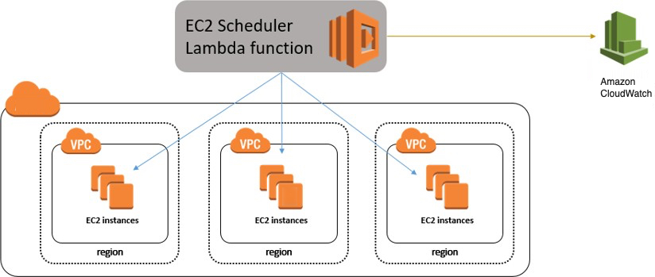
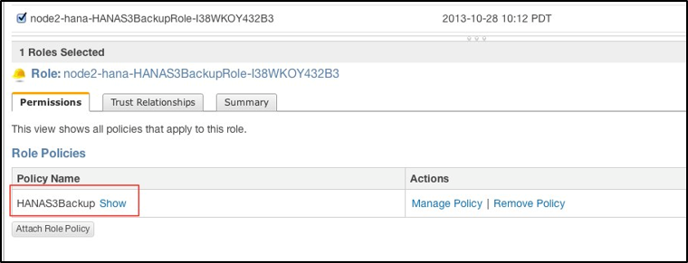
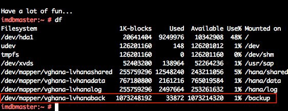
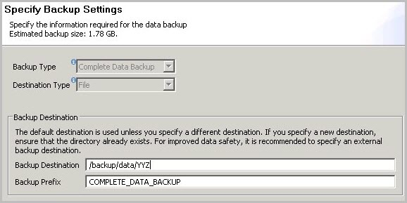
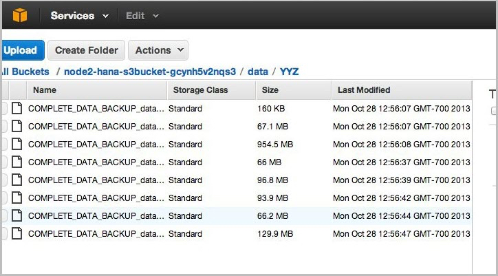
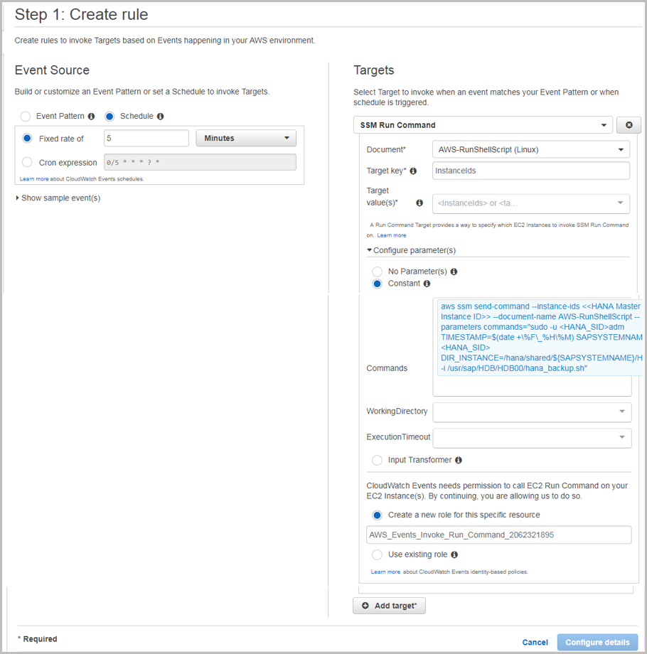
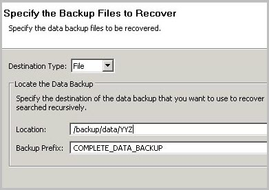
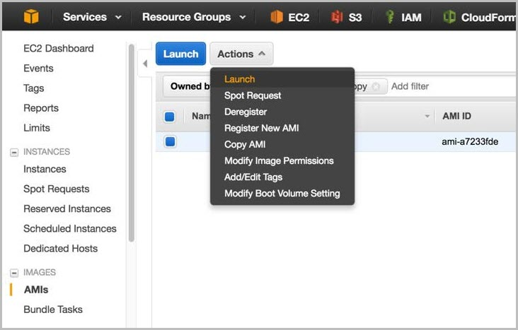

# Administration

This section provides guidance on common administrative tasks required to operate an SAP HANA system, including information about starting, stopping, and cloning systems.

## Starting and Stopping EC2 Instances Running SAP HANA Hosts

At any time, you can stop one or multiple SAP HANA hosts. Before stopping the EC2 instance of an SAP HANA host, first stop SAP HANA on that instance.

When you resume the instance, it will automatically start with the same IP address, network, and storage configuration as before. You also have the option of using the [EC2 Scheduler](https://aws.amazon.com/answers/infrastructure-management/ec2-scheduler/ "https://aws.amazon.com/answers/infrastructure-management/ec2-scheduler/") to schedule starts and stops of your EC2 instances. The EC2 Scheduler relies on the native shutdown and start-up mechanisms of the operating system. These native mechanisms will invoke the orderly shutdown and startup of your SAP HANA instance. Here is an architectural diagram of how the EC2 Scheduler works:

**Figure 1: EC2 Scheduler**



## Tagging SAP Resources on AWS

Tagging your SAP resources on AWS can significantly simplify identification, security, manageability, and billing of those resources. You can tag your resources using the AWS Management Console or by using the `create-tags` functionality of the AWS Command Line Interface (AWS CLI). This table lists some example tag names and tag values:

| ​                 | Tag name                                                             | Tag value |
| ----------------- | -------------------------------------------------------------------- | --------- |
| **Name**          | SAP server’s virtual (host) name                                     |
| **Environment**   | SAP server’s landscape role; for example: SBX, DEV, QAT, STG, PRD.   |
| **Application**   | SAP solution or product; for example: ECC, CRM, BW, PI, SCM, SRM, EP |
| **Owner**         | SAP point of contact                                                 |
| **Service level** | Known uptime and downtime schedule                                   |

After you have tagged your resources, you can apply specific security restrictions such as access control, based on the tag values. Here is an example of such a policy from the [AWS Security blog](https://aws.amazon.com/blogs/security/how-to-automatically-tag-amazon-ec2-resources-in-response-to-api-events/ "https://aws.amazon.com/blogs/security/how-to-automatically-tag-amazon-ec2-resources-in-response-to-api-events/"):

```
    {
   "Version" : "2012-10-17",
   "Statement" : [
      {
         "Sid" : "LaunchEC2Instances", "Effect" : "Allow",
         "Action" : [
            "ec2:Describe*", "ec2:RunInstances"
         ],
         "Resource" : [
            "*"
         ]
      },
      {
         "Sid" : "AllowActionsIfYouAreTheOwner",
         "Effect" : "Allow",
         "Action" : [
            "ec2:StopInstances",
            "ec2:StartInstances",
            "ec2:RebootInstances",
            "ec2:TerminateInstances"
         ],
         "Condition" : {
            "StringEquals" : {
               "ec2:ResourceTag/PrincipalId" : "${aws:userid}"
            }
         },
         "Resource"	: [
            "*"
         ]
      }
   ]
}
```

The AWS Identity and Access Management (IAM) policy allows only specific permissions based on the tag value. In this scenario, the current user ID must match the tag value in order for the user to be granted permissions. For more information on tagging, see the [AWS documentation](../../../AWSEC2/latest/UserGuide/Using_Tags.md "../../../AWSEC2/latest/UserGuide/Using_Tags.md") and [AWS blog](https://aws.amazon.com/blogs/aws/new-aws-resource-tagging-api/ "https://aws.amazon.com/blogs/aws/new-aws-resource-tagging-api/").

## Monitoring

You can use various AWS, SAP, and third-party solutions to monitor your SAP workloads. Here are some of the core AWS monitoring services:

- [Amazon CloudWatch](https://aws.amazon.com/cloudwatch/ "https://aws.amazon.com/cloudwatch/") – CloudWatch is a monitoring service for AWS resources. It’s critical for SAP workloads where it’s used to collect resource utilization logs and to create alarms to automatically react to changes in AWS resources.
- [AWS CloudTrail](https://aws.amazon.com/cloudtrail/ "https://aws.amazon.com/cloudtrail/") – CloudTrail keeps track of all API calls made within your AWS account. It captures key metrics about the API calls and can be useful for automating trail creation for your SAP resources.

Configuring CloudWatch detailed monitoring for SAP resources is mandatory for getting AWS and SAP support. You can use native AWS monitoring services in a complementary fashion with the SAP Solution Manager. You can find third-party monitoring tools in [AWS Marketplace](https://aws.amazon.com/marketplace "https://aws.amazon.com/marketplace").

## Automation

AWS offers multiple options for programmatically scripting your resources to operate or scale them in a predictable and repeatable manner. You can use AWS CloudFormation to automate and operate SAP systems on AWS. Here are some examples for automating your SAP environment on AWS:

|                               |                                                                                                                                                                                                            |                                                                                                                                                                                                                                                                         |
| ----------------------------- | ---------------------------------------------------------------------------------------------------------------------------------------------------------------------------------------------------------- | ----------------------------------------------------------------------------------------------------------------------------------------------------------------------------------------------------------------------------------------------------------------------- |
| **Area**                      | **Activities**                                                                                                                                                                                             | **AWS services**                                                                                                                                                                                                                                                        |
| **Infrastructure deployment** | Provision new SAP environment<br>SAP system cloning                                                                                                                                                        | [AWS CloudFormation](../../../AWSCloudFormation/latest/UserGuide/GettingStarted.md "../../../AWSCloudFormation/latest/UserGuide/GettingStarted.md")<br>[AWS CLI](../../../cli/latest/userguide/cli-chap-welcome.md "../../../cli/latest/userguide/cli-chap-welcome.md") |
| **Capacity management**       | Automate scale-up/scale-out of SAP application servers                                                                                                                                                     | [AWS Lambda](../../../lambda/latest/dg/getting-started.md "../../../lambda/latest/dg/getting-started.md")<br>[AWS CloudFormation](../../../AWSCloudFormation/latest/UserGuide/GettingStarted.md "../../../AWSCloudFormation/latest/UserGuide/GettingStarted.md")        |
| **Operations**                | SAP backup automation (see the [backup](#hana-ops-backup-example "#hana-ops-backup-example")<br>[example](#hana-ops-backup-example "#hana-ops-backup-example"))<br>Performing monitoring and visualization | [Amazon CloudWatch](../../../AmazonCloudWatch/latest/monitoring/WhatIsCloudWatch.md "../../../AmazonCloudWatch/latest/monitoring/WhatIsCloudWatch.md")https://docs.aws.amazon.com/systems-manager/latest/userguide/what-is-systems-manager.html[AWS Systems Manager]    |

## Patching

There are two ways for you to patch your SAP HANA database, with options for minimizing cost and/or downtime. With AWS, you can provision additional servers as needed to minimize downtime for patching in a cost-effective manner. You can also minimize risks by creating on-demand copies of your existing production SAP HANA databases for lifelike production readiness testing.

This table summarizes the tradeoffs of the two patching methods:

| Patching method                      | Benefits                                                                                                                                                                                             | Tradeoff                                                                                                         | Technologies available                                                                                                                                                                                                                                                                                                                                                                                                                                                                                                                                                                                                                                                                                                                                                                                                                                                                                                                                                                                                                                                                                                                                                                                                                                                                                                                                                                                                              |
| ------------------------------------ | ---------------------------------------------------------------------------------------------------------------------------------------------------------------------------------------------------- | ---------------------------------------------------------------------------------------------------------------- | ----------------------------------------------------------------------------------------------------------------------------------------------------------------------------------------------------------------------------------------------------------------------------------------------------------------------------------------------------------------------------------------------------------------------------------------------------------------------------------------------------------------------------------------------------------------------------------------------------------------------------------------------------------------------------------------------------------------------------------------------------------------------------------------------------------------------------------------------------------------------------------------------------------------------------------------------------------------------------------------------------------------------------------------------------------------------------------------------------------------------------------------------------------------------------------------------------------------------------------------------------------------------------------------------------------------------------------------------------------------------------------------------------------------------------------- |
| **Patch an existing server**         | No costs for additional on-demand instances<br>Lowest levels of relative complexity and setup tasks involved                                                                                         | Need to patch the existing operating system and database<br>Longest downtime to the existing server and database | Native OS patching tools [Patch Manager](https://aws.amazon.com/ec2/systems-manager/patch-manager/ "https://aws.amazon.com/ec2/systems-manager/patch-manager/")<br>[Native SAP HANA patching tools](https://help.sap.com/viewer/2c1988d620e04368aa4103bf26f17727/2.0.00/en-US/9731208b85fa4c2fa68c529404ffa75a.html "https://help.sap.com/viewer/2c1988d620e04368aa4103bf26f17727/2.0.00/en-US/9731208b85fa4c2fa68c529404ffa75a.html")                                                                                                                                                                                                                                                                                                                                                                                                                                                                                                                                                                                                                                                                                                                                                                                                                                                                                                                                                                                              |
| **Provision and patch a new server** | Leverage latest AMIs (only database patch is required)<br>Shortest downtime on the existing server and database<br>Option to patch and test the operating system and database separately or together | More costs for additional on-demand instances<br>More complexity and setup tasks involved                        | [Amazon Machine Image (AMI)](../../../AWSEC2/latest/UserGuide/AMIs.md "../../../AWSEC2/latest/UserGuide/AMIs.md")<br>[AWS CLI](../../../cli/latest/userguide/cli-ec2-launch.md "../../../cli/latest/userguide/cli-ec2-launch.md")<br>[AWS CloudFormation](https://aws.amazon.com/cloudformation/ "https://aws.amazon.com/cloudformation/")<br>[SAP HANA System Replication](https://help.sap.com/viewer/6b94445c94ae495c83a19646e7c3fd56/2.0.00/en-US/38ad53e538ad41db9d12d22a6c8f2503.html "https://help.sap.com/viewer/6b94445c94ae495c83a19646e7c3fd56/2.0.00/en-US/38ad53e538ad41db9d12d22a6c8f2503.html")https://help.sap.com/viewer/6b94445c94ae495c83a19646e7c3fd56/2.0.00/en-US/c622d640e47e4c0ebca8cbe74ff9550a.html[SAP HANA System Cloning][SAP HANA backups](https://help.sap.com/viewer/6b94445c94ae495c83a19646e7c3fd56/2.0.00/en-US/ea70213a0e114ec29724e4a10b6bb176.html "https://help.sap.com/viewer/6b94445c94ae495c83a19646e7c3fd56/2.0.00/en-US/ea70213a0e114ec29724e4a10b6bb176.html")<br>SAP Notes:<br>[1984882](https://launchpad.support.sap.com/%23/notes/1984882/E "https://launchpad.support.sap.com/%23/notes/1984882/E")<br>• Using HANA System Replication for Hardware Exchange with minimum/zero downtime<br>[1913302](https://launchpad.support.sap.com/%23/notes/1913302/E "https://launchpad.support.sap.com/%23/notes/1913302/E")<br>• HANA: Suspend DB connections for short maintenance tasks |

The first method (patch an existing server) involves patching the operating system (OS) and database (DB) components of your SAP HANA server. The goal of this method is to minimize any additional server costs and to avoid any tasks needed to set up additional systems or tests. This method may be most appropriate if you have a well-defined patching process and are satisfied with your current downtime and costs. With this method you must use the correct operating system (OS) update process and tools for your Linux distribution. See this [SUSE blog](https://www.suse.com/communities/blog/upgrading-running-demand-instances-public-cloud/ "https://www.suse.com/communities/blog/upgrading-running-demand-instances-public-cloud/") and [Red Hat FAQ](https://aws.amazon.com/partners/redhat/faqs/ "https://aws.amazon.com/partners/redhat/faqs/"), or check each vendor’s documentation for their specific processes and procedures.

In addition to patching tools provided by our Linux partners,AWS offers a [free of charge patching service](https://aws.amazon.com/about-aws/whats-new/2016/12/amazon-ec2-systems-manager-now-offers-patch-management/ "https://aws.amazon.com/about-aws/whats-new/2016/12/amazon-ec2-systems-manager-now-offers-patch-management/") called [Patch Manager](https://aws.amazon.com/ec2/systems-manager/patch-manager/ "https://aws.amazon.com/ec2/systems-manager/patch-manager/"). Patch Manager is an automated tool that helps you simplify your OS patching process. You can scan your EC2 instances for missing patches and automatically install them, select the timing for patch rollouts, control instance reboots, and many other tasks. You can also define auto-approval rules for patches with an added ability to black-list or white-list specific patches, control how the patches are deployed on the target instances (e.g., stop services before applying the patch), and schedule the automatic rollout through maintenance windows.

The second method (provision and patch a new server) involves provisioning a new EC2 instance that will receive a copy of your source system and database. The goal of the method is to minimize downtime, minimize risks (by having production data and executing production-like testing), and have repeatable processes. This method may be most appropriate if you are looking for higher degrees of automation to enable these goals and are comfortable with the trade- offs. This method is more complex and has a many more options to fit your requirements. Certain options are not exclusive and can be used together. For example, your AWS CloudFormation template can include the latest Amazon Machine Images (AMIs), which you can then use to automate the provisioning, set up, and configuration of a new SAP HANA server.

For more information, see [Automated patching](automated-patching.md "automated-patching.md").

### Backup and Recovery

This section provides an overview of the AWS services used in the backup and recovery of SAP HANA systems and provides an example backup and recovery scenario. This guide does not include detailed instructions on how to execute database backups using native HANA backup and recovery features or third- party backup tools. Please refer to the standard OS, SAP, and SAP HANA documentation or the documentation provided by backup software vendors. In addition, backup schedules, frequency, and retention periods might vary with your system type and business requirements. See the following standard SAP documentation for guidance on these topics.

###### Note

For a discussion of both general and advanced backup and recovery concepts for SAP systems on AWS, see the [SAP on AWS Backup and Recovery Guide](https://d0.awsstatic.com/enterprise-marketing/SAP/sap-on-aws-backup-and-recovery-guide-v2-2.pdf "https://d0.awsstatic.com/enterprise-marketing/SAP/sap-on-aws-backup-and-recovery-guide-v2-2.pdf").

| SAP Note                                                                                                         | Description                                              |
| ---------------------------------------------------------------------------------------------------------------- | -------------------------------------------------------- |
| [1642148](https://service.sap.com/sap/support/notes/1642148 "https://service.sap.com/sap/support/notes/1642148") | FAQ: SAP HANA Database Backup & Recovery                 |
| [1821207](https://service.sap.com/sap/support/notes/1821207 "https://service.sap.com/sap/support/notes/1821207") | Determining required recovery files                      |
| [1869119](https://service.sap.com/sap/support/notes/1869119 "https://service.sap.com/sap/support/notes/1869119") | Checking backups using hdbbackupcheck                    |
| [1873247](https://service.sap.com/sap/support/notes/1873247 "https://service.sap.com/sap/support/notes/1873247") | Checking recoverability with hdbbackupdiag --check       |
| [1651055](https://service.sap.com/sap/support/notes/1651055 "https://service.sap.com/sap/support/notes/1651055") | Scheduling SAP HANA Database Backups in Linux            |
| [2484177](https://service.sap.com/sap/support/notes/2484177 "https://service.sap.com/sap/support/notes/2484177") | Scheduling backups for multi-tenant SAP HANA Cockpit 2.0 |

### Creating an Image of an SAP HANA System

You can use the AWS Management Console or the command line to create your own AMI based on an existing instance. For more information, see the [AWS documentation](../../../AWSEC2/latest/UserGuide/creating-an-ami-ebs.md "../../../AWSEC2/latest/UserGuide/creating-an-ami-ebs.md"). You can use an AMI of your SAP HANA instance for the following purposes:

- **To create a full offline system backup** (of the OS /usr/sap, HANA shared, backup, data, and log files) – AMIs are automatically saved in multiple Availability Zones within the same AWS Region.
- **To move a HANA system from one AWS Region to another** – You can create an image of an existing EC2 instance and move it to another AWS Region by following the instructions in the [AWS documentation](../../../AWSEC2/latest/UserGuide/CopyingAMIs.md "../../../AWSEC2/latest/UserGuide/CopyingAMIs.md"). When the AMI has been copied to the target AWS Region, you can launch the new instance there.
- **To clone an SAP HANA system** – You can create an AMI of an existing SAP HANA system to create an exact clone of the system. See the next section for additional information.

###### Note

See [Restoring SAP HANA Backups and Snapshots](#hana-ops-restoring-backups-snapshots "#hana-ops-restoring-backups-snapshots") later in this whitepaper to view the recommended restoration steps for production environments.

###### Tip

The SAP HANA system should be in a consistent state before you create an AMI. To do this, stop the SAP HANA instance before creating the AMI or by following the instructions in [SAP Note 1703435](https://service.sap.com/notes/1703435 "https://service.sap.com/notes/1703435").

### AWS Services and Components for Backup Solutions

AWS provides a number of services and options for storage and backup, including Amazon Simple Storage Service (Amazon S3), AWS Identity and Access Management (IAM), and S3 Glacier.

#### Amazon S3

[Amazon S3](https://aws.amazon.com/s3/ "https://aws.amazon.com/s3/") is the center of any SAP backup and recovery solution on AWS. It provides a highly durable storage infrastructure designed for mission-critical and primary data storage. It is designed to provide 99.999999999% durability and 99.99% availability over a given year. See the [Amazon S3 documentation](https://aws.amazon.com/documentation/s3/ "https://aws.amazon.com/documentation/s3/") for detailed instructions on how to create and configure an S3 bucket to store your SAP HANA backup files.

#### IAM

With [IAM](https://aws.amazon.com/iam/ "https://aws.amazon.com/iam/"), you can securely control access to AWS services and resources for your users. You can create and manage AWS users and groups and use permissions to grant user access to AWS resources. You can create roles in IAM and manage permissions to control which operations can be performed by the entity, or AWS service, that assumes the role. You can also define which entity is allowed to assume the role.

During the deployment process, AWS CloudFormation creates an IAM role that allows access to get objects from and/or put objects into Amazon S3. That role is subsequently assigned to each EC2 instance that is hosting SAP HANA master and worker nodes at launch time as they are deployed.

**Figure 2: IAM role example**



To ensure security that applies the principle of least privilege, permissions for this role are limited only to actions that are required for backup and recovery.

```
{"Statement":[
   {"Resource":"arn:aws:s3::: <amzn-s3-demo-bucket>/*",
      "Action":["s3:GetObject","s3:PutObject","s3:DeleteObject",
"s3:ListBucket","s3:Get*","s3:List*"], "Effect":"Allow"},

{"Resource":"*","Action":["s3:List*","ec2:Describe*","ec2:Attach NetworkInterface",

"ec2:AttachVolume","ec2:CreateTags","ec2:CreateVolume","ec2:RunI nstances",
   "ec2:StartInstances"],"Effect":"Allow"}]}
```

To add functions later, you can use the AWS Management Console to modify the IAM role.

#### S3 Glacier

[S3 Glacier](https://aws.amazon.com/glacier "https://aws.amazon.com/glacier") is an extremely low-cost service that provides secure and durable storage for data archiving and backup. S3 Glacier is optimized for data that is infrequently accessed and provides multiple options such as expedited, standard, and bulk methods for data retrieval. With standard and bulk retrievals, data is available in 3-5 hours or 5-12 hours, respectively.

However, with expedited retrieval, S3 Glacier provides you with an option to retrieve data in 3-5 minutes, which can be ideal for occasional urgent requests. With S3 Glacier, you can reliably store large or small amounts of data for as little as $0.01 per gigabyte per month, a significant savings compared to on-premises solutions. You can use [lifecycle policies](../../../AmazonS3/latest/dev/object-archival.md "../../../AmazonS3/latest/dev/object-archival.md"), as explained in the _Amazon S3 Developer Guide_, to push SAP HANA backups to S3 Glacier for long-term archiving.

### Backup Destination

The primary difference between backing up SAP systems on AWS compared with traditional on-premises infrastructure is the backup destination. Tape is the typical backup destination used with on-premises infrastructure. On AWS, backups are stored in Amazon S3. Amazon S3 has many benefits over tape, including the ability to automatically store backups offsite from the source system, since data in Amazon S3 is replicated across multiple facilities within the AWS Region.

SAP HANA systems provisioned with AWS Launch Wizard for SAP are configured with a set of EBS volumes to be used as an initial local backup destination. HANA backups are first stored on these local EBS volumes and then copied to Amazon S3 for long-term storage.

You can use SAP HANA Studio, SQL commands, or the DBA Cockpit to start or schedule SAP HANA data backups. Log backups are written automatically unless disabled. The /backup file system is configured as part of the deployment process.

**Figure 3: SAP HANA file system layout**



The SAP HANA global.ini configuration file has been customized for database backups to go directly to `/backup/data/<SID>`, while automatic log archival files go to `/backup/log/<SID>`.

```
[persistence]
basepath_shared = no
savepoint_intervals = 300
basepath_datavolumes = /hana/data/<SID>
basepath_logvolumes = /hana/log/<SID>
basepath_databackup = /backup/data/<SID>
basepath_logbackup = /backup/log/<SID>
```

Some third-party backup tools like Commvault, NetBackup, and IBM Tivoli Storage Manager (IBM TSM) are integrated with Amazon S3 capabilities and can be used to trigger and save SAP HANA backups directly into Amazon S3 without needing to store the backups on EBS volumes first.

### AWS CLI

The [AWS Command Line Interface](https://aws.amazon.com/cli/ "https://aws.amazon.com/cli/") (AWS CLI), which is a unified tool to manage AWS services, is installed as part of the base image. Using various commands, you can control multiple AWS services from the command line directly and automate them through scripts. Access to your S3 bucket is available through the IAM role assigned to the instance (as [discussed earlier](#hana-ops-iam "#hana-ops-iam")). Using the AWS CLI commands for Amazon S3, you can list the contents of the previously created bucket, back up files, and restore files, as explained in the [AWS CLI documentation](../../../cli/latest/reference/s3.md "../../../cli/latest/reference/s3.md").

```
imdbmaster:/backup # aws s3 ls --region=us-east-1 s3://node2- hana-s3bucket-gcynh5v2nqs3

Bucket: node2-hana-s3bucket-gcynh5v2nqs3
Prefix:
      LastWriteTime      Length      Name
      -------------      ------      ----
```

### Backup Example

Here are the steps you can take for a typical backup task:

1. In the SAP HANA Backup Editor, choose **Open Backup Wizard**. You can also open the Backup Wizard by right-clicking the system that you want to back up and choosing **Back Up**.
   1. Select the destination type **File**. This will back up the database to files in the specified file system.
   2. Specify the backup destination (`/backup/data/<SID>`) and the backup prefix.

   **Figure 4: SAP HANA backup example**

    3. Choose **Next** and then **Finish**. A confirmation message will appear when the backup is complete. 4. Verify that the backup files are available at the OS level. The next step is to push or synchronize the backup files from the /backup file system to Amazon S3 by using the [aws s3 sync](../../../cli/latest/reference/s3/sync.md "../../../cli/latest/reference/s3/sync.md") command.

   ```
   imdbmaster:/ # aws s3 sync backup s3://node2-hana-s3bucket- gcynh5v2nqs3 --region=us-east-1
   ```

2. Use the AWS Management Console to verify that the files have been pushed to Amazon S3. You can also use the [aws s3 ls](../../../cli/latest/reference/s3/ls.md "../../../cli/latest/reference/s3/ls.md") command shown previously in the [AWS Command Line Interface section](#hana-ops-cli "#hana-ops-cli").

**Figure 5: Amazon S3 bucket contents after backup**



###### Tip

The `aws s3 sync` command will only upload new files that don’t exist in Amazon S3. Use a periodically scheduled `cron` job to sync, and then delete files that have been uploaded. See [SAP Note 1651055](https://service.sap.com/sap/support/notes/1651055 "https://service.sap.com/sap/support/notes/1651055") for scheduling periodic backup jobs in Linux, and extend the supplied scripts with `aws s3 sync` commands.

### Scheduling and Executing Backups Remotely

You can use the [AWS Systems Manager Run Command](../../../systems-manager/latest/userguide/execute-remote-commands.md "../../../systems-manager/latest/userguide/execute-remote-commands.md"), along with Amazon CloudWatch Events, to schedule backups of your SAP HANA system remotely without the need to log in to the EC2 instances. You can also use `cron` or any other instance-level scheduling mechanism.

The Systems Manager Run Command lets you remotely and securely manage the configuration of your managed instances. A managed instance is any EC2 instance or on-premises machine in your hybrid environment that has been configured for Systems Manager. The Run Command enables you to automate common administrative tasks and perform ad hoc configuration changes at

scale. You can use the Run Command from the Amazon EC2 console, the AWS CLI, Windows PowerShell, or the AWS SDKs.

#### Systems Manager Prerequisites

Systems Manager has the following prerequisites.

|                                        |                                                                                                                                                                                                                                                                                                                                                                                                                                                                                                                                                                                                                                                                                                                                                                                                                                                                                                                                                                                                                                                                              |
| -------------------------------------- | ---------------------------------------------------------------------------------------------------------------------------------------------------------------------------------------------------------------------------------------------------------------------------------------------------------------------------------------------------------------------------------------------------------------------------------------------------------------------------------------------------------------------------------------------------------------------------------------------------------------------------------------------------------------------------------------------------------------------------------------------------------------------------------------------------------------------------------------------------------------------------------------------------------------------------------------------------------------------------------------------------------------------------------------------------------------------------- |
| **Supported operating system (Linux)** | Instances must run a supported version of Linux.<br>64-bit and 32-bit systems:<br>\<br>• Amazon Linux 2014.09, 2014.03 or later<br>\<br>• Ubuntu Server 16.04 LTS, 14.04 LTS, or 12.04 LTS<br>\<br>• Red Hat Enterprise Linux (RHEL) 6.5 or later<br>\<br>• CentOS 6.3 or later<br>64-bit systems only:<br>\<br>• Amazon Linux 2015.09, 2015.03 or later<br>\<br>• Red Hat Enterprise Linux (RHEL) 7.x or later<br>\<br>• CentOS 7.1 or later<br>\<br>• SUSE Linux Enterprise Server (SLES) 12 or higher<br>For the latest information about supported operating systems, see the [AWS Systems Manager documentation](../../../systems-manager/latest/userguide/systems-manager-prereqs.md#prereqs-operating-systems "../../../systems-manager/latest/userguide/systems-manager-prereqs.md#prereqs-operating-systems").                                                                                                                                                                                                                                                      |
| **Roles for Systems Manager**          | Systems Manager requires an IAM role for instances that will process commands and a separate role for users who are executing commands. Both roles require permission policies that enable them to communicate with the Systems Manager API. You can choose to use Systems Manager managed policies or you can create your own roles and specify permissions. For more information, see [Configuring Security Roles for Systems Manager](../../../systems-manager/latest/userguide/systems-manager-access.md "../../../systems-manager/latest/userguide/systems-manager-access.md") in the AWS documentation.<br>If you are configuring on-premises servers or virtual machines (VMs) that you want to configure using Systems Manager, you must also configure an IAM service role. For more information, see [Create an IAM Service Role](../../../systems-manager/latest/userguide/systems-manager-managedinstances.md#sysman-service-role "../../../systems-manager/latest/userguide/systems-manager-managedinstances.md#sysman-service-role") in the AWS documentation. |
| **SSM Agent (EC2 Linux instances)**    | AWS Systems Manager Agent (SSM Agent) processes Systems Manager requests and configures your machine as specified in the request. You must download and install SSM Agent to your EC2 Linux instances. For more information, see [Installing SSM Agent on Linux](../../../systems-manager/latest/userguide/ssm-agent.md#sysman-install-ssm-agent "../../../systems-manager/latest/userguide/ssm-agent.md#sysman-install-ssm-agent") in the AWS documentation.                                                                                                                                                                                                                                                                                                                                                                                                                                                                                                                                                                                                                |

To schedule remote backups, follow these high-level steps:

1. Install and configure SSM Agent on the EC2 instance. For detailed installation steps, see the [AWS Systems Manager documentation](../../../systems-manager/latest/userguide/ssm-agent.md#sysman-install-ssm-agent "../../../systems-manager/latest/userguide/ssm-agent.md#sysman-install-ssm-agent").
2. Provide SSM access to the EC2 instance role that is assigned to the SAP HANA instance. For detailed information on how to assign SSM access to a role, see the [AWS Systems Manager documentation](../../../systems-manager/latest/userguide/systems-manager-access.md "../../../systems-manager/latest/userguide/systems-manager-access.md").
3. Create an SAP HANA backup script. You can use the following sample script as a starting point and modify it to meet your requirements.

```
#!/bin/sh
set -x
S3Bucket_Name=<Name of the S3 bucket where backup files will be copied>
TIMESTAMP=$(date +\%F\_%H\%M)
exec 1>/backup/data/${SAPSYSTEMNAME}/${TIMESTAMP}_backup_log.out 2>&1
echo "Starting to take backup of Hana Database and Upload the backup files to S3"
echo "Backup Timestamp for $SAPSYSTEMNAME is $TIMESTAMP" BACKUP_PREFIX=${SAPSYSTEMNAME}_${TIMESTAMP}
echo $BACKUP_PREFIX
# source HANA environment
source $DIR_INSTANCE/hdbenv.sh
# execute command with user key
hdbsql -U BACKUP	"backup data using file ('$BACKUP_PREFIX')" echo "HANA Backup is completed"
echo "Continue with copying the backup files in to S3" echo $BACKUP_PREFIX
sudo -u root /usr/local/bin/aws s3 cp --recursive
/backup/data/${SAPSYSTEMNAME}/ s3://${S3Bucket_Name}/bkps/${SAPSYSTEMNAME}/data/ --exclude "*" --include "${BACKUP_PREFIX}*"
echo "Copying HANA Database log files in to S3"
sudo -u root /usr/local/bin/aws s3 sync
/backup/log/${SAPSYSTEMNAME}/ s3://${S3Bucket_Name}/bkps/${SAPSYSTEMNAME}/log/ --exclude "*" --include "log_backup*"
sudo -u root /usr/local/bin/aws s3 cp
/backup/data/${SAPSYSTEMNAME}/${TIMESTAMP}_backup_log.out
s3://${S3Bucket_Name}/bkps/${SAPSYSTEMNAME}
```

###### Note

This script takes into consideration that `hdbuserstore` has a key named `Backup`. 4. Test a one-time backup by executing an `ssm` command directly.

###### Note

For this command to execute successfully, you will have to enable `<sid>adm login` using `sudo`.

```
aws ssm send-command --instance-ids <HANA master instance ID> --document-name {aws}-RunShellScript
--parameters commands="sudo - u <HANA_SID>adm TIMESTAMP=$(date +\%F\_%H\%M) SAPSYSTEMNAME=<HANA_SID>
DIR_INSTANCE=/hana/shared/${SAPSYSTEMNAME}/HDB00 -i /usr/sap/HDB/HDB00/hana_backup.sh"
```

5. Using CloudWatch Events, you can schedule backups remotely at any desired frequency. Navigate to the CloudWatch Events page and create a rule.
   1. Choose **Schedule**.
   2. Select **SSM Run Command** as the target.
   3. Select **AWS-RunShellScript (Linux)** as the document type.
   4. Choose **InstanceIds** or **Tags** as the target key.
   5. Choose **Constant** under **Configure Parameters**, and type the `run` command.

   **Figure 6: Creating Amazon CloudWatch Events rules**

   

## Restoring SAP HANA Backups and Snapshots

### Restoring SAP Backups

To restore your SAP HANA database from a backup, perform the following steps:

1. If the backup files are not already available in the /backup file system but are in Amazon S3, restore the files from Amazon S3 by using the [aws s3 cp](../../../cli/latest/reference/s3/cp.md "../../../cli/latest/reference/s3/cp.md") command. This command has the following syntax:

```
aws --region <region> cp <s3-bucket/path> --recursive <backup- prefix>*.
```

For example:

```
imdbmaster:/backup/data/YYZ # aws --region us-east-1 s3 cp s3://node2-hana-s3bucket-gcynh5v2nqs3/data/YYZ . --recursive -- include COMPLETE*
```

2. Recover the SAP HANA database by using the Recovery Wizard as outlined in the [SAP HANA Administration Guide](https://help.sap.com/hana/SAP_HANA_Administration_Guide_en.pdf "https://help.sap.com/hana/SAP_HANA_Administration_Guide_en.pdf"). Specify **File** as the destination type and enter the correct backup prefix.

**Figure 7: Restore example**

 3. When the recovery is complete, you can resume normal operations and clean up backup files from the ` /backup/<SID>/\*` directories.

### Restoring EBS Snapshots

To restore EBS snapshots, perform the following steps:

1. Create a new volume from the snapshot:

```
aws ec2 create-volume --region us-west-2 --availability-zone us- west-2a --snapshot-id snap-1234abc123a12345a --volume-type gp2
```

2. Attach the newly created volume to your EC2 host:

```
aws ec2 attach-volume --region=us-west-2 --volume-id vol- 4567c123e45678dd9 --instance-id i-03add123456789012 --device /dev/sdf
```

3. Mount the logical volume associated with SAP HANA data on the host:

```
mount /dev/sdf /hana/data
```

4. Start your SAP HANA instance.

###### Note

For large mission-critical systems, we highly recommend that you execute the volume initialization command on the database data and log volumes after restoring the AMI but before starting the database. Executing the volume initialization command will help you avoid extensive wait times before the database is available. Here is the sample `fio` command that you can use:

```
sudo fio –filename=/dev/xvdf –rw=read –bs=128K –iodepth=32 – ioengine=libaiodirect=1 –name=volume-initialize
```

For more information about initializing Amazon EBS volumes, see the [AWS documentation](../../../AWSEC2/latest/UserGuide/ebs-initialize.md "../../../AWSEC2/latest/UserGuide/ebs-initialize.md").

### Restoring AMI Snapshots

You can restore your SAP HANA AMI snapshots through the AWS Management Console. Open the [Amazon EC2 console](https://console.aws.amazon.com/ec2/ "https://console.aws.amazon.com/ec2/"), and choose **AMIs** in the navigation pane.

Choose the AMI that you want to restore, expand **Actions**, and then choose **Launch**.

**Figure 8: Restoring an AMI snapshot**


