# SAP HANA system replication

SAP HANA system replication is a highly available solution provided by SAP for SAP HANA. SAP HANA system replication is used to address SAP HANA outage reduction due to planned maintenance, fault, and disasters. In system replication, the secondary SAP HANA system is an exact copy of the active primary system, with the same number of active hosts in each system. Each service in the primary system communicates with its counterpart in the secondary system, and operates in live replication mode to replicate and persist data and logs, and typically load data in the memory. SAP HANA system replication is fully supported on AWS.

###### Topics

- [Architecture patterns](#hsr-patterns "#hsr-patterns")
- [Replication and operation modes](#hsr-modes "#hsr-modes")
- [Configuration scenarios](#hsr-configuration-scenarios "#hsr-configuration-scenarios")
- [Takeover considerations](#hsr-takeover "#hsr-takeover")

## Architecture patterns

AWS isolates facilities geographically, in Regions and Availability Zones. A multi-Availability Zone architecture reduces the risk of location failure while maintaining performance.

With single Region multi-Availabilty Zone pattern, the secondary system can be installed in a different Availability Zone in the same AWS Region as the primary system. This provides a rapid failover solution for planned downtime, managing storage corruption or any other local faults.

For disaster recovery, you can use a multi-Region architecture pattern where the secondary system is installed in a different AWS Region. You can choose the Region based on your business requirements, such as data residency limitations for compliance.

For more information, see [Architecture patterns for SAP HANA on AWS](hana-ops-patterns.md "hana-ops-patterns.md").

## Replication and operation modes

SAP HANA system replication offers the following replication and operation modes that are fully supported on AWS.

**Replication modes**

Different replication mode options for the replication of redo logs, including synchronous on disk, synchronous in-memory, and asynchronous, can be used depending on your recovery time and point objectives. Synchronous SAP HANA system replication is recommended for multi-Availability Zone deployments, ensuring near zero recovery point objectives. AWS provides low latency and high bandwidth connectivity between the different Availability Zones within a Region.

Asynchronous replication is recommended for system replication across AWS Regions. You can select a multi-Region architecture pattern if your business requirements are not impacted by potential network latency. You must also factor the cost of AWS services in different Regions and cross-Region data transfer.

**Operation modes**

Different operation modes can be used while registering the secondary SAP HANA system, such as `delta_datashipping`, `logreplay` or `logreplay_readaccess`. The database accordingly sends different types of data packages to the secondary system.

## Configuration scenarios

SAP HANA system replication supports the following configuration scenarios that are fully supported on AWS.

###### Topics

- [Active/Passive secondary system](#hsr-active-passive-secondary "#hsr-active-passive-secondary")
- [Active/Active (read enabled) secondary system](#hsr-active-active-read-secondary "#hsr-active-active-read-secondary")
- [SAP HANA secondary time travel](#hsr-secondary-time-travel "#hsr-secondary-time-travel")
- [SAP HANA replication scenarios in AWS](#hsr-hana-replication-aws "#hsr-hana-replication-aws")
- [SAP HANA multi-tier replication](#hsr-multi-tier "#hsr-multi-tier")
- [SAP HANA multi-target replication](#hsr-multi-target "#hsr-multi-target")

### Active/Passive secondary system

In this scenario, system replication does not allow read access or SQL querying on the secondary system until the active system is switched from the current primary to the secondary system by takeover. The secondary system acts as a hot standby with the `logreplay` operation mode.

### Active/Active (read enabled) secondary system

In this scenario, system replication supports read access on the secondary system. It requires the `logreplay_readaccess` operation mode.

### SAP HANA secondary time travel

In this scenario, you can gain access to the data that was deleted in the primary system or intentionally delay the `logreplay` in secondary system to read older data while the replication continues on the secondary system. You can recover from logical errors and have a faster recovery. You can use the secondary time travel configuration only with the `logreplay` operation mode.

You must properly size the secondary time travel memory instance for replication. The minimum memory requirement is to use row store size, column store memory size, and 50 GB of memory with preload for `logreplay` operation mode. For more information, see [SAP Note 1999880 - FAQ: SAP HANA System Replication](https://me.sap.com/notes/1999880 "https://me.sap.com/notes/1999880"). The following parameters are require for setup.

- `global.ini/[system\_replication]/timetravel\_max\_retention\_time ` parameter must be configured on the secondary system. This parameter defines the time period to which the secondary system can be brought back in the past.
- `global.ini/[system\_replication]/timetravel\_snapshot\_creation\_interval ` is an optional parameter. You can adjust the secondary system’s snapshot creation. The secondary system can start retaining logs and snapshots.

The following diagram shows the SAP HANA secondary time travel configuration scenario.

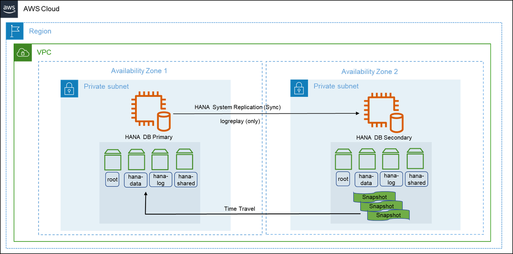

### SAP HANA replication scenarios in AWS

In a two-tier SAP HANA system replication, deployment on AWS is optimized based on performance or cost. For the fastest takeover time, use a secondary instance with the same size as the primary instance. This is a performance optimized deployment. A cost optimized deployment can reduce overall costs with a compromise on the recovery time objective. Cost optimized scenarios are also referred to as pilot light disaster recovery. For more information, see [Rapidly recover mission-critical systems in a disaster](https://aws.amazon.com/blogs/publicsector/rapidly-recover-mission-critical-systems-in-a-disaster/ "https://aws.amazon.com/blogs/publicsector/rapidly-recover-mission-critical-systems-in-a-disaster/").

###### Topics

- [Performance optimized](#hsr-performance-optimized "#hsr-performance-optimized")
- [Cost optimized](#hsr-cost-optimized "#hsr-cost-optimized")

#### Performance optimized

SAP HANA database systems that are critical to business continuity require a near-zero recovery time objective during planned and unplanned outages. You can optimize performance with a secondary instance of the same size as primary. This configuration can accommodate preloaded column tables in-memory, and synchronous system replication. We do not recommend hosting your SAP HANA instances across AWS Regions in this setup. This is to avoid latency while replicating in a synchronous mode. This deployment protects your critical SAP HANA systems against failure of an Availability Zone, a rare occurrence.

You can set up a third-party cluster solution along with SAP HANA system replication to detect failure and automate failover. For more information, see [Pacemaker cluster](hana-ops-ha-dr.md#pacemaker-hana-hadr "hana-ops-ha-dr.md#pacemaker-hana-hadr"). The following diagram shows a performance optimized deployment.

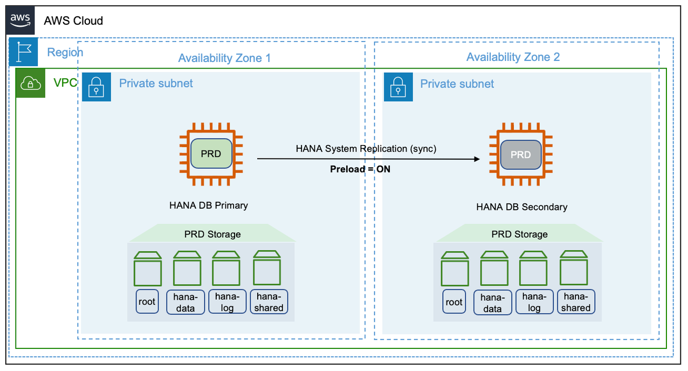

#### Cost optimized

You can reduce costs by using a smaller or shared secondary SAP HANA system. In the smaller secondary option, the infrastructure is initially sized smaller than the primary and resized before performing a takeover. In the shared secondary option, the unused memory on the secondary system is used by a non-production or sacrificial instance.

The `preload_column_tables` parameter is set to _false_ for both, smaller and shared secondary options. You can find this parameter in the `global.ini` file located at `(/hana/shared/<SID>/global/hdb/custom/config`. Setting the parameter as _false_ enables the secondary system to operate with reduced memory. However, the default value of the `preload_column_tables` is _true_.

###### Note

Before performing a takeover in a cost optimized deployment, you must set the `preload_column_tables` parameter to its default value of _true_ and restart the SAP HANA system.

The size of your SAP HANA database impacts the time taken to load the column tables into main memory. This affects your overall recovery time objective. You can use SQL scripts to get a rough estimate of the minimum memory required for these tables. Refer to the _HANA_Tables_ColumnStore_Columns_LastTouchTime_ section in [SAP Note 1969700 – SQL Statement Collection for SAP HANA](https://me.sap.com/notes/1969700 "https://me.sap.com/notes/1969700") for more information.

**Smaller secondary**

The following diagram shows the deployment of a smaller secondary SAP HANA system in a different Availability Zones within the same AWS Region.

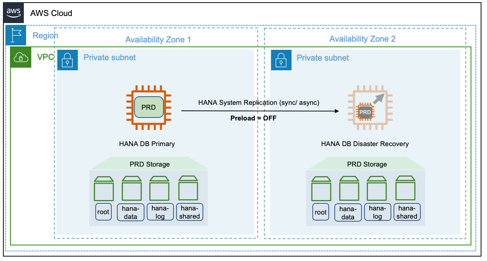

This deployment is also possible across multiple AWS Regions. We recommend using the asynchronous mode while replicating across Regions. Note that when you resize the secondary system before a takeover, there is no reserved capacity. The requirement of a production sized instance is subject to the current availability in your Availability Zone.

**Shared secondary**

Multiple components one system (MCOS) model is a common use case of the shared secondary deployment option. You can operate an active quality instance along with the secondary instance on the same host. This setup requires additional storage to operate the additional instances. During a takeover, the instance with lower priority can be shutdown to make the underlying host resources available for production workloads.

You must set the `global_allocation_limit` for all instances running on the site. This ensures that no one instance with the `global_allocation_limit` set to `0` occupies the entire memory available on the host. For more information, see [SAP Note 1681092 – Multiple SAP HANA systems (SIDs) on the same underlying server(s)](https://me.sap.com/notes/1681092 "https://me.sap.com/notes/1681092").

The following diagram shows a shared secondary deployment on AWS.

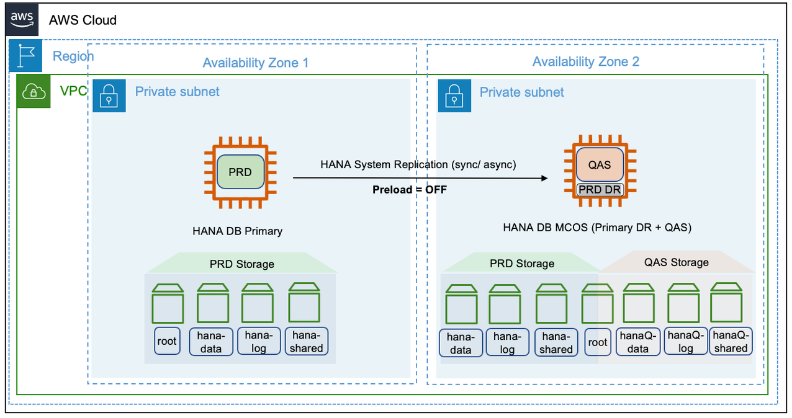

**Sizing considerations for cost optimized deployments**

Despite disabling the preload of column tables, the actual memory usage on the secondary host is also dependent on the operation mode of system replication. For more information, see [SAP Note 1999880 - FAQ: SAP HANA System Replication](https://me.sap.com/notes/1999880 "https://me.sap.com/notes/1999880").

Although the `preload_column_tables` parameter is set to _false_, the `logreplay` operation mode is also a contributing factor to the memory size. You should consider the size of column store tables with data modified in the previous 30 days from the current date of evaluation.

The `logreplay` operation mode may not be able to provide true cost optimization. The `delta_datashipping` operation mode can be an alternative. However, the `delta_datashipping` has limitations. It can include a higher recovery time and an increase demand for network bandwidth between the replication sites. If your business requirements can afford higher network bandwidth and relaxed recovery times, `delta_datashipping` mode can be a viable option.

The potential cost savings is higher with larger database instances. The memory footprint on the secondary system has a minimum requirement of row store memory and buffer requirements, even for smaller database instances. Calculation the memory requirement and accordingly setting the `global_allocation_limit` is an iterative process. The column store demand for delta merge grows with the growing size of the production database. Therefore, memory allocations for all hosts on a site should be monitored periodically, and after mass data loads, go-lives, and SAP system specific lifecycle events.

### SAP HANA multi-tier replication

This configuration scenario is suitable if you are looking for both, high availability and disaster recovery. This setup provides a chained replication model where a primary system can replicate to only one secondary system at any given point of time. For more information, see [Setting Up SAP HANA Multi-tier System Replication](https://help.sap.com/docs/SAP_HANA_PLATFORM/6b94445c94ae495c83a19646e7c3fd56/f730f308fede4040bcb5ccea6751e74d.html "https://help.sap.com/docs/SAP_HANA_PLATFORM/6b94445c94ae495c83a19646e7c3fd56/f730f308fede4040bcb5ccea6751e74d.html").

In this scenario, there can be a mix of performance and cost deployment options. The primary and secondary system can be deployed in a high availability setup using a pacemaker cluster. The tertiary or disaster recovery system can be a cost optimized deployment. An active non-production instance can run on the same node, as a multiple components one installation model. This setup is shown in the following diagram.

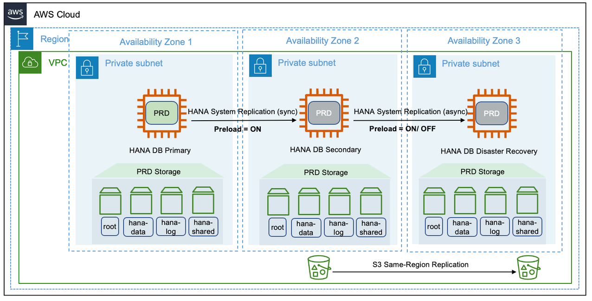

### SAP HANA multi-target replication

In SAP HANA multi-tier scenario, replication happens sequentially, from primary to secondary system, and then from secondary to tertiary system. Starting with SPA HANA 2.0 SPS 03, SAP HANA provides multi-target system replication configuration for a single primary system to replicate to multiple secondary systems. For more information, see [SAP HANA Multitarget System Replication](https://help.sap.com/docs/SAP_HANA_PLATFORM/6b94445c94ae495c83a19646e7c3fd56/ba457510958241889a459e606bbcf3d3.html "https://help.sap.com/docs/SAP_HANA_PLATFORM/6b94445c94ae495c83a19646e7c3fd56/ba457510958241889a459e606bbcf3d3.html").

The following diagram shows a multi-tier target replication configuration on AWS.

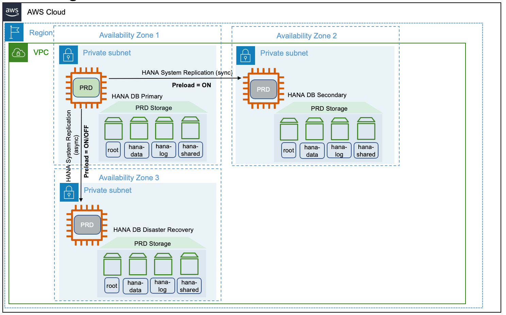

**Replication mode**

The primary, secondary, and tertiary systems can be placed on different Availability Zones within the same or across AWS Regions. Apart from the replication modes supported by SAP, SAP HANA systems deployed across different AWS Regions must choose the async mode of replication due to latency requirements. To see the replication modes supported by SAP, see [Supported Replication Modes between Sites](https://help.sap.com/docs/SAP_HANA_PLATFORM/6b94445c94ae495c83a19646e7c3fd56/c3fe0a3c263c49dc9404143306455e16.html "https://help.sap.com/docs/SAP_HANA_PLATFORM/6b94445c94ae495c83a19646e7c3fd56/c3fe0a3c263c49dc9404143306455e16.html").

**Operation mode**

It is not possible to combine `logreplay` and `delta_datashipping` operation modes in a multi-tier or multi-target system replication. For example, if the primary and secondary systems use `logreplay` for system replication, then `delta_datashipping` cannot be used between the secondary and tertiary systems or vice-versa.

The `logreplay` operation mode is only supported in a multi-target system replication scenario. To implement a high availability pacemaker cluster solution along with multi-target replication, check the relevant resources from SUSE and RHEL.

The `logreplay_readaccess` operation mode is supported on an Active/Active (read enabled) configuration with multi-target system replication. However, in a multi-tier replication, only the secondary system can be used for read-only capability, and cannot be extended to the tertiary system.

**Disaster recovery**

The multi-target system replication offers automated re-registration of the secondary systems to a new primary source in case of failure on the primary. You can set this automation with the `register_secondaries_on_takeover` parameter. For more information, see [Disaster Recovery Scenarios for Multitarget System Replication](https://help.sap.com/docs/SAP_HANA_PLATFORM/4e9b18c116aa42fc84c7dbfd02111aba/8428f79ca32d4869848a1aefe437151c.html "https://help.sap.com/docs/SAP_HANA_PLATFORM/4e9b18c116aa42fc84c7dbfd02111aba/8428f79ca32d4869848a1aefe437151c.html").

## Takeover considerations

When there is a need for SAP HANA system replication takeover, you must trigger it in your secondary system by following the standard SAP HANA takeover process. You must decide if you want to wait for your system to be recovered in the primary Availability Zone before a takeover, if you have enabled automatic recovery. For more information, see [SAP Note 2063657 - SAP HANA System Replication Takeover Decision Guideline](https://me.sap.com/notes/2063657 "https://me.sap.com/notes/2063657").

###### Topics

- [Client redirect options](#hsr-client-redirect "#hsr-client-redirect")
- [Client redirection for Active/Active high availability scenario](#hsr-ha-client-redirect "#hsr-ha-client-redirect")

### Client redirect options

In almost all scenarios, failover of the SAP HANA system alone does not guarantee business continuity. You must ensure that your client applications, such as NetWeaver application server, JDBC, ODBC, etc are able to connect to the SAP HANA system after the failover. Connection can be reestablished by redirecting your network-based IP or DNS. IP redirection can be processed faster in a script as compared to synchronizing changes in DNS entries over a global network. For more information, see the _Client Connection Recovery_ section in the [SAP HANA Administration Guide](https://help.sap.com/docs/SAP_HANA_PLATFORM/6b94445c94ae495c83a19646e7c3fd56/330e5550b09d4f0f8b6cceb14a64cd22.html "https://help.sap.com/docs/SAP_HANA_PLATFORM/6b94445c94ae495c83a19646e7c3fd56/330e5550b09d4f0f8b6cceb14a64cd22.html").

#### DNS redirection

You must set the IP address of the secondary system in the host name for a network-based DNS redirection. The DNS records must point to the active SAP HANA instance in the same Availability Zone. You can use a script as part of the takeover to modify the DNS records. You can also make the change to DNS records manually.

A vendor proprietary solution is required to modify DNS records. With AWS, you can use Amazon Route 53 to automate the modification of DNS records with AWS CLI or AWS API. For more information, see [Configuring Amazon Route 53 as your DNS service](../../../Route53/latest/DeveloperGuide/dns-configuring.md "../../../Route53/latest/DeveloperGuide/dns-configuring.md").

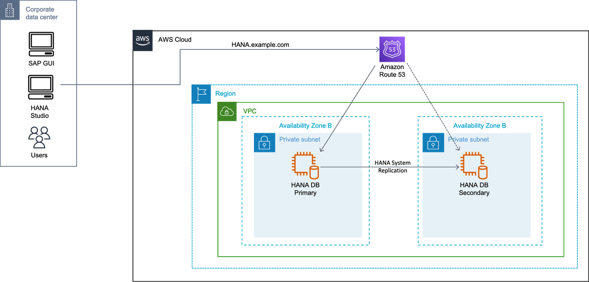

#### IP redirection

With network-based IP redirection, a virtual IP address is assigned to the virtual host name. In case of a takeover, the virtual IP unbinds from the network adapter of the primary system and binds to the network adapter on the secondary system.

Amazon VPC setup includes assigning subnets to your primary and secondary nodes for the SAP HANA database. Each of these configured subnets has a classless inter-domain routing (CIDR) IP assignment from the Amazon VPC which resides entirely within one Availability Zone. This CIDR IP assignment cannot span multiple zones or be reassigned to the secondary instance in a different Availability Zone during a failover. For more information, see [How Amazon VPC works](../../../vpc/latest/userguide/how-it-works.md "../../../vpc/latest/userguide/how-it-works.md").

###### Topics

- [AWS Transit Gateway](#hsr-redirect-ip-gateway "#hsr-redirect-ip-gateway")
- [Network Load Balancer](#hsr-redirect-ip-nlb "#hsr-redirect-ip-nlb")

##### AWS Transit Gateway

With Transit Gateway, you use route table rules which allow the overlay IP address to communicate to the SAP instance without having to configure any additional components, like a Network Load Balancer or Route 53. You can connect to the overlay IP from another VPC, another subnet (not sharing the same route table where overlay IP address is maintained), over a VPN connection, or via an AWS Direct Connect connection from a corporate network. For more information, see [What is a Transit Gateway?](../../../vpc/latest/tgw/what-is-transit-gateway.md "../../../vpc/latest/tgw/what-is-transit-gateway.md")

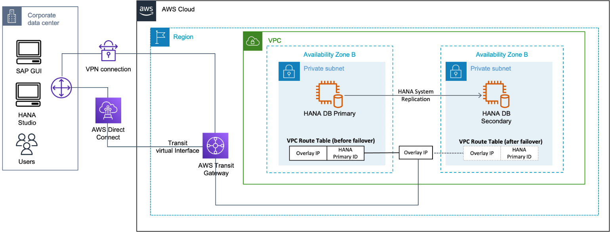

##### Network Load Balancer

If you do not use Amazon Route 53 or AWS Transit Gateway, you can use Network Load Balancer for accessing the overlay IP address externally. The Network Load Balancer functions at the fourth layer of the Open Systems Interconnection (OSI) model. It can handle millions of requests per second. After the load balancer receives a connection request, it selects a target from the Network Load Balancer target group to route network connection request to a destination address which can be an overlay IP address. For more information, see [What is a Network Load Balancer?](../../../elasticloadbalancing/latest/network/introduction.md "../../../elasticloadbalancing/latest/network/introduction.md")

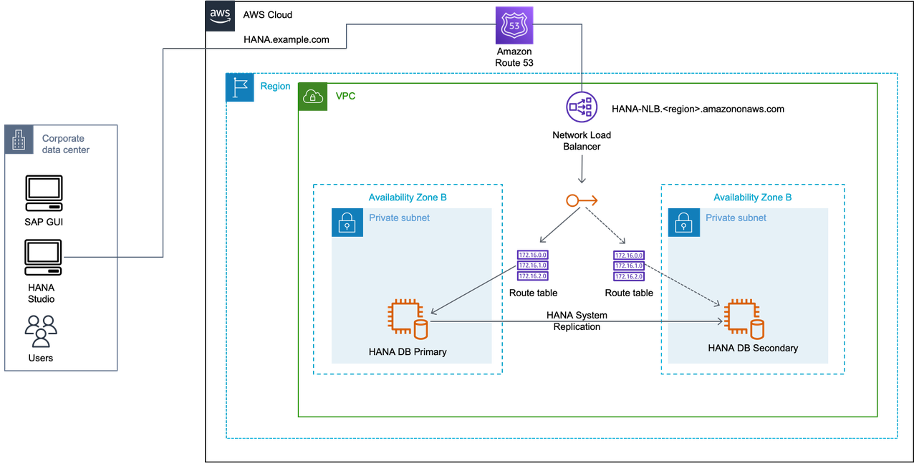

### Client redirection for Active/Active high availability scenario

You use the additional overlay IP address for your secondary read-only system in this configuration. The IP address binds to the active secondary system as part of the cluster failover. The DNS records for the secondary system can be updated manually or by using a script during takeover.

An additional Network Load Balancer needs to be created for load balancing your secondary system.

With Transit Gateway, you use an overlay IP address on your secondary system to connect with Amazon VPC and subnet where your secondary system will run.

###### Topics

- [Active/Active scenario with DNS](#hsr-redirect-ha-dns "#hsr-redirect-ha-dns")
- [Active/Active scenario with AWS Transit Gateway](#hsr-redirect-ha-ip "#hsr-redirect-ha-ip")
- [Active/Active scenario with Network Load Balancer](#hsr-redirect-ha-gateway "#hsr-redirect-ha-gateway")

#### Active/Active scenario with DNS

In this scenario, you use two DNS records for SAP HANA read/write primary instance and SAP HANA read only secondary instance. In case of failover, the modification of DNS records can be automated or manual.

#### Active/Active scenario with AWS Transit Gateway

In this scenario, two overlay IP addresses for SAP HANA read/write primary instance and SAP HANA read only secondary instance. In case of failover, the route table is adjusted in its Availability Zone, and Transit Gateway reroutes the connections to these IP addresses. This applies to both overlay IP addresses.

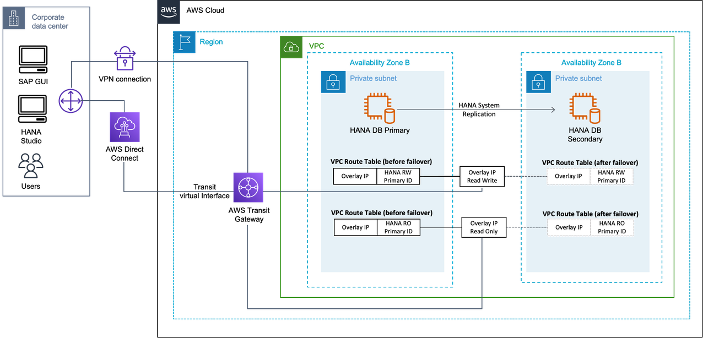

#### Active/Active scenario with Network Load Balancer

In this scenario, two overlay IP addresses for SAP HANA read/write primary instance and SAP HANA read only secondary instance. In case of failover, the route table is adjusted in its Availability Zone, and Network Load Balancer for the read/write or read only endpoint points to the overlay IP address in its Availability Zone. This applies to both overlay IP addresses.

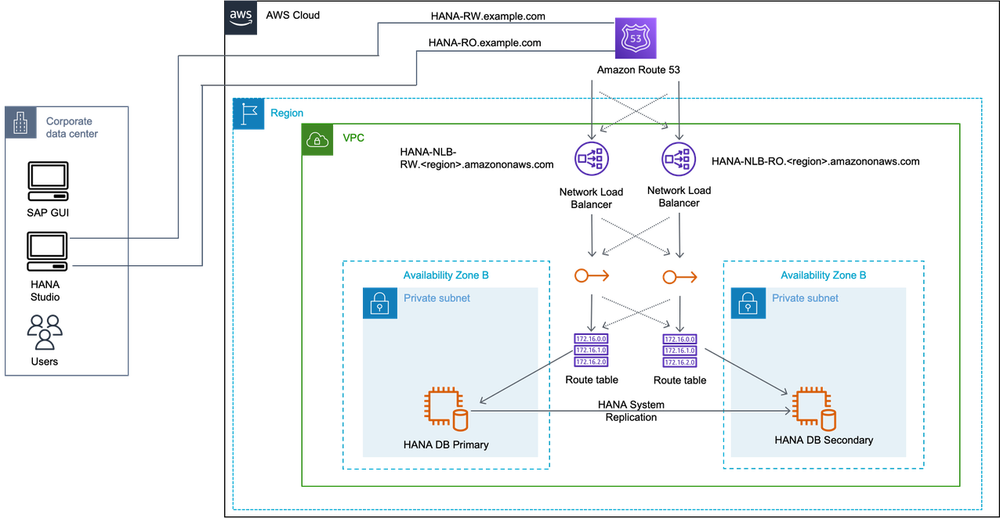
