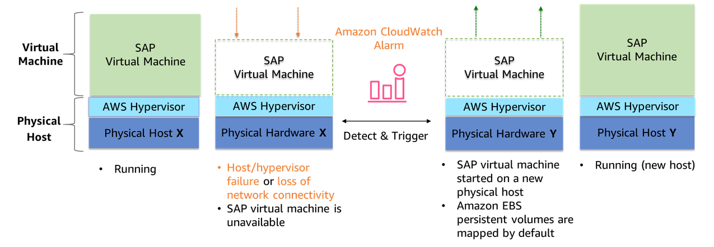
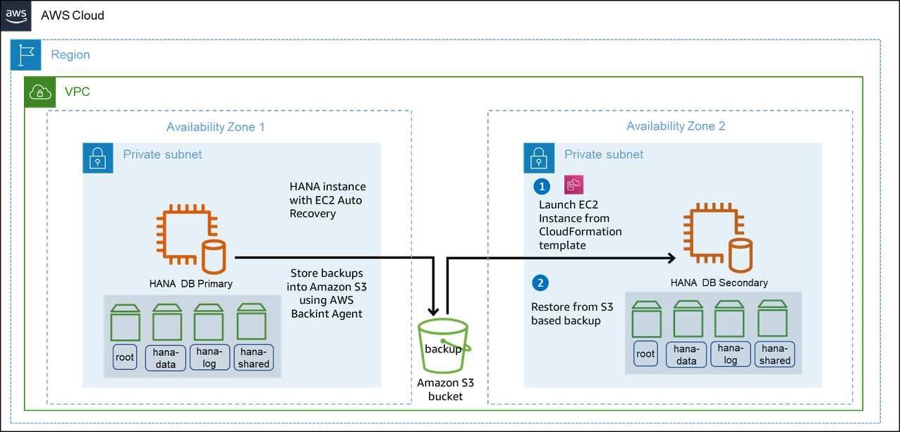
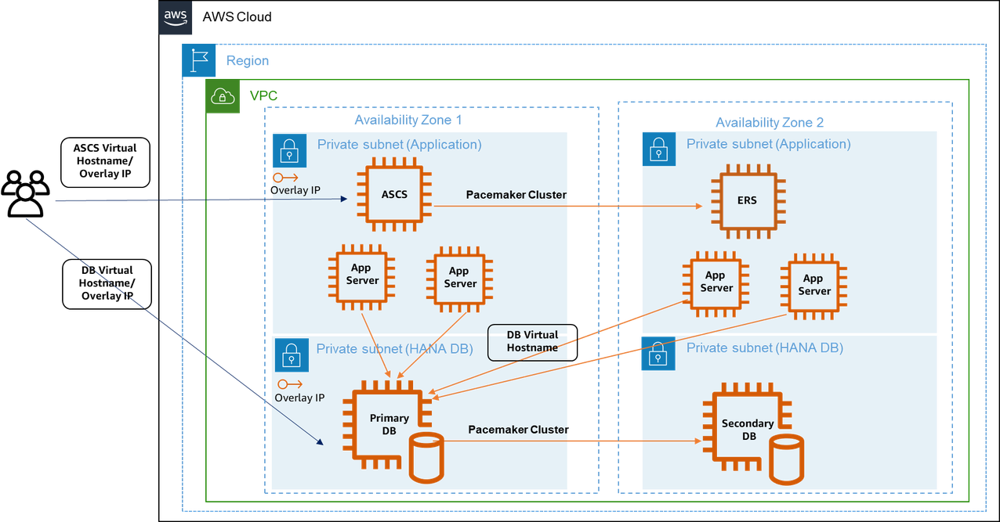

# High availability and disaster recovery

AWS provides multiple options for performing disaster recovery and making your SAP HANA systems highly available. This section provides information about these solutions. It also covers the support on AWS platform for native SAP HANA recovery features provided by SAP.

###### Topics

- [Amazon EC2 recovery options](#ec2-recovery-hana-hadr "#ec2-recovery-hana-hadr")
- [SAP HANA service auto-restart](#hana-restart-hana-hadr "#hana-restart-hana-hadr")
- [SAP HANA backup/restore](#hana-backup-hana-hadr "#hana-backup-hana-hadr")
- [AWS Backint Agent for SAP HANA](#backint-hana-hadr "#backint-hana-hadr")
- [Amazon EBS snapshots](#ebs-hana-hadr "#ebs-hana-hadr")
- [Cluster solutions](#cluster-hana-hadr "#cluster-hana-hadr")
- [Pacemaker cluster](#pacemaker-hana-hadr "#pacemaker-hana-hadr")
- [AWS Launch Wizard for SAP](#lwsap-hana-hadr "#lwsap-hana-hadr")
- [AWS Application Migration Service and AWS Elastic Disaster Recovery](#mgn-drs-hana-hadr "#mgn-drs-hana-hadr")
- [SAP HANA system replication](hana-ops-ha-dr-hsr.md "hana-ops-ha-dr-hsr.md")
- [Testing SAP HANA high availability deployments](hana-ops-ha-dr-testing.md "hana-ops-ha-dr-testing.md")
- [Troubleshoot high availability SAP HANA deployments](hana-ops-ha-dr-troubleshoot.md "hana-ops-ha-dr-troubleshoot.md")

## Amazon EC2 recovery options

You can recover your SAP HANA databases running on Amazon EC2 instances with the following recovery options.

Simplified automatic recovery

- The default configuration of an Amazon EC2 instance enables automatic recovery of a supported instance due to hardware failure or a problem requiring the involvement of AWS. Automatic recovery of your Amazon EC2 instance increases the resiliency of your SAP workload. For more information, see [Simplified automatic recovery based on instance configuration](../../../AWSEC2/latest/UserGuide/ec2-instance-recover.md#instance-configuration-recovery "../../../AWSEC2/latest/UserGuide/ec2-instance-recover.md#instance-configuration-recovery").

Amazon CloudWatch action based recovery

- You can create a `StatusCheckFailed_System` CloudWatch alarm to monitor your Amazon EC2 instance. The system status check may fail due to the following reasons:
  - Loss of network connectivity
  - Loss of system power
  - Software issues on the physical host
  - Hardware issues on the physical host that impact network reachability

When the CloudWatch alarm detects this failure, recover action is initiated. A recovered instance is identical to the original instance, including the instance ID, private IP addresses, Elastic IP addresses, and all instance metadata. For more information, see [Amazon CloudWatch action based recovery](../../../AWSEC2/latest/UserGuide/ec2-instance-recover.md#cloudwatch-recovery "../../../AWSEC2/latest/UserGuide/ec2-instance-recover.md#cloudwatch-recovery").

- TIP: When you create the `StatusCheckFailed_System` CloudWatch alarm using AWS Management Console, associate it with Amazon SNS to receive email notifications. Alternatively, you can set up Amazon SNS notifications after creating the alarm. For more information, see [Setting up Amazon SNS notifications](../../../AmazonCloudWatch/latest/monitoring/US_SetupSNS.md "../../../AmazonCloudWatch/latest/monitoring/US_SetupSNS.md").

Dedicated host recovery

- Dedicated host auto recovery restarts your instances on to a new replacement host when there is a Dedicated Host failure due to system power or network connectivity events. For more information, see [Host recovery](../../../AWSEC2/latest/UserGuide/dedicated-hosts-recovery.md "../../../AWSEC2/latest/UserGuide/dedicated-hosts-recovery.md").

We recommend configuring your Amazon EC2 instances, except instances in a third-party cluster solution, and dedicated hosts with automatic recovery to protect against hardware failure. The following diagram illustrates Amazon EC2 recovery options.

## SAP HANA service auto-restart

SAP HANA service auto-restart is a fault recovery solution provided by SAP. SAP HANA has many configured services running all the time for various activities. When any of these services is disabled due to software failure or human error, the service is automatically restarted with the SAP HANA service auto-restart watchdog function. When the service is restarted, it loads all the necessary data back into memory and resumes its operation. SAP HANA service auto-restart solution works the same way on AWS as it does on any other platform. Using SAP HANA service auto-restart along with [Amazon EC2 recovery options](#ec2-recovery-hana-hadr "#ec2-recovery-hana-hadr") is a robust disaster recovery solution.

## SAP HANA backup/restore

Although SAP HANA is an in-memory database, it persists all changes in persistent storage to recover and resume from any failures, such as power outages. If the persistent storage is damaged or any logical errors occur, SAP HANA backups are required to restore the database. The SAP HANA database backup files can be regularly backed up to a remote location for disaster recovery purposes. SAP HANA backup/restore works the same way on AWS as it does on any other platform. For more information, see [SAP HANA Administration Guide](https://help.sap.com/docs/SAP_HANA_PLATFORM/6b94445c94ae495c83a19646e7c3fd56/330e5550b09d4f0f8b6cceb14a64cd22.html "https://help.sap.com/docs/SAP_HANA_PLATFORM/6b94445c94ae495c83a19646e7c3fd56/330e5550b09d4f0f8b6cceb14a64cd22.html").

## AWS Backint Agent for SAP HANA

AWS Backint Agent for SAP HANA (AWS Backint agent) is an SAP-certified backup and restore application for SAP HANA workloads running on Amazon EC2 instances in the cloud. AWS Backint agent runs as a standalone application that integrates with your existing workflows to back up your SAP HANA database to Amazon S3 and to restore it using SAP HANA Cockpit, SAP HANA Studio, and SQL commands. AWS Backint agent supports full, incremental, and differential backup of SAP HANA databases. Additionally, you can back up log files and catalogs toAmazon S3. For more information, see [AWS Backint Agent for SAP HANA](aws-backint-agent-sap-hana.md "aws-backint-agent-sap-hana.md").

###### Topics

- [Example scenario](#example-backint-hana-hadr "#example-backint-hana-hadr")
- [Time to back up](#time-backint-hana-hadr "#time-backint-hana-hadr")
- [Recovery time and point objectives](#rto-rpo-backint-hana-hadr "#rto-rpo-backint-hana-hadr")

### Example scenario

AWS Backint Agent for SAP HANA enables you to make your SAP HANA systems on AWS highly available and ready for disaster recovery. See the following example scenario to learn more.

1. Run your SAP HANA system on Amazon EC2 in Availability Zone 1.
2. Set up the `StatusCheckFailed_System` CloudWatch alarm to automatically recover your Amazon EC2 instance if the system check fails.
   1. Your instance is recovered within the same Availability Zone.
   2. You may not be able to access the instance when the Availability Zone becomes unavailable.

3. Launch a new Amazon EC2 instance using a AWS CloudFormation template in Availability Zone 2. For more information, see [Launch an instance from a launch template](../../../AWSEC2/latest/UserGuide/ec2-launch-templates.md "../../../AWSEC2/latest/UserGuide/ec2-launch-templates.md").
4. Restore your SAP HANA database from Amazon S3 with AWS Backint agent. For more information, see [Back up and restore your SAP HANA system with AWS Backint Agent for SAP HANA](aws-backint-agent-backup-restore.md "aws-backint-agent-backup-restore.md").
5. Redirect your client traffic to the new SAP HANA system on Amazon EC2 when it is operational.

In this scenario, you avoid the cost of a standby node. Using AWS multi-Availability Zone infrastructure and backup/restore with AWS Backint Agent for SAP HANA, you can quickly resume operations and significantly reduce downtime costs.

The elaborate recovery procedure makes this model suitable for a longer recovery time objective and a recovery point objective that is greater than zero. Your recovery point objective depends on how frequently you store your SAP HANA backup files in Amazon S3.

You can lower your recovery point objective with AWS Backint agent storing your SAP HANA system backups to Amazon S3. Additionally, you can quickly restore from the backup files in Amazon S3 without creating custom scripts to manually copy your SAP HANA backup files to and from Amazon S3.

### Time to back up

The time taken to back up and restore your SAP HANA database on Amazon EC2 with AWS Backint agent depends on the configuration of your system. These include Amazon EC2 instance type, Amazon EBS volume type, and database size. The following are the key variables that impact the time taken to back up and restore your SAP HANA system.

- Storage throughput of the underlying Amazon EBS volume supporting the SAP HANA database
- Network throughput supporting the communication channel with Amazon S3
- Available CPU resources on the instance type

### Recovery time and point objectives

We recommend you to perform various tests to identify the right system configuration that suit your business recovery time and point objectives. AWS Backint Agent for SAP HANA maximizes the available throughput by parallel processing the back up and restore processes. The recovery time objective is optimized for any given system configuration. For example, with SAP HANA scale-up node on r5.2xlarge, AWS Backint agent was able to upload 551GB of data in 4 minutes and 15 seconds, achieving an overall throughput of 2.16GB/s. Similarly, for a 4 node SAP HANA scale-out running on u6-tb1.metal instances, AWS Backint agent was able to upload 22.86TB of data in 23 minutes, achieving an overall throughput of 16.8GB/s.

Based on our testing, the time taken for restore operations using AWS Backint agent is normally 1.5 to 2 times the back up time. For more information, see [Performance tuning](aws-backint-agent-installing-configuring.md#aws-backint-agent-performance-tuning "aws-backint-agent-installing-configuring.md#aws-backint-agent-performance-tuning").

## Amazon EBS snapshots

You can back up your data on Amazon EBS volumes to Amazon S3 by taking point-in-time snapshots. Snapshots provide a fast backup process, regardless of the database size. They are stored in Amazon S3 and replicated across Availability Zones automatically.

Amazon EBS snapshots are incremental by default. Only the delta changes are stored since the last snapshot. Snapshots are also crash consistent. They contain the blocks of completed I/O operations. You can copy the snapshots across AWS Regions or share it with other AWS accounts. You can restore Amazon EBS volumes from the snapshot or create a new volume out of a snapshot in the same or different Availability Zone, and launch Amazon EC2 instances. Amazon EBS snapshots provide a simple and secure data protection solution that is designed to protect your block storage data, such as Amazon EBS volumes, boot volumes, and on-premises block data. For more information, see [Amazon EBS snapshots](../../../AWSEC2/latest/UserGuide/EBSSnapshots.md "../../../AWSEC2/latest/UserGuide/EBSSnapshots.md").

Amazon EBS snapshots can also be used to enable disaster recovery, and migrate data across AWS Regions and accounts. Amazon EBS fast snapshot restore enables you to create a volume from a snapshot that is fully initialized at creation. This eliminates the latency of I/O operations on a block when it is accessed for the first time. Volumes that are created using fast snapshot restore instantly deliver all of their provisioned performance. Amazon EBS fast snapshot restore can be enabled on a snapshot while it is being created. It helps you achieve low recovery time objective. For more information, see [Amazon EBS fast snapshot restore](../../../AWSEC2/latest/UserGuide/ebs-fast-snapshot-restore.md "../../../AWSEC2/latest/UserGuide/ebs-fast-snapshot-restore.md").

## Cluster solutions

SAP HANA workloads on AWS are configured in a highly available and fault tolerant manner at the infrastructure layer. A failure still needs to be managed at the SAP HANA database layer. If a failure is detected at the hardware or software level, you can perform a manual failover process with SAP HANA cockpit, SAP HANA studio, or `hdbnsutil` command line tool. The manual processes can affect the availability of your business processes.

You can also use Python-based API included with SAP HANA to create your own high availability and disaster recovery provider or hooks. You can then integrate these hooks with SAP HANA system replication takeover process to automate tasks such as, restarting the primary node, IP redirection, DNS redirection, and shutdown of dev/QA systems in the secondary node. For more information, see [Implementing a HA/DR Provider](https://help.sap.com/docs/SAP_HANA_PLATFORM/6b94445c94ae495c83a19646e7c3fd56/1367c8fdefaa4808a7485b09815ae0f3.html "https://help.sap.com/docs/SAP_HANA_PLATFORM/6b94445c94ae495c83a19646e7c3fd56/1367c8fdefaa4808a7485b09815ae0f3.html").

Based on the operating system of your SAP HANA database, you can implement a third-party high availability cluster solution. It can reduce downtime and automate failover steps. The following solutions include a pacemaker framework along with SAP HANA hooks that are certified by SAP and supported on AWS.

- SUSE Linux Enterprise Server (SLES) High Availability Extension (HAE)
- Red Hat Enterprise Linux (RHEL) for SAP high availability

For more information, see [SAP HANA on AWS: High Availability Configuration Guide for SLES and RHEL](sap-hana-on-aws-ha-configuration.md "sap-hana-on-aws-ha-configuration.md").

## Pacemaker cluster

SAP HANA high availability solution based on SAP HANA system replication is automated for failover between primary and secondary SAP HANA instances. The primary and secondary instances are configured together as a pacemaker cluster. The clustering software is at the operating system layer and is integrated with the SAP HANA database using SAP HANA hooks. The clustering software detects and automates the failover. The recovery time can be in minutes or less. For more information, see [SAP HANA system replication](hana-ops-ha-dr-hsr.md "hana-ops-ha-dr-hsr.md").

The SAPHanaSR and SAPHANASR-Scale-out solutions from SUSE are based on pacemaker and corosync. These along with dedicated resource agents for SAP HANA are released as part of SLES for SAP Applications. For more information on how to set up a high availability cluster on SLES for SAP Applications on AWS, see [High availability cluster configuration on SLES](sap-hana-on-aws-ha-cluster-configuration-on-sles.md "sap-hana-on-aws-ha-cluster-configuration-on-sles.md").

The high availability solution from RHEL also provides a pacemaker cluster framework and the resource agents required for automation failover process of SAP HANA system replication. For more information on how to set up a high availability cluster on RHEL on AWS, see [High availability cluster configuration on RHEL](sap-hana-on-aws-ha-cluster-configuration-on-rhel.md "sap-hana-on-aws-ha-cluster-configuration-on-rhel.md"). The following resources are available from Red Hat.

- [Configuring SAP HANA Scale-Up System Replication with the RHEL HA Add-On on Amazon Web Services (AWS)](https://access.redhat.com/articles/3569621 "https://access.redhat.com/articles/3569621")
- [Configuring SAP HANA Scale-Out System Replication with the RHEL HA Add-On on Amazon Web Services (AWS)](https://access.redhat.com/articles/6093611 "https://access.redhat.com/articles/6093611")

For automated deployment of SAP HANA system replication using AWS Launch Wizard for SAP, see [AWS Launch Wizard for SAP](#lwsap-hana-hadr "#lwsap-hana-hadr").

The pacemaker cluster uses a virtual IP address to connect to the master SAP HANA instance. The virtual IP address is migrated to the secondary instance during failover. The secondary instance is then promoted as active primary for traffic redirection. An overlay IP address is used for the networking configuration on AWS. It is a virtual IP address configured to point to the master SAP HANA instance whether it is on the primary node or secondary node. You can configure overlay IP routing with AWS Transit Gateway or Network Load Balancer. For more information, see [SAP on AWS High Availability with Overlay IP Address Routing](sap-ha-overlay-ip.md "sap-ha-overlay-ip.md").

## AWS Launch Wizard for SAP

AWS Launch Wizard for SAP offers guided deployment for production-ready applications on AWS with resource sizing, customizable deployments, application configuration, and cost estimation. These tools eliminate the complexity of high availability deployments. For more information, see [AWS Launch Wizard for SAP](../../../launchwizard/latest/userguide/launch-wizard-sap.md "../../../launchwizard/latest/userguide/launch-wizard-sap.md").

AWS Launch Wizard for SAP fast-tracks your SAP HANA deployments on AWS. It requires minimal manual intervention. The following high availability automated deployment patterns for SAP HANA are supported by AWS Launch Wizard.

- **Cross-AZ SAP HANA database high availability setup**: Deploy SAP HANA with high availability configured across two Availability Zones.
- **Cross-AZ SAP NetWeaver system setup**: Deploy Amazon EC2 instances for ASCS/ERS and SAP HANA databases across two Availability Zones, and spread the deployment of application servers across them.
- **SUSE/RHEL cluster setup**: For SAP HANA and NetWeaver on HANA high availability deployments, Launch Wizard for SAP configures SUSE/RHEL clustering when you provide SAP software and specify the deployment of SAP database or application software. Clustering is enabled between the ASCS and ERS nodes for SAP HANA databases across two Availability Zones. See the following diagram.

###### Note

We strongly recommend that you validate the setup of your environment before using the high availability cluster for deployment. Run tests before deploying an application on your SAP HANA instance set up by Launch Wizard. The tests can ensure that failover and fail-back operations are working properly.

The following table summarizes the deployment patterns supported by AWS Launch Wizard for SAP.

| Deployment pattern                                                | Support |
| ----------------------------------------------------------------- | ------- |
| SAP HANA database on a single Amazon EC2 instance                 | Yes     |
| SAP NetWeaver on SAP HANA system on a single Amazon EC2 instance  | Yes     |
| SAP HANA database on multiple Amazon EC2 instances                | Yes     |
| SAP NetWeaver system on multiple Amazon EC2 instances             | Yes     |
| Cross-Availability Zone SAP HANA database high availability setup | Yes     |
| Cross-Availability Zone SAP NetWeaver system setup                | Yes     |
| SUSE/RHEL cluster setup                                           | Yes     |

For more information, see [Supported deployments and features of AWS Launch Wizard](../../../launchwizard/latest/userguide/launch-wizard-sap-deployments.md "../../../launchwizard/latest/userguide/launch-wizard-sap-deployments.md").

## AWS Application Migration Service and AWS Elastic Disaster Recovery

We recommend using AWS Application Migration Service to migrate your SAP HANA databases to AWS. For more information, see [What is AWS Application Migration Service](../../../mgn/latest/ug/what-is-application-migration-service.md "../../../mgn/latest/ug/what-is-application-migration-service.md")?

For disaster recovery, we recommend using AWS Elastic Disaster Recovery. It uses block level replication to continuously replicate data from source to target. It helps reduce the infrastructure costs and total cost of ownership. It provides sub-second recovery point objective and recovery time objective of minutes. For more information, see [What is AWS Elastic Disaster Recovery](../../../drs/latest/userguide/what-is-drs.md "../../../drs/latest/userguide/what-is-drs.md")?

_Cloud Endure, an AWS company, also provides migration and disaster recovery services. Cloud Endure disaster recovery service is a business continuity offering that can be used for SAP and non-SAP workloads._
