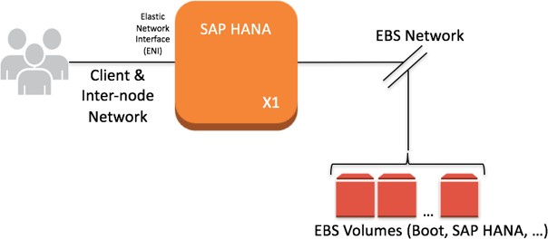
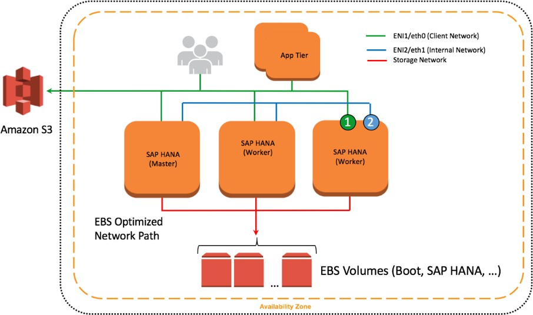
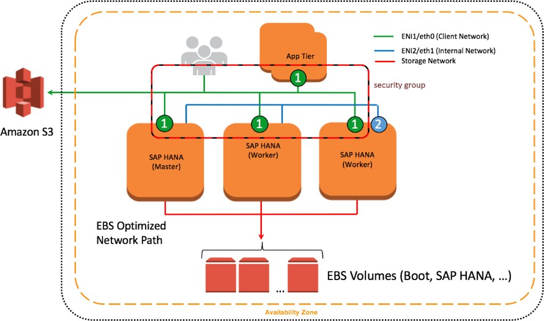
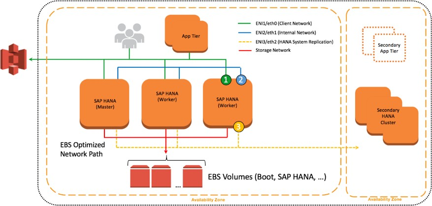

# Networking

SAP HANA components communicate over the following logical network zones:

- Client zone – to communicate with different clients such as SQL clients, SAP Application Server, SAP HANA Extended Application Services (XS), and SAP HANA Studio
- Internal zone – to communicate with hosts in a distributed SAP HANA system as well as for SAP HSR
- Storage zone – to persist SAP HANA data in the storage infrastructure for resumption after start or recovery after failure
  Separating network zones for SAP HANA is considered an AWS and SAP best practice. It enables you to isolate the traffic required for each communication channel.

In a traditional, bare-metal setup, these different network zones are set up by having multiple physical network cards or virtual LANs (VLANs). Conversely, on the AWS Cloud, you can use elastic network interfaces combined with security groups to achieve this network isolation. Amazon EBS-optimized instances can also be used for further isolation for storage I/O.

## EBS-Optimized Instances

Many newer Amazon EC2 instance types such as the X1 use an optimized configuration stack and provide additional, dedicated capacity for Amazon EBS I/O. These are called [EBS-optimized instances](../../../AWSEC2/latest/UserGuide/EBSOptimized.md "../../../AWSEC2/latest/UserGuide/EBSOptimized.md"). This optimization provides the best performance for your EBS volumes by minimizing contention between Amazon EBS I/O and other traffic from your instance.

**Figure 9: EBS-optimized instances**

## Elastic Network Interfaces

An elastic network interface is a virtual network interface that you can attach to an EC2 instance in an Amazon Virtual Private Cloud (Amazon VPC). With an elastic network interface (referred to as _network interface_ in the remainder of this guide), you can create different logical networks by specifying multiple private IP addresses for your instances.

For more information about network interfaces, see the [AWS documentation](../../../AWSEC2/latest/UserGuide/using-eni.md "../../../AWSEC2/latest/UserGuide/using-eni.md"). In the following example, two network interfaces are attached to each SAP HANA node as well as in a separate communication channel for storage.

**Figure 10: Network interfaces attached to SAP HANA nodes**

## Security Groups

A security group acts as a virtual firewall that controls the traffic for one or more instances. When you launch an instance, you associate one or more security groups with the instance. You add rules to each security group that allow traffic to or from its associated instances. You can modify the rules for a security group at any time. The new rules are automatically applied to all instances that are associated with the security group. To learn more about security groups, see the [AWS documentation](../../../AmazonVPC/latest/UserGuide/VPC_SecurityGroups.md "../../../AmazonVPC/latest/UserGuide/VPC_SecurityGroups.md"). In the following example, ENI-1 of each instance shown is a member of the same security group that controls inbound and outbound network traffic for the client network.

**Figure 11: Network interfaces and security groups**

## Network Configuration for SAP HANA System Replication (HSR)

You can configure additional network interfaces and security groups to further isolate inter-node communication as well as SAP HSR network traffic. In Figure 10, ENI-2 is has its own security group (not shown) to secure client traffic from inter-node communication. ENI-3 is configured to secure SAP HSR traffic to another Availability Zone within the same Region. In this example, the target SAP HANA cluster would be configured with additional network interfaces similar to the source environment, and ENI-3 would share a common security group.

**Figure 12: Further isolation with additional ENIs and security groups**

## Configuration Steps for Logical Network Separation

To configure your logical network for SAP HANA, follow these steps:

1. Create new security groups to allow for isolation of client, internal communication, and, if applicable, SAP HSR network traffic. See [Ports and Connections](https://help.sap.com/saphelp_hanaplatform/helpdata/en/a9/326f20b39342a7bc3d08acb8ffc68a/frameset.htm "https://help.sap.com/saphelp_hanaplatform/helpdata/en/a9/326f20b39342a7bc3d08acb8ffc68a/frameset.htm") in the SAP HANA documentation to learn about the list of ports used for different network zones. For more information about how to create and configure security groups, see the [AWS documentation](../../../AWSEC2/latest/UserGuide/using-network-security.md#creating-security-group "../../../AWSEC2/latest/UserGuide/using-network-security.md#creating-security-group").
2. Use Secure Shell (SSH) to connect to your EC2 instance at the OS level. Follow the steps described in the [appendix](hana-ops-appendix.md "hana-ops-appendix.md") to configure the OS to properly recognize and name the Ethernet devices associated with the new network interfaces you will be creating.
3. Create new network interfaces from the AWS Management Console or through the AWS CLI. Make sure that the new network interfaces are created in the subnet where your SAP HANA instance is deployed. As you create each new network interface, associate it with the appropriate security group you created in step 1. For more information about how to create a new network interface, see the [AWS documentation](../../../AWSEC2/latest/UserGuide/using-eni.md#create_eni "../../../AWSEC2/latest/UserGuide/using-eni.md#create_eni").
4. Attach the network interfaces you created to your EC2 instance where SAP HANA is installed. For more information about how to attach a network interface to an EC2 instance, see the [AWS documentation](../../../AWSEC2/latest/UserGuide/using-eni.md#attach_eni_running_stopped "../../../AWSEC2/latest/UserGuide/using-eni.md#attach_eni_running_stopped").
5. Create virtual host names and map them to the IP addresses associated with client, internal, and replication network interfaces. Ensure that host name-to-IP-address resolution is working by creating entries in all applicable host files or in the Domain Name System (DNS). When complete, test that the virtual host names can be resolved from all SAP HANA nodes and clients.
6. For scale-out deployments, configure SAP HANA inter-service communication to let SAP HANA communicate over the internal network. To learn more about this step, see [Configuring SAP HANA Inter-Service Communication](https://help.sap.com/saphelp_hanaplatform/helpdata/en/bb/cb76c7fa7f45b4adb99e60ad6c85ba/frameset.htm "https://help.sap.com/saphelp_hanaplatform/helpdata/en/bb/cb76c7fa7f45b4adb99e60ad6c85ba/frameset.htm") in the SAP HANA documentation.
7. Configure SAP HANA hostname resolution to let SAP HANA communicate over the replication network for SAP HSR. To learn more about this step, see [Configuring Hostname Resolution for SAP HANA System Replication](https://help.sap.com/saphelp_hanaplatform/helpdata/en/9a/cd6482a5154b7e95ce72e83b04f94d/frameset.htm "https://help.sap.com/saphelp_hanaplatform/helpdata/en/9a/cd6482a5154b7e95ce72e83b04f94d/frameset.htm") in the SAP HANA documentation.
