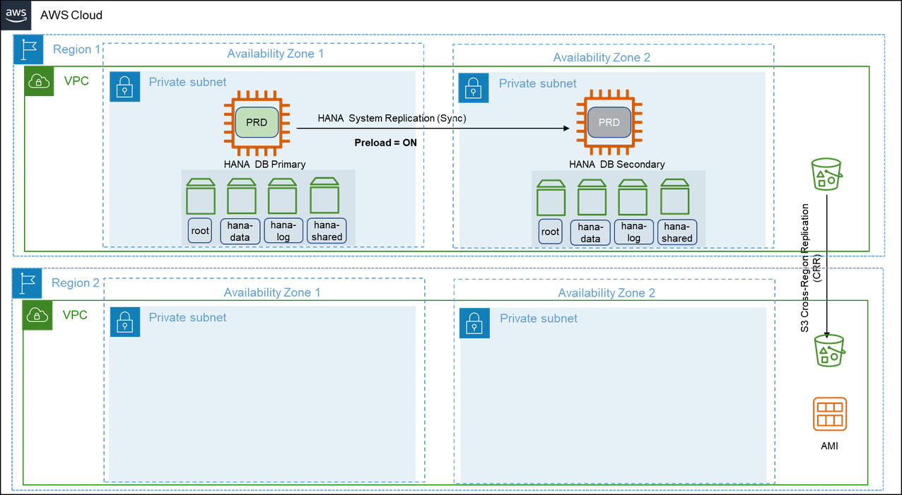
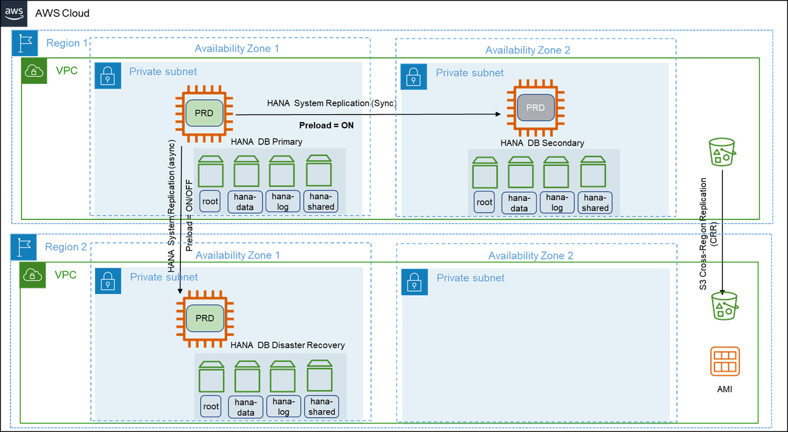
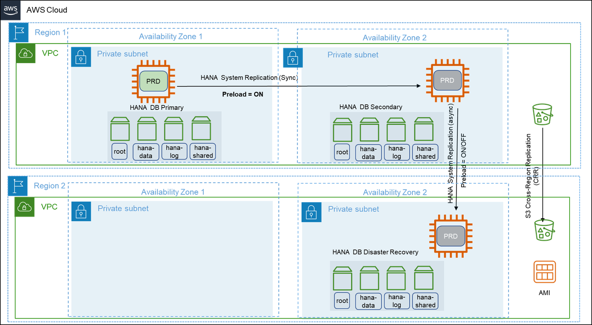
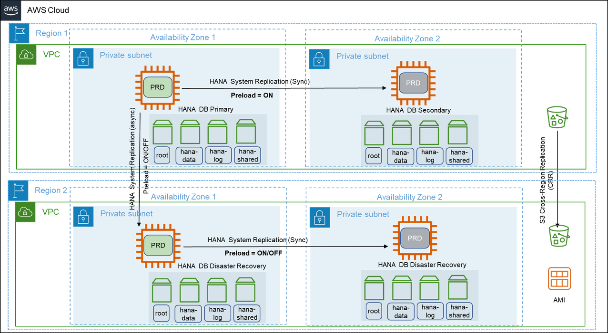
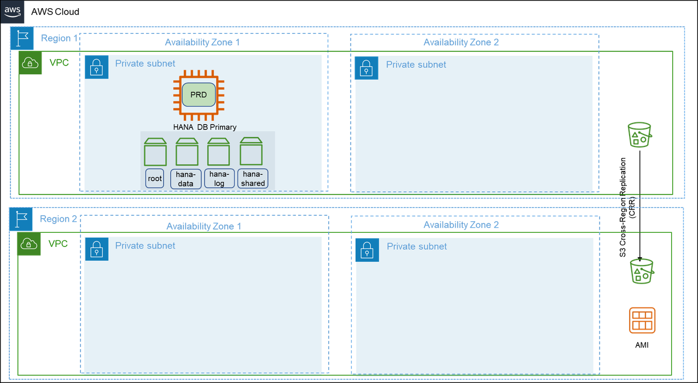

# Multi-Region architecture patterns for SAP HANA

AWS Global Infrastructure spans across multiple Regions around the world and this footprint is constantly increasing. For the latest updates, see [AWS Global Infrastructure](https://aws.amazon.com/about-aws/global-infrastructure/ "https://aws.amazon.com/about-aws/global-infrastructure/"). If you are looking for your SAP data to reside in multiple regions at any given point to ensure increased availability and minimal downtime in the event of failure, you should opt for multi-Region architecture patterns.

When deploying a multi-Region pattern, you can benefit from using an automated approach such as, cluster solution, for fail over between Availability Zones to minimize the overall downtime and remove the need for human intervention. Multi-Region patterns not only provide high availability but also disaster recovery, thereby lowering overall costs. Distance between the chosen regions have direct impact on latency and hence, in a multi-Region pattern, this has to be considered into the overall design of SAP HANA System Replication.

There are additional cost implications from cross-Region replication or data transfer that also need to be factored into the overall solution pricing. The pricing varies between Regions.

The following are the four multi-Region architecture patterns.

###### Topics

- [Pattern 5: Primary Region with two Availability Zones for production and secondary Region with a replica of backups/AMIs](#hana-ops-patterns-pattern5 "#hana-ops-patterns-pattern5")
- [Pattern 6: Primary Region with two Availability Zones for production and secondary Region with compute and storage capacity deployed in a single Availability Zone](#hana-ops-patterns-pattern6 "#hana-ops-patterns-pattern6")
- [Pattern 7: Primary Region with two Availability Zones for production and a secondary Region with compute and storage capacity deployed, and data replication across two Availability Zones](#hana-ops-patterns-pattern7 "#hana-ops-patterns-pattern7")
- [Pattern 8: Primary Region with one Availability Zone for production and a secondary Region with a replica of backups/AMIs](#hana-ops-patterns-pattern8 "#hana-ops-patterns-pattern8")
- [Summary](#hana-ops-patterns-summary "#hana-ops-patterns-summary")

## Pattern 5: Primary Region with two Availability Zones for production and secondary Region with a replica of backups/AMIs

This pattern is similar to pattern 1 where your SAP HANA instance is highly available. You deploy your production SAP HANA instance across two Availability Zones in the primary Region using synchronous SAP HANA System Replication. You can restore your SAP HANA instance in a secondary Region with a replica of backups stores in Amazon S3, Amazon EBS, and Amazon Machine Images (AMIs).

With cross-Region replication of files stored in Amazon S3, the data stored in a bucket is automatically (asynchronously) copied to the target Region. Amazon EBS snapshots can be copied between Regions. For more information, see [Copy an Amazon EBS snapshot](../../../AWSEC2/latest/UserGuide/ebs-copy-snapshot.md "../../../AWSEC2/latest/UserGuide/ebs-copy-snapshot.md"). You can copy an AMI within or across Regions using AWS CLI, AWS Management Console, AWS SDKs or Amazon EC2 APIs. For more information, see [Copy an AMI](../../../AWSEC2/latest/UserGuide/CopyingAMIs.md "../../../AWSEC2/latest/UserGuide/CopyingAMIs.md"). You can also use AWS Backup to schedule and run snapshots and replications across Regions.

In the event of a complete Region failure, the production SAP HANA instance needs to be built in the secondary Region using AMI. You can use AWS CloudFormation templates to automate the launch of a new SAP HANA instance. Once your instance is launched, you can then download the last set of backup from Amazon S3 to restore your SAP HANA instance to a point-in-time before the disaster event. You can also use AWS Backint Agent to restore and recover your SAP HANA instance and redirect your client traffic to the new instance in the secondary Region.

This architecture provides you with the advantage of implementing your SAP HANA instance across multiple Availability Zones with the ability to failover instantly in the event of a failure. For disaster recovery that is outside the primary Region, recovery point objective is constrained by how often you store your SAP HANA backup files in your Amazon S3 bucket and the time it takes to replicate your Amazon S3 bucket to the target Region. You can use Amazon S3 replication time control for a time-bound replication. For more information, see {https---docs-aws-amazon-com-AmazonS3-latest-userguide-replication-time-control-html-enabling-replication-time-control}[Enabling Amazon S3 Replication Time Control].

Your recovery time objective depends on the time it takes to build the system in the secondary Region and restore operations from backup files. The amount of time will vary depending on the size of the database. Also, the time required to get the compute capacity for restore procedures may be more in the absence of a reserved instance capacity. This pattern is suitable when you need the lowest possible recovery time and point objectives within a region and high recovery point and time objectives for disaster recovery outside the primary Region.

## Pattern 6: Primary Region with two Availability Zones for production and secondary Region with compute and storage capacity deployed in a single Availability Zone

In addition to the architecture of pattern 5, this pattern has an asynchronous SAP HANA System Replication is setup between the SAP HANA instance in the primary Region and an identical third instance in one of the Availability Zones in the secondary Region. We recommend using the asynchronous mode of SAP HANA System Replication when replicating between AWS Regions due to increased latency.

In the event of a failure in the primary Region, the production workloads are failed over to the secondary Region manually. This pattern ensures that your SAP systems are highly available and are disaster-tolerant. This pattern provides a quicker failover and continuity of business operations with continuous data replication.

There is an increased cost of deploying the required compute and storage for the production SAP HANA instance in the secondary Region and of data transfers between Regions. This pattern is suitable when you require disaster recovery outside of the primary Region with low recovery point and time objectives.

This pattern can be deployed in a multi-tier as well as multi-target replication configuration.

The following diagram shows a multi-target replication where the primary SAP HANA instance is replicated on both Availability Zones within the same Region and also in the secondary Region.

The following diagram shows a multi-tier replication where the replication is configured in a chained fashion.

## Pattern 7: Primary Region with two Availability Zones for production and a secondary Region with compute and storage capacity deployed, and data replication across two Availability Zones

In this pattern, two sets of two-tier SAP HANA System Replication is deployed across two AWS Regions. The two-tier SAP HANA System Replication is configured across two Availability Zones within the same Region and the replication outside of the primary Region is configured using SAP HANA Multi-target System Replication. This setup can be extended with high availability cluster solution for automatic failover capability on the primary Region. For more information, see {https---help-sap-com-docs-SAP-HANA-PLATFORM-6b94445c94ae495c83a19646e7c3fd56-ba457510958241889a459e606bbcf3d3-html-version-2-0-04}[SAP HANA Multi-target System Replication].

This pattern provides protection against failures in the Availability Zones and Regions. However, a cross-Region takeover of SAP HANA instance requires manual intervention. During a failover of the secondary Region, the SAP HANA instance continues to have SAP HANA System Replication up and running in the new Region without any manual intervention. This setup is applicable if you are looking for the highest application availability at all times and disaster recovery outside the primary Region with the least possible recovery point and time objectives. This pattern can withstand an extremely rare possibility of the failure of three Availability Zones spread across multiple Regions.

This pattern is highly suitable for you if you operate active/active (read-only) SAP HANA instances in the primary Region and plan to continue the same SAP HANA System Replication configuration with read-only capability. If you are looking for read-only capability across two Regions along with an existing read-only instance within the Region, you can configure multiple secondary systems supporting active/active (read-only) configuration. However, only one of the systems can be accessed via hint-based statement routing and the others must be accessed via direct connection.

With this pattern, the redundant compute and storage capacity deployed across two Availability Zones in two Regions and the cross-Region communication add to the total cost of ownership.

## Pattern 8: Primary Region with one Availability Zone for production and a secondary Region with a replica of backups/AMIs

This pattern is similar to pattern 4 with additional disaster recovery in a secondary Region containing replicas of the SAP HANA instance backups stored in Amazon S3, Amazon EBS snapshots, and AMIs. In this pattern, the SAP HANA instance is deployed as a standalone installation in the primary Region in one Availability Zone with no target SAP HANA systems to replicate data.

With this pattern, your SAP HANA instance is not highly available. In the event of a complete Region failure, the production SAP HANA instance needs to be built in the secondary Region using AMI. You can use AWS CloudFormation templates to automate the launch of a new SAP HANA instance. Once your instance is launched, you can then download the last set of backup from Amazon S3 to restore your SAP HANA instance to a point-in-time before the disaster event. You can also use AWS Backint Agent to restore recover your SAP HANA instance and redirect your client traffic to the new instance in the secondary Region.

For disaster recovery that is outside the primary Region, recovery point objective is constrained by how often you store your SAP HANA backup files in your Amazon S3 bucket and the time it takes to replicate your Amazon S3 bucket to the target Region. Your recovery time objective depends on the time it takes to build the system in the secondary Region and restore operations from backup files. The amount of time will vary depending on the size of the database. This pattern is suitable for non-production or non-critical production systems that can tolerate a downtime required to restore normal operations.

## Summary

We highly recommend operating business critical SAP HANA instances across two Availability Zones. You can use a third-party cluster solution, such as, Pacemaker along with SAP HANA System Replication to ensure a highly availability setup.

A high availability setup with third-party cluster solution adds to the licensing cost and is still recommended as it can provide high resiliency architecture, a near-zero recovery time and point objectives.
