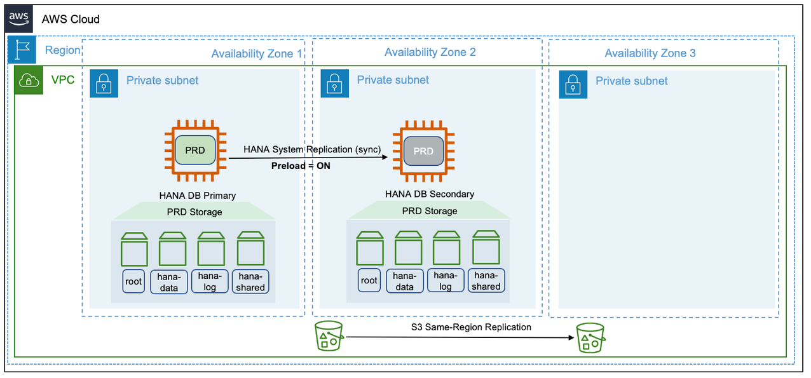
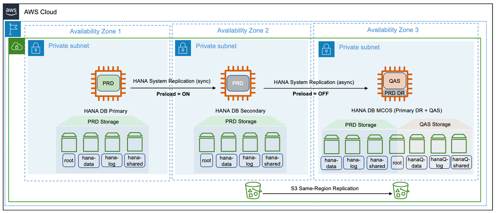
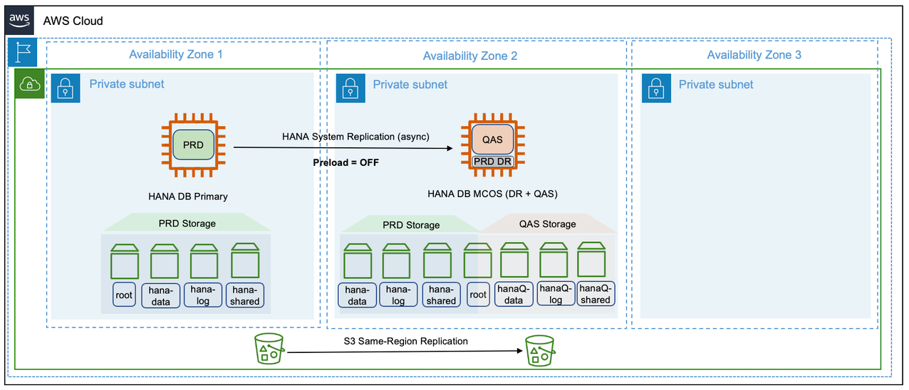
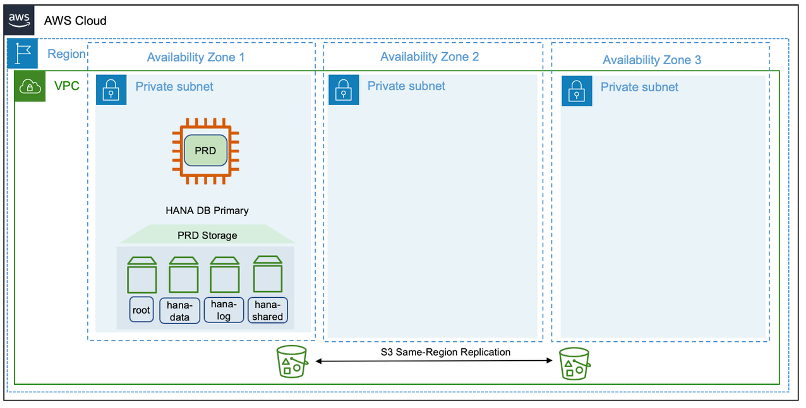

# Single Region architecture patterns for SAP HANA

Single Region architecture patterns help you avoid network latency as your SAP workload components are located in a close proximity within the same Region. Every AWS Region generally has three Availability Zones. For more information, see [AWS Global Infrastructure Map](https://aws.amazon.com/about-aws/global-infrastructure/ "https://aws.amazon.com/about-aws/global-infrastructure/").

You can choose these patterns when you need to ensure that your SAP data resides within regional boundaries stipulated by the data sovereignty laws.

The following are the four single Region architecture patterns.

###### Topics

- [Pattern 1: Single Region with two Availability Zones for production](#hana-ops-patterns-pattern1 "#hana-ops-patterns-pattern1")
- [Pattern 2: Single Region with two Availability Zones for production and production sized non-production in a third Availability Zone](#hana-ops-patterns-pattern2 "#hana-ops-patterns-pattern2")
- [Pattern 3: Single Region with one Availability Zone for production and another Availability Zone for non-production](#hana-ops-patterns-pattern3 "#hana-ops-patterns-pattern3")
- [Pattern 4: Single Region with one Availability Zone for production](#hana-ops-patterns-pattern4 "#hana-ops-patterns-pattern4")

## Pattern 1: Single Region with two Availability Zones for production

In this pattern, SAP HANA instance is deployed across two Availability Zones with SAP HANA System Replication configured on both the instances. The primary and secondary instances are of the same instance type. The secondary instance can be deployed in active/passive or active/active mode. We recommend using the sync mode of HANA System Replication for the low-latency connectivity between the two Availability Zones. For more information, see {https---help-sap-com-docs-SAP-HANA-PLATFORM-6b94445c94ae495c83a19646e7c3fd56-c039a1a5b8824ecfa754b55e0caffc01-html-version-2-0-05}[Replication Modes for SAP HANA System Replication].

This pattern is foundational if you are looking for high availability cluster solutions for automated failover to fulfill near-zero recovery point and time objectives. SAP HANA System Replication with high availability cluster solutions for automated failover provides resiliency against failure scenarios. For more information, see [Failure scenarios](../general/arch-guide-failure-scenarios.md "../general/arch-guide-failure-scenarios.md").

You need to consider the cost of licensing for third-party cluster solutions. If the secondary SAP HANA instance is not being used for read-only operations, then it is an idle capacity. Provisioning production equivalent instance type as standby adds to the total cost of ownership.

Your SAP HANA instance backups can be stored in Amazon S3 buckets using AWS Backint Agent for SAP HANA. Amazon S3 objects are automatically stored across multiple devices spanning a minimum of three Availability Zones across a Region. To protect against logical data loss, you can use the Same-Region Replication feature of Amazon S3. For more information, see [Setting up replication](../../../AmazonS3/latest/userguide/replication-how-setup.md "../../../AmazonS3/latest/userguide/replication-how-setup.md").

## Pattern 2: Single Region with two Availability Zones for production and production sized non-production in a third Availability Zone

In this pattern, SAP HANA instance is deployed in a multi-tier SAP HANA System Replication across three Availability Zones. The primary and secondary SAP HANA instances are of the same instance type and can be configured in a highly available setup, using third-party cluster solutions. The secondary SAP HANA instance can be deployed in an active/passive or active/active configuration. We recommend using the sync mode of SAP HANA System Replication for the low-latency connectivity between the two Availability Zones. The tertiary SAP HANA instance is deployed in a third Availability Zone, as a Multiple Components on One System (MCOS) installation. The production instance is co-hosted (on the same Amazon EC2 instance) along with a non-production SAP HANA instance.

This architectural pattern is cost-optimized. It aids disaster recovery in the unlikely event of losing connection to two Availability Zones at the same time. For disaster recovery, the non-production SAP HANA workload is stopped to make resources available for production workload. However, invoking disaster recovery (third Availability Zone) is a manual activity. As per the requirements of MCOS, you are required to provision the non-production SAP HANA instance with the same AWS instance type as that of the primary instance and it has to be located in a third Availability Zone. Also, operating an MCOS system requires additional storage for non-production workloads and detailed tested procedures to invoke a disaster recovery.

In comparison to pattern 1, pattern 2 further enhances the application availability. There is no restoration or recovery from backups required to invoke a disaster recovery. The additional cost of the third instance is justified as the idle capacity is being utilized for non-production workloads.

## Pattern 3: Single Region with one Availability Zone for production and another Availability Zone for non-production

In this pattern, SAP HANA instance is deployed in a two-tier SAP HANA System Replication across two Availability Zones. The primary and secondary SAP HANA instances are of the same type and there is no idle capacity or high availability licensing requirement. Additional storage is required for the non-production SAP HANA workloads on the secondary instance.

The secondary instance is an MCOS installation and co-hosts a non-production SAP HANA workload. For more information, see {https---launchpad-support-sap-com---notes-1681092}[SAP Note Multiple SAP HANA DBMSs (SIDs) on one SAP HANA system]. This is a cost-optimized solution without high availability. In the event of a failure on the primary instance, the non-production SAP HANA workload is stopped and a takeover is performed on the secondary instance. Considering the time taken in recovering services on the secondary instance, this type of pattern is suitable for SAP HANA workloads that can have a higher recovery time objective and are functioning as disaster recovery systems.

## Pattern 4: Single Region with one Availability Zone for production

In this pattern, SAP HANA instance is deployed as a standalone installation with no target systems to replicate data. This is the most basic and cost-efficient deployment option. However, this is the least resilient of all the architectures and is not recommended for business-critical SAP HANA workloads. The options available to restore business operations during a failure scenario are by Amazon EC2 auto recovery, in the event of an instance failure or by restoration and recovery from most recent and valid backups, in the event of a significant issue impacting the Availability Zone. The non-production SAP HANA workloads have no dependency on the production SAP HANA instance. They are free to be deployed in an Availability Zone within the Region and can be appropriately sized for its workload.

