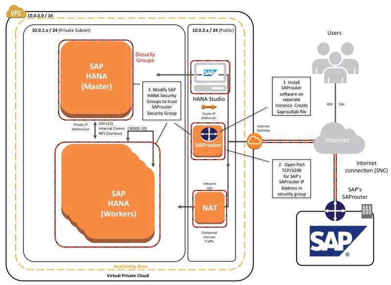
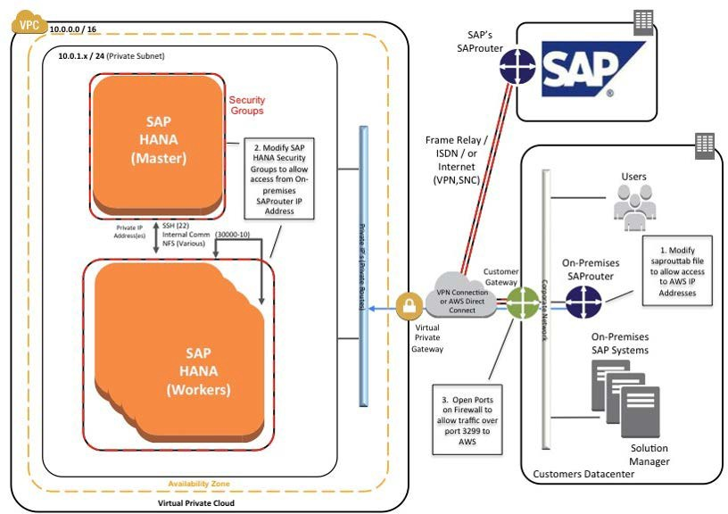

# SAP Support Access

In some situations it may be necessary to allow an SAP support engineer to access your SAP HANA systems on AWS. The following information serves only as a supplement to the information contained in the "Getting Support" section of the [SAP HANA Administration Guide](https://help.sap.com/hana/SAP_HANA_Administration_Guide_en.pdf "https://help.sap.com/hana/SAP_HANA_Administration_Guide_en.pdf").

A few steps are required to configure proper connectivity to SAP. These steps differ depending on whether you want to use an existing remote network connection to SAP, or you are setting up a new connection directly with SAP from systems on AWS.

## Support Channel Setup with SAProuter on AWS

When setting up a direct support connection to SAP from AWS, consider the following steps:

1. For the SAProuter instance, create and configure a specific SAProuter security group, which only allows the required inbound and outbound access to the SAP support network. This should be limited to a specific IP address that SAP gives you to connect to, along with TCP port 3299. See the [Amazon EC2 security group documentation](../../../AWSEC2/latest/UserGuide/using-network-security.md "../../../AWSEC2/latest/UserGuide/using-network-security.md") for additional details about creating and configuring security groups.
2. Launch the instance that the SAProuter software will be installed on into a public subnet of the VPC and assign it an Elastic IP address.
3. Install the SAProuter software and create a saprouttab file that allows access from SAP to your SAP HANA system on AWS.
4. Set up the connection with SAP. For your internet connection, use **Secure Network Communication (SNC)**. For more information, see the [SAP Remote Support – Help](https://support.sap.com/remote-support/help.html "https://support.sap.com/remote-support/help.html") page.
5. Modify the existing SAP HANA security groups to trust the new SAProuter security group you have created.

###### Tip

For added security, shut down the EC2 instance that hosts the SAProuter service when it is not needed for support purposes

**Figure 13: Support connectivity with SAProuter on AWS**

## Support Channel Setup with SAProuter on Premises

In many cases, you may already have a support connection configured between your data center and SAP. This can easily be extended to support SAP systems on AWS. This scenario assumes that connectivity between your data center and AWS has already been established, either by way of a secure VPN tunnel over the internet or by using [AWS Direct Connect](https://aws.amazon.com/directconnect/ "https://aws.amazon.com/directconnect/").

You can extend this connectivity as follows:

1. Ensure that the proper saprouttab entries exist to allow access from SAP to resources in the VPC.
2. Modify the SAP HANA security groups to allow access from the on- premises SAProuter IP address.
3. Ensure that the proper firewall ports are open on your gateway to allow traffic to pass over TCP port 3299.

**Figure 14: Support connectivity with SAProuter on premises**
