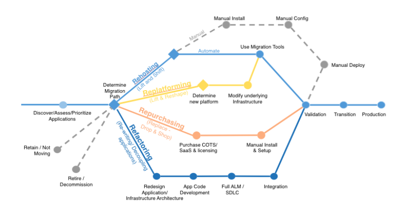

# Migration Frameworks

Although this guide focuses on SAP HANA migrations to AWS, it is important to understand AWS migrations in a broader context. To help our customers conceptualize and understand AWS migrations in general, we have developed two major guidelines: 6 Rs and CAF.

## 6 Rs Framework

The [6 Rs migration strategy](https://aws.amazon.com/blogs/enterprise-strategy/6-strategies-for-migrating-applications-to-the-cloud/ "https://aws.amazon.com/blogs/enterprise-strategy/6-strategies-for-migrating-applications-to-the-cloud/") helps you understand and prioritize portfolio and application discovery, planning, change management, and the technical processes involved in migrating your applications to AWS. The 6 Rs represent six strategies listed in the following table that help you plan for your application migrations.

| "R" migration strategy            | Methodology                                                                                                                                  |
| --------------------------------- | -------------------------------------------------------------------------------------------------------------------------------------------- |
| **Rehosting**                     | The application is migrated as is to AWS. This is also called a "lift-and-shift" approach.                                                   |
| **Replatforming**                 | The application is changed or transformed in some aspect as part of its migration to AWS.                                                    |
| **Repurchasing**                  | You move to a different application or solution on the cloud.                                                                                |
| **Refactoring / Re‑architecting** | The application is redesigned (for example, it’s converted from a monolithic architecture to microservices) as part of the migration to AWS. |
| **Retiring**                      | The application is retired during migration to AWS.                                                                                          |
| **Retaining**                     | The application isn’t migrated.                                                                                                              |

The decision tree diagram helps you visualize the end-to-end process, starting from application discovery and moving through each 6 R strategy.

The two strategies that are specifically applicable for SAP HANA migrations to AWS are rehosting and replatforming. Rehosting is applicable when you want to move your SAP HANA system as is to AWS. This type of migration involves minimal change and can be seen as a natural fit for customers who are already running some sort of SAP HANA system. Replatforming is applicable when you want to migrate from an _anyDB_ source database (such as IBM DB2, Oracle Database, or SQL Server) to an SAP HANA database.

## AWS CAF Framework

The second guideline is the [AWS Cloud Adoption Framework (CAF)](https://aws.amazon.com/professional-services/CAF/ "https://aws.amazon.com/professional-services/CAF/"). The AWS CAF breaks down the complex process of planning a move to the cloud into manageable pieces called _perspectives_. Perspectives represent essential areas of focus that span people, processes, and technology. Capabilities within each perspective identify the areas of your organization that require attention. From this information, you can build an action plan organized into prescriptive work streams that support a successful cloud journey. Both the CAF and 6 Rs frameworks help you understand and plan the broader context of an AWS migration and what it means to you and your company.
