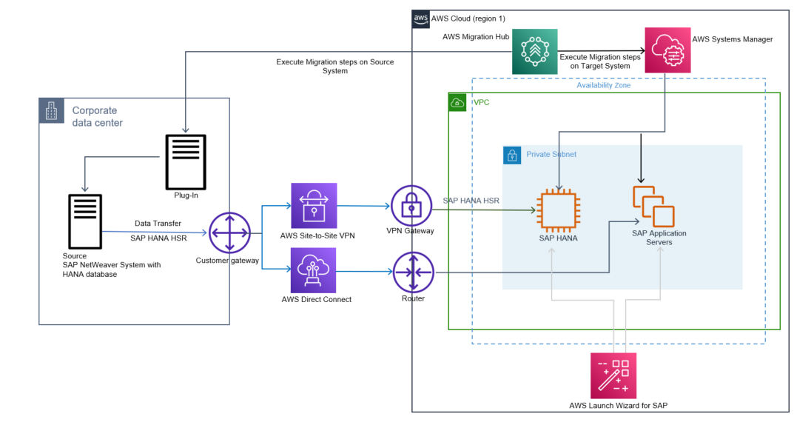
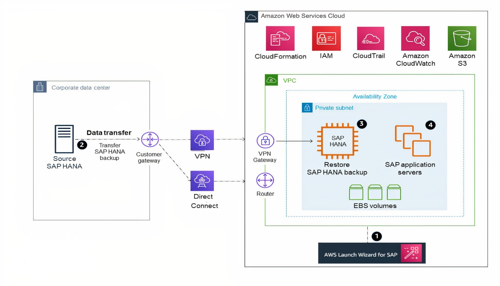
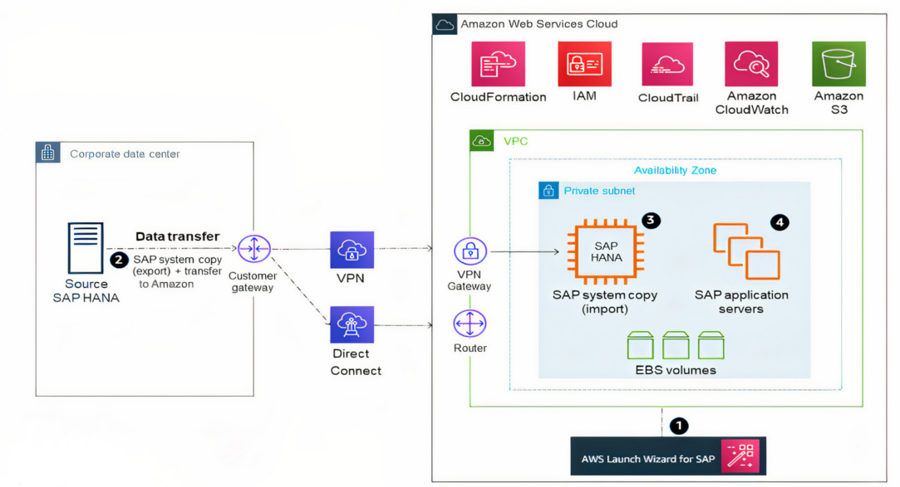
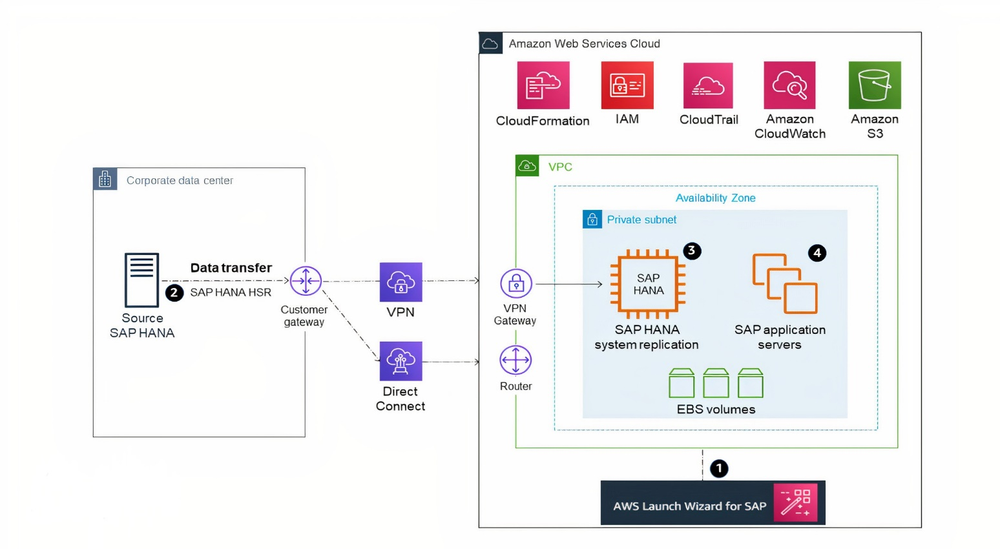
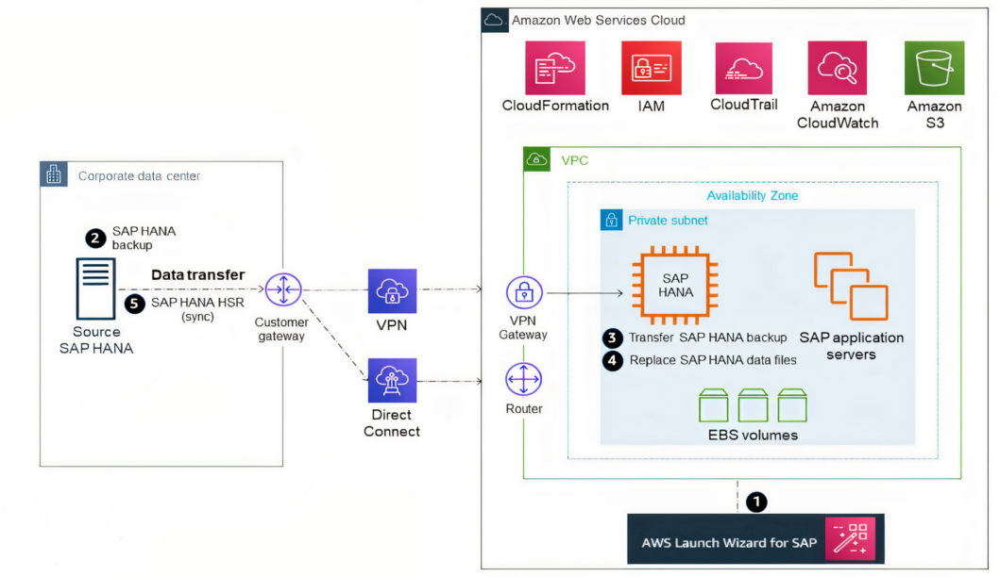
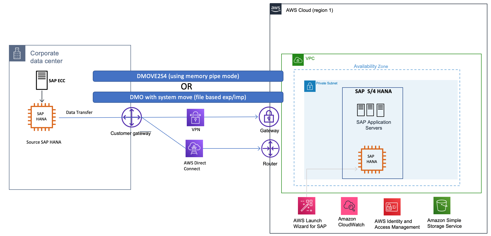

# Migrating SAP HANA from Other Platforms to AWS

This scenario is more straightforward than migrating from _anyDB_, because you’re already using SAP HANA. For this migration, you need to map your existing SAP HANA systems and sizing that are on a different platform to SAP HANA solutions on AWS.

EC2 instance memory capabilities give you the option to consolidate multiple SAP HANA databases on a single EC2 instance (scale-up) or multiple EC2 instances (scale-out). SAP calls these options HANA and ABAP One Server, Multiple Components in One Database (MCOD), Multiple Components in One System (MCOS), and Multitenant Database Containers (MDC). It is beyond the scope of this guide to recommend specific consolidation combinations; for possible combinations, see [SAP Note 1661202 – Support for multiple applications on SAP HANA](https://launchpad.support.sap.com/#/notes/1661202 "https://launchpad.support.sap.com/#/notes/1661202").

This migration scenario involves provisioning your SAP HANA system on AWS, backing up your source database, transferring your data to AWS, and installing your SAP application servers. If you are resizing your HANA environment from scale-up to scale-out, please follow the process highlighted in [SAP Note 2130603](https://launchpad.support.sap.com/#/notes/0002130603 "https://launchpad.support.sap.com/#/notes/0002130603"). If you are resizing your HANA environment from scale-out to scale-up, refer to [SAP Note 2093572](https://launchpad.support.sap.com/#/notes/2093572 "https://launchpad.support.sap.com/#/notes/2093572"). Depending on your specific scenario, you can use standard backup and restore, SAP HANA classical migration, SAP HANA HSR, AWS Server Migration Service (AWS SMS), or third-party continuous data protection (CDP) tools; see the following sections for details on each option.

###### Topics

- [Option 1: AWS Migration Hub Orchestrator](#migrating-hana-mhub-orchestrator "#migrating-hana-mhub-orchestrator")
- [Option 2: SAP HANA Backup and Restore](#migrating-hana-backup-restore-steps "#migrating-hana-backup-restore-steps")
- [Option 3: SAP HANA Classical Migration](#migrating-hana-classical-steps "#migrating-hana-classical-steps")
- [Option 4: SAP HANA HSR](#migrating-hana-hsr-steps "#migrating-hana-hsr-steps")
- [Option 5: SAP HANA HSR (with Initialization via Backup and Restore)](#migrating-hana-hsr-with-backup-restore-steps "#migrating-hana-hsr-with-backup-restore-steps")
- [Option 6: SAP HANA (on-premises) to SAP HANA (AWS Cloud)](#migrating-hana-on-premises-cloud "#migrating-hana-on-premises-cloud")

## Option 1: AWS Migration Hub Orchestrator

For details on how to migrate SAP HANA systems to AWS using AWS Migration Hub Orchestrator, see [Migrate SAP NetWeaver based applications and SAP HANA databases to AWS](../../../migrationhub-orchestrator/latest/userguide/migrate-sap.md "../../../migrationhub-orchestrator/latest/userguide/migrate-sap.md").

## Option 2: SAP HANA Backup and Restore

1. Provision your SAP HANA system and landscape on AWS. (The [AWS Launch Wizard for SAP](../../../launchwizard/latest/userguide/launch-wizard-sap.md "../../../launchwizard/latest/userguide/launch-wizard-sap.md") can help expedite and automate this process for you.)
2. Transfer (**sftp** or **rsync**) a full SAP HANA backup, making sure to transfer any necessary SAP HANA logs for point-in-time recovery, from your source system to your target EC2 instance on AWS. A general tip here is to compress your files and split your files into smaller chunks to parallelize the transfer. If your transfer destination is Amazon S3, using the **aws s3 cp** command will automatically parallelize the file upload for you. For other options for transferring your data to AWS, see the AWS services listed previously in the [Backup/Restore Tools](migrating-hana-tools.md#migrating-hana-backup-restore "migrating-hana-tools.md#migrating-hana-backup-restore") section.
3. Recover your SAP HANA database.
4. Install your SAP application servers. (Skip this step if you used the [AWS Launch Wizard for SAP](../../../launchwizard/latest/userguide/launch-wizard-sap.md "../../../launchwizard/latest/userguide/launch-wizard-sap.md") in step 1.)
5. Depending on your application architecture, you might need to reconnect your applications to the newly migrated SAP HANA system.

## Option 3: SAP HANA Classical Migration

1. Provision your SAP HANA system and landscape on AWS. (The [AWS Launch Wizard for SAP](../../../launchwizard/latest/userguide/launch-wizard-sap.md "../../../launchwizard/latest/userguide/launch-wizard-sap.md") can help expedite and automate this process for you.)
2. Perform an SAP homogeneous system copy to export your source SAP HANA database. You may also choose to use a database backup as the export; see [SAP Note 1844468 – Homogeneous system copy on SAP HANA](https://service.sap.com/sap/support/notes/1844468 "https://service.sap.com/sap/support/notes/1844468"). When export is complete, transfer your data into AWS.
3. Continue the SAP system copy process on your SAP HANA system on AWS to import the data you exported in step 2.
4. Install your SAP application servers. (Skip this step if you used the [AWS Launch Wizard for SAP](../../../launchwizard/latest/userguide/launch-wizard-sap.md "../../../launchwizard/latest/userguide/launch-wizard-sap.md") in step 1.)
5. Depending on your application architecture, you might need to reconnect your applications to the newly migrated SAP HANA system.

## Option 4: SAP HANA HSR

1. Provision your SAP HANA system and landscape on AWS. ([AWS Launch Wizard for SAP](../../../launchwizard/latest/userguide/launch-wizard-sap.md "../../../launchwizard/latest/userguide/launch-wizard-sap.md") can help expedite and automate this process for you.) To save costs, you might choose to stand up a smaller EC2 instance type.
2. Establish asynchronous SAP HANA system replication from your source database to your standby SAP HANA database on AWS.
3. Perform an SAP HANA takeover on your standby database.
4. Install your SAP application servers. (Skip this step if you used [AWS Launch Wizard for SAP](../../../launchwizard/latest/userguide/launch-wizard-sap.md "../../../launchwizard/latest/userguide/launch-wizard-sap.md") in step 1.)
5. Depending on your application architecture, you might need to reconnect your applications to the newly migrated SAP HANA system.

## Option 5: SAP HANA HSR (with Initialization via Backup and Restore)

1. Provision your SAP HANA system and landscape on AWS. ([AWS Launch Wizard for SAP](../../../launchwizard/latest/userguide/launch-wizard-sap.md "../../../launchwizard/latest/userguide/launch-wizard-sap.md") can help expedite and automate this process for you.) To save costs, you might choose to stand up a smaller EC2 instance type.
2. Stop the source SAP HANA database and obtain a copy of the data files (this is essentially a cold backup). After the files have been saved, you may start up your SAP HANA database again.
3. Transfer the SAP HANA data files to AWS, to the SAP HANA server you provisioned in step 1. (For example, you can store the data files in the /backup directory or in Amazon S3 during the transfer process.)
4. Stop the SAP HANA database on the target system in AWS. Replace the SAP HANA data files (on the target server) with the SAP HANA data files you transferred in step 3.
5. Start the SAP HANA system on the target system and establish asynchronous SAP HANA system replication from your source system to your target SAP HANA system in AWS.
6. Perform an SAP HANA takeover on your standby database.
7. Install your SAP application servers. (Skip this step if you used [AWS Launch Wizard for SAP](../../../launchwizard/latest/userguide/launch-wizard-sap.md "../../../launchwizard/latest/userguide/launch-wizard-sap.md") in step 1.)
8. Depending on your application architecture, you might need to reconnect your applications to the newly migrated SAP HANA system.

## Option 6: SAP HANA (on-premises) to SAP HANA (AWS Cloud)

SAP added a new feature to the DMO option with SUM 2.0 SP-17 – DMO with system move, enabling SAP HANA to SAP HANA migration. It combines migration with conversion. With this option, you can convert SAP ERP on SAP HANA to SAP S/4HANA while migrating the system to SAP S/4HANA cloud, private edition on AWS Cloud.

DMOVE2S4 enables homogeneous migration (SAP HANA to SAP HANA). For this scenario, downtime optimized techniques, such as downtime optimized DMO (doDMO) or downtime optimized conversion (DOC) are currently not supported.

For more information, see SAP Blog - [Two Major News with SUM 2.0 SP 17](https://blogs.sap.com/2023/05/31/two-major-news-with-sum-2.0-sp-17/ "https://blogs.sap.com/2023/05/31/two-major-news-with-sum-2.0-sp-17/").

The following image displays this option.

