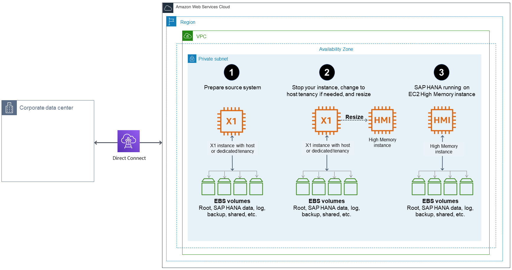
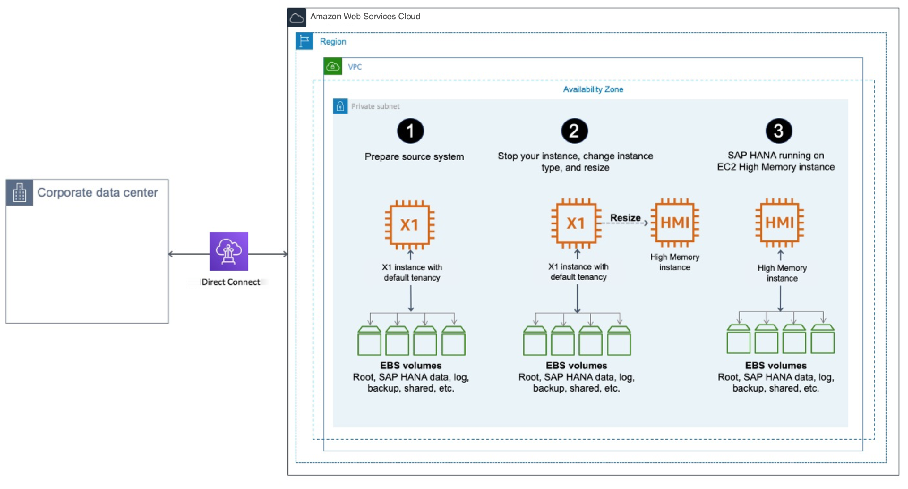
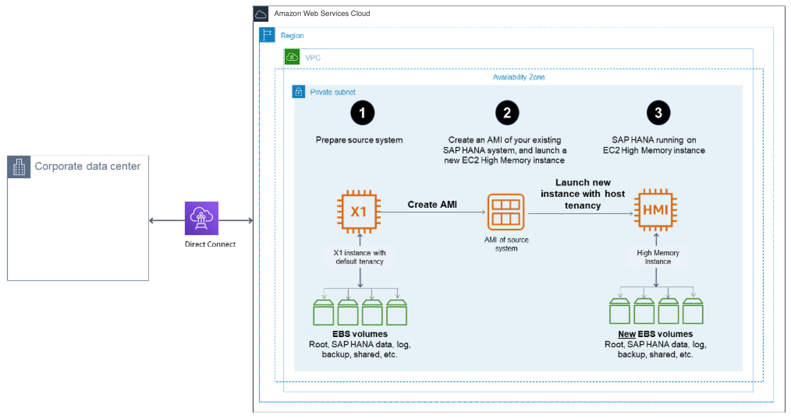
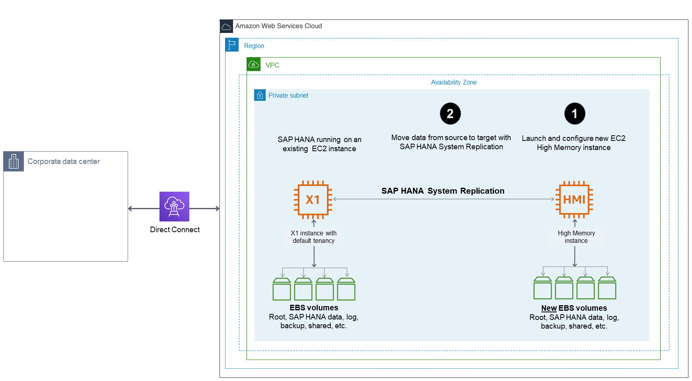
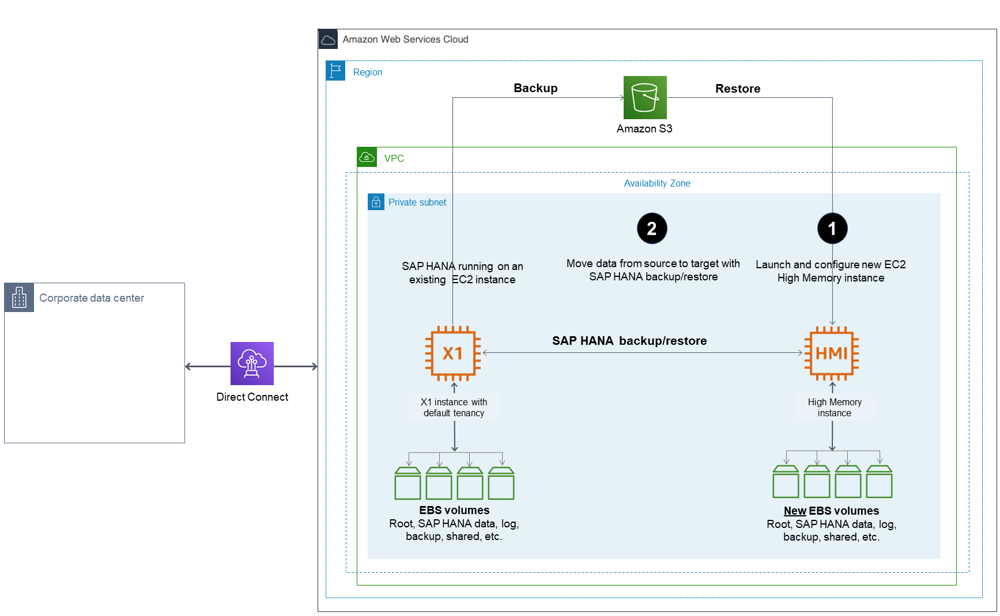
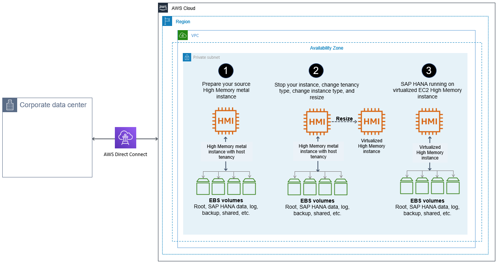

# Migrating SAP HANA on AWS to an EC2 High Memory Instance

EC2 High Memory instances are built on [AWS Nitro System](https://aws.amazon.com/ec2/nitro "https://aws.amazon.com/ec2/nitro") with up to 24TB of memory in a single instance to deliver scalable and elastic infrastructure capabilities for large in-memory databases, such as SAP HANA.

For SAP HANA workloads, EC2 High Memory instances support SUSE Linux Enterprise Server for SAP Applications (SLES for SAP) and Red Hat Enterprise Linux for SAP Solutions (RHEL for SAP) operating systems. The following table provides the minimum supported operating system version for SAP HANA workloads. See the [SAP HANA hardware directory](https://www.sap.com/dmc/exp/2014-09-02-hana-hardware/enEN/#/solutions?filters=iaas;ve:23 "https://www.sap.com/dmc/exp/2014-09-02-hana-hardware/enEN/#/solutions?filters=iaas;ve:23") for a list of supported operating systems for your instance type.

| Instance Type                                                                                                                | Supported operating system version                                          |
| ---------------------------------------------------------------------------------------------------------------------------- | --------------------------------------------------------------------------- |
| u-6tb1.metal, u-9tb1.metal, and u-12tb1.metal                                                                                | SLES for SAP 12 SP3 and above; RHEL for SAP 7.4 and above                   |
| u-18tb1.metal and u-24tb1.metal                                                                                              | SLES for SAP 12 SP4 and above; RHEL for SAP 8.1 and above                   |
| u-3tb1.56xlarge                                                                                                              | SLES for SAP 12 SP3 and above; RHEL for SAP 7.4 and above                   |
| u-6tb1.56xlarge                                                                                                              | SLES for SAP 12 SP3 and above; RHEL for SAP 7.4, RHEL for SAP 7.7 and above |
| u-6tb1.112xlarge, u-9tb1.112xlarge, u-12tb1.112xlarge, u-18tb1.112xlarge, and u-24tb1.112xlarge                              | SLES for SAP 12 SP4 and above; RHEL for SAP 8.1 and above                   |
| u7i-6tb.112xlarge, u7i-8tb.112xlarge, u7i-12tb.224xlarge, u7in-16tb.224xlarge, u7in-24tb.224xlarge, and u7inh-32tb.480xlarge | SLES 15 SP3 and above; RHEL 8.6 and above                                   |

**Considerations**

**u-\*tb1.112xlarge**

Before using `u-*tb1.112xlarge` instance types with one of the following operating system versions, verify that your system has the minimum required kernel version in order to use all available vCPUs.

- SLES for SAP 12 SP4 – 4.12.14-95.68
- SLES for SAP 12 SP5 – 4.12.14-122.60
- SLES for SAP 15 – 4.12.14-150.66
- SLES for SAP 15 SP1 – 4.12.14-197.83
- SLES for SAP 15 SP2 – 5.3.18-24.52
- RHEL for SAP 8.1 - 4.18.0-147.44.1.el8_1
- RHEL for SAP 8.2 - 4.18.0-193.47.1.el8_2

**u-\*tb1.metal**

You must launch `u-**tb1.metal**` instances using Amazon EC2 Dedicated Hosts with host tenancy. `u7i`, `u-6tb1.56xlarge`, and `u-*tb1.112xlarge` instances can be launched with default, dedicated or host tenancy.

Before you start your migration, if you plan to use `u-**tb1.metal**` instances, make sure that an `u-*tb1.metal` instance is allocated to your target account, Availability Zone, and AWS Region. If you plan to use `u7i`, `u-6tb1.56xlarge` or `u-*tb1.112xlarge`, ensure your account limit for resource "On-Demand High Memory instances" or "U\*TB1 Dedicated Hosts" (required only if you intend to use it as dedicated host) is set appropriately. If needed, submit a request from AWS console to increase your account limit. For more information, see [Amazon EC2 service quotas and On-Demand Instance limits](../../../AWSEC2/latest/UserGuide/ec2-resource-limits.md "../../../AWSEC2/latest/UserGuide/ec2-resource-limits.md") in the _Amazon EC2 User Guide_.

**u7inh-32tb.480xlarge**

If you use the `u7inh-32tb.480xlarge` instance type to run the SAP S/4HANA application, you must disable Hyperthreading for best performance. `u7inh-32tb.480xlarge` has 16 CPU sockets and SAP requires Hyperthreading to be disabled for Intel Sapphire Rapids based 16-socket systems. If you are running analytical workloads such as SAP BW/4HANA, you don’t have to disable Hyperthreading. For additional details, see SAP Note 2711650. You can disable Hyperthreading by setting threads per core to 1 using the CPU options feature. For more information, see [Specify CPU options for an Amazon EC2 instance](../../../AWSEC2/latest/UserGuide/instance-specify-cpu-options.md "../../../AWSEC2/latest/UserGuide/instance-specify-cpu-options.md") in the _Amazon EC2 User Guide_.

You have several options for migrating your existing SAP HANA workload on AWS to an EC2 High Memory instance, as discussed in the following sections.

In the following sections, we show X1 instance as the source instance type for migration. These procedures are applicable for any other source instance types as well.

###### Topics

- [Option 1: Resizing an Existing EC2 Instance with Host or Dedicated Tenancy](#migrating-hana-hm-resize "#migrating-hana-hm-resize")
- [Option 2: Migrating from an Existing EC2 Instance with Default Tenancy](#migrating-hana-hm-default "#migrating-hana-hm-default")
- [Option 3: Migrating from Amazon EC2 High Memory metal instance with Virtualized High Memory Host Tenancy](#migrating-hana-high-memory "#migrating-hana-high-memory")

## Option 1: Resizing an Existing EC2 Instance with Host or Dedicated Tenancy

If your existing EC2 instance is running with host or dedicated tenancy, you can follow the steps in this section to migrate it to `u-\*tb1.metal ` EC2 High Memory instance. With this option, all your instance properties, including IP addresses, hostnames, and EBS volumes, remain the same after migration.

1. Verify that your source system is running on a supported operating system version. If not, you might have to upgrade your operating system before resizing to an EC2 High Memory instance.
2. EC2 High Memory instances are based on the Nitro system. On Nitro-based instances, EBS volumes are presented as NVMe block devices. If your source system has any mount point entries in `/etc/fstab` with reference to block devices such as `/dev/xvd<x>`, you need to create a label for these devices and mount them by label before migrating to EC2 High Memory instances. Otherwise, you will face issues when you start SAP HANA on an EC2 High Memory instance.
3. Verify that you don’t exceed the maximum supported EBS volumes to your instance. An `u-**tb1.metal**` EC2 High Memory instance currently supports up to 19 EBS volumes. `u7i`, `u-6tb1.56xlarge`, and `u-*tb1.112xlarge` instances supports up to 27 EBS volumes. For details, see [Instance Type Limits](../../../AWSEC2/latest/UserGuide/volume_limits.md#instance-type-volume-limits "../../../AWSEC2/latest/UserGuide/volume_limits.md#instance-type-volume-limits") in the AWS documentation.
4. When you are ready to migrate, make sure that you have a good backup of your source system. You can use AWS Backint Agent for SAP HANA to easily backup your SAP HANA database to Amazon S3. For details, see [AWS Backint Agent for SAP HANA](aws-backint-agent-sap-hana.md "aws-backint-agent-sap-hana.md") in the AWS documentation.
5. Stop the source instance in the Amazon EC2 console or by using the AWS CLI.
6. If your source EC2 instance is running with dedicated tenancy, modify the instance placement to host tenancy. For instructions, see [Modifying instance Tenancy and Affinity](../../../AWSEC2/latest/UserGuide/how-dedicated-hosts-work.md#moving-instances-dedicated-hosts "../../../AWSEC2/latest/UserGuide/how-dedicated-hosts-work.md#moving-instances-dedicated-hosts") in the AWS documentation. Skip this step if your instance is running with host tenancy.
7. Modify the instance placement of your existing instance to your target EC2 High Memory Dedicated Host through the Amazon EC2 console or the AWS CLI. For details, see [modify-instance-placement](../../../cli/latest/reference/ec2/modify-instance-placement.md "../../../cli/latest/reference/ec2/modify-instance-placement.md") in the AWS documentation.
8. Change your instance type to the desired EC2 High Memory instance type (for example, `u-12tb1.metal` or `u-12tb1.112xlarge`) through the AWS CLI or AWS Console.

###### Note

You can change the instance type to `u-*tb1.metal` only through the AWS CLI or Amazon EC2 API. 9. Start your instance in the Amazon EC2 console or by using the AWS CLI. 10. When you increase the memory of your SAP HANA system, you might need to adjust the storage size of SAP HANA data, log, shared, and backup volumes as well to accommodate data growth and to get improved performance. For details, see [SAP HANA on AWS Operations Guide](sap-hana-on-aws-operations.md "sap-hana-on-aws-operations.md"). 11. Start your SAP HANA database and perform your validation. 12. Complete any SAP HANA-specific post-migration activities. 13. Complete any AWS-specific post-migration activities, such as setting up Amazon CloudWatch, AWS Config, and AWS CloudTrail. 14. Configure your SAP HANA system for high availability on the EC2 High Memory instance with SAP HANA HSR and clustering software, and test it. 15. Complete post-migration tasks to ensure that you are not charged.

    * Review and confirm if you need to cancel reservations once migration is complete.
    * Review and confirm if you need to release Amazon EC2 Dedicated Hosts through the console. Once a reservation is cancelled, on-demand charging begins for the dedicated hosts until they are released from the console.

## Option 2: Migrating from an Existing EC2 Instance with Default Tenancy

If your existing EC2 instance is running with default tenancy, you have multiple options to migrate it to an EC2 High Memory instance: If you plan to use `u7i*`, `u-6tb1.56xlarge` or `u-*tb1.112xlarge` instance types, you can simply stop your instance and resize it to desired target instance size. Additionally, if you plan to use `u-*tb1.metal` instances, you can use an Amazon Machine Image (AMI) to launch your `u-*tb1.metal` EC2 High Memory instance with host tenancy, or you can set up a new SAP HANA on EC2 High Memory instance and then copy the data over from your source system.

### Option 2(a): Resizing an existing EC2 instance

In this option, if you are using `u7i*`, `u-6tb1.56xlarge` or `u-*tb1.112xlarge` instance types, you can simply resize your instance through AWS Management Console or AWS CLI.

1. Verify that your source system is running on a supported operating system version. If it isn’t, you might have to upgrade your operating system before resizing to an EC2 High Memory instance.
2. EC2 High Memory instances are based on the Nitro system. On Nitro-based instances, EBS volumes are presented as NVMe block devices. If your source system has any mount point entries in `/etc/fstab` with reference to block devices such as `/dev/xvd<x>`, you need to create a label for these devices and mount them by label before migrating to EC2 High Memory instances. Otherwise, you will face issues when you start SAP HANA on an EC2 High Memory instance.
3. When you are ready to migrate, verify that you have a good backup of your source system.
4. Stop the source instance in the Amazon EC2 console or by using the AWS CLI.
5. Change the instance type to target EC2 High Memory instance size such as `u7i*`, `u-6tb1.56xlarge` or `u-*tb1.112xlarge`.
6. When you increase the memory of your SAP HANA system, you might need to adjust the storage size of SAP HANA data, log, shared, and backup volumes as well to accommodate data growth and to get improved performance. For details, see the [SAP HANA on AWS Operations Guide](sap-hana-on-aws-operations.md "sap-hana-on-aws-operations.md").
7. Start your SAP HANA database and perform your validation.

###### Note

If necessary, complete any SAP HANA-specific post-migration activities. 8. Check the connectivity between your SAP application servers and the new SAP HANA instance. 9. If necessary, complete any AWS-specific post-migration activities, such as setting up Amazon CloudWatch, AWS Config, and AWS CloudTrail. 10. Configure your SAP HANA system for high availability on the EC2 High Memory instance with SAP HANA HSR and clustering software, and test it. 11. Complete post-migration tasks to ensure that you are not charged.

    * Review and confirm if you need to cancel reservations once migration is complete.
    * Review and confirm if you need to release Amazon EC2 Dedicated Hosts through the console. Once a reservation is cancelled, on-demand charging begins for the dedicated hosts until they are released from the console.

### Option 2(b): Migrating Using an AMI

In this option, you launch a new EC2 High Memory instance based on the AMI that you created from your source system for the migration.

1. Verify that your source system is running on a supported operating system version. If it isn’t, you might have to upgrade your operating system before resizing to an EC2 High Memory instance.
2. EC2 High Memory instances are based on the Nitro system. On Nitro-based instances, EBS volumes are presented as NVMe block devices. If your source system has any mount point entries in `/etc/fstab` with reference to block devices such as `/dev/xvd<x>`, you need to create a label for these devices and mount them by label before migrating to EC2 High Memory instances. Otherwise, you will face issues when you start SAP HANA on an EC2 High Memory instance.
3. When you are ready to migrate, verify that you have a good backup of your source system.
4. Stop the source instance in the Amazon EC2 console or by using the AWS CLI.
5. Create an AMI of your source instance. For details, see [Creating an Amazon EBS-Backed Linux AMI](../../../AWSEC2/latest/UserGuide/creating-an-ami-ebs.md "../../../AWSEC2/latest/UserGuide/creating-an-ami-ebs.md") in the AWS documentation.

###### Tip

Creating an AMI for the first time with the attached EBS volumes could take a long time, depending on your data size. To expedite this process, we recommend that you take snapshots of EBS volumes attached to the instance ahead of time. 6. Launch a new EC2 High Memory instance with host tenancy for `u7i*` or `u-**tb1.metal**` instances. For `u7i`, `u-6tb1.56xlarge`, and `u-*tb1.112xlarge`, you can launch a new EC2 High Memory instance with default, dedicated or host tenancy. 7. The new instance will have a new IP address. Update all references to the IP address of the source system, including the /etc/hosts file for the operating system and DNS entries, to reflect the new IP address. The hostname and storage layout will remain the same as on the source system. 8. When you increase the memory of your SAP HANA system, you might need to adjust the storage size of SAP HANA data, log, shared, and backup volumes as well to accommodate data growth and to get improved performance. For details, see the [SAP HANA on AWS Operations Guide](sap-hana-on-aws-operations.md "sap-hana-on-aws-operations.md"). 9. Start your SAP HANA database and perform your validation.

###### Note

You might notice that SAP HANA is slow when loading data into memory for the first time after you create your instance with an AMI. This is expected behavior when EBS volumes associated with SAP HANA data are created from a snapshot. You will not experience the slowness after the initial hydration. 10. Complete any SAP HANA-specific post-migration activities. 11. Check the connectivity between your SAP application servers and the new SAP HANA instance. 12. Complete any AWS-specific post-migration activities, such as setting up Amazon CloudWatch, AWS Config, and AWS CloudTrail. 13. Configure your SAP HANA system for high availability on the EC2 High Memory instance with SAP HANA HSR and clustering software, and test it. 14. Complete post-migration tasks to ensure that you are not charged.

    * Review and confirm if you need to cancel reservations once migration is complete.
    * Review and confirm if you need to release Amazon EC2 Dedicated Hosts through the console. Once a reservation is cancelled, on-demand charging begins for the dedicated hosts until they are released from the console.

### Option 2(c): Migrating Using SAP HANA HSR or SAP HANA backup and restore

In this option, you launch a new EC2 High Memory instance, install and configure SAP HANA on the instance, and then copy the data over from your source system to complete the migration.

1. Launch a new SAP HANA EC2 High Memory instance with host tenancy for `u7i*` or `u-**tb1.metal**` instances. For `u7i`, `u-6tb1.56xlarge`, and `u-*tb1.112xlarge`, you can launch your instance with default, dedicated or host tenancy. You can use the [AWS Launch Wizard for SAP](../../../launchwizard/latest/userguide/launch-wizard-sap.md "../../../launchwizard/latest/userguide/launch-wizard-sap.md") to set up your instance automatically, or follow the [SAP HANA Environment Setup on AWS](std-sap-hana-environment-setup.md "std-sap-hana-environment-setup.md") guide to set up your instance manually. Make sure that you are using an operating system that supports EC2 High Memory instances.
2. Complete any AWS-specific post-migration activities, such as setting up Amazon CloudWatch, AWS Config, and AWS CloudTrail, ahead of time.
3. Migrate the data from your existing SAP HANA instance by using SAP HANA HSR or SAP HANA backup and restore tools.
   - If you plan to use SAP HANA HSR for data migration, configure HSR to move data from your source system to your target system. For details, see the [SAP HANA Administration Guide](https://help.sap.com/viewer/6b94445c94ae495c83a19646e7c3fd56/2.0.03/en-US/330e5550b09d4f0f8b6cceb14a64cd22.html "https://help.sap.com/viewer/6b94445c94ae495c83a19646e7c3fd56/2.0.03/en-US/330e5550b09d4f0f8b6cceb14a64cd22.html") from SAP.

   
   - If you plan to use the SAP HANA backup and restore feature to migrate your data, back up your source SAP HANA system. When backup is complete, move the backup data to your target system and perform a restore in your target system. If you back up your source SAP HANA system directly to Amazon S3 using AWS Backint Agent for SAP HANA, you can directly restore it in the target system from Amazon S3. For details, see the [AWS Backint Agent for SAP HANA](aws-backint-agent-sap-hana.md "aws-backint-agent-sap-hana.md") in the AWS documentation.

   

4. Stop your source system, complete any additional post-migration steps, like updating DNS and checking the connectivity between your SAP application servers and the new SAP HANA instance.
5. Configure your SAP HANA system for high availability on the EC2 High Memory instance with SAP HANA HSR and clustering software, and test it.
6. Complete post-migration tasks to ensure that you are not charged.
   - Review and confirm if you need to cancel reservations once migration is complete.
   - Review and confirm if you need to release Amazon EC2 Dedicated Hosts through the console. Once a reservation is cancelled, on-demand charging begins for the dedicated hosts until they are released from the console.

## Option 3: Migrating from Amazon EC2 High Memory metal instance with Virtualized High Memory Host Tenancy

If your existing Amazon EC2 High Memory metal instance (`u*-tb1.metal`) is running with host tenancy, you can easily migrate it to virtualized high memory instance `(u-**tb**.56xlarge` or `u-**tb**.112xlarge)`. Stop your instance to change the tenancy and instance type, and then resize it to the desired target virtualized High Memory instance size. This architecture of this option is as shown in the following image.

1. Verify that your source system is running on a supported operating system version. If not, you might have to upgrade your operating system before resizing to an EC2 High Memory instance.
2. If you built your source High Memory metal instance with AWS Marketplace based image, such as SLES for SAP or RHEL for SAP, ensure that your target virtualized High Memory instance size is listed as supported instance type in the AWS Marketplace product page of your chosen image.
3. When you are ready to migrate, make sure that you have a good backup of your source system.
4. Stop the source instance in the Amazon EC2 console or by using the AWS CLI.
5. Change the tenancy type from host to default using AWS CLI. For more information, see [Tenancy conversion](../../../license-manager/latest/userguide/conversion-tenancy.md "../../../license-manager/latest/userguide/conversion-tenancy.md").
6. Change your instance type to target High Memory instance type, such as `u-**tb**.56xlarge` or `u-**tb**.112xlarge` through the AWS CLI or AWS Console.
7. When you increase the memory of your SAP HANA system, you might need to adjust the storage size of SAP HANA data, log, shared, and backup volumes as well to accommodate data growth and to get improved performance. For details, see [SAP HANA on AWS Operations Guide](sap-hana-on-aws-operations.md "sap-hana-on-aws-operations.md").
8. Enable Amazon EC2 automatic recovery to recover your instance when a system status check failure occurs. For more information, see [Recover your instance](../../../AWSEC2/latest/UserGuide/ec2-instance-recover.md "../../../AWSEC2/latest/UserGuide/ec2-instance-recover.md").
9. Start your SAP HANA database and perform your validation.

###### Note

If necessary, complete any SAP HANA-specific post-migration activities. 10. Check the connectivity between your SAP application servers and the new SAP HANA instance. 11. If necessary, complete any AWS-specific post-migration activities, such as setting up Amazon CloudWatch, AWS Config, and AWS CloudTrail. 12. Complete post-migration tasks to ensure that you are not charged.

    * Review and confirm if you need to cancel reservations once migration is complete.
    * Review and confirm if you need to release Amazon EC2 Dedicated Hosts through the console. Once a reservation is cancelled, on-demand charging begins for the dedicated hosts until they are released from the console.
